# Test output
## a-clj
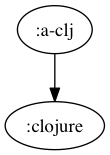
```
buck-out/gen/RULES/clojure-clojurescript-buck/tests/a-clj
└── build
    ├── deps
    ├── project.clj
    ├── src
    │   └── a
    │       └── a_clj.clj
    └── test

4 directories, 3 files
```
`cat project.clj`:
``` clojure
(defproject a-clj "0.0.1"
  :dependencies [[org.clojure/clojure "1.8.0"]]
  
  :source-paths ["src"])
```
## a-clj_build
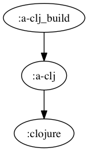
```
buck-out/gen/RULES/clojure-clojurescript-buck/tests/a-clj_build
└── build
    ├── a-clj-0.0.1.jar
    ├── classes
    │   └── META-INF
    │       └── maven
    │           └── a-clj
    │               └── a-clj
    │                   └── pom.properties
    └── stale
        └── extract-native.dependencies

7 directories, 3 files
```
## a-cljc
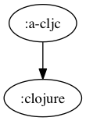
```
buck-out/gen/RULES/clojure-clojurescript-buck/tests/a-cljc
└── build
    ├── deps
    ├── project.clj
    ├── src
    │   └── a
    │       └── a_cljc.cljc
    └── test

4 directories, 3 files
```
`cat project.clj`:
``` clojure
(defproject a-cljc "0.0.1"
  :dependencies [[org.clojure/clojure "1.8.0"]]
  
  :source-paths ["src"])
```
## a-cljc_build
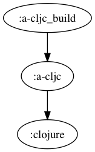
```
buck-out/gen/RULES/clojure-clojurescript-buck/tests/a-cljc_build
└── build
    ├── a-cljc-0.0.1.jar
    ├── classes
    │   └── META-INF
    │       └── maven
    │           └── a-cljc
    │               └── a-cljc
    │                   └── pom.properties
    └── stale
        └── extract-native.dependencies

7 directories, 3 files
```
## a-cljc_cljs
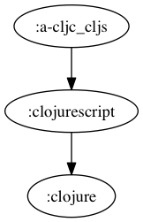
```
buck-out/gen/RULES/clojure-clojurescript-buck/tests/a-cljc_cljs
└── build
    ├── deps
    ├── project.clj
    ├── src
    │   └── a
    │       └── a_cljc.cljc
    └── test

4 directories, 3 files
```
`cat project.clj`:
``` clojure
(defproject a-cljc_cljs "0.0.1"
:dependencies [[org.clojure/clojure "1.8.0"]
[org.clojure/clojurescript "1.7.228"]]
:plugins [[lein-cljsbuild "1.1.2"]
          [lein-doo "0.1.6"]]
:source-paths ["src" "test"]
:cljsbuild {:builds {:debug {:source-paths ["src" "test"]
                             :compiler {:optimizations :simple
                                        :output-dir "target"
                                        :output-to "target/a-cljc_cljs.js"}}
                     :integration {:source-paths ["src" "test"]
                                   :compiler {:optimizations :advanced
                                              :output-dir "integ"
                                              :output-to "integ/a-cljc_cljs.min.js"}}
                     :release {:source-paths ["src"]
                               :compiler {:optimizations :advanced
                                          :output-dir "release"
                                          :output-to "release/a-cljc_cljs.js"}}}})
```
## a-cljc_cljs_build
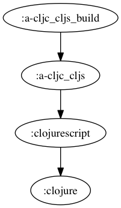
```
buck-out/gen/RULES/clojure-clojurescript-buck/tests/a-cljc_cljs_build
└── build
    ├── a
    │   └── a_cljc.js
    ├── a-cljc_cljs.js
    └── cljs
        ├── core.cljs
        └── core.js

3 directories, 4 files
```
## a-cljs
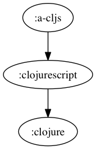
```
buck-out/gen/RULES/clojure-clojurescript-buck/tests/a-cljs
└── build
    ├── deps
    ├── project.clj
    ├── src
    │   └── a
    │       └── a_cljs.cljs
    └── test

4 directories, 3 files
```
`cat project.clj`:
``` clojure
(defproject a-cljs "0.0.1"
:dependencies [[org.clojure/clojure "1.8.0"]
[org.clojure/clojurescript "1.7.228"]]
:plugins [[lein-cljsbuild "1.1.2"]
          [lein-doo "0.1.6"]]
:source-paths ["src" "test"]
:cljsbuild {:builds {:debug {:source-paths ["src" "test"]
                             :compiler {:optimizations :simple
                                        :output-dir "target"
                                        :output-to "target/a-cljs.js"}}
                     :integration {:source-paths ["src" "test"]
                                   :compiler {:optimizations :advanced
                                              :output-dir "integ"
                                              :output-to "integ/a-cljs.min.js"}}
                     :release {:source-paths ["src"]
                               :compiler {:optimizations :advanced
                                          :output-dir "release"
                                          :output-to "release/a-cljs.js"}}}})
```
## a-cljs_build

```
buck-out/gen/RULES/clojure-clojurescript-buck/tests/a-cljs_build
└── build
    ├── a
    │   └── a_cljs.js
    ├── a-cljs.js
    └── cljs
        ├── core.cljs
        └── core.js

3 directories, 4 files
```
## b-clj
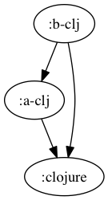
```
buck-out/gen/RULES/clojure-clojurescript-buck/tests/b-clj
└── build
    ├── deps
    ├── project.clj
    ├── src
    │   ├── a
    │   │   └── a_clj.clj
    │   └── b
    │       └── b_clj.clj
    └── test

5 directories, 4 files
```
`cat project.clj`:
``` clojure
(defproject b-clj "0.0.1"
  :dependencies [[org.clojure/clojure "1.8.0"]]
  
  :source-paths ["src"])
```
## b-clj_build

```
buck-out/gen/RULES/clojure-clojurescript-buck/tests/b-clj_build
└── build
    ├── b-clj-0.0.1.jar
    ├── classes
    │   └── META-INF
    │       └── maven
    │           └── b-clj
    │               └── b-clj
    │                   └── pom.properties
    └── stale
        └── extract-native.dependencies

7 directories, 3 files
```
## b-cljc
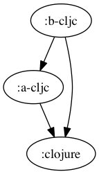
```
buck-out/gen/RULES/clojure-clojurescript-buck/tests/b-cljc
└── build
    ├── deps
    ├── project.clj
    ├── src
    │   ├── a
    │   │   └── a_cljc.cljc
    │   └── b
    │       └── b_cljc.cljc
    └── test

5 directories, 4 files
```
`cat project.clj`:
``` clojure
(defproject b-cljc "0.0.1"
  :dependencies [[org.clojure/clojure "1.8.0"]]
  
  :source-paths ["src"])
```
## b-cljc_build
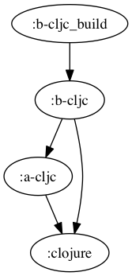
```
buck-out/gen/RULES/clojure-clojurescript-buck/tests/b-cljc_build
└── build
    ├── b-cljc-0.0.1.jar
    ├── classes
    │   └── META-INF
    │       └── maven
    │           └── b-cljc
    │               └── b-cljc
    │                   └── pom.properties
    └── stale
        └── extract-native.dependencies

7 directories, 3 files
```
## b-cljc_cljs
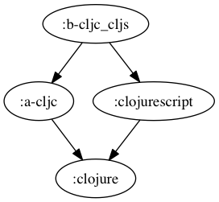
```
buck-out/gen/RULES/clojure-clojurescript-buck/tests/b-cljc_cljs
└── build
    ├── deps
    ├── project.clj
    ├── src
    │   ├── a
    │   │   └── a_cljc.cljc
    │   └── b
    │       └── b_cljc.cljc
    └── test

5 directories, 4 files
```
`cat project.clj`:
``` clojure
(defproject b-cljc_cljs "0.0.1"
:dependencies [[org.clojure/clojure "1.8.0"]
[org.clojure/clojurescript "1.7.228"]]
:plugins [[lein-cljsbuild "1.1.2"]
          [lein-doo "0.1.6"]]
:source-paths ["src" "test"]
:cljsbuild {:builds {:debug {:source-paths ["src" "test"]
                             :compiler {:optimizations :simple
                                        :output-dir "target"
                                        :output-to "target/b-cljc_cljs.js"}}
                     :integration {:source-paths ["src" "test"]
                                   :compiler {:optimizations :advanced
                                              :output-dir "integ"
                                              :output-to "integ/b-cljc_cljs.min.js"}}
                     :release {:source-paths ["src"]
                               :compiler {:optimizations :advanced
                                          :output-dir "release"
                                          :output-to "release/b-cljc_cljs.js"}}}})
```
## b-cljc_cljs_build
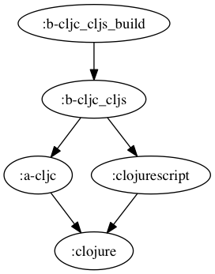
```
buck-out/gen/RULES/clojure-clojurescript-buck/tests/b-cljc_cljs_build
└── build
    ├── a
    │   └── a_cljc.js
    ├── b
    │   └── b_cljc.js
    ├── b-cljc_cljs.js
    └── cljs
        ├── core.cljs
        └── core.js

4 directories, 5 files
```
## b-cljs
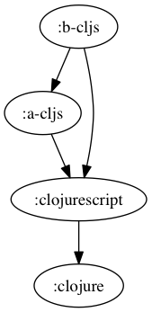
```
buck-out/gen/RULES/clojure-clojurescript-buck/tests/b-cljs
└── build
    ├── deps
    ├── project.clj
    ├── src
    │   ├── a
    │   │   └── a_cljs.cljs
    │   └── b
    │       └── b_cljs.cljs
    └── test

5 directories, 4 files
```
`cat project.clj`:
``` clojure
(defproject b-cljs "0.0.1"
:dependencies [[org.clojure/clojure "1.8.0"]
[org.clojure/clojurescript "1.7.228"]]
:plugins [[lein-cljsbuild "1.1.2"]
          [lein-doo "0.1.6"]]
:source-paths ["src" "test"]
:cljsbuild {:builds {:debug {:source-paths ["src" "test"]
                             :compiler {:optimizations :simple
                                        :output-dir "target"
                                        :output-to "target/b-cljs.js"}}
                     :integration {:source-paths ["src" "test"]
                                   :compiler {:optimizations :advanced
                                              :output-dir "integ"
                                              :output-to "integ/b-cljs.min.js"}}
                     :release {:source-paths ["src"]
                               :compiler {:optimizations :advanced
                                          :output-dir "release"
                                          :output-to "release/b-cljs.js"}}}})
```
## b-cljs_build
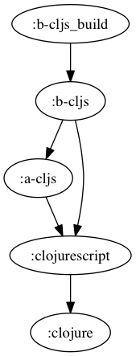
```
buck-out/gen/RULES/clojure-clojurescript-buck/tests/b-cljs_build
└── build
    ├── a
    │   └── a_cljs.js
    ├── b
    │   └── b_cljs.js
    ├── b-cljs.js
    └── cljs
        ├── core.cljs
        └── core.js

4 directories, 5 files
```
## c-clj
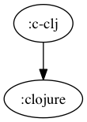
```
buck-out/gen/RULES/clojure-clojurescript-buck/tests/c-clj
└── build
    ├── deps
    ├── project.clj
    ├── src
    │   └── c
    │       └── c_clj.clj
    └── test

4 directories, 3 files
```
`cat project.clj`:
``` clojure
(defproject c-clj "0.0.1"
  :dependencies [[org.clojure/clojure "1.8.0"]
[org.clojure/data.json "0.2.6"]]
  
  :source-paths ["src"])
```
## c-clj_build
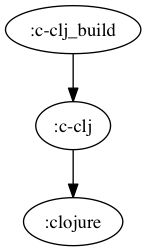
```
buck-out/gen/RULES/clojure-clojurescript-buck/tests/c-clj_build
└── build
    ├── c-clj-0.0.1.jar
    ├── classes
    │   └── META-INF
    │       └── maven
    │           └── c-clj
    │               └── c-clj
    │                   └── pom.properties
    └── stale
        └── extract-native.dependencies

7 directories, 3 files
```
## c-cljc

```
buck-out/gen/RULES/clojure-clojurescript-buck/tests/c-cljc
└── build
    ├── deps
    ├── project.clj
    ├── src
    │   └── c
    │       └── c_cljc.cljc
    └── test

4 directories, 3 files
```
`cat project.clj`:
``` clojure
(defproject c-cljc "0.0.1"
  :dependencies [[org.clojure/clojure "1.8.0"]
[org.clojure/data.json "0.2.6"]]
  
  :source-paths ["src"])
```
## c-cljc_build
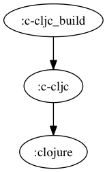
```
buck-out/gen/RULES/clojure-clojurescript-buck/tests/c-cljc_build
└── build
    ├── c-cljc-0.0.1.jar
    ├── classes
    │   └── META-INF
    │       └── maven
    │           └── c-cljc
    │               └── c-cljc
    │                   └── pom.properties
    └── stale
        └── extract-native.dependencies

7 directories, 3 files
```
## c-cljc_cljs
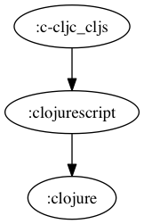
```
buck-out/gen/RULES/clojure-clojurescript-buck/tests/c-cljc_cljs
└── build
    ├── deps
    ├── project.clj
    ├── src
    │   └── c
    │       └── c_cljc.cljc
    └── test

4 directories, 3 files
```
`cat project.clj`:
``` clojure
(defproject c-cljc_cljs "0.0.1"
:dependencies [[org.clojure/clojure "1.8.0"]
[org.clojure/clojurescript "1.7.228"]
[org.clojure/data.json "0.2.6"]]
:plugins [[lein-cljsbuild "1.1.2"]
          [lein-doo "0.1.6"]]
:source-paths ["src" "test"]
:cljsbuild {:builds {:debug {:source-paths ["src" "test"]
                             :compiler {:optimizations :simple
                                        :output-dir "target"
                                        :output-to "target/c-cljc_cljs.js"}}
                     :integration {:source-paths ["src" "test"]
                                   :compiler {:optimizations :advanced
                                              :output-dir "integ"
                                              :output-to "integ/c-cljc_cljs.min.js"}}
                     :release {:source-paths ["src"]
                               :compiler {:optimizations :advanced
                                          :output-dir "release"
                                          :output-to "release/c-cljc_cljs.js"}}}})
```
## c-cljc_cljs_build
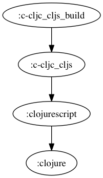
```
buck-out/gen/RULES/clojure-clojurescript-buck/tests/c-cljc_cljs_build
└── build
    ├── c
    │   └── c_cljc.js
    ├── c-cljc_cljs.js
    └── cljs
        ├── core.cljs
        └── core.js

3 directories, 4 files
```
## c-cljs
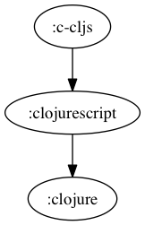
```
buck-out/gen/RULES/clojure-clojurescript-buck/tests/c-cljs
└── build
    ├── deps
    ├── project.clj
    ├── src
    │   └── c
    │       └── c_cljs.cljs
    └── test

4 directories, 3 files
```
`cat project.clj`:
``` clojure
(defproject c-cljs "0.0.1"
:dependencies [[org.clojure/clojure "1.8.0"]
[org.clojure/clojurescript "1.7.228"]
[org.clojure/data.json "0.2.6"]]
:plugins [[lein-cljsbuild "1.1.2"]
          [lein-doo "0.1.6"]]
:source-paths ["src" "test"]
:cljsbuild {:builds {:debug {:source-paths ["src" "test"]
                             :compiler {:optimizations :simple
                                        :output-dir "target"
                                        :output-to "target/c-cljs.js"}}
                     :integration {:source-paths ["src" "test"]
                                   :compiler {:optimizations :advanced
                                              :output-dir "integ"
                                              :output-to "integ/c-cljs.min.js"}}
                     :release {:source-paths ["src"]
                               :compiler {:optimizations :advanced
                                          :output-dir "release"
                                          :output-to "release/c-cljs.js"}}}})
```
## c-cljs_build
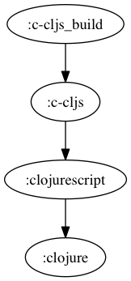
```
buck-out/gen/RULES/clojure-clojurescript-buck/tests/c-cljs_build
└── build
    ├── c
    │   └── c_cljs.js
    ├── c-cljs.js
    └── cljs
        ├── core.cljs
        └── core.js

3 directories, 4 files
```
## d-clj
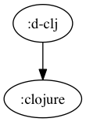
```
buck-out/gen/RULES/clojure-clojurescript-buck/tests/d-clj
└── build
    ├── deps
    ├── project.clj
    ├── src
    │   └── d
    │       ├── d1.clj
    │       └── d2.clj
    └── test

4 directories, 4 files
```
`cat project.clj`:
``` clojure
(defproject d-clj "0.0.1"
  :dependencies [[org.clojure/clojure "1.8.0"]]
  
  :source-paths ["src"])
```
## d-clj_build
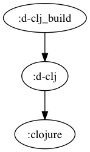
```
buck-out/gen/RULES/clojure-clojurescript-buck/tests/d-clj_build
└── build
    ├── classes
    │   └── META-INF
    │       └── maven
    │           └── d-clj
    │               └── d-clj
    │                   └── pom.properties
    ├── d-clj-0.0.1.jar
    └── stale
        └── extract-native.dependencies

7 directories, 3 files
```
## d-cljc
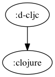
```
buck-out/gen/RULES/clojure-clojurescript-buck/tests/d-cljc
└── build
    ├── deps
    ├── project.clj
    ├── src
    │   └── d
    │       ├── d1.cljc
    │       └── d2.cljc
    └── test

4 directories, 4 files
```
`cat project.clj`:
``` clojure
(defproject d-cljc "0.0.1"
  :dependencies [[org.clojure/clojure "1.8.0"]]
  
  :source-paths ["src"])
```
## d-cljc_build
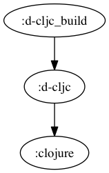
```
buck-out/gen/RULES/clojure-clojurescript-buck/tests/d-cljc_build
└── build
    ├── classes
    │   └── META-INF
    │       └── maven
    │           └── d-cljc
    │               └── d-cljc
    │                   └── pom.properties
    ├── d-cljc-0.0.1.jar
    └── stale
        └── extract-native.dependencies

7 directories, 3 files
```
## d-cljc_cljs
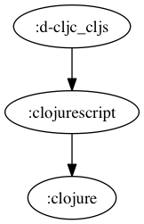
```
buck-out/gen/RULES/clojure-clojurescript-buck/tests/d-cljc_cljs
└── build
    ├── deps
    ├── project.clj
    ├── src
    │   └── d
    │       ├── d1.cljc
    │       └── d2.cljc
    └── test

4 directories, 4 files
```
`cat project.clj`:
``` clojure
(defproject d-cljc_cljs "0.0.1"
:dependencies [[org.clojure/clojure "1.8.0"]
[org.clojure/clojurescript "1.7.228"]]
:plugins [[lein-cljsbuild "1.1.2"]
          [lein-doo "0.1.6"]]
:source-paths ["src" "test"]
:cljsbuild {:builds {:debug {:source-paths ["src" "test"]
                             :compiler {:optimizations :simple
                                        :output-dir "target"
                                        :output-to "target/d-cljc_cljs.js"}}
                     :integration {:source-paths ["src" "test"]
                                   :compiler {:optimizations :advanced
                                              :output-dir "integ"
                                              :output-to "integ/d-cljc_cljs.min.js"}}
                     :release {:source-paths ["src"]
                               :compiler {:optimizations :advanced
                                          :output-dir "release"
                                          :output-to "release/d-cljc_cljs.js"}}}})
```
## d-cljc_cljs_build
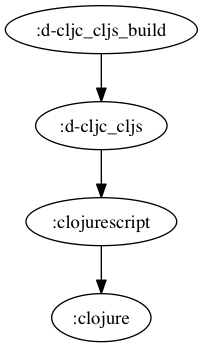
```
buck-out/gen/RULES/clojure-clojurescript-buck/tests/d-cljc_cljs_build
└── build
    ├── cljs
    │   ├── core.cljs
    │   └── core.js
    ├── d
    │   ├── d1.js
    │   └── d2.js
    └── d-cljc_cljs.js

3 directories, 5 files
```
## d-cljs

```
buck-out/gen/RULES/clojure-clojurescript-buck/tests/d-cljs
└── build
    ├── deps
    ├── project.clj
    ├── src
    │   └── d
    │       ├── d1.cljs
    │       └── d2.cljs
    └── test

4 directories, 4 files
```
`cat project.clj`:
``` clojure
(defproject d-cljs "0.0.1"
:dependencies [[org.clojure/clojure "1.8.0"]
[org.clojure/clojurescript "1.7.228"]]
:plugins [[lein-cljsbuild "1.1.2"]
          [lein-doo "0.1.6"]]
:source-paths ["src" "test"]
:cljsbuild {:builds {:debug {:source-paths ["src" "test"]
                             :compiler {:optimizations :simple
                                        :output-dir "target"
                                        :output-to "target/d-cljs.js"}}
                     :integration {:source-paths ["src" "test"]
                                   :compiler {:optimizations :advanced
                                              :output-dir "integ"
                                              :output-to "integ/d-cljs.min.js"}}
                     :release {:source-paths ["src"]
                               :compiler {:optimizations :advanced
                                          :output-dir "release"
                                          :output-to "release/d-cljs.js"}}}})
```
## d-cljs_build
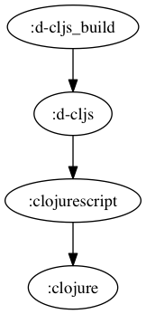
```
buck-out/gen/RULES/clojure-clojurescript-buck/tests/d-cljs_build
└── build
    ├── cljs
    │   ├── core.cljs
    │   └── core.js
    ├── d
    │   ├── d1.js
    │   └── d2.js
    └── d-cljs.js

3 directories, 5 files
```
## e-clj

```
buck-out/gen/RULES/clojure-clojurescript-buck/tests/e-clj
└── build
    ├── deps
    ├── project.clj
    ├── src
    │   └── e
    │       └── e_clj.clj
    └── test

4 directories, 3 files
```
`cat project.clj`:
``` clojure
(defproject e-clj "0.0.1"
  :dependencies [[org.clojure/clojure "1.8.0"]]
  
  :source-paths ["src"])
```
## e-clj_build

```
buck-out/gen/RULES/clojure-clojurescript-buck/tests/e-clj_build
└── build
    ├── classes
    │   └── META-INF
    │       └── maven
    │           └── e-clj
    │               └── e-clj
    │                   └── pom.properties
    ├── e-clj-0.0.1.jar
    └── stale
        └── extract-native.dependencies

7 directories, 3 files
```
## e-clj_build_test
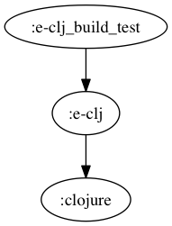
```
buck-out/gen/RULES/clojure-clojurescript-buck/tests/e-clj_build_test
└── build_test
    ├── deps
    ├── dev-resources
    ├── project.clj
    ├── resources
    ├── src
    │   └── e
    │       └── e_clj.clj
    ├── target
    │   ├── classes
    │   │   └── META-INF
    │   │       └── maven
    │   │           └── e-clj
    │   │               └── e-clj
    │   │                   └── pom.properties
    │   ├── e-clj-0.0.1.jar
    │   └── stale
    │       └── extract-native.dependencies
    └── test
        └── e
            └── e_test.clj

14 directories, 7 files
```
`cat project.clj`:
``` clojure
(defproject e-clj "0.0.1"
  :dependencies [[org.clojure/clojure "1.8.0"]]
  
  :source-paths ["src"])
```
## e-clj_test
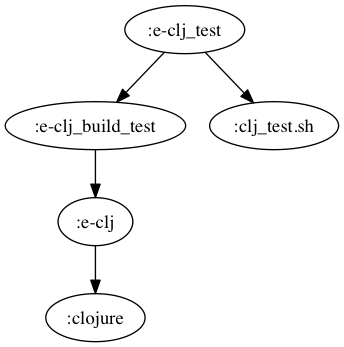
```
buck-out/gen/RULES/clojure-clojurescript-buck/tests/e-clj_test [error opening dir]

0 directories, 0 files
```
## e-cljc

```
buck-out/gen/RULES/clojure-clojurescript-buck/tests/e-cljc
└── build
    ├── deps
    ├── project.clj
    ├── src
    │   └── e
    │       └── e_cljc.cljc
    └── test

4 directories, 3 files
```
`cat project.clj`:
``` clojure
(defproject e-cljc "0.0.1"
  :dependencies [[org.clojure/clojure "1.8.0"]]
  
  :source-paths ["src"])
```
## e-cljc_build

```
buck-out/gen/RULES/clojure-clojurescript-buck/tests/e-cljc_build
└── build
    ├── classes
    │   └── META-INF
    │       └── maven
    │           └── e-cljc
    │               └── e-cljc
    │                   └── pom.properties
    ├── e-cljc-0.0.1.jar
    └── stale
        └── extract-native.dependencies

7 directories, 3 files
```
## e-cljc_build_test

```
buck-out/gen/RULES/clojure-clojurescript-buck/tests/e-cljc_build_test
└── build_test
    ├── deps
    ├── dev-resources
    ├── project.clj
    ├── resources
    ├── src
    │   └── e
    │       └── e_cljc.cljc
    ├── target
    │   ├── classes
    │   │   └── META-INF
    │   │       └── maven
    │   │           └── e-cljc
    │   │               └── e-cljc
    │   │                   └── pom.properties
    │   ├── e-cljc-0.0.1.jar
    │   └── stale
    │       └── extract-native.dependencies
    └── test
        └── e
            └── e_test.cljc

14 directories, 7 files
```
`cat project.clj`:
``` clojure
(defproject e-cljc "0.0.1"
  :dependencies [[org.clojure/clojure "1.8.0"]]
  
  :source-paths ["src"])
```
## e-cljc_cljs

```
buck-out/gen/RULES/clojure-clojurescript-buck/tests/e-cljc_cljs
└── build
    ├── deps
    ├── project.clj
    ├── src
    │   └── e
    │       └── e_cljc.cljc
    └── test

4 directories, 3 files
```
`cat project.clj`:
``` clojure
(defproject e-cljc_cljs "0.0.1"
:dependencies [[org.clojure/clojure "1.8.0"]
[org.clojure/clojurescript "1.7.228"]]
:plugins [[lein-cljsbuild "1.1.2"]
          [lein-doo "0.1.6"]]
:source-paths ["src" "test"]
:cljsbuild {:builds {:debug {:source-paths ["src" "test"]
                             :compiler {:optimizations :simple
                                        :output-dir "target"
                                        :output-to "target/e-cljc_cljs.js"}}
                     :integration {:source-paths ["src" "test"]
                                   :compiler {:optimizations :advanced
                                              :output-dir "integ"
                                              :output-to "integ/e-cljc_cljs.min.js"}}
                     :release {:source-paths ["src"]
                               :compiler {:optimizations :advanced
                                          :output-dir "release"
                                          :output-to "release/e-cljc_cljs.js"}}}})
```
## e-cljc_cljs_build

```
buck-out/gen/RULES/clojure-clojurescript-buck/tests/e-cljc_cljs_build
└── build
    ├── cljs
    │   ├── core.cljs
    │   └── core.js
    ├── e
    │   └── e_cljc.js
    └── e-cljc_cljs.js

3 directories, 4 files
```
## e-cljc_cljs_build_test
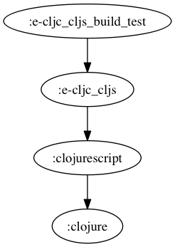
```
buck-out/gen/RULES/clojure-clojurescript-buck/tests/e-cljc_cljs_build_test
└── build_test
    ├── deps
    ├── integ
    │   ├── cljs
    │   │   ├── core.cljs
    │   │   ├── core.js
    │   │   ├── pprint.cljs
    │   │   ├── pprint.js
    │   │   ├── test.cljs
    │   │   └── test.js
    │   ├── clojure
    │   │   ├── string.cljs
    │   │   └── string.js
    │   ├── constants_table.js
    │   ├── doo
    │   │   ├── runner.cljs
    │   │   └── runner.js
    │   ├── e
    │   │   ├── e_cljc.js
    │   │   └── e_test.js
    │   ├── e-cljc_cljs.min.js
    │   ├── jx
    │   │   └── reporter
    │   │       ├── karma.cljs
    │   │       └── karma.js
    │   └── test
    │       └── runner.js
    ├── project.clj
    ├── src
    │   └── e
    │       └── e_cljc.cljc
    ├── target
    │   ├── cljs
    │   │   ├── core.cljs
    │   │   ├── core.js
    │   │   ├── pprint.cljs
    │   │   ├── pprint.js
    │   │   ├── test.cljs
    │   │   └── test.js
    │   ├── clojure
    │   │   ├── string.cljs
    │   │   └── string.js
    │   ├── doo
    │   │   ├── runner.cljs
    │   │   └── runner.js
    │   ├── e
    │   │   ├── e_cljc.js
    │   │   └── e_test.js
    │   ├── e-cljc_cljs.js
    │   ├── jx
    │   │   └── reporter
    │   │       ├── karma.cljs
    │   │       └── karma.js
    │   └── test
    │       └── runner.js
    └── test
        ├── e
        │   └── e_test.cljc
        └── runner.cljs

21 directories, 38 files
```
`cat project.clj`:
``` clojure
(defproject e-cljc_cljs "0.0.1"
:dependencies [[org.clojure/clojure "1.8.0"]
[org.clojure/clojurescript "1.7.228"]]
:plugins [[lein-cljsbuild "1.1.2"]
          [lein-doo "0.1.6"]]
:source-paths ["src" "test"]
:cljsbuild {:builds {:debug {:source-paths ["src" "test"]
                             :compiler {:optimizations :simple
                                        :output-dir "target"
                                        :output-to "target/e-cljc_cljs.js"}}
                     :integration {:source-paths ["src" "test"]
                                   :compiler {:optimizations :advanced
                                              :output-dir "integ"
                                              :output-to "integ/e-cljc_cljs.min.js"}}
                     :release {:source-paths ["src"]
                               :compiler {:optimizations :advanced
                                          :output-dir "release"
                                          :output-to "release/e-cljc_cljs.js"}}}})
```
## e-cljc_cljs_test

```
buck-out/gen/RULES/clojure-clojurescript-buck/tests/e-cljc_cljs_test [error opening dir]

0 directories, 0 files
```
## e-cljc_test
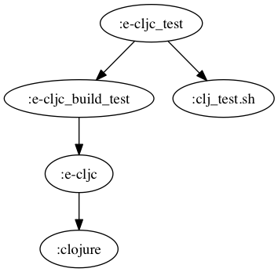
```
buck-out/gen/RULES/clojure-clojurescript-buck/tests/e-cljc_test [error opening dir]

0 directories, 0 files
```
## e-cljs

```
buck-out/gen/RULES/clojure-clojurescript-buck/tests/e-cljs
└── build
    ├── deps
    ├── project.clj
    ├── src
    │   └── e
    │       └── e_cljs.cljs
    └── test

4 directories, 3 files
```
`cat project.clj`:
``` clojure
(defproject e-cljs "0.0.1"
:dependencies [[org.clojure/clojure "1.8.0"]
[org.clojure/clojurescript "1.7.228"]]
:plugins [[lein-cljsbuild "1.1.2"]
          [lein-doo "0.1.6"]]
:source-paths ["src" "test"]
:cljsbuild {:builds {:debug {:source-paths ["src" "test"]
                             :compiler {:optimizations :simple
                                        :output-dir "target"
                                        :output-to "target/e-cljs.js"}}
                     :integration {:source-paths ["src" "test"]
                                   :compiler {:optimizations :advanced
                                              :output-dir "integ"
                                              :output-to "integ/e-cljs.min.js"}}
                     :release {:source-paths ["src"]
                               :compiler {:optimizations :advanced
                                          :output-dir "release"
                                          :output-to "release/e-cljs.js"}}}})
```
## e-cljs_build

```
buck-out/gen/RULES/clojure-clojurescript-buck/tests/e-cljs_build
└── build
    ├── cljs
    │   ├── core.cljs
    │   └── core.js
    ├── e
    │   └── e_cljs.js
    └── e-cljs.js

3 directories, 4 files
```
## e-cljs_build_test
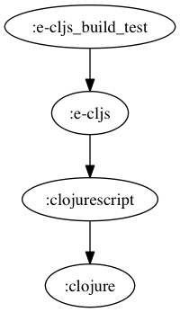
```
buck-out/gen/RULES/clojure-clojurescript-buck/tests/e-cljs_build_test
└── build_test
    ├── deps
    ├── integ
    │   ├── cljs
    │   │   ├── core.cljs
    │   │   ├── core.js
    │   │   ├── pprint.cljs
    │   │   ├── pprint.js
    │   │   ├── test.cljs
    │   │   └── test.js
    │   ├── clojure
    │   │   ├── string.cljs
    │   │   └── string.js
    │   ├── constants_table.js
    │   ├── doo
    │   │   ├── runner.cljs
    │   │   └── runner.js
    │   ├── e
    │   │   ├── e_cljs.js
    │   │   └── e_test.js
    │   ├── e-cljs.min.js
    │   ├── jx
    │   │   └── reporter
    │   │       ├── karma.cljs
    │   │       └── karma.js
    │   └── test
    │       └── runner.js
    ├── project.clj
    ├── src
    │   └── e
    │       └── e_cljs.cljs
    ├── target
    │   ├── cljs
    │   │   ├── core.cljs
    │   │   ├── core.js
    │   │   ├── pprint.cljs
    │   │   ├── pprint.js
    │   │   ├── test.cljs
    │   │   └── test.js
    │   ├── clojure
    │   │   ├── string.cljs
    │   │   └── string.js
    │   ├── doo
    │   │   ├── runner.cljs
    │   │   └── runner.js
    │   ├── e
    │   │   ├── e_cljs.js
    │   │   └── e_test.js
    │   ├── e-cljs.js
    │   ├── jx
    │   │   └── reporter
    │   │       ├── karma.cljs
    │   │       └── karma.js
    │   └── test
    │       └── runner.js
    └── test
        ├── e
        │   └── e_test.cljs
        └── runner.cljs

21 directories, 38 files
```
`cat project.clj`:
``` clojure
(defproject e-cljs "0.0.1"
:dependencies [[org.clojure/clojure "1.8.0"]
[org.clojure/clojurescript "1.7.228"]]
:plugins [[lein-cljsbuild "1.1.2"]
          [lein-doo "0.1.6"]]
:source-paths ["src" "test"]
:cljsbuild {:builds {:debug {:source-paths ["src" "test"]
                             :compiler {:optimizations :simple
                                        :output-dir "target"
                                        :output-to "target/e-cljs.js"}}
                     :integration {:source-paths ["src" "test"]
                                   :compiler {:optimizations :advanced
                                              :output-dir "integ"
                                              :output-to "integ/e-cljs.min.js"}}
                     :release {:source-paths ["src"]
                               :compiler {:optimizations :advanced
                                          :output-dir "release"
                                          :output-to "release/e-cljs.js"}}}})
```
## e-cljs_test
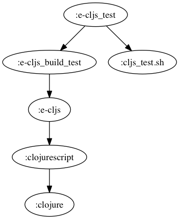
```
buck-out/gen/RULES/clojure-clojurescript-buck/tests/e-cljs_test [error opening dir]

0 directories, 0 files
```
## f-clj
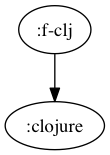
```
buck-out/gen/RULES/clojure-clojurescript-buck/tests/f-clj
└── build
    ├── deps
    ├── project.clj
    ├── src
    │   └── f
    │       └── core
    │           └── f_clj.clj
    └── test

5 directories, 3 files
```
`cat project.clj`:
``` clojure
(defproject f-clj "0.0.1"
  :dependencies [[org.clojure/clojure "1.8.0"]]
  :main f.core.f-clj
  :aot [f.core.f-clj]
  :source-paths ["src"])
```
## f-clj_build

```
buck-out/gen/RULES/clojure-clojurescript-buck/tests/f-clj_build
└── build
    ├── classes
    │   ├── META-INF
    │   │   └── maven
    │   │       └── f-clj
    │   │           └── f-clj
    │   │               └── pom.properties
    │   └── f
    │       └── core
    │           ├── f_clj$_main.class
    │           ├── f_clj$fn__27.class
    │           ├── f_clj$loading__5569__auto____25.class
    │           ├── f_clj.class
    │           └── f_clj__init.class
    ├── f-clj-0.0.1.jar
    └── stale
        └── extract-native.dependencies

9 directories, 8 files
```
## f-clj_release
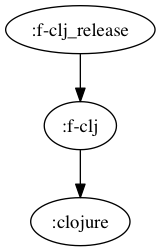
```
buck-out/gen/RULES/clojure-clojurescript-buck/tests/f-clj_release
└── f-clj.jar

0 directories, 1 file
```
## f-cljc
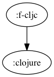
```
buck-out/gen/RULES/clojure-clojurescript-buck/tests/f-cljc
└── build
    ├── deps
    ├── project.clj
    ├── src
    │   └── f
    │       └── core
    │           └── f_cljc.cljc
    └── test

5 directories, 3 files
```
`cat project.clj`:
``` clojure
(defproject f-cljc "0.0.1"
  :dependencies [[org.clojure/clojure "1.8.0"]]
  :main f.core.f-cljc
  :aot [f.core.f-cljc]
  :source-paths ["src"])
```
## f-cljc_build
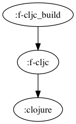
```
buck-out/gen/RULES/clojure-clojurescript-buck/tests/f-cljc_build
└── build
    ├── classes
    │   ├── META-INF
    │   │   └── maven
    │   │       └── f-cljc
    │   │           └── f-cljc
    │   │               └── pom.properties
    │   └── f
    │       └── core
    │           ├── f_cljc$_main.class
    │           ├── f_cljc$fn__27.class
    │           ├── f_cljc$loading__5569__auto____25.class
    │           ├── f_cljc.class
    │           └── f_cljc__init.class
    ├── f-cljc-0.0.1.jar
    └── stale
        └── extract-native.dependencies

9 directories, 8 files
```
## f-cljc_cljs
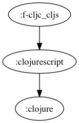
```
buck-out/gen/RULES/clojure-clojurescript-buck/tests/f-cljc_cljs
└── build
    ├── deps
    ├── project.clj
    ├── src
    │   └── f
    │       └── core
    │           └── f_cljc.cljc
    └── test

5 directories, 3 files
```
`cat project.clj`:
``` clojure
(defproject f-cljc_cljs "0.0.1"
:dependencies [[org.clojure/clojure "1.8.0"]
[org.clojure/clojurescript "1.7.228"]]
:plugins [[lein-cljsbuild "1.1.2"]
          [lein-doo "0.1.6"]]
:source-paths ["src" "test"]
:cljsbuild {:builds {:debug {:source-paths ["src" "test"]
                             :compiler {:optimizations :simple
                                        :output-dir "target"
                                        :output-to "target/f-cljc_cljs.js"}}
                     :integration {:source-paths ["src" "test"]
                                   :compiler {:optimizations :advanced
                                              :output-dir "integ"
                                              :output-to "integ/f-cljc_cljs.min.js"}}
                     :release {:source-paths ["src"]
                               :compiler {:optimizations :advanced
                                          :output-dir "release"
                                          :output-to "release/f-cljc_cljs.js"}}}})
```
## f-cljc_cljs_build
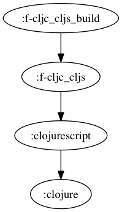
```
buck-out/gen/RULES/clojure-clojurescript-buck/tests/f-cljc_cljs_build
└── build
    ├── cljs
    │   ├── core.cljs
    │   └── core.js
    ├── f
    │   └── core
    │       └── f_cljc.js
    └── f-cljc_cljs.js

4 directories, 4 files
```
## f-cljc_cljs_release
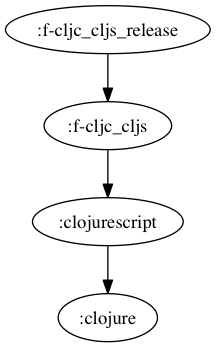
```
buck-out/gen/RULES/clojure-clojurescript-buck/tests/f-cljc_cljs_release
└── f-cljc_cljs.js

0 directories, 1 file
```
## f-cljc_release
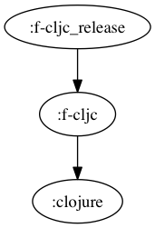
```
buck-out/gen/RULES/clojure-clojurescript-buck/tests/f-cljc_release
└── f-cljc.jar

0 directories, 1 file
```
## f-cljs
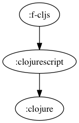
```
buck-out/gen/RULES/clojure-clojurescript-buck/tests/f-cljs
└── build
    ├── deps
    ├── project.clj
    ├── src
    │   └── f
    │       └── core
    │           └── f_cljs.cljs
    └── test

5 directories, 3 files
```
`cat project.clj`:
``` clojure
(defproject f-cljs "0.0.1"
:dependencies [[org.clojure/clojure "1.8.0"]
[org.clojure/clojurescript "1.7.228"]]
:plugins [[lein-cljsbuild "1.1.2"]
          [lein-doo "0.1.6"]]
:source-paths ["src" "test"]
:cljsbuild {:builds {:debug {:source-paths ["src" "test"]
                             :compiler {:optimizations :simple
                                        :output-dir "target"
                                        :output-to "target/f-cljs.js"}}
                     :integration {:source-paths ["src" "test"]
                                   :compiler {:optimizations :advanced
                                              :output-dir "integ"
                                              :output-to "integ/f-cljs.min.js"}}
                     :release {:source-paths ["src"]
                               :compiler {:optimizations :advanced
                                          :output-dir "release"
                                          :output-to "release/f-cljs.js"}}}})
```
## f-cljs_build
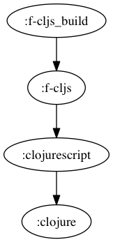
```
buck-out/gen/RULES/clojure-clojurescript-buck/tests/f-cljs_build
└── build
    ├── cljs
    │   ├── core.cljs
    │   └── core.js
    ├── f
    │   └── core
    │       └── f_cljs.js
    └── f-cljs.js

4 directories, 4 files
```
## f-cljs_release
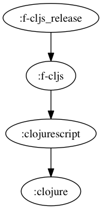
```
buck-out/gen/RULES/clojure-clojurescript-buck/tests/f-cljs_release
└── f-cljs.js

0 directories, 1 file
```
## g-clj
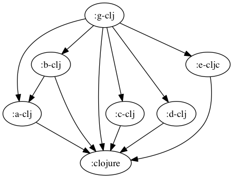
```
buck-out/gen/RULES/clojure-clojurescript-buck/tests/g-clj
└── build
    ├── deps
    ├── project.clj
    ├── src
    │   ├── a
    │   │   └── a_clj.clj
    │   ├── b
    │   │   └── b_clj.clj
    │   ├── c
    │   │   └── c_clj.clj
    │   ├── d
    │   │   ├── d1.clj
    │   │   └── d2.clj
    │   ├── e
    │   │   └── e_cljc.cljc
    │   └── g
    │       └── core
    │           └── g_clj.clj
    └── test

10 directories, 9 files
```
`cat project.clj`:
``` clojure
(defproject g-clj "0.0.1"
  :dependencies [[aleph "0.4.1-beta2"]
[org.clojure/clojure "1.8.0"]
[org.clojure/data.json "0.2.6"]]
  :main g.core.g-clj
  :aot [g.core.g-clj]
  :source-paths ["src"])
```
## g-clj_build
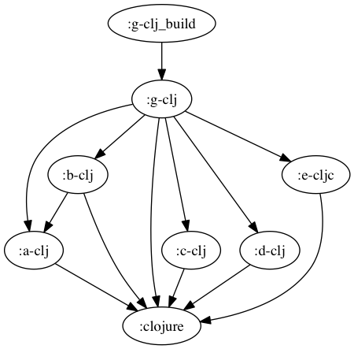
```
buck-out/gen/RULES/clojure-clojurescript-buck/tests/g-clj_build
└── build
    ├── classes
    │   ├── META-INF
    │   │   └── maven
    │   │       └── g-clj
    │   │           └── g-clj
    │   │               └── pom.properties
    │   ├── a
    │   │   ├── a_clj$fn__29.class
    │   │   ├── a_clj$loading__5569__auto____27.class
    │   │   └── a_clj__init.class
    │   ├── aleph
    │   │   ├── flow$acquire$fn$reify__1751.class
    │   │   ├── flow$acquire$fn__1750.class
    │   │   ├── flow$acquire.class
    │   │   ├── flow$dispose.class
    │   │   ├── flow$fn__1741.class
    │   │   ├── flow$instrumented_pool$reify__1745.class
    │   │   ├── flow$instrumented_pool$reify__1747.class
    │   │   ├── flow$instrumented_pool.class
    │   │   ├── flow$loading__5569__auto____1232.class
    │   │   ├── flow$release.class
    │   │   ├── flow__init.class
    │   │   ├── http
    │   │   │   ├── client$client_handler$handle_response__4607.class
    │   │   │   ├── client$client_handler$reify__4609$fn__4614.class
    │   │   │   ├── client$client_handler$reify__4609$fn__4616.class
    │   │   │   ├── client$client_handler$reify__4609$fn__4623.class
    │   │   │   ├── client$client_handler$reify__4609$fn__4629.class
    │   │   │   ├── client$client_handler$reify__4609.class
    │   │   │   ├── client$client_handler.class
    │   │   │   ├── client$close_connection.class
    │   │   │   ├── client$fn__4581.class
    │   │   │   ├── client$fn__4583$no_url__4584.class
    │   │   │   ├── client$fn__4583$req__GT_domain__4588.class
    │   │   │   ├── client$fn__4583.class
    │   │   │   ├── client$http_connection$fn__4653$fn__4654$f__3786__auto____4655.class
    │   │   │   ├── client$http_connection$fn__4653$fn__4654$fn__4657.class
    │   │   │   ├── client$http_connection$fn__4653$fn__4654.class
    │   │   │   ├── client$http_connection$fn__4653$fn__4663.class
    │   │   │   ├── client$http_connection$fn__4653$fn__4665$fn__4666.class
    │   │   │   ├── client$http_connection$fn__4653$fn__4665$fn__4668$fn__4669$fn__4670.class
    │   │   │   ├── client$http_connection$fn__4653$fn__4665$fn__4668$fn__4669.class
    │   │   │   ├── client$http_connection$fn__4653$fn__4665$fn__4668.class
    │   │   │   ├── client$http_connection$fn__4653$fn__4665.class
    │   │   │   ├── client$http_connection$fn__4653.class
    │   │   │   ├── client$http_connection.class
    │   │   │   ├── client$loading__5569__auto____4337.class
    │   │   │   ├── client$pipeline_builder$fn__4646.class
    │   │   │   ├── client$pipeline_builder.class
    │   │   │   ├── client$raw_client_handler$handle_response__4593.class
    │   │   │   ├── client$raw_client_handler$reify__4595$fn__4596.class
    │   │   │   ├── client$raw_client_handler$reify__4595$fn__4598.class
    │   │   │   ├── client$raw_client_handler$reify__4595.class
    │   │   │   ├── client$raw_client_handler.class
    │   │   │   ├── client$websocket_client_handler$reify__4682$fn__4683.class
    │   │   │   ├── client$websocket_client_handler$reify__4682$fn__4686$fn__4687.class
    │   │   │   ├── client$websocket_client_handler$reify__4682$fn__4686.class
    │   │   │   ├── client$websocket_client_handler$reify__4682.class
    │   │   │   ├── client$websocket_client_handler.class
    │   │   │   ├── client$websocket_connection$fn__4697.class
    │   │   │   ├── client$websocket_connection$fn__4700.class
    │   │   │   ├── client$websocket_connection.class
    │   │   │   ├── client$websocket_frame_size.class
    │   │   │   ├── client$websocket_handshaker.class
    │   │   │   ├── client__init.class
    │   │   │   ├── client_middleware$accept_encoding_value.class
    │   │   │   ├── client_middleware$basic_auth_value.class
    │   │   │   ├── client_middleware$client_error_QMARK_.class
    │   │   │   ├── client_middleware$coerce_clojure_body.class
    │   │   │   ├── client_middleware$coerce_json_body.class
    │   │   │   ├── client_middleware$coerce_transit_body.class
    │   │   │   ├── client_middleware$conflict_QMARK_.class
    │   │   │   ├── client_middleware$content_type_value.class
    │   │   │   ├── client_middleware$decorate_accept.class
    │   │   │   ├── client_middleware$decorate_accept_encoding.class
    │   │   │   ├── client_middleware$decorate_basic_auth.class
    │   │   │   ├── client_middleware$decorate_content_type.class
    │   │   │   ├── client_middleware$decorate_form_params.class
    │   │   │   ├── client_middleware$decorate_method.class
    │   │   │   ├── client_middleware$decorate_nested_params.class
    │   │   │   ├── client_middleware$decorate_oauth.class
    │   │   │   ├── client_middleware$decorate_query_params$fn__4473.class
    │   │   │   ├── client_middleware$decorate_query_params.class
    │   │   │   ├── client_middleware$decorate_url.class
    │   │   │   ├── client_middleware$decorate_user_info.class
    │   │   │   ├── client_middleware$def_decorator.class
    │   │   │   ├── client_middleware$detect_charset.class
    │   │   │   ├── client_middleware$dissoc_in.class
    │   │   │   ├── client_middleware$fn__4341.class
    │   │   │   ├── client_middleware$fn__4343.class
    │   │   │   ├── client_middleware$fn__4345.class
    │   │   │   ├── client_middleware$fn__4361$fn__4362.class
    │   │   │   ├── client_middleware$fn__4361$opt__4364.class
    │   │   │   ├── client_middleware$fn__4361.class
    │   │   │   ├── client_middleware$fn__4517$fn__4518.class
    │   │   │   ├── client_middleware$fn__4517.class
    │   │   │   ├── client_middleware$fn__4523.class
    │   │   │   ├── client_middleware$fn__4525.class
    │   │   │   ├── client_middleware$fn__4548.class
    │   │   │   ├── client_middleware$fn__4550.class
    │   │   │   ├── client_middleware$fn__4552.class
    │   │   │   ├── client_middleware$fn__4554.class
    │   │   │   ├── client_middleware$fn__4556.class
    │   │   │   ├── client_middleware$fn__4558.class
    │   │   │   ├── client_middleware$fn__4560.class
    │   │   │   ├── client_middleware$fn__4564.class
    │   │   │   ├── client_middleware$fn__4568.class
    │   │   │   ├── client_middleware$follow_redirect.class
    │   │   │   ├── client_middleware$generate_query_string.class
    │   │   │   ├── client_middleware$handle_redirects.class
    │   │   │   ├── client_middleware$json_decode.class
    │   │   │   ├── client_middleware$json_decode_strict.class
    │   │   │   ├── client_middleware$loading__5569__auto____4339.class
    │   │   │   ├── client_middleware$missing_QMARK_.class
    │   │   │   ├── client_middleware$nest_params$fn__4371$fn__4374.class
    │   │   │   ├── client_middleware$nest_params$fn__4371.class
    │   │   │   ├── client_middleware$nest_params.class
    │   │   │   ├── client_middleware$parse_content_type$fn__4510.class
    │   │   │   ├── client_middleware$parse_content_type$fn__4513.class
    │   │   │   ├── client_middleware$parse_content_type.class
    │   │   │   ├── client_middleware$parse_transit.class
    │   │   │   ├── client_middleware$parse_url.class
    │   │   │   ├── client_middleware$parse_user_info.class
    │   │   │   ├── client_middleware$redirect_QMARK_.class
    │   │   │   ├── client_middleware$server_error_QMARK_.class
    │   │   │   ├── client_middleware$success_QMARK_.class
    │   │   │   ├── client_middleware$update.class
    │   │   │   ├── client_middleware$url_encode.class
    │   │   │   ├── client_middleware$url_encode_illegal_characters.class
    │   │   │   ├── client_middleware$when_pos.class
    │   │   │   ├── client_middleware$wrap_exceptions$fn__4399$fn__4409.class
    │   │   │   ├── client_middleware$wrap_exceptions$fn__4399$fn__4413.class
    │   │   │   ├── client_middleware$wrap_exceptions$fn__4399$fn__4417.class
    │   │   │   ├── client_middleware$wrap_exceptions$fn__4399$fn__4421.class
    │   │   │   ├── client_middleware$wrap_exceptions$fn__4399$fn__4425$fn__4427.class
    │   │   │   ├── client_middleware$wrap_exceptions$fn__4399$fn__4425.class
    │   │   │   ├── client_middleware$wrap_exceptions$fn__4399.class
    │   │   │   ├── client_middleware$wrap_exceptions.class
    │   │   │   ├── client_middleware$wrap_request$fn__4572$fn__4573.class
    │   │   │   ├── client_middleware$wrap_request$fn__4572$fn__4576.class
    │   │   │   ├── client_middleware$wrap_request$fn__4572.class
    │   │   │   ├── client_middleware$wrap_request.class
    │   │   │   ├── client_middleware$wrap_request_timing$fn__4503$fn__4504.class
    │   │   │   ├── client_middleware$wrap_request_timing$fn__4503.class
    │   │   │   ├── client_middleware$wrap_request_timing.class
    │   │   │   ├── client_middleware__init.class
    │   │   │   ├── core
    │   │   │   │   ├── HeaderMap$eval4012__4013.class
    │   │   │   │   ├── HeaderMap$fn__4009.class
    │   │   │   │   ├── HeaderMap$fn__4015.class
    │   │   │   │   ├── HeaderMap$fn__4017.class
    │   │   │   │   ├── HeaderMap.class
    │   │   │   │   ├── ILookupNettyRequest.class
    │   │   │   │   ├── ILookupNettyResponse.class
    │   │   │   │   ├── NettyRequest$eval4067__4068.class
    │   │   │   │   ├── NettyRequest$fn__4064.class
    │   │   │   │   ├── NettyRequest$fn__4070.class
    │   │   │   │   ├── NettyRequest$fn__4072.class
    │   │   │   │   ├── NettyRequest.class
    │   │   │   │   ├── NettyResponse$eval4115__4116.class
    │   │   │   │   ├── NettyResponse$fn__4112.class
    │   │   │   │   ├── NettyResponse$fn__4118.class
    │   │   │   │   ├── NettyResponse$fn__4120.class
    │   │   │   │   └── NettyResponse.class
    │   │   │   ├── core$eval4003.class
    │   │   │   ├── core$eval4054.class
    │   │   │   ├── core$eval4105.class
    │   │   │   ├── core$fn__3991.class
    │   │   │   ├── core$fn__3994$fn__3995.class
    │   │   │   ├── core$fn__3994.class
    │   │   │   ├── core$fn__4007$__GT_HeaderMap__4030.class
    │   │   │   ├── core$fn__4007.class
    │   │   │   ├── core$fn__4050.class
    │   │   │   ├── core$fn__4062$__GT_NettyRequest__4089.class
    │   │   │   ├── core$fn__4062.class
    │   │   │   ├── core$fn__4092$__GT_NettyRequest__4093.class
    │   │   │   ├── core$fn__4092.class
    │   │   │   ├── core$fn__4101.class
    │   │   │   ├── core$fn__4110$__GT_NettyResponse__4134.class
    │   │   │   ├── core$fn__4110.class
    │   │   │   ├── core$fn__4137$__GT_NettyResponse__4138.class
    │   │   │   ├── core$fn__4137.class
    │   │   │   ├── core$fn__4145$coerce_element__4146.class
    │   │   │   ├── core$fn__4145.class
    │   │   │   ├── core$fn__4175$handle_cleanup__4176$fn__4177.class
    │   │   │   ├── core$fn__4175$handle_cleanup__4176$fn__4179.class
    │   │   │   ├── core$fn__4175$handle_cleanup__4176.class
    │   │   │   ├── core$fn__4175$send_message__4182$fn__4183.class
    │   │   │   ├── core$fn__4175$send_message__4182.class
    │   │   │   ├── core$fn__4175.class
    │   │   │   ├── core$headers__GT_map.class
    │   │   │   ├── core$loading__5569__auto____1759.class
    │   │   │   ├── core$map__GT_headers_BANG_.class
    │   │   │   ├── core$netty_request__GT_ring_request.class
    │   │   │   ├── core$netty_response__GT_ring_response.class
    │   │   │   ├── core$normalize_header_key.class
    │   │   │   ├── core$ring_request__GT_full_netty_request.class
    │   │   │   ├── core$ring_request__GT_netty_request.class
    │   │   │   ├── core$ring_response__GT_netty_response.class
    │   │   │   ├── core$send_contiguous_body.class
    │   │   │   ├── core$send_file_body.class
    │   │   │   ├── core$send_streaming_body$fn__4153.class
    │   │   │   ├── core$send_streaming_body$fn__4157.class
    │   │   │   ├── core$send_streaming_body$fn__4161.class
    │   │   │   ├── core$send_streaming_body$fn__4163.class
    │   │   │   ├── core$send_streaming_body$fn__4165$fn__4166.class
    │   │   │   ├── core$send_streaming_body$fn__4165.class
    │   │   │   ├── core$send_streaming_body.class
    │   │   │   ├── core$try_set_content_length_BANG_.class
    │   │   │   ├── core__init.class
    │   │   │   ├── server$date_header_value$fn__4197.class
    │   │   │   ├── server$date_header_value.class
    │   │   │   ├── server$error_response.class
    │   │   │   ├── server$fn__4193.class
    │   │   │   ├── server$fn__4208$fn__4209.class
    │   │   │   ├── server$fn__4208$fn__4211.class
    │   │   │   ├── server$fn__4208$send_response__4213$f__3786__auto____4217.class
    │   │   │   ├── server$fn__4208$send_response__4213$fn__4215.class
    │   │   │   ├── server$fn__4208$send_response__4213$fn__4220.class
    │   │   │   ├── server$fn__4208$send_response__4213.class
    │   │   │   ├── server$fn__4208.class
    │   │   │   ├── server$handle_request$fn__4228$f__619__auto____4229.class
    │   │   │   ├── server$handle_request$fn__4228$fn__4234.class
    │   │   │   ├── server$handle_request$fn__4228.class
    │   │   │   ├── server$handle_request$fn__4241.class
    │   │   │   ├── server$handle_request$fn__4243$fn__4244.class
    │   │   │   ├── server$handle_request$fn__4243.class
    │   │   │   ├── server$handle_request.class
    │   │   │   ├── server$initialize_websocket_handler$fn__4329.class
    │   │   │   ├── server$initialize_websocket_handler$fn__4331.class
    │   │   │   ├── server$initialize_websocket_handler$fn__4333.class
    │   │   │   ├── server$initialize_websocket_handler.class
    │   │   │   ├── server$invalid_value_response.class
    │   │   │   ├── server$loading__5569__auto____1757.class
    │   │   │   ├── server$pipeline_builder$fn__4303.class
    │   │   │   ├── server$pipeline_builder.class
    │   │   │   ├── server$raw_ring_handler$handle_request__4291.class
    │   │   │   ├── server$raw_ring_handler$reify__4293$fn__4294.class
    │   │   │   ├── server$raw_ring_handler$reify__4293.class
    │   │   │   ├── server$raw_ring_handler.class
    │   │   │   ├── server$rfc_1123_date_string.class
    │   │   │   ├── server$ring_handler$handle_request__4250.class
    │   │   │   ├── server$ring_handler$process_content__4266$fn__4268.class
    │   │   │   ├── server$ring_handler$process_content__4266.class
    │   │   │   ├── server$ring_handler$process_last_content__4256.class
    │   │   │   ├── server$ring_handler$process_request__4252$fn__4253.class
    │   │   │   ├── server$ring_handler$process_request__4252.class
    │   │   │   ├── server$ring_handler$reify__4278.class
    │   │   │   ├── server$ring_handler.class
    │   │   │   ├── server$start_server$fn__4309.class
    │   │   │   ├── server$start_server.class
    │   │   │   ├── server$websocket_server_handler$fn__4314.class
    │   │   │   ├── server$websocket_server_handler$fn__4316$fn__4317.class
    │   │   │   ├── server$websocket_server_handler$fn__4316.class
    │   │   │   ├── server$websocket_server_handler$reify__4321.class
    │   │   │   ├── server$websocket_server_handler.class
    │   │   │   └── server__init.class
    │   │   ├── http$connection_pool$fn__4714$fn__4715.class
    │   │   ├── http$connection_pool$fn__4714.class
    │   │   ├── http$connection_pool$fn__4718.class
    │   │   ├── http$connection_pool.class
    │   │   ├── http$create_connection.class
    │   │   ├── http$def_http_method.class
    │   │   ├── http$fn__4703.class
    │   │   ├── http$fn__4721.class
    │   │   ├── http$fn__4735$maybe_connect__4738.class
    │   │   ├── http$fn__4735$maybe_timeout_BANG___4736.class
    │   │   ├── http$fn__4735$request__4741$fn__4743$fn__4744$fn__4745.class
    │   │   ├── http$fn__4735$request__4741$fn__4743$fn__4744$fn__4747$fn__4748.class
    │   │   ├── http$fn__4735$request__4741$fn__4743$fn__4744$fn__4747$fn__4750$fn__4751.class
    │   │   ├── http$fn__4735$request__4741$fn__4743$fn__4744$fn__4747$fn__4750.class
    │   │   ├── http$fn__4735$request__4741$fn__4743$fn__4744$fn__4747.class
    │   │   ├── http$fn__4735$request__4741$fn__4743$fn__4744$fn__4755.class
    │   │   ├── http$fn__4735$request__4741$fn__4743$fn__4744.class
    │   │   ├── http$fn__4735$request__4741$fn__4743.class
    │   │   ├── http$fn__4735$request__4741.class
    │   │   ├── http$fn__4735.class
    │   │   ├── http$get_all.class
    │   │   ├── http$loading__5569__auto____177.class
    │   │   ├── http$register_connection_stats_callback.class
    │   │   ├── http$req.class
    │   │   ├── http$start_server.class
    │   │   ├── http$unregister_connection_stats_callback.class
    │   │   ├── http$websocket_client.class
    │   │   ├── http$websocket_connection.class
    │   │   ├── http__init.class
    │   │   ├── netty
    │   │   │   ├── AlephServer.class
    │   │   │   ├── ChannelSink$fn__3798.class
    │   │   │   ├── ChannelSink.class
    │   │   │   ├── HeaderMap$eval3926__3927.class
    │   │   │   ├── HeaderMap$fn__3923.class
    │   │   │   ├── HeaderMap$fn__3929.class
    │   │   │   ├── HeaderMap$fn__3931.class
    │   │   │   ├── HeaderMap$fn__3934.class
    │   │   │   └── HeaderMap.class
    │   │   ├── netty$__GT_ChannelSink.class
    │   │   ├── netty$acquire.class
    │   │   ├── netty$acquire__3740.class
    │   │   ├── netty$allocate.class
    │   │   ├── netty$bandwidth_tracker$fn__3895.class
    │   │   ├── netty$bandwidth_tracker$reify__3897.class
    │   │   ├── netty$bandwidth_tracker.class
    │   │   ├── netty$buf__GT_array.class
    │   │   ├── netty$buffered_source$fn__3824.class
    │   │   ├── netty$buffered_source.class
    │   │   ├── netty$bufs__GT_array$fn__3758.class
    │   │   ├── netty$bufs__GT_array$fn__3760.class
    │   │   ├── netty$bufs__GT_array.class
    │   │   ├── netty$channel.class
    │   │   ├── netty$channel_handler.class
    │   │   ├── netty$channel_remote_address.class
    │   │   ├── netty$channel_server_name.class
    │   │   ├── netty$channel_server_port.class
    │   │   ├── netty$close.class
    │   │   ├── netty$connection_stats.class
    │   │   ├── netty$create_client$fn__3975.class
    │   │   ├── netty$create_client$fn__3978.class
    │   │   ├── netty$create_client.class
    │   │   ├── netty$epoll_available_QMARK_.class
    │   │   ├── netty$eval3728$fn__3729.class
    │   │   ├── netty$eval3728.class
    │   │   ├── netty$eval3735$fn__3736.class
    │   │   ├── netty$eval3735.class
    │   │   ├── netty$eval3917.class
    │   │   ├── netty$flush.class
    │   │   ├── netty$fn__3726.class
    │   │   ├── netty$fn__3765.class
    │   │   ├── netty$fn__3767.class
    │   │   ├── netty$fn__3769$append_to_buf_BANG___3770.class
    │   │   ├── netty$fn__3769$to_byte_buf__3772.class
    │   │   ├── netty$fn__3769.class
    │   │   ├── netty$fn__3797$__GT_ChannelSink__3812.class
    │   │   ├── netty$fn__3797.class
    │   │   ├── netty$fn__3921$__GT_HeaderMap__3946.class
    │   │   ├── netty$fn__3921.class
    │   │   ├── netty$fn__3955.class
    │   │   ├── netty$fn__3958$G__3953__3963.class
    │   │   ├── netty$fn__3958$G__3954__3960.class
    │   │   ├── netty$fn__3958.class
    │   │   ├── netty$fn__3971.class
    │   │   ├── netty$fn__3973.class
    │   │   ├── netty$get_default_event_loop_threads.class
    │   │   ├── netty$headers.class
    │   │   ├── netty$insecure_ssl_client_context.class
    │   │   ├── netty$instrument_BANG_$f__3786__auto____3905.class
    │   │   ├── netty$instrument_BANG_$fn__3908.class
    │   │   ├── netty$instrument_BANG_.class
    │   │   ├── netty$leak_detector_level_BANG_.class
    │   │   ├── netty$loading__5569__auto____2709.class
    │   │   ├── netty$pipeline_initializer$reify__3900.class
    │   │   ├── netty$pipeline_initializer.class
    │   │   ├── netty$put_BANG_$fn__3791.class
    │   │   ├── netty$put_BANG_.class
    │   │   ├── netty$release.class
    │   │   ├── netty$release__3733.class
    │   │   ├── netty$release_buf__GT_array.class
    │   │   ├── netty$safe_execute.class
    │   │   ├── netty$self_signed_ssl_context.class
    │   │   ├── netty$set_logger_BANG_.class
    │   │   ├── netty$sink$fn__3816.class
    │   │   ├── netty$sink.class
    │   │   ├── netty$source$fn__3820.class
    │   │   ├── netty$source.class
    │   │   ├── netty$ssl_client_context.class
    │   │   ├── netty$start_server$fn__3983.class
    │   │   ├── netty$start_server$reify__3986.class
    │   │   ├── netty$start_server.class
    │   │   ├── netty$to_byte_buf_stream.class
    │   │   ├── netty$wrap_future$reify__3777.class
    │   │   ├── netty$wrap_future.class
    │   │   ├── netty$write.class
    │   │   ├── netty$write_and_flush.class
    │   │   └── netty__init.class
    │   ├── b
    │   │   ├── b_clj$fn__33.class
    │   │   ├── b_clj$loading__5569__auto____31.class
    │   │   └── b_clj__init.class
    │   ├── byte_streams
    │   │   ├── char_sequence$coding_error_action.class
    │   │   ├── char_sequence$decode.class
    │   │   ├── char_sequence$decode_byte_source$reify__3396$fn__3397.class
    │   │   ├── char_sequence$decode_byte_source$reify__3396.class
    │   │   ├── char_sequence$decode_byte_source.class
    │   │   ├── char_sequence$flush.class
    │   │   ├── char_sequence$fn__3379.class
    │   │   ├── char_sequence$lazy_char_buffer_sequence$fn__3387.class
    │   │   ├── char_sequence$lazy_char_buffer_sequence.class
    │   │   ├── char_sequence$loading__5569__auto____3377.class
    │   │   ├── char_sequence$parse_result.class
    │   │   ├── char_sequence__init.class
    │   │   ├── graph
    │   │   │   ├── Conversion.class
    │   │   │   ├── ConversionGraph$fn__2975$fn__2976.class
    │   │   │   ├── ConversionGraph$fn__2975.class
    │   │   │   ├── ConversionGraph$fn__2979$fn__2980.class
    │   │   │   ├── ConversionGraph$fn__2979.class
    │   │   │   ├── ConversionGraph$fn__2983.class
    │   │   │   ├── ConversionGraph$fn__2985$fn__2987.class
    │   │   │   ├── ConversionGraph$fn__2985.class
    │   │   │   ├── ConversionGraph.class
    │   │   │   ├── ConversionPath$reify__3002.class
    │   │   │   ├── ConversionPath$reify__3004.class
    │   │   │   ├── ConversionPath$reify__3006.class
    │   │   │   ├── ConversionPath$reify__3008.class
    │   │   │   ├── ConversionPath.class
    │   │   │   ├── IConversionGraph.class
    │   │   │   └── Type.class
    │   │   ├── graph$assignable_QMARK_.class
    │   │   ├── graph$canonicalize.class
    │   │   ├── graph$class_satisfies_QMARK_$fn__2859.class
    │   │   ├── graph$class_satisfies_QMARK_.class
    │   │   ├── graph$closeable_seq$reify__3047.class
    │   │   ├── graph$closeable_seq.class
    │   │   ├── graph$conj_path.class
    │   │   ├── graph$conversion_fn$fn__3052.class
    │   │   ├── graph$conversion_fn$fn__3054.class
    │   │   ├── graph$conversion_fn$fn__3056$fn__3057$fn__3058.class
    │   │   ├── graph$conversion_fn$fn__3056$fn__3057.class
    │   │   ├── graph$conversion_fn$fn__3056$fn__3061.class
    │   │   ├── graph$conversion_fn$fn__3056.class
    │   │   ├── graph$conversion_fn.class
    │   │   ├── graph$conversion_graph.class
    │   │   ├── graph$fn__2836.class
    │   │   ├── graph$fn__2838$__GT_Conversion__2842.class
    │   │   ├── graph$fn__2838.class
    │   │   ├── graph$fn__2845$__GT_Type__2849.class
    │   │   ├── graph$fn__2845.class
    │   │   ├── graph$fn__2879.class
    │   │   ├── graph$fn__2882$G__2875__2889.class
    │   │   ├── graph$fn__2882$G__2876__2885.class
    │   │   ├── graph$fn__2882.class
    │   │   ├── graph$fn__2895$G__2871__2900.class
    │   │   ├── graph$fn__2895$G__2872__2897.class
    │   │   ├── graph$fn__2895.class
    │   │   ├── graph$fn__2906$G__2867__2919.class
    │   │   ├── graph$fn__2906$G__2868__2912.class
    │   │   ├── graph$fn__2906.class
    │   │   ├── graph$fn__2925$G__2869__2932.class
    │   │   ├── graph$fn__2925$G__2870__2928.class
    │   │   ├── graph$fn__2925.class
    │   │   ├── graph$fn__2938$G__2877__2947.class
    │   │   ├── graph$fn__2938$G__2878__2942.class
    │   │   ├── graph$fn__2938.class
    │   │   ├── graph$fn__2953$G__2873__2958.class
    │   │   ├── graph$fn__2953$G__2874__2955.class
    │   │   ├── graph$fn__2953.class
    │   │   ├── graph$fn__2974$__GT_ConversionGraph__2993.class
    │   │   ├── graph$fn__2974.class
    │   │   ├── graph$fn__2998$__GT_ConversionPath__3018.class
    │   │   ├── graph$fn__2998$map__GT_ConversionPath__3020.class
    │   │   ├── graph$fn__2998.class
    │   │   ├── graph$fn__3025$fn__3027.class
    │   │   ├── graph$fn__3025$fn__3034.class
    │   │   ├── graph$fn__3025.class
    │   │   ├── graph$implicit_conversions$fn__2964.class
    │   │   ├── graph$implicit_conversions$fn__2966.class
    │   │   ├── graph$implicit_conversions$fn__2968.class
    │   │   ├── graph$implicit_conversions.class
    │   │   ├── graph$loading__5569__auto____2713.class
    │   │   ├── graph$pprint_type.class
    │   │   ├── graph$protocol_QMARK_.class
    │   │   ├── graph$seq_conversion_fn$fn__3075.class
    │   │   ├── graph$seq_conversion_fn$fn__3077.class
    │   │   ├── graph$seq_conversion_fn$fn__3079$fn__3080.class
    │   │   ├── graph$seq_conversion_fn$fn__3079$fn__3084.class
    │   │   ├── graph$seq_conversion_fn$fn__3079$fn__3086.class
    │   │   ├── graph$seq_conversion_fn$fn__3079$fn__3088.class
    │   │   ├── graph$seq_conversion_fn$fn__3079.class
    │   │   ├── graph$seq_conversion_fn.class
    │   │   ├── graph$type.class
    │   │   ├── graph__init.class
    │   │   ├── protocols
    │   │   │   ├── ByteSink.class
    │   │   │   ├── ByteSource.class
    │   │   │   └── Closeable.class
    │   │   ├── protocols$fn__2772.class
    │   │   ├── protocols$fn__2776.class
    │   │   ├── protocols$fn__2779$G__2774__2784.class
    │   │   ├── protocols$fn__2779$G__2775__2781.class
    │   │   ├── protocols$fn__2779.class
    │   │   ├── protocols$fn__2792.class
    │   │   ├── protocols$fn__2795$G__2790__2804.class
    │   │   ├── protocols$fn__2795$G__2791__2799.class
    │   │   ├── protocols$fn__2795.class
    │   │   ├── protocols$fn__2812.class
    │   │   ├── protocols$fn__2815$G__2810__2824.class
    │   │   ├── protocols$fn__2815$G__2811__2819.class
    │   │   ├── protocols$fn__2815.class
    │   │   ├── protocols$fn__2830.class
    │   │   ├── protocols$fn__2832$closeable_QMARK___2833.class
    │   │   ├── protocols$fn__2832.class
    │   │   ├── protocols$loading__5569__auto____2770.class
    │   │   ├── protocols__init.class
    │   │   ├── pushback_stream
    │   │   │   ├── Consumption.class
    │   │   │   ├── PushbackByteStream.class
    │   │   │   ├── PushbackStream.class
    │   │   │   └── SynchronizedPushbackByteStream.class
    │   │   ├── pushback_stream$__GT_input_stream.class
    │   │   ├── pushback_stream$both$fn__3286.class
    │   │   ├── pushback_stream$both$fn__3288.class
    │   │   ├── pushback_stream$both.class
    │   │   ├── pushback_stream$close.class
    │   │   ├── pushback_stream$close__3346.class
    │   │   ├── pushback_stream$eager_take.class
    │   │   ├── pushback_stream$eager_take__3353.class
    │   │   ├── pushback_stream$eval3327$fn__3328.class
    │   │   ├── pushback_stream$eval3327.class
    │   │   ├── pushback_stream$eval3334$fn__3335.class
    │   │   ├── pushback_stream$eval3334.class
    │   │   ├── pushback_stream$eval3341$fn__3342.class
    │   │   ├── pushback_stream$eval3341.class
    │   │   ├── pushback_stream$eval3348$fn__3349.class
    │   │   ├── pushback_stream$eval3348.class
    │   │   ├── pushback_stream$eval3355$fn__3356.class
    │   │   ├── pushback_stream$eval3355.class
    │   │   ├── pushback_stream$eval3362$fn__3363.class
    │   │   ├── pushback_stream$eval3362.class
    │   │   ├── pushback_stream$eval3369$fn__3370.class
    │   │   ├── pushback_stream$eval3369.class
    │   │   ├── pushback_stream$expand_either$fn__3280.class
    │   │   ├── pushback_stream$expand_either.class
    │   │   ├── pushback_stream$fn__3269.class
    │   │   ├── pushback_stream$fn__3271.class
    │   │   ├── pushback_stream$fn__3273$__GT_Consumption__3275.class
    │   │   ├── pushback_stream$fn__3273.class
    │   │   ├── pushback_stream$fn__3291$__GT_PushbackByteStream__3303.class
    │   │   ├── pushback_stream$fn__3291.class
    │   │   ├── pushback_stream$fn__3306$__GT_SynchronizedPushbackByteStream__3322.class
    │   │   ├── pushback_stream$fn__3306.class
    │   │   ├── pushback_stream$loading__5569__auto____3094.class
    │   │   ├── pushback_stream$prewalk.class
    │   │   ├── pushback_stream$pushback_array.class
    │   │   ├── pushback_stream$pushback_array__3367.class
    │   │   ├── pushback_stream$pushback_buffer.class
    │   │   ├── pushback_stream$pushback_buffer__3374.class
    │   │   ├── pushback_stream$pushback_stream.class
    │   │   ├── pushback_stream$put.class
    │   │   ├── pushback_stream$put_array.class
    │   │   ├── pushback_stream$put_array__3332.class
    │   │   ├── pushback_stream$put_buffer.class
    │   │   ├── pushback_stream$put_buffer__3339.class
    │   │   ├── pushback_stream$take.class
    │   │   ├── pushback_stream$take__3360.class
    │   │   ├── pushback_stream$unsafe_pushback_stream.class
    │   │   ├── pushback_stream$walk.class
    │   │   ├── pushback_stream__init.class
    │   │   ├── utils$fast_memoize$fn__2722$fn__2723.class
    │   │   ├── utils$fast_memoize$fn__2722$fn__2725.class
    │   │   ├── utils$fast_memoize$fn__2722$fn__2727.class
    │   │   ├── utils$fast_memoize$fn__2722$fn__2729.class
    │   │   ├── utils$fast_memoize$fn__2722$fn__2731.class
    │   │   ├── utils$fast_memoize$fn__2722$fn__2733.class
    │   │   ├── utils$fast_memoize$fn__2722$fn__2735.class
    │   │   ├── utils$fast_memoize$fn__2722$fn__2737.class
    │   │   ├── utils$fast_memoize$fn__2722.class
    │   │   ├── utils$fast_memoize.class
    │   │   ├── utils$fn__2717.class
    │   │   ├── utils$loading__5569__auto____2715.class
    │   │   ├── utils$memoize_form.class
    │   │   └── utils__init.class
    │   ├── byte_streams$bytes_EQ_.class
    │   ├── byte_streams$cmp_bufs$fn__3716.class
    │   ├── byte_streams$cmp_bufs.class
    │   ├── byte_streams$compare_bytes.class
    │   ├── byte_streams$conversion_path.class
    │   ├── byte_streams$convert.class
    │   ├── byte_streams$def_conversion.class
    │   ├── byte_streams$def_transfer.class
    │   ├── byte_streams$default_transfer.class
    │   ├── byte_streams$eval3490.class
    │   ├── byte_streams$eval3498.class
    │   ├── byte_streams$eval3519.class
    │   ├── byte_streams$eval3535.class
    │   ├── byte_streams$eval3545.class
    │   ├── byte_streams$eval3564.class
    │   ├── byte_streams$eval3572.class
    │   ├── byte_streams$eval3580.class
    │   ├── byte_streams$eval3585.class
    │   ├── byte_streams$eval3604.class
    │   ├── byte_streams$eval3620.class
    │   ├── byte_streams$fn__3407.class
    │   ├── byte_streams$fn__3409.class
    │   ├── byte_streams$fn__3412.class
    │   ├── byte_streams$fn__3431.class
    │   ├── byte_streams$fn__3433.class
    │   ├── byte_streams$fn__3435.class
    │   ├── byte_streams$fn__3445$conversion_cost__3449.class
    │   ├── byte_streams$fn__3445$fn__3446.class
    │   ├── byte_streams$fn__3445.class
    │   ├── byte_streams$fn__3492$fn__3493.class
    │   ├── byte_streams$fn__3492$fn__3495.class
    │   ├── byte_streams$fn__3492.class
    │   ├── byte_streams$fn__3500$fn__3501.class
    │   ├── byte_streams$fn__3500$fn__3503.class
    │   ├── byte_streams$fn__3500.class
    │   ├── byte_streams$fn__3507.class
    │   ├── byte_streams$fn__3510.class
    │   ├── byte_streams$fn__3512.class
    │   ├── byte_streams$fn__3514.class
    │   ├── byte_streams$fn__3522$fn__3524.class
    │   ├── byte_streams$fn__3522.class
    │   ├── byte_streams$fn__3538$fn__3540.class
    │   ├── byte_streams$fn__3538.class
    │   ├── byte_streams$fn__3543.class
    │   ├── byte_streams$fn__3548$fn__3550.class
    │   ├── byte_streams$fn__3548.class
    │   ├── byte_streams$fn__3554.class
    │   ├── byte_streams$fn__3557.class
    │   ├── byte_streams$fn__3561.class
    │   ├── byte_streams$fn__3566$fn__3568.class
    │   ├── byte_streams$fn__3566.class
    │   ├── byte_streams$fn__3574$fn__3575.class
    │   ├── byte_streams$fn__3574.class
    │   ├── byte_streams$fn__3578.class
    │   ├── byte_streams$fn__3582.class
    │   ├── byte_streams$fn__3587$fn__3588.class
    │   ├── byte_streams$fn__3587$fn__3591.class
    │   ├── byte_streams$fn__3587.class
    │   ├── byte_streams$fn__3595.class
    │   ├── byte_streams$fn__3599.class
    │   ├── byte_streams$fn__3602.class
    │   ├── byte_streams$fn__3606.class
    │   ├── byte_streams$fn__3614.class
    │   ├── byte_streams$fn__3617.class
    │   ├── byte_streams$fn__3623$buf_seq__3625$fn__3626.class
    │   ├── byte_streams$fn__3623$buf_seq__3625.class
    │   ├── byte_streams$fn__3623$fn__3629.class
    │   ├── byte_streams$fn__3623.class
    │   ├── byte_streams$fn__3632.class
    │   ├── byte_streams$fn__3634.class
    │   ├── byte_streams$fn__3637.class
    │   ├── byte_streams$fn__3641.class
    │   ├── byte_streams$fn__3645.class
    │   ├── byte_streams$fn__3648.class
    │   ├── byte_streams$fn__3650.class
    │   ├── byte_streams$fn__3652.class
    │   ├── byte_streams$fn__3655.class
    │   ├── byte_streams$fn__3659.class
    │   ├── byte_streams$fn__3661$readable_character_QMARK___3662.class
    │   ├── byte_streams$fn__3661.class
    │   ├── byte_streams$loading__5569__auto____2711.class
    │   ├── byte_streams$normalize_type_descriptor.class
    │   ├── byte_streams$optimized_transfer_QMARK_.class
    │   ├── byte_streams$possible_conversions.class
    │   ├── byte_streams$print_bytes$fn__3672.class
    │   ├── byte_streams$print_bytes$fn__3676.class
    │   ├── byte_streams$print_bytes$fn__3678.class
    │   ├── byte_streams$print_bytes$fn__3682.class
    │   ├── byte_streams$print_bytes$hex_format__3674.class
    │   ├── byte_streams$print_bytes$hex_format__3680.class
    │   ├── byte_streams$print_bytes.class
    │   ├── byte_streams$reify__3487.class
    │   ├── byte_streams$seq_of.class
    │   ├── byte_streams$stream_of.class
    │   ├── byte_streams$this__3457$fn__3458.class
    │   ├── byte_streams$this__3457$fn__3460.class
    │   ├── byte_streams$this__3457$fn__3463$fn__3464.class
    │   ├── byte_streams$this__3457$fn__3463.class
    │   ├── byte_streams$this__3457$fn__3470.class
    │   ├── byte_streams$this__3457$fn__3473.class
    │   ├── byte_streams$this__3457.class
    │   ├── byte_streams$to_byte_array.class
    │   ├── byte_streams$to_byte_arrays.class
    │   ├── byte_streams$to_byte_buffer.class
    │   ├── byte_streams$to_byte_buffers.class
    │   ├── byte_streams$to_byte_sink.class
    │   ├── byte_streams$to_byte_source.class
    │   ├── byte_streams$to_char_sequence.class
    │   ├── byte_streams$to_data_input_stream.class
    │   ├── byte_streams$to_input_stream.class
    │   ├── byte_streams$to_line_seq$line_BANG___3706$fn__3707$fn__3708.class
    │   ├── byte_streams$to_line_seq$line_BANG___3706$fn__3707.class
    │   ├── byte_streams$to_line_seq$line_BANG___3706.class
    │   ├── byte_streams$to_line_seq.class
    │   ├── byte_streams$to_output_stream.class
    │   ├── byte_streams$to_readable_channel.class
    │   ├── byte_streams$to_reader.class
    │   ├── byte_streams$to_string.class
    │   ├── byte_streams$transfer.class
    │   ├── byte_streams$type_descriptor.class
    │   ├── byte_streams$vector_of.class
    │   ├── byte_streams__init.class
    │   ├── c
    │   │   ├── c_clj$fn__163.class
    │   │   ├── c_clj$loading__5569__auto____35.class
    │   │   └── c_clj__init.class
    │   ├── clj_tuple$fn__1413.class
    │   ├── clj_tuple$hash_map.class
    │   ├── clj_tuple$loading__5569__auto____1411.class
    │   ├── clj_tuple$vector.class
    │   ├── clj_tuple__init.class
    │   ├── clojure
    │   │   ├── data
    │   │   │   ├── json
    │   │   │   │   └── JSONWriter.class
    │   │   │   ├── json$_read.class
    │   │   │   ├── json$codepoint.class
    │   │   │   ├── json$codepoint_case.class
    │   │   │   ├── json$codepoint_clause.class
    │   │   │   ├── json$default_value_fn.class
    │   │   │   ├── json$default_write_key_fn.class
    │   │   │   ├── json$fn__113$fn__114.class
    │   │   │   ├── json$fn__113.class
    │   │   │   ├── json$fn__39.class
    │   │   │   ├── json$fn__83.class
    │   │   │   ├── json$fn__86$G__81__93.class
    │   │   │   ├── json$fn__86$G__82__89.class
    │   │   │   ├── json$fn__86.class
    │   │   │   ├── json$json_str.class
    │   │   │   ├── json$loading__5569__auto____37.class
    │   │   │   ├── json$pprint.class
    │   │   │   ├── json$pprint_array$fn__121.class
    │   │   │   ├── json$pprint_array.class
    │   │   │   ├── json$pprint_dispatch.class
    │   │   │   ├── json$pprint_generic$fn__149.class
    │   │   │   ├── json$pprint_generic.class
    │   │   │   ├── json$pprint_json.class
    │   │   │   ├── json$pprint_object$fn__127.class
    │   │   │   ├── json$pprint_object$iter__130__134$fn__135$fn__136.class
    │   │   │   ├── json$pprint_object$iter__130__134$fn__135.class
    │   │   │   ├── json$pprint_object$iter__130__134.class
    │   │   │   ├── json$pprint_object.class
    │   │   │   ├── json$print_json.class
    │   │   │   ├── json$read.class
    │   │   │   ├── json$read_array.class
    │   │   │   ├── json$read_decimal.class
    │   │   │   ├── json$read_escaped_char.class
    │   │   │   ├── json$read_hex_char.class
    │   │   │   ├── json$read_integer$fn__60.class
    │   │   │   ├── json$read_integer.class
    │   │   │   ├── json$read_json.class
    │   │   │   ├── json$read_number$fn__65.class
    │   │   │   ├── json$read_number.class
    │   │   │   ├── json$read_object.class
    │   │   │   ├── json$read_quoted_string.class
    │   │   │   ├── json$read_str.class
    │   │   │   ├── json$write.class
    │   │   │   ├── json$write_array.class
    │   │   │   ├── json$write_bignum.class
    │   │   │   ├── json$write_double.class
    │   │   │   ├── json$write_float.class
    │   │   │   ├── json$write_generic.class
    │   │   │   ├── json$write_json.class
    │   │   │   ├── json$write_named.class
    │   │   │   ├── json$write_null.class
    │   │   │   ├── json$write_object.class
    │   │   │   ├── json$write_plain.class
    │   │   │   ├── json$write_ratio.class
    │   │   │   ├── json$write_str.class
    │   │   │   ├── json$write_string.class
    │   │   │   ├── json__init.class
    │   │   │   └── json_compat_0_1__init.class
    │   │   └── tools
    │   │       ├── logging
    │   │       │   ├── impl
    │   │       │   │   ├── Logger.class
    │   │       │   │   └── LoggerFactory.class
    │   │       │   ├── impl$cl_factory.class
    │   │       │   ├── impl$find_factory.class
    │   │       │   ├── impl$fn__185.class
    │   │       │   ├── impl$fn__191.class
    │   │       │   ├── impl$fn__194$G__187__201.class
    │   │       │   ├── impl$fn__194$G__188__197.class
    │   │       │   ├── impl$fn__194.class
    │   │       │   ├── impl$fn__207$G__189__218.class
    │   │       │   ├── impl$fn__207$G__190__212.class
    │   │       │   ├── impl$fn__207.class
    │   │       │   ├── impl$fn__228.class
    │   │       │   ├── impl$fn__231$G__224__236.class
    │   │       │   ├── impl$fn__231$G__225__233.class
    │   │       │   ├── impl$fn__231.class
    │   │       │   ├── impl$fn__242$G__226__249.class
    │   │       │   ├── impl$fn__242$G__227__245.class
    │   │       │   ├── impl$fn__242.class
    │   │       │   ├── impl$jul_factory.class
    │   │       │   ├── impl$loading__5569__auto____183.class
    │   │       │   ├── impl$log4j_factory.class
    │   │       │   ├── impl$reify__255.class
    │   │       │   ├── impl$reify__257.class
    │   │       │   ├── impl$slf4j_factory.class
    │   │       │   ├── impl__init.class
    │   │       │   └── proxy$java
    │   │       │       └── io
    │   │       │           └── ByteArrayOutputStream$ff19274a.class
    │   │       ├── logging$debug.class
    │   │       ├── logging$debugf.class
    │   │       ├── logging$enabled_QMARK_.class
    │   │       ├── logging$error.class
    │   │       ├── logging$errorf.class
    │   │       ├── logging$eval349$fn__350.class
    │   │       ├── logging$eval349$fn__353.class
    │   │       ├── logging$eval349$reify__358.class
    │   │       ├── logging$eval349.class
    │   │       ├── logging$fatal.class
    │   │       ├── logging$fatalf.class
    │   │       ├── logging$fn__294.class
    │   │       ├── logging$fn__324$log_capture_BANG___325.class
    │   │       ├── logging$fn__324$log_uncapture_BANG___328.class
    │   │       ├── logging$fn__324.class
    │   │       ├── logging$info.class
    │   │       ├── logging$infof.class
    │   │       ├── logging$loading__5569__auto____181.class
    │   │       ├── logging$log.class
    │   │       ├── logging$log_STAR_$fn__296.class
    │   │       ├── logging$log_STAR_.class
    │   │       ├── logging$log_stream$fn__316$fn__317.class
    │   │       ├── logging$log_stream$fn__316$fn__319.class
    │   │       ├── logging$log_stream$fn__316.class
    │   │       ├── logging$log_stream.class
    │   │       ├── logging$logf.class
    │   │       ├── logging$logp.class
    │   │       ├── logging$spy.class
    │   │       ├── logging$spyf.class
    │   │       ├── logging$trace.class
    │   │       ├── logging$tracef.class
    │   │       ├── logging$warn.class
    │   │       ├── logging$warnf.class
    │   │       ├── logging$with_logs.class
    │   │       └── logging__init.class
    │   ├── d
    │   │   ├── d1$fn__167.class
    │   │   ├── d1$loading__5569__auto____165.class
    │   │   ├── d1__init.class
    │   │   ├── d2$fn__171.class
    │   │   ├── d2$loading__5569__auto____169.class
    │   │   └── d2__init.class
    │   ├── e
    │   │   ├── e_cljc$fn__175.class
    │   │   ├── e_cljc$loading__5569__auto____173.class
    │   │   └── e_cljc__init.class
    │   ├── g
    │   │   └── core
    │   │       ├── g_clj$fn__4764.class
    │   │       ├── g_clj$loading__5569__auto____25.class
    │   │       ├── g_clj.class
    │   │       └── g_clj__init.class
    │   ├── manifold
    │   │   ├── debug$disable_dropped_error_logging_BANG_.class
    │   │   ├── debug$enable_dropped_error_logging_BANG_.class
    │   │   ├── debug$fn__703.class
    │   │   ├── debug$loading__5569__auto____701.class
    │   │   ├── debug__init.class
    │   │   ├── deferred
    │   │   │   ├── Deferrable.class
    │   │   │   ├── Deferred$f__806__auto____955.class
    │   │   │   ├── Deferred$f__806__auto____960.class
    │   │   │   ├── Deferred$fn__916.class
    │   │   │   ├── Deferred$fn__918.class
    │   │   │   ├── Deferred$fn__920$fn__921.class
    │   │   │   ├── Deferred$fn__920.class
    │   │   │   ├── Deferred$fn__928$fn__929.class
    │   │   │   ├── Deferred$fn__928.class
    │   │   │   ├── Deferred$fn__936$fn__937.class
    │   │   │   ├── Deferred$fn__936.class
    │   │   │   ├── Deferred$fn__944$fn__945.class
    │   │   │   ├── Deferred$fn__944.class
    │   │   │   ├── Deferred.class
    │   │   │   ├── ErrorDeferred$fn__1014.class
    │   │   │   ├── ErrorDeferred.class
    │   │   │   ├── IDeferred.class
    │   │   │   ├── IDeferredListener.class
    │   │   │   ├── IMutableDeferred.class
    │   │   │   ├── LeakAwareDeferred$f__806__auto____861.class
    │   │   │   ├── LeakAwareDeferred$f__806__auto____866.class
    │   │   │   ├── LeakAwareDeferred$fn__822.class
    │   │   │   ├── LeakAwareDeferred$fn__824.class
    │   │   │   ├── LeakAwareDeferred$fn__826$fn__827.class
    │   │   │   ├── LeakAwareDeferred$fn__826.class
    │   │   │   ├── LeakAwareDeferred$fn__834$fn__835.class
    │   │   │   ├── LeakAwareDeferred$fn__834.class
    │   │   │   ├── LeakAwareDeferred$fn__842$fn__843.class
    │   │   │   ├── LeakAwareDeferred$fn__842.class
    │   │   │   ├── LeakAwareDeferred$fn__850$fn__851.class
    │   │   │   ├── LeakAwareDeferred$fn__850.class
    │   │   │   ├── LeakAwareDeferred.class
    │   │   │   ├── Listener.class
    │   │   │   ├── Recur.class
    │   │   │   ├── SuccessDeferred$fn__1004.class
    │   │   │   ├── SuccessDeferred$fn__1006.class
    │   │   │   └── SuccessDeferred.class
    │   │   ├── deferred$$reify__779.class
    │   │   ├── deferred$$reify__782.class
    │   │   ├── deferred$__GT_deferred.class
    │   │   ├── deferred$add_listener_BANG_.class
    │   │   ├── deferred$back_references$fn__1211.class
    │   │   ├── deferred$back_references.class
    │   │   ├── deferred$both$fn__812.class
    │   │   ├── deferred$both$fn__815.class
    │   │   ├── deferred$both.class
    │   │   ├── deferred$cancel_listener_BANG_.class
    │   │   ├── deferred$catch.class
    │   │   ├── deferred$catch_SINGLEQUOTE_$fn__1150.class
    │   │   ├── deferred$catch_SINGLEQUOTE_$fn__1152.class
    │   │   ├── deferred$catch_SINGLEQUOTE_.class
    │   │   ├── deferred$chain.class
    │   │   ├── deferred$chain_SINGLEQUOTE_.class
    │   │   ├── deferred$chain_SINGLEQUOTE___inliner__1142.class
    │   │   ├── deferred$chain__inliner__1145.class
    │   │   ├── deferred$claim_BANG_.class
    │   │   ├── deferred$connect$fn__1037.class
    │   │   ├── deferred$connect$fn__1039.class
    │   │   ├── deferred$connect.class
    │   │   ├── deferred$deferrable_QMARK_.class
    │   │   ├── deferred$deferred_QMARK_.class
    │   │   ├── deferred$deferred_QMARK___764.class
    │   │   ├── deferred$deref_deferred.class
    │   │   ├── deferred$error_BANG_.class
    │   │   ├── deferred$error_deferred.class
    │   │   ├── deferred$error_value.class
    │   │   ├── deferred$error_value__746.class
    │   │   ├── deferred$eval727$fn__728.class
    │   │   ├── deferred$eval727.class
    │   │   ├── deferred$eval734$fn__735.class
    │   │   ├── deferred$eval734.class
    │   │   ├── deferred$eval741$fn__742.class
    │   │   ├── deferred$eval741.class
    │   │   ├── deferred$eval751$fn__752.class
    │   │   ├── deferred$eval751.class
    │   │   ├── deferred$eval759$fn__760.class
    │   │   ├── deferred$eval759.class
    │   │   ├── deferred$expand_let_flow$fn__1217.class
    │   │   ├── deferred$expand_let_flow$fn__1219.class
    │   │   ├── deferred$expand_let_flow$fn__1221.class
    │   │   ├── deferred$expand_let_flow$fn__1223.class
    │   │   ├── deferred$expand_let_flow.class
    │   │   ├── deferred$finally.class
    │   │   ├── deferred$finally_SINGLEQUOTE_$fn__1159.class
    │   │   ├── deferred$finally_SINGLEQUOTE_.class
    │   │   ├── deferred$fn$reify__1208.class
    │   │   ├── deferred$fn__1003$__GT_SuccessDeferred__1010.class
    │   │   ├── deferred$fn__1003.class
    │   │   ├── deferred$fn__1013$__GT_ErrorDeferred__1021.class
    │   │   ├── deferred$fn__1013.class
    │   │   ├── deferred$fn__1024$deferred__1025.class
    │   │   ├── deferred$fn__1024.class
    │   │   ├── deferred$fn__1066$chain_SINGLEQUOTE____1087$fn__1089.class
    │   │   ├── deferred$fn__1066$chain_SINGLEQUOTE____1087$fn__1091.class
    │   │   ├── deferred$fn__1066$chain_SINGLEQUOTE____1087.class
    │   │   ├── deferred$fn__1066$subscribe__1067$fn__1068.class
    │   │   ├── deferred$fn__1066$subscribe__1067$fn__1070.class
    │   │   ├── deferred$fn__1066$subscribe__1067$fn__1072.class
    │   │   ├── deferred$fn__1066$subscribe__1067$fn__1074.class
    │   │   ├── deferred$fn__1066$subscribe__1067$fn__1076.class
    │   │   ├── deferred$fn__1066$subscribe__1067$fn__1078.class
    │   │   ├── deferred$fn__1066$subscribe__1067.class
    │   │   ├── deferred$fn__1066.class
    │   │   ├── deferred$fn__1107$chain___1128$fn__1130.class
    │   │   ├── deferred$fn__1107$chain___1128$fn__1132.class
    │   │   ├── deferred$fn__1107$chain___1128.class
    │   │   ├── deferred$fn__1107$subscribe__1108$fn__1109.class
    │   │   ├── deferred$fn__1107$subscribe__1108$fn__1111.class
    │   │   ├── deferred$fn__1107$subscribe__1108$fn__1113.class
    │   │   ├── deferred$fn__1107$subscribe__1108$fn__1115.class
    │   │   ├── deferred$fn__1107$subscribe__1108$fn__1117.class
    │   │   ├── deferred$fn__1107$subscribe__1108$fn__1119.class
    │   │   ├── deferred$fn__1107$subscribe__1108.class
    │   │   ├── deferred$fn__1107.class
    │   │   ├── deferred$fn__1191$__GT_Recur__1193.class
    │   │   ├── deferred$fn__1191.class
    │   │   ├── deferred$fn__1207.class
    │   │   ├── deferred$fn__1228$fn__1229.class
    │   │   ├── deferred$fn__1228.class
    │   │   ├── deferred$fn__707.class
    │   │   ├── deferred$fn__711.class
    │   │   ├── deferred$fn__714$G__709__719.class
    │   │   ├── deferred$fn__714$G__710__716.class
    │   │   ├── deferred$fn__714.class
    │   │   ├── deferred$fn__725.class
    │   │   ├── deferred$fn__786.class
    │   │   ├── deferred$fn__788$__GT_Listener__790.class
    │   │   ├── deferred$fn__788.class
    │   │   ├── deferred$fn__796.class
    │   │   ├── deferred$fn__819$__GT_LeakAwareDeferred__910.class
    │   │   ├── deferred$fn__819.class
    │   │   ├── deferred$fn__913$__GT_Deferred__1000.class
    │   │   ├── deferred$fn__913.class
    │   │   ├── deferred$future.class
    │   │   ├── deferred$future_with.class
    │   │   ├── deferred$let_flow.class
    │   │   ├── deferred$let_flow_SINGLEQUOTE_.class
    │   │   ├── deferred$listener$fn__793.class
    │   │   ├── deferred$listener.class
    │   │   ├── deferred$loading__5569__auto____179.class
    │   │   ├── deferred$loop$fn__1202.class
    │   │   ├── deferred$loop$fn__1204.class
    │   │   ├── deferred$loop.class
    │   │   ├── deferred$on_realized.class
    │   │   ├── deferred$on_realized__757.class
    │   │   ├── deferred$onto.class
    │   │   ├── deferred$realized_QMARK_.class
    │   │   ├── deferred$realized_QMARK___732.class
    │   │   ├── deferred$recur.class
    │   │   ├── deferred$register_future_callbacks$f__614__auto____771.class
    │   │   ├── deferred$register_future_callbacks.class
    │   │   ├── deferred$set_deferred.class
    │   │   ├── deferred$success_BANG_.class
    │   │   ├── deferred$success_deferred.class
    │   │   ├── deferred$success_error_unrealized.class
    │   │   ├── deferred$success_value.class
    │   │   ├── deferred$success_value__739.class
    │   │   ├── deferred$timeout_BANG_$fn__1182.class
    │   │   ├── deferred$timeout_BANG_$fn__1184.class
    │   │   ├── deferred$timeout_BANG_.class
    │   │   ├── deferred$unroll_chain$fn__1053.class
    │   │   ├── deferred$unroll_chain$fn__1055.class
    │   │   ├── deferred$unroll_chain.class
    │   │   ├── deferred$unwrap.class
    │   │   ├── deferred$unwrap_SINGLEQUOTE_.class
    │   │   ├── deferred$zip$fn__1178.class
    │   │   ├── deferred$zip.class
    │   │   ├── deferred$zip_SINGLEQUOTE_$fn__1166.class
    │   │   ├── deferred$zip_SINGLEQUOTE_$fn__1168.class
    │   │   ├── deferred$zip_SINGLEQUOTE_.class
    │   │   ├── deferred$zip_SINGLEQUOTE___inliner__1164.class
    │   │   ├── deferred$zip__inliner__1176.class
    │   │   ├── deferred__init.class
    │   │   ├── executor$eval504$fn__505.class
    │   │   ├── executor$eval504.class
    │   │   ├── executor$executor.class
    │   │   ├── executor$executor__509.class
    │   │   ├── executor$fixed_thread_executor$fn__551.class
    │   │   ├── executor$fixed_thread_executor$reify__554.class
    │   │   ├── executor$fixed_thread_executor.class
    │   │   ├── executor$fn__502.class
    │   │   ├── executor$fn__560$fn__561$fn__562.class
    │   │   ├── executor$fn__560$fn__561$fn__564$fn__569.class
    │   │   ├── executor$fn__560$fn__561$fn__564$fn__573.class
    │   │   ├── executor$fn__560$fn__561$fn__564.class
    │   │   ├── executor$fn__560$fn__561.class
    │   │   ├── executor$fn__560$wait_pool__581.class
    │   │   ├── executor$fn__560.class
    │   │   ├── executor$fn__586$execute_pool__607.class
    │   │   ├── executor$fn__586$fn__587$fn__588.class
    │   │   ├── executor$fn__586$fn__587$fn__590$fn__595.class
    │   │   ├── executor$fn__586$fn__587$fn__590$fn__599.class
    │   │   ├── executor$fn__586$fn__587$fn__590.class
    │   │   ├── executor$fn__586$fn__587.class
    │   │   ├── executor$fn__586.class
    │   │   ├── executor$instrumented_executor$fn__544.class
    │   │   ├── executor$instrumented_executor$reify__546.class
    │   │   ├── executor$instrumented_executor.class
    │   │   ├── executor$loading__5569__auto____500.class
    │   │   ├── executor$register_execute_pool_stats_callback.class
    │   │   ├── executor$register_wait_pool_stats_callback.class
    │   │   ├── executor$stats__GT_map$fn__527.class
    │   │   ├── executor$stats__GT_map$fn__529.class
    │   │   ├── executor$stats__GT_map$fn__531.class
    │   │   ├── executor$stats__GT_map$fn__533.class
    │   │   ├── executor$stats__GT_map$fn__535.class
    │   │   ├── executor$stats__GT_map$fn__537.class
    │   │   ├── executor$stats__GT_map$fn__539.class
    │   │   ├── executor$stats__GT_map$q__525.class
    │   │   ├── executor$stats__GT_map.class
    │   │   ├── executor$thread_factory$reify__511$f__512.class
    │   │   ├── executor$thread_factory$reify__511.class
    │   │   ├── executor$thread_factory.class
    │   │   ├── executor$unregister_execute_pool_stats_callback.class
    │   │   ├── executor$unregister_wait_pool_stats_callback.class
    │   │   ├── executor$utilization_executor.class
    │   │   ├── executor__init.class
    │   │   ├── stream
    │   │   │   ├── BufferedStream$fn__2650.class
    │   │   │   ├── BufferedStream$fn__2652.class
    │   │   │   ├── BufferedStream.class
    │   │   │   ├── Callback.class
    │   │   │   ├── SinkProxy.class
    │   │   │   ├── SourceProxy$fn__2299.class
    │   │   │   ├── SourceProxy.class
    │   │   │   ├── SplicedStream.class
    │   │   │   ├── core
    │   │   │   │   ├── IEventSink.class
    │   │   │   │   ├── IEventSource.class
    │   │   │   │   ├── IEventStream.class
    │   │   │   │   ├── Sinkable.class
    │   │   │   │   └── Sourceable.class
    │   │   │   ├── core$close_BANG_.class
    │   │   │   ├── core$close_BANG___1812.class
    │   │   │   ├── core$closed_QMARK_.class
    │   │   │   ├── core$closed_QMARK___1819.class
    │   │   │   ├── core$def_sink$fn__1865.class
    │   │   │   ├── core$def_sink.class
    │   │   │   ├── core$def_sink_PLUS_source$fn__1869.class
    │   │   │   ├── core$def_sink_PLUS_source.class
    │   │   │   ├── core$def_source$fn__1861.class
    │   │   │   ├── core$def_source.class
    │   │   │   ├── core$drained_QMARK_.class
    │   │   │   ├── core$drained_QMARK___1826.class
    │   │   │   ├── core$eval1806$fn__1807.class
    │   │   │   ├── core$eval1806.class
    │   │   │   ├── core$eval1814$fn__1815.class
    │   │   │   ├── core$eval1814.class
    │   │   │   ├── core$eval1821$fn__1822.class
    │   │   │   ├── core$eval1821.class
    │   │   │   ├── core$eval1828$fn__1829.class
    │   │   │   ├── core$eval1828.class
    │   │   │   ├── core$eval1835$fn__1836.class
    │   │   │   ├── core$eval1835.class
    │   │   │   ├── core$fn__1765.class
    │   │   │   ├── core$fn__1769.class
    │   │   │   ├── core$fn__1772$G__1767__1777.class
    │   │   │   ├── core$fn__1772$G__1768__1774.class
    │   │   │   ├── core$fn__1772.class
    │   │   │   ├── core$fn__1785.class
    │   │   │   ├── core$fn__1788$G__1783__1793.class
    │   │   │   ├── core$fn__1788$G__1784__1790.class
    │   │   │   ├── core$fn__1788.class
    │   │   │   ├── core$fn__1799.class
    │   │   │   ├── core$fn__1801.class
    │   │   │   ├── core$fn__1803.class
    │   │   │   ├── core$fn__1842.class
    │   │   │   ├── core$loading__5569__auto____1763.class
    │   │   │   ├── core$merged_body$fn__1857.class
    │   │   │   ├── core$merged_body.class
    │   │   │   ├── core$synchronous_QMARK_.class
    │   │   │   ├── core$synchronous_QMARK___1840.class
    │   │   │   ├── core$weak_handle.class
    │   │   │   ├── core$weak_handle__1833.class
    │   │   │   ├── core__init.class
    │   │   │   ├── default
    │   │   │   │   ├── Consumer.class
    │   │   │   │   ├── Consumption.class
    │   │   │   │   ├── Producer.class
    │   │   │   │   ├── Production.class
    │   │   │   │   ├── Stream$fn__2000$fn__2001.class
    │   │   │   │   ├── Stream$fn__2000.class
    │   │   │   │   ├── Stream$fn__2017.class
    │   │   │   │   ├── Stream$fn__2021.class
    │   │   │   │   ├── Stream$fn__2025.class
    │   │   │   │   ├── Stream$fn__2029.class
    │   │   │   │   └── Stream.class
    │   │   │   ├── default$__GT_Stream.class
    │   │   │   ├── default$add_BANG_$fn__2062$fn__2063.class
    │   │   │   ├── default$add_BANG_$fn__2062.class
    │   │   │   ├── default$add_BANG_.class
    │   │   │   ├── default$fn__1977.class
    │   │   │   ├── default$fn__1979$__GT_Production__1981.class
    │   │   │   ├── default$fn__1979.class
    │   │   │   ├── default$fn__1984$__GT_Consumption__1986.class
    │   │   │   ├── default$fn__1984.class
    │   │   │   ├── default$fn__1989$__GT_Producer__1991.class
    │   │   │   ├── default$fn__1989.class
    │   │   │   ├── default$fn__1994$__GT_Consumer__1996.class
    │   │   │   ├── default$fn__1994.class
    │   │   │   ├── default$fn__1999$__GT_Stream__2058.class
    │   │   │   ├── default$fn__1999.class
    │   │   │   ├── default$loading__5569__auto____1872.class
    │   │   │   ├── default$onto.class
    │   │   │   ├── default$stream.class
    │   │   │   ├── default$stream_STAR_.class
    │   │   │   ├── default__init.class
    │   │   │   ├── deferred
    │   │   │   │   ├── DeferredSink.class
    │   │   │   │   └── DeferredSource.class
    │   │   │   ├── deferred$__GT_DeferredSink.class
    │   │   │   ├── deferred$__GT_DeferredSource.class
    │   │   │   ├── deferred$fn__2245.class
    │   │   │   ├── deferred$fn__2247$__GT_DeferredSink__2257.class
    │   │   │   ├── deferred$fn__2247.class
    │   │   │   ├── deferred$fn__2261$__GT_DeferredSource__2271.class
    │   │   │   ├── deferred$fn__2261.class
    │   │   │   ├── deferred$fn__2275.class
    │   │   │   ├── deferred$fn__2277.class
    │   │   │   ├── deferred$loading__5569__auto____2243.class
    │   │   │   ├── deferred__init.class
    │   │   │   ├── graph
    │   │   │   │   ├── AsyncPut.class
    │   │   │   │   └── Downstream.class
    │   │   │   ├── graph$async_connect$err_callback__1938.class
    │   │   │   ├── graph$async_connect$this__1914$fn__1915$fn__1916.class
    │   │   │   ├── graph$async_connect$this__1914$fn__1915.class
    │   │   │   ├── graph$async_connect$this__1914$fn__1919$fn__1920.class
    │   │   │   ├── graph$async_connect$this__1914$fn__1919.class
    │   │   │   ├── graph$async_connect$this__1914.class
    │   │   │   ├── graph$async_connect$this__1925$fn__1926.class
    │   │   │   ├── graph$async_connect$this__1925$fn__1928$fn__1929.class
    │   │   │   ├── graph$async_connect$this__1925$fn__1928.class
    │   │   │   ├── graph$async_connect$this__1925$fn__1932$fn__1933.class
    │   │   │   ├── graph$async_connect$this__1925$fn__1932.class
    │   │   │   ├── graph$async_connect$this__1925.class
    │   │   │   ├── graph$async_connect$this__1942$fn__1943$fn__1944.class
    │   │   │   ├── graph$async_connect$this__1942$fn__1943.class
    │   │   │   ├── graph$async_connect$this__1942$fn__1947.class
    │   │   │   ├── graph$async_connect$this__1942$fn__1949.class
    │   │   │   ├── graph$async_connect$this__1942.class
    │   │   │   ├── graph$async_connect.class
    │   │   │   ├── graph$async_send.class
    │   │   │   ├── graph$connect.class
    │   │   │   ├── graph$downstream$fn__1888.class
    │   │   │   ├── graph$downstream.class
    │   │   │   ├── graph$fn__1876.class
    │   │   │   ├── graph$fn__1878$__GT_Downstream__1880.class
    │   │   │   ├── graph$fn__1878.class
    │   │   │   ├── graph$fn__1883$__GT_AsyncPut__1885.class
    │   │   │   ├── graph$fn__1883.class
    │   │   │   ├── graph$handle_async_error.class
    │   │   │   ├── graph$handle_async_put.class
    │   │   │   ├── graph$loading__5569__auto____1874.class
    │   │   │   ├── graph$sync_connect$f__619__auto____1957$fn__1958.class
    │   │   │   ├── graph$sync_connect$f__619__auto____1957.class
    │   │   │   ├── graph$sync_connect.class
    │   │   │   ├── graph$sync_send$fn__1894.class
    │   │   │   ├── graph$sync_send.class
    │   │   │   ├── graph__init.class
    │   │   │   ├── iterator
    │   │   │   │   ├── IteratorSource$f__2105$f__614__auto____2106.class
    │   │   │   │   ├── IteratorSource$f__2105.class
    │   │   │   │   └── IteratorSource.class
    │   │   │   ├── iterator$__GT_IteratorSource.class
    │   │   │   ├── iterator$fn__2102.class
    │   │   │   ├── iterator$fn__2104$__GT_IteratorSource__2123.class
    │   │   │   ├── iterator$fn__2104.class
    │   │   │   ├── iterator$fn__2127.class
    │   │   │   ├── iterator$fn__2129.class
    │   │   │   ├── iterator$loading__5569__auto____2100.class
    │   │   │   ├── iterator__init.class
    │   │   │   ├── queue
    │   │   │   │   ├── BlockingQueueSink$f__2166$f__614__auto____2167.class
    │   │   │   │   ├── BlockingQueueSink$f__2166.class
    │   │   │   │   ├── BlockingQueueSink$f__2178$f__614__auto____2179.class
    │   │   │   │   ├── BlockingQueueSink$f__2178.class
    │   │   │   │   ├── BlockingQueueSink.class
    │   │   │   │   ├── BlockingQueueSource$f__2136$f__614__auto____2137.class
    │   │   │   │   ├── BlockingQueueSource$f__2136.class
    │   │   │   │   ├── BlockingQueueSource$f__2143$f__614__auto____2144.class
    │   │   │   │   ├── BlockingQueueSource$f__2143.class
    │   │   │   │   └── BlockingQueueSource.class
    │   │   │   ├── queue$__GT_BlockingQueueSink.class
    │   │   │   ├── queue$__GT_BlockingQueueSource.class
    │   │   │   ├── queue$fn__2133.class
    │   │   │   ├── queue$fn__2135$__GT_BlockingQueueSource__2161.class
    │   │   │   ├── queue$fn__2135.class
    │   │   │   ├── queue$fn__2165$__GT_BlockingQueueSink__2201.class
    │   │   │   ├── queue$fn__2165.class
    │   │   │   ├── queue$fn__2205.class
    │   │   │   ├── queue$fn__2207.class
    │   │   │   ├── queue$loading__5569__auto____2131.class
    │   │   │   ├── queue__init.class
    │   │   │   ├── random_access
    │   │   │   │   └── RandomAccessSource.class
    │   │   │   ├── random_access$__GT_RandomAccessSource.class
    │   │   │   ├── random_access$fn__2082.class
    │   │   │   ├── random_access$fn__2084$__GT_RandomAccessSource__2094.class
    │   │   │   ├── random_access$fn__2084.class
    │   │   │   ├── random_access$fn__2098.class
    │   │   │   ├── random_access$loading__5569__auto____2080.class
    │   │   │   ├── random_access__init.class
    │   │   │   ├── seq
    │   │   │   │   ├── SeqSource$f__2214$f__614__auto____2215.class
    │   │   │   │   ├── SeqSource$f__2214.class
    │   │   │   │   └── SeqSource.class
    │   │   │   ├── seq$__GT_SeqSource.class
    │   │   │   ├── seq$fn__2211.class
    │   │   │   ├── seq$fn__2213$__GT_SeqSource__2235.class
    │   │   │   ├── seq$fn__2213.class
    │   │   │   ├── seq$fn__2239.class
    │   │   │   ├── seq$fn__2241.class
    │   │   │   ├── seq$loading__5569__auto____2209.class
    │   │   │   └── seq__init.class
    │   │   ├── stream$__GT_sink.class
    │   │   ├── stream$__GT_source.class
    │   │   ├── stream$batch$this__1198__auto____2667$fn__2668$fn__2669.class
    │   │   ├── stream$batch$this__1198__auto____2667$fn__2668$fn__2671$fn__2672.class
    │   │   ├── stream$batch$this__1198__auto____2667$fn__2668$fn__2671.class
    │   │   ├── stream$batch$this__1198__auto____2667$fn__2668.class
    │   │   ├── stream$batch$this__1198__auto____2667$fn__2678.class
    │   │   ├── stream$batch$this__1198__auto____2667$fn__2680.class
    │   │   ├── stream$batch$this__1198__auto____2667.class
    │   │   ├── stream$batch.class
    │   │   ├── stream$buffer.class
    │   │   ├── stream$buffered_stream$buf_PLUS___2659.class
    │   │   ├── stream$buffered_stream.class
    │   │   ├── stream$close_BANG_.class
    │   │   ├── stream$close_BANG___2368.class
    │   │   ├── stream$closed_QMARK_.class
    │   │   ├── stream$closed_QMARK___2375.class
    │   │   ├── stream$concat$this__1198__auto____2613$fn__2614$fn__2615$this__1198__auto____2618$fn__2619$fn__2620.class
    │   │   ├── stream$concat$this__1198__auto____2613$fn__2614$fn__2615$this__1198__auto____2618$fn__2619$fn__2622.class
    │   │   ├── stream$concat$this__1198__auto____2613$fn__2614$fn__2615$this__1198__auto____2618$fn__2619.class
    │   │   ├── stream$concat$this__1198__auto____2613$fn__2614$fn__2615$this__1198__auto____2618$fn__2626.class
    │   │   ├── stream$concat$this__1198__auto____2613$fn__2614$fn__2615$this__1198__auto____2618$fn__2628.class
    │   │   ├── stream$concat$this__1198__auto____2613$fn__2614$fn__2615$this__1198__auto____2618.class
    │   │   ├── stream$concat$this__1198__auto____2613$fn__2614$fn__2615.class
    │   │   ├── stream$concat$this__1198__auto____2613$fn__2614$fn__2636.class
    │   │   ├── stream$concat$this__1198__auto____2613$fn__2614.class
    │   │   ├── stream$concat$this__1198__auto____2613$fn__2639.class
    │   │   ├── stream$concat$this__1198__auto____2613$fn__2641.class
    │   │   ├── stream$concat$this__1198__auto____2613.class
    │   │   ├── stream$concat.class
    │   │   ├── stream$connect.class
    │   │   ├── stream$connect_via.class
    │   │   ├── stream$connect_via_proxy$fn__2454.class
    │   │   ├── stream$connect_via_proxy$fn__2456.class
    │   │   ├── stream$connect_via_proxy.class
    │   │   ├── stream$description.class
    │   │   ├── stream$description__2340.class
    │   │   ├── stream$downstream.class
    │   │   ├── stream$downstream__2347.class
    │   │   ├── stream$drained_QMARK_.class
    │   │   ├── stream$drained_QMARK___2389.class
    │   │   ├── stream$eval2307$fn__2308.class
    │   │   ├── stream$eval2307.class
    │   │   ├── stream$eval2314$fn__2315.class
    │   │   ├── stream$eval2314.class
    │   │   ├── stream$eval2321$fn__2322.class
    │   │   ├── stream$eval2321.class
    │   │   ├── stream$eval2328$fn__2329.class
    │   │   ├── stream$eval2328.class
    │   │   ├── stream$eval2335$fn__2336.class
    │   │   ├── stream$eval2335.class
    │   │   ├── stream$eval2342$fn__2343.class
    │   │   ├── stream$eval2342.class
    │   │   ├── stream$eval2349$fn__2350.class
    │   │   ├── stream$eval2349.class
    │   │   ├── stream$eval2356$fn__2357.class
    │   │   ├── stream$eval2356.class
    │   │   ├── stream$eval2363$fn__2364.class
    │   │   ├── stream$eval2363.class
    │   │   ├── stream$eval2370$fn__2371.class
    │   │   ├── stream$eval2370.class
    │   │   ├── stream$eval2377$fn__2378.class
    │   │   ├── stream$eval2377.class
    │   │   ├── stream$eval2384$fn__2385.class
    │   │   ├── stream$eval2384.class
    │   │   ├── stream$eval2391$fn__2392.class
    │   │   ├── stream$eval2391.class
    │   │   ├── stream$filter$fn__2527.class
    │   │   ├── stream$filter.class
    │   │   ├── stream$fn__2279.class
    │   │   ├── stream$fn__2281$sinkable_QMARK___2282.class
    │   │   ├── stream$fn__2281.class
    │   │   ├── stream$fn__2286$sourceable_QMARK___2287.class
    │   │   ├── stream$fn__2286.class
    │   │   ├── stream$fn__2293$__GT_SinkProxy__2295.class
    │   │   ├── stream$fn__2293.class
    │   │   ├── stream$fn__2298$__GT_SourceProxy__2302.class
    │   │   ├── stream$fn__2298.class
    │   │   ├── stream$fn__2430$__GT_SplicedStream__2437.class
    │   │   ├── stream$fn__2430.class
    │   │   ├── stream$fn__2441$__GT_Callback__2445.class
    │   │   ├── stream$fn__2441.class
    │   │   ├── stream$fn__2448$consume__2449.class
    │   │   ├── stream$fn__2448.class
    │   │   ├── stream$fn__2491$zip__2492$fn__2498.class
    │   │   ├── stream$fn__2491$zip__2492$fn__2501.class
    │   │   ├── stream$fn__2491$zip__2492$this__1198__auto____2505$fn__2506$fn__2507.class
    │   │   ├── stream$fn__2491$zip__2492$this__1198__auto____2505$fn__2506$fn__2509.class
    │   │   ├── stream$fn__2491$zip__2492$this__1198__auto____2505$fn__2506$fn__2511.class
    │   │   ├── stream$fn__2491$zip__2492$this__1198__auto____2505$fn__2506.class
    │   │   ├── stream$fn__2491$zip__2492$this__1198__auto____2505$fn__2514.class
    │   │   ├── stream$fn__2491$zip__2492$this__1198__auto____2505$fn__2516.class
    │   │   ├── stream$fn__2491$zip__2492$this__1198__auto____2505.class
    │   │   ├── stream$fn__2491$zip__2492.class
    │   │   ├── stream$fn__2491.class
    │   │   ├── stream$fn__2649$__GT_BufferedStream__2656.class
    │   │   ├── stream$fn__2649.class
    │   │   ├── stream$lazily_partition_by$this__1198__auto____2586$fn__2587$fn__2588$fn__2589.class
    │   │   ├── stream$lazily_partition_by$this__1198__auto____2586$fn__2587$fn__2588$fn__2593.class
    │   │   ├── stream$lazily_partition_by$this__1198__auto____2586$fn__2587$fn__2588$fn__2595.class
    │   │   ├── stream$lazily_partition_by$this__1198__auto____2586$fn__2587$fn__2588$fn__2597.class
    │   │   ├── stream$lazily_partition_by$this__1198__auto____2586$fn__2587$fn__2588.class
    │   │   ├── stream$lazily_partition_by$this__1198__auto____2586$fn__2587.class
    │   │   ├── stream$lazily_partition_by$this__1198__auto____2586$fn__2601.class
    │   │   ├── stream$lazily_partition_by$this__1198__auto____2586$fn__2603.class
    │   │   ├── stream$lazily_partition_by$this__1198__auto____2586.class
    │   │   ├── stream$lazily_partition_by.class
    │   │   ├── stream$loading__5569__auto____1761.class
    │   │   ├── stream$map$fn__2474.class
    │   │   ├── stream$map$fn__2476.class
    │   │   ├── stream$map.class
    │   │   ├── stream$mapcat$fn__2563$this__1198__auto____2566$fn__2567$fn__2568.class
    │   │   ├── stream$mapcat$fn__2563$this__1198__auto____2566$fn__2567.class
    │   │   ├── stream$mapcat$fn__2563$this__1198__auto____2566$fn__2571.class
    │   │   ├── stream$mapcat$fn__2563$this__1198__auto____2566$fn__2573.class
    │   │   ├── stream$mapcat$fn__2563$this__1198__auto____2566.class
    │   │   ├── stream$mapcat$fn__2563.class
    │   │   ├── stream$mapcat$fn__2581.class
    │   │   ├── stream$mapcat.class
    │   │   ├── stream$on_closed.class
    │   │   ├── stream$on_closed__2382.class
    │   │   ├── stream$on_drained.class
    │   │   ├── stream$on_drained__2396.class
    │   │   ├── stream$onto.class
    │   │   ├── stream$onto__2312.class
    │   │   ├── stream$periodically.class
    │   │   ├── stream$periodically_$fn__2464$fn__2465.class
    │   │   ├── stream$periodically_$fn__2464.class
    │   │   ├── stream$periodically_.class
    │   │   ├── stream$put_BANG_.class
    │   │   ├── stream$put_BANG___inliner__2398.class
    │   │   ├── stream$put_all_BANG_$this__1198__auto____2403$fn__2404$fn__2405.class
    │   │   ├── stream$put_all_BANG_$this__1198__auto____2403$fn__2404.class
    │   │   ├── stream$put_all_BANG_$this__1198__auto____2403$fn__2408.class
    │   │   ├── stream$put_all_BANG_$this__1198__auto____2403$fn__2410.class
    │   │   ├── stream$put_all_BANG_$this__1198__auto____2403.class
    │   │   ├── stream$put_all_BANG_.class
    │   │   ├── stream$realize_each$fn__2480$fn__2481.class
    │   │   ├── stream$realize_each$fn__2480$fn__2483.class
    │   │   ├── stream$realize_each$fn__2480.class
    │   │   ├── stream$realize_each.class
    │   │   ├── stream$reduce$fn__2541$this__1198__auto____2544$fn__2545$fn__2546.class
    │   │   ├── stream$reduce$fn__2541$this__1198__auto____2544$fn__2545$fn__2548.class
    │   │   ├── stream$reduce$fn__2541$this__1198__auto____2544$fn__2545.class
    │   │   ├── stream$reduce$fn__2541$this__1198__auto____2544$fn__2551.class
    │   │   ├── stream$reduce$fn__2541$this__1198__auto____2544$fn__2553.class
    │   │   ├── stream$reduce$fn__2541$this__1198__auto____2544.class
    │   │   ├── stream$reduce$fn__2541.class
    │   │   ├── stream$reduce.class
    │   │   ├── stream$reductions$fn__2530$fn__2531$fn__2532.class
    │   │   ├── stream$reductions$fn__2530$fn__2531$fn__2534.class
    │   │   ├── stream$reductions$fn__2530$fn__2531.class
    │   │   ├── stream$reductions$fn__2530.class
    │   │   ├── stream$reductions.class
    │   │   ├── stream$sink_QMARK_.class
    │   │   ├── stream$sink_QMARK___2333.class
    │   │   ├── stream$sink_only.class
    │   │   ├── stream$source_QMARK_.class
    │   │   ├── stream$source_QMARK___2326.class
    │   │   ├── stream$source_only.class
    │   │   ├── stream$splice.class
    │   │   ├── stream$stream.class
    │   │   ├── stream$stream_QMARK_.class
    │   │   ├── stream$stream_QMARK___2319.class
    │   │   ├── stream$stream_STAR_.class
    │   │   ├── stream$stream__GT_seq$fn__2459.class
    │   │   ├── stream$stream__GT_seq$fn__2461.class
    │   │   ├── stream$stream__GT_seq.class
    │   │   ├── stream$synchronous_QMARK_.class
    │   │   ├── stream$synchronous_QMARK___2361.class
    │   │   ├── stream$take_BANG_.class
    │   │   ├── stream$take_BANG___inliner__2421.class
    │   │   ├── stream$throttle$this__1198__auto____2690$fn__2691$fn__2692.class
    │   │   ├── stream$throttle$this__1198__auto____2690$fn__2691$fn__2694.class
    │   │   ├── stream$throttle$this__1198__auto____2690$fn__2691$fn__2696.class
    │   │   ├── stream$throttle$this__1198__auto____2690$fn__2691.class
    │   │   ├── stream$throttle$this__1198__auto____2690$fn__2699.class
    │   │   ├── stream$throttle$this__1198__auto____2690$fn__2701.class
    │   │   ├── stream$throttle$this__1198__auto____2690.class
    │   │   ├── stream$throttle.class
    │   │   ├── stream$transform.class
    │   │   ├── stream$try_put_BANG_.class
    │   │   ├── stream$try_put_BANG___inliner__2418.class
    │   │   ├── stream$try_take_BANG_.class
    │   │   ├── stream$try_take_BANG___inliner__2424.class
    │   │   ├── stream$weak_handle.class
    │   │   ├── stream$weak_handle__2354.class
    │   │   ├── stream__init.class
    │   │   ├── time$at.class
    │   │   ├── time$days.class
    │   │   ├── time$fn__652.class
    │   │   ├── time$fn__662$format_duration__663.class
    │   │   ├── time$fn__662.class
    │   │   ├── time$fn__668$add__680.class
    │   │   ├── time$fn__668$floor__671.class
    │   │   ├── time$fn__668$fn__669.class
    │   │   ├── time$fn__668.class
    │   │   ├── time$fn__684$every__693$f__694.class
    │   │   ├── time$fn__684$every__693$fn__696.class
    │   │   ├── time$fn__684$every__693.class
    │   │   ├── time$fn__684$fn__685$fn__686.class
    │   │   ├── time$fn__684$fn__685.class
    │   │   ├── time$fn__684$in__689$f__690.class
    │   │   ├── time$fn__684$in__689.class
    │   │   ├── time$fn__684.class
    │   │   ├── time$hours.class
    │   │   ├── time$hz.class
    │   │   ├── time$loading__5569__auto____650.class
    │   │   ├── time$microseconds.class
    │   │   ├── time$milliseconds.class
    │   │   ├── time$minutes.class
    │   │   ├── time$nanoseconds.class
    │   │   ├── time$seconds.class
    │   │   ├── time__init.class
    │   │   ├── utils$fast_satisfies$fn__633.class
    │   │   ├── utils$fast_satisfies$fn__635.class
    │   │   ├── utils$fast_satisfies.class
    │   │   ├── utils$fn__612.class
    │   │   ├── utils$future_with.class
    │   │   ├── utils$invoke_callbacks$fn__627.class
    │   │   ├── utils$invoke_callbacks.class
    │   │   ├── utils$loading__5569__auto____610.class
    │   │   ├── utils$mutex.class
    │   │   ├── utils$wait_for.class
    │   │   ├── utils$when_class$fn__647.class
    │   │   ├── utils$when_class.class
    │   │   ├── utils$when_core_async$fn__644.class
    │   │   ├── utils$when_core_async.class
    │   │   ├── utils$with_lock.class
    │   │   ├── utils$with_lock_STAR_.class
    │   │   ├── utils$without_overflow.class
    │   │   └── utils__init.class
    │   ├── potemkin
    │   │   ├── collections
    │   │   │   ├── PotemkinMap.class
    │   │   │   └── PotemkinMeta.class
    │   │   ├── collections$compile_if.class
    │   │   ├── collections$def_derived_map$fn__1728.class
    │   │   ├── collections$def_derived_map$fn__1730.class
    │   │   ├── collections$def_derived_map$fn__1733.class
    │   │   ├── collections$def_derived_map$fn__1736.class
    │   │   ├── collections$def_derived_map.class
    │   │   ├── collections$def_map_type$fn__1698.class
    │   │   ├── collections$def_map_type.class
    │   │   ├── collections$fn__1537.class
    │   │   ├── collections$fn__1553.class
    │   │   ├── collections$fn__1556$G__1545__1563.class
    │   │   ├── collections$fn__1556$G__1546__1559.class
    │   │   ├── collections$fn__1556.class
    │   │   ├── collections$fn__1569$G__1549__1576.class
    │   │   ├── collections$fn__1569$G__1550__1572.class
    │   │   ├── collections$fn__1569.class
    │   │   ├── collections$fn__1582$G__1539__1587.class
    │   │   ├── collections$fn__1582$G__1540__1584.class
    │   │   ├── collections$fn__1582.class
    │   │   ├── collections$fn__1593$G__1541__1602.class
    │   │   ├── collections$fn__1593$G__1542__1597.class
    │   │   ├── collections$fn__1593.class
    │   │   ├── collections$fn__1608$G__1547__1613.class
    │   │   ├── collections$fn__1608$G__1548__1610.class
    │   │   ├── collections$fn__1608.class
    │   │   ├── collections$fn__1619$G__1551__1624.class
    │   │   ├── collections$fn__1619$G__1552__1621.class
    │   │   ├── collections$fn__1619.class
    │   │   ├── collections$fn__1630$G__1543__1639.class
    │   │   ├── collections$fn__1630$G__1544__1634.class
    │   │   ├── collections$fn__1630.class
    │   │   ├── collections$fn__1649.class
    │   │   ├── collections$fn__1652$G__1645__1657.class
    │   │   ├── collections$fn__1652$G__1646__1654.class
    │   │   ├── collections$fn__1652.class
    │   │   ├── collections$fn__1663$G__1647__1670.class
    │   │   ├── collections$fn__1663$G__1648__1666.class
    │   │   ├── collections$fn__1663.class
    │   │   ├── collections$fn__1686.class
    │   │   ├── collections$fn__1688$fn__1689.class
    │   │   ├── collections$fn__1688.class
    │   │   ├── collections$loading__5569__auto____1407.class
    │   │   ├── collections$reify_map_type$fn__1703.class
    │   │   ├── collections$reify_map_type$fn__1705.class
    │   │   ├── collections$reify_map_type.class
    │   │   ├── collections$throw_arity.class
    │   │   ├── collections__init.class
    │   │   ├── macros$equivalent_QMARK_.class
    │   │   ├── macros$fn__1269.class
    │   │   ├── macros$gensym_QMARK_.class
    │   │   ├── macros$loading__5569__auto____1260.class
    │   │   ├── macros$normalize_gensyms$fn__1285.class
    │   │   ├── macros$normalize_gensyms$gensym_STAR___1283.class
    │   │   ├── macros$normalize_gensyms.class
    │   │   ├── macros$safe_resolve.class
    │   │   ├── macros$un_gensym.class
    │   │   ├── macros$unified_gensym_QMARK_.class
    │   │   ├── macros$unify_gensyms$fn__1278.class
    │   │   ├── macros$unify_gensyms.class
    │   │   ├── macros__init.class
    │   │   ├── namespaces$fn__1238.class
    │   │   ├── namespaces$import_def.class
    │   │   ├── namespaces$import_fn.class
    │   │   ├── namespaces$import_macro.class
    │   │   ├── namespaces$import_vars$fn__1255.class
    │   │   ├── namespaces$import_vars$unravel__1250$fn__1251.class
    │   │   ├── namespaces$import_vars$unravel__1250.class
    │   │   ├── namespaces$import_vars.class
    │   │   ├── namespaces$link_vars$fn__1240.class
    │   │   ├── namespaces$link_vars.class
    │   │   ├── namespaces$loading__5569__auto____1236.class
    │   │   ├── namespaces__init.class
    │   │   ├── types
    │   │   │   └── PotemkinType.class
    │   │   ├── types$abstract_type_QMARK_.class
    │   │   ├── types$clean_deftype$fn__1336.class
    │   │   ├── types$clean_deftype.class
    │   │   ├── types$def_abstract_type.class
    │   │   ├── types$definterface_PLUS_$fn__1383$fn__1385.class
    │   │   ├── types$definterface_PLUS_$fn__1383.class
    │   │   ├── types$definterface_PLUS_$fn__1388.class
    │   │   ├── types$definterface_PLUS_$fn__1391$fn__1393.class
    │   │   ├── types$definterface_PLUS_$fn__1391$fn__1395.class
    │   │   ├── types$definterface_PLUS_$fn__1391.class
    │   │   ├── types$definterface_PLUS_.class
    │   │   ├── types$defprotocol_PLUS_.class
    │   │   ├── types$defrecord_PLUS_.class
    │   │   ├── types$deftype_PLUS_.class
    │   │   ├── types$deftype_STAR___GT_deftype.class
    │   │   ├── types$deftype_STAR___GT_fn_map$fn__GT_key__1358$fn__1359.class
    │   │   ├── types$deftype_STAR___GT_fn_map$fn__GT_key__1358.class
    │   │   ├── types$deftype_STAR___GT_fn_map.class
    │   │   ├── types$deftype__GT_deftype_STAR_$find_deftype_STAR___1350.class
    │   │   ├── types$deftype__GT_deftype_STAR_$remove_nil_implements__1352.class
    │   │   ├── types$deftype__GT_deftype_STAR_.class
    │   │   ├── types$expand_deftype$fn__1342.class
    │   │   ├── types$expand_deftype.class
    │   │   ├── types$extend_implementations$fn__1297.class
    │   │   ├── types$extend_implementations.class
    │   │   ├── types$extend_protocol_PLUS_$fn__1324.class
    │   │   ├── types$extend_protocol_PLUS_$fn__1328.class
    │   │   ├── types$extend_protocol_PLUS_$protocol_QMARK___1315.class
    │   │   ├── types$extend_protocol_PLUS_$this__1309$fn__1311.class
    │   │   ├── types$extend_protocol_PLUS_$this__1309.class
    │   │   ├── types$extend_protocol_PLUS_.class
    │   │   ├── types$fn__1290.class
    │   │   ├── types$fn__1292.class
    │   │   ├── types$fn__1399.class
    │   │   ├── types$loading__5569__auto____1258.class
    │   │   ├── types$merge_deftypes_STAR_$fn__1364.class
    │   │   ├── types$merge_deftypes_STAR_.class
    │   │   ├── types$munge_fn_name$fn__1371.class
    │   │   ├── types$munge_fn_name.class
    │   │   ├── types$protocol_QMARK_.class
    │   │   ├── types$register_impl_callback$fn__1303.class
    │   │   ├── types$register_impl_callback.class
    │   │   ├── types$reify_PLUS_.class
    │   │   ├── types$resolve_tag.class
    │   │   ├── types$transform_deftype_STAR_$fn__1346.class
    │   │   ├── types$transform_deftype_STAR_.class
    │   │   ├── types$untag.class
    │   │   ├── types__init.class
    │   │   ├── utils$condp_case$fn__1454$fn__1456.class
    │   │   ├── utils$condp_case$fn__1454.class
    │   │   ├── utils$condp_case.class
    │   │   ├── utils$de_nil.class
    │   │   ├── utils$de_nil__1476.class
    │   │   ├── utils$doary.class
    │   │   ├── utils$doit.class
    │   │   ├── utils$eval1461$fn__1462.class
    │   │   ├── utils$eval1461.class
    │   │   ├── utils$eval1470$fn__1471.class
    │   │   ├── utils$eval1470.class
    │   │   ├── utils$fast_bound_fn.class
    │   │   ├── utils$fast_bound_fn_STAR_$f__1423__auto____1430.class
    │   │   ├── utils$fast_bound_fn_STAR_$fn__1432.class
    │   │   ├── utils$fast_bound_fn_STAR_.class
    │   │   ├── utils$fast_memoize$fn__1481.class
    │   │   ├── utils$fast_memoize.class
    │   │   ├── utils$fn__1417.class
    │   │   ├── utils$loading__5569__auto____1409.class
    │   │   ├── utils$memoize_form.class
    │   │   ├── utils$re_nil.class
    │   │   ├── utils$re_nil__1467.class
    │   │   ├── utils$retry_exception_QMARK_.class
    │   │   ├── utils$try_STAR_$fn__1440.class
    │   │   ├── utils$try_STAR_$ignore_retry__1443.class
    │   │   ├── utils$try_STAR_.class
    │   │   ├── utils__init.class
    │   │   ├── walk$fn__1264.class
    │   │   ├── walk$loading__5569__auto____1262.class
    │   │   ├── walk$postwalk.class
    │   │   ├── walk$prewalk.class
    │   │   ├── walk$walk.class
    │   │   └── walk__init.class
    │   ├── potemkin$fn__1739.class
    │   ├── potemkin$loading__5569__auto____1234.class
    │   ├── potemkin__init.class
    │   ├── primitive_math$_.class
    │   ├── primitive_math$_EQ__EQ_.class
    │   ├── primitive_math$_GT_.class
    │   ├── primitive_math$_GT__EQ_.class
    │   ├── primitive_math$_GT__GT_.class
    │   ├── primitive_math$_GT__GT__GT_.class
    │   ├── primitive_math$_LT_.class
    │   ├── primitive_math$_LT__EQ_.class
    │   ├── primitive_math$_LT__LT_.class
    │   ├── primitive_math$_PLUS_.class
    │   ├── primitive_math$_SLASH_.class
    │   ├── primitive_math$_STAR_.class
    │   ├── primitive_math$bit_and.class
    │   ├── primitive_math$bit_not.class
    │   ├── primitive_math$bit_or.class
    │   ├── primitive_math$bit_shift_left.class
    │   ├── primitive_math$bit_shift_right.class
    │   ├── primitive_math$bit_unsigned_shift_right.class
    │   ├── primitive_math$bit_xor.class
    │   ├── primitive_math$bool_and.class
    │   ├── primitive_math$bool_not.class
    │   ├── primitive_math$bool_or.class
    │   ├── primitive_math$bool_xor.class
    │   ├── primitive_math$byte.class
    │   ├── primitive_math$byte__GT_ubyte.class
    │   ├── primitive_math$byte__GT_ubyte__inliner__3222.class
    │   ├── primitive_math$byte__inliner__3204.class
    │   ├── primitive_math$dec.class
    │   ├── primitive_math$div.class
    │   ├── primitive_math$double.class
    │   ├── primitive_math$double__GT_long.class
    │   ├── primitive_math$double__GT_long__inliner__3248.class
    │   ├── primitive_math$double__inliner__3219.class
    │   ├── primitive_math$eval3111$fn__3112.class
    │   ├── primitive_math$eval3111.class
    │   ├── primitive_math$eval3139.class
    │   ├── primitive_math$eval3143.class
    │   ├── primitive_math$eval3147.class
    │   ├── primitive_math$eval3151.class
    │   ├── primitive_math$eval3155.class
    │   ├── primitive_math$eval3159.class
    │   ├── primitive_math$false_QMARK_.class
    │   ├── primitive_math$float.class
    │   ├── primitive_math$float__GT_int.class
    │   ├── primitive_math$float__GT_int__inliner__3242.class
    │   ├── primitive_math$float__inliner__3213.class
    │   ├── primitive_math$fn__3098.class
    │   ├── primitive_math$fn__3177.class
    │   ├── primitive_math$inc.class
    │   ├── primitive_math$int.class
    │   ├── primitive_math$int__GT_float.class
    │   ├── primitive_math$int__GT_float__inliner__3245.class
    │   ├── primitive_math$int__GT_uint.class
    │   ├── primitive_math$int__GT_uint__inliner__3234.class
    │   ├── primitive_math$int__inliner__3210.class
    │   ├── primitive_math$loading__5569__auto____3096.class
    │   ├── primitive_math$long.class
    │   ├── primitive_math$long__GT_double.class
    │   ├── primitive_math$long__GT_double__inliner__3251.class
    │   ├── primitive_math$long__GT_ulong.class
    │   ├── primitive_math$long__inliner__3216.class
    │   ├── primitive_math$max.class
    │   ├── primitive_math$min.class
    │   ├── primitive_math$not_EQ__EQ_.class
    │   ├── primitive_math$ns_wrapper$fn__3182$fn__3183.class
    │   ├── primitive_math$ns_wrapper$fn__3182$fn__3186.class
    │   ├── primitive_math$ns_wrapper$fn__3182.class
    │   ├── primitive_math$ns_wrapper.class
    │   ├── primitive_math$rem.class
    │   ├── primitive_math$reverse_double.class
    │   ├── primitive_math$reverse_double__inliner__3266.class
    │   ├── primitive_math$reverse_float.class
    │   ├── primitive_math$reverse_float__inliner__3263.class
    │   ├── primitive_math$reverse_int.class
    │   ├── primitive_math$reverse_int__inliner__3257.class
    │   ├── primitive_math$reverse_long.class
    │   ├── primitive_math$reverse_long__inliner__3260.class
    │   ├── primitive_math$reverse_short.class
    │   ├── primitive_math$reverse_short__inliner__3254.class
    │   ├── primitive_math$short.class
    │   ├── primitive_math$short__GT_ushort.class
    │   ├── primitive_math$short__GT_ushort__inliner__3228.class
    │   ├── primitive_math$short__inliner__3207.class
    │   ├── primitive_math$true_QMARK_.class
    │   ├── primitive_math$ubyte__GT_byte.class
    │   ├── primitive_math$ubyte__GT_byte__inliner__3225.class
    │   ├── primitive_math$uint__GT_int.class
    │   ├── primitive_math$uint__GT_int__inliner__3237.class
    │   ├── primitive_math$ulong__GT_long.class
    │   ├── primitive_math$unuse_primitive_operators.class
    │   ├── primitive_math$use_primitive_operators.class
    │   ├── primitive_math$ushort__GT_short.class
    │   ├── primitive_math$ushort__GT_short__inliner__3231.class
    │   ├── primitive_math$using_primitive_operators_QMARK_.class
    │   ├── primitive_math$variadic_predicate_proxy.class
    │   ├── primitive_math$variadic_proxy.class
    │   ├── primitive_math$zero_QMARK_.class
    │   ├── primitive_math__init.class
    │   └── riddley
    │       ├── compiler
    │       │   └── proxy$clojure
    │       │       └── lang
    │       │           └── Compiler$ObjMethod$ff19274a.class
    │       ├── compiler$fn__366.class
    │       ├── compiler$fn__372$local_id__373.class
    │       ├── compiler$fn__372.class
    │       ├── compiler$loading__5569__auto____364.class
    │       ├── compiler$locals.class
    │       ├── compiler$register_arg$fn__385.class
    │       ├── compiler$register_arg.class
    │       ├── compiler$register_local$fn__380$fn__381.class
    │       ├── compiler$register_local$fn__380.class
    │       ├── compiler$register_local.class
    │       ├── compiler$stub_method.class
    │       ├── compiler$tag_of.class
    │       ├── compiler$with_base_env.class
    │       ├── compiler$with_lexical_scoping.class
    │       ├── compiler$with_stub_vars.class
    │       ├── compiler__init.class
    │       ├── walk$case_handler$fn__471.class
    │       ├── walk$case_handler.class
    │       ├── walk$catch_handler$fn__477.class
    │       ├── walk$catch_handler.class
    │       ├── walk$def_handler$fn__422.class
    │       ├── walk$def_handler.class
    │       ├── walk$deftype_handler$fn__446$fn__452$fn__454.class
    │       ├── walk$deftype_handler$fn__446$fn__452.class
    │       ├── walk$deftype_handler$fn__446.class
    │       ├── walk$deftype_handler.class
    │       ├── walk$do_handler.class
    │       ├── walk$dot_handler.class
    │       ├── walk$fn__388.class
    │       ├── walk$fn_handler$body_handler__405$fn__406.class
    │       ├── walk$fn_handler$body_handler__405.class
    │       ├── walk$fn_handler$fn__415$fn__416.class
    │       ├── walk$fn_handler$fn__415.class
    │       ├── walk$fn_handler.class
    │       ├── walk$let_bindings$fn__426.class
    │       ├── walk$let_bindings.class
    │       ├── walk$let_handler$fn__467.class
    │       ├── walk$let_handler.class
    │       ├── walk$loading__5569__auto____362.class
    │       ├── walk$macroexpand$fn__390.class
    │       ├── walk$macroexpand.class
    │       ├── walk$macroexpand_all.class
    │       ├── walk$reify_handler$fn__433$fn__435.class
    │       ├── walk$reify_handler$fn__433.class
    │       ├── walk$reify_handler.class
    │       ├── walk$walk_exprs$fn__484$fn__485.class
    │       ├── walk$walk_exprs$fn__484$fn__489.class
    │       ├── walk$walk_exprs$fn__484.class
    │       ├── walk$walk_exprs.class
    │       └── walk__init.class
    ├── g-clj-0.0.1.jar
    └── stale
        └── extract-native.dependencies

48 directories, 1763 files
```
## g-clj_build_test
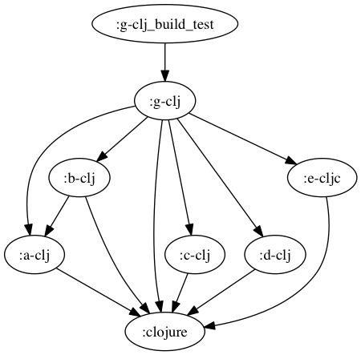
```
buck-out/gen/RULES/clojure-clojurescript-buck/tests/g-clj_build_test
└── build_test
    ├── deps
    ├── dev-resources
    ├── project.clj
    ├── resources
    ├── src
    │   ├── a
    │   │   └── a_clj.clj
    │   ├── b
    │   │   └── b_clj.clj
    │   ├── c
    │   │   └── c_clj.clj
    │   ├── d
    │   │   ├── d1.clj
    │   │   └── d2.clj
    │   ├── e
    │   │   └── e_cljc.cljc
    │   └── g
    │       └── core
    │           └── g_clj.clj
    ├── target
    │   ├── classes
    │   │   ├── META-INF
    │   │   │   └── maven
    │   │   │       └── g-clj
    │   │   │           └── g-clj
    │   │   │               └── pom.properties
    │   │   ├── a
    │   │   │   ├── a_clj$fn__29.class
    │   │   │   ├── a_clj$loading__5569__auto____27.class
    │   │   │   └── a_clj__init.class
    │   │   ├── aleph
    │   │   │   ├── flow$acquire$fn$reify__1751.class
    │   │   │   ├── flow$acquire$fn__1750.class
    │   │   │   ├── flow$acquire.class
    │   │   │   ├── flow$dispose.class
    │   │   │   ├── flow$fn__1741.class
    │   │   │   ├── flow$instrumented_pool$reify__1745.class
    │   │   │   ├── flow$instrumented_pool$reify__1747.class
    │   │   │   ├── flow$instrumented_pool.class
    │   │   │   ├── flow$loading__5569__auto____1232.class
    │   │   │   ├── flow$release.class
    │   │   │   ├── flow__init.class
    │   │   │   ├── http
    │   │   │   │   ├── client$client_handler$handle_response__4607.class
    │   │   │   │   ├── client$client_handler$reify__4609$fn__4614.class
    │   │   │   │   ├── client$client_handler$reify__4609$fn__4616.class
    │   │   │   │   ├── client$client_handler$reify__4609$fn__4623.class
    │   │   │   │   ├── client$client_handler$reify__4609$fn__4629.class
    │   │   │   │   ├── client$client_handler$reify__4609.class
    │   │   │   │   ├── client$client_handler.class
    │   │   │   │   ├── client$close_connection.class
    │   │   │   │   ├── client$fn__4581.class
    │   │   │   │   ├── client$fn__4583$no_url__4584.class
    │   │   │   │   ├── client$fn__4583$req__GT_domain__4588.class
    │   │   │   │   ├── client$fn__4583.class
    │   │   │   │   ├── client$http_connection$fn__4653$fn__4654$f__3786__auto____4655.class
    │   │   │   │   ├── client$http_connection$fn__4653$fn__4654$fn__4657.class
    │   │   │   │   ├── client$http_connection$fn__4653$fn__4654.class
    │   │   │   │   ├── client$http_connection$fn__4653$fn__4663.class
    │   │   │   │   ├── client$http_connection$fn__4653$fn__4665$fn__4666.class
    │   │   │   │   ├── client$http_connection$fn__4653$fn__4665$fn__4668$fn__4669$fn__4670.class
    │   │   │   │   ├── client$http_connection$fn__4653$fn__4665$fn__4668$fn__4669.class
    │   │   │   │   ├── client$http_connection$fn__4653$fn__4665$fn__4668.class
    │   │   │   │   ├── client$http_connection$fn__4653$fn__4665.class
    │   │   │   │   ├── client$http_connection$fn__4653.class
    │   │   │   │   ├── client$http_connection.class
    │   │   │   │   ├── client$loading__5569__auto____4337.class
    │   │   │   │   ├── client$pipeline_builder$fn__4646.class
    │   │   │   │   ├── client$pipeline_builder.class
    │   │   │   │   ├── client$raw_client_handler$handle_response__4593.class
    │   │   │   │   ├── client$raw_client_handler$reify__4595$fn__4596.class
    │   │   │   │   ├── client$raw_client_handler$reify__4595$fn__4598.class
    │   │   │   │   ├── client$raw_client_handler$reify__4595.class
    │   │   │   │   ├── client$raw_client_handler.class
    │   │   │   │   ├── client$websocket_client_handler$reify__4682$fn__4683.class
    │   │   │   │   ├── client$websocket_client_handler$reify__4682$fn__4686$fn__4687.class
    │   │   │   │   ├── client$websocket_client_handler$reify__4682$fn__4686.class
    │   │   │   │   ├── client$websocket_client_handler$reify__4682.class
    │   │   │   │   ├── client$websocket_client_handler.class
    │   │   │   │   ├── client$websocket_connection$fn__4697.class
    │   │   │   │   ├── client$websocket_connection$fn__4700.class
    │   │   │   │   ├── client$websocket_connection.class
    │   │   │   │   ├── client$websocket_frame_size.class
    │   │   │   │   ├── client$websocket_handshaker.class
    │   │   │   │   ├── client__init.class
    │   │   │   │   ├── client_middleware$accept_encoding_value.class
    │   │   │   │   ├── client_middleware$basic_auth_value.class
    │   │   │   │   ├── client_middleware$client_error_QMARK_.class
    │   │   │   │   ├── client_middleware$coerce_clojure_body.class
    │   │   │   │   ├── client_middleware$coerce_json_body.class
    │   │   │   │   ├── client_middleware$coerce_transit_body.class
    │   │   │   │   ├── client_middleware$conflict_QMARK_.class
    │   │   │   │   ├── client_middleware$content_type_value.class
    │   │   │   │   ├── client_middleware$decorate_accept.class
    │   │   │   │   ├── client_middleware$decorate_accept_encoding.class
    │   │   │   │   ├── client_middleware$decorate_basic_auth.class
    │   │   │   │   ├── client_middleware$decorate_content_type.class
    │   │   │   │   ├── client_middleware$decorate_form_params.class
    │   │   │   │   ├── client_middleware$decorate_method.class
    │   │   │   │   ├── client_middleware$decorate_nested_params.class
    │   │   │   │   ├── client_middleware$decorate_oauth.class
    │   │   │   │   ├── client_middleware$decorate_query_params$fn__4473.class
    │   │   │   │   ├── client_middleware$decorate_query_params.class
    │   │   │   │   ├── client_middleware$decorate_url.class
    │   │   │   │   ├── client_middleware$decorate_user_info.class
    │   │   │   │   ├── client_middleware$def_decorator.class
    │   │   │   │   ├── client_middleware$detect_charset.class
    │   │   │   │   ├── client_middleware$dissoc_in.class
    │   │   │   │   ├── client_middleware$fn__4341.class
    │   │   │   │   ├── client_middleware$fn__4343.class
    │   │   │   │   ├── client_middleware$fn__4345.class
    │   │   │   │   ├── client_middleware$fn__4361$fn__4362.class
    │   │   │   │   ├── client_middleware$fn__4361$opt__4364.class
    │   │   │   │   ├── client_middleware$fn__4361.class
    │   │   │   │   ├── client_middleware$fn__4517$fn__4518.class
    │   │   │   │   ├── client_middleware$fn__4517.class
    │   │   │   │   ├── client_middleware$fn__4523.class
    │   │   │   │   ├── client_middleware$fn__4525.class
    │   │   │   │   ├── client_middleware$fn__4548.class
    │   │   │   │   ├── client_middleware$fn__4550.class
    │   │   │   │   ├── client_middleware$fn__4552.class
    │   │   │   │   ├── client_middleware$fn__4554.class
    │   │   │   │   ├── client_middleware$fn__4556.class
    │   │   │   │   ├── client_middleware$fn__4558.class
    │   │   │   │   ├── client_middleware$fn__4560.class
    │   │   │   │   ├── client_middleware$fn__4564.class
    │   │   │   │   ├── client_middleware$fn__4568.class
    │   │   │   │   ├── client_middleware$follow_redirect.class
    │   │   │   │   ├── client_middleware$generate_query_string.class
    │   │   │   │   ├── client_middleware$handle_redirects.class
    │   │   │   │   ├── client_middleware$json_decode.class
    │   │   │   │   ├── client_middleware$json_decode_strict.class
    │   │   │   │   ├── client_middleware$loading__5569__auto____4339.class
    │   │   │   │   ├── client_middleware$missing_QMARK_.class
    │   │   │   │   ├── client_middleware$nest_params$fn__4371$fn__4374.class
    │   │   │   │   ├── client_middleware$nest_params$fn__4371.class
    │   │   │   │   ├── client_middleware$nest_params.class
    │   │   │   │   ├── client_middleware$parse_content_type$fn__4510.class
    │   │   │   │   ├── client_middleware$parse_content_type$fn__4513.class
    │   │   │   │   ├── client_middleware$parse_content_type.class
    │   │   │   │   ├── client_middleware$parse_transit.class
    │   │   │   │   ├── client_middleware$parse_url.class
    │   │   │   │   ├── client_middleware$parse_user_info.class
    │   │   │   │   ├── client_middleware$redirect_QMARK_.class
    │   │   │   │   ├── client_middleware$server_error_QMARK_.class
    │   │   │   │   ├── client_middleware$success_QMARK_.class
    │   │   │   │   ├── client_middleware$update.class
    │   │   │   │   ├── client_middleware$url_encode.class
    │   │   │   │   ├── client_middleware$url_encode_illegal_characters.class
    │   │   │   │   ├── client_middleware$when_pos.class
    │   │   │   │   ├── client_middleware$wrap_exceptions$fn__4399$fn__4409.class
    │   │   │   │   ├── client_middleware$wrap_exceptions$fn__4399$fn__4413.class
    │   │   │   │   ├── client_middleware$wrap_exceptions$fn__4399$fn__4417.class
    │   │   │   │   ├── client_middleware$wrap_exceptions$fn__4399$fn__4421.class
    │   │   │   │   ├── client_middleware$wrap_exceptions$fn__4399$fn__4425$fn__4427.class
    │   │   │   │   ├── client_middleware$wrap_exceptions$fn__4399$fn__4425.class
    │   │   │   │   ├── client_middleware$wrap_exceptions$fn__4399.class
    │   │   │   │   ├── client_middleware$wrap_exceptions.class
    │   │   │   │   ├── client_middleware$wrap_request$fn__4572$fn__4573.class
    │   │   │   │   ├── client_middleware$wrap_request$fn__4572$fn__4576.class
    │   │   │   │   ├── client_middleware$wrap_request$fn__4572.class
    │   │   │   │   ├── client_middleware$wrap_request.class
    │   │   │   │   ├── client_middleware$wrap_request_timing$fn__4503$fn__4504.class
    │   │   │   │   ├── client_middleware$wrap_request_timing$fn__4503.class
    │   │   │   │   ├── client_middleware$wrap_request_timing.class
    │   │   │   │   ├── client_middleware__init.class
    │   │   │   │   ├── core
    │   │   │   │   │   ├── HeaderMap$eval4012__4013.class
    │   │   │   │   │   ├── HeaderMap$fn__4009.class
    │   │   │   │   │   ├── HeaderMap$fn__4015.class
    │   │   │   │   │   ├── HeaderMap$fn__4017.class
    │   │   │   │   │   ├── HeaderMap.class
    │   │   │   │   │   ├── ILookupNettyRequest.class
    │   │   │   │   │   ├── ILookupNettyResponse.class
    │   │   │   │   │   ├── NettyRequest$eval4067__4068.class
    │   │   │   │   │   ├── NettyRequest$fn__4064.class
    │   │   │   │   │   ├── NettyRequest$fn__4070.class
    │   │   │   │   │   ├── NettyRequest$fn__4072.class
    │   │   │   │   │   ├── NettyRequest.class
    │   │   │   │   │   ├── NettyResponse$eval4115__4116.class
    │   │   │   │   │   ├── NettyResponse$fn__4112.class
    │   │   │   │   │   ├── NettyResponse$fn__4118.class
    │   │   │   │   │   ├── NettyResponse$fn__4120.class
    │   │   │   │   │   └── NettyResponse.class
    │   │   │   │   ├── core$eval4003.class
    │   │   │   │   ├── core$eval4054.class
    │   │   │   │   ├── core$eval4105.class
    │   │   │   │   ├── core$fn__3991.class
    │   │   │   │   ├── core$fn__3994$fn__3995.class
    │   │   │   │   ├── core$fn__3994.class
    │   │   │   │   ├── core$fn__4007$__GT_HeaderMap__4030.class
    │   │   │   │   ├── core$fn__4007.class
    │   │   │   │   ├── core$fn__4050.class
    │   │   │   │   ├── core$fn__4062$__GT_NettyRequest__4089.class
    │   │   │   │   ├── core$fn__4062.class
    │   │   │   │   ├── core$fn__4092$__GT_NettyRequest__4093.class
    │   │   │   │   ├── core$fn__4092.class
    │   │   │   │   ├── core$fn__4101.class
    │   │   │   │   ├── core$fn__4110$__GT_NettyResponse__4134.class
    │   │   │   │   ├── core$fn__4110.class
    │   │   │   │   ├── core$fn__4137$__GT_NettyResponse__4138.class
    │   │   │   │   ├── core$fn__4137.class
    │   │   │   │   ├── core$fn__4145$coerce_element__4146.class
    │   │   │   │   ├── core$fn__4145.class
    │   │   │   │   ├── core$fn__4175$handle_cleanup__4176$fn__4177.class
    │   │   │   │   ├── core$fn__4175$handle_cleanup__4176$fn__4179.class
    │   │   │   │   ├── core$fn__4175$handle_cleanup__4176.class
    │   │   │   │   ├── core$fn__4175$send_message__4182$fn__4183.class
    │   │   │   │   ├── core$fn__4175$send_message__4182.class
    │   │   │   │   ├── core$fn__4175.class
    │   │   │   │   ├── core$headers__GT_map.class
    │   │   │   │   ├── core$loading__5569__auto____1759.class
    │   │   │   │   ├── core$map__GT_headers_BANG_.class
    │   │   │   │   ├── core$netty_request__GT_ring_request.class
    │   │   │   │   ├── core$netty_response__GT_ring_response.class
    │   │   │   │   ├── core$normalize_header_key.class
    │   │   │   │   ├── core$ring_request__GT_full_netty_request.class
    │   │   │   │   ├── core$ring_request__GT_netty_request.class
    │   │   │   │   ├── core$ring_response__GT_netty_response.class
    │   │   │   │   ├── core$send_contiguous_body.class
    │   │   │   │   ├── core$send_file_body.class
    │   │   │   │   ├── core$send_streaming_body$fn__4153.class
    │   │   │   │   ├── core$send_streaming_body$fn__4157.class
    │   │   │   │   ├── core$send_streaming_body$fn__4161.class
    │   │   │   │   ├── core$send_streaming_body$fn__4163.class
    │   │   │   │   ├── core$send_streaming_body$fn__4165$fn__4166.class
    │   │   │   │   ├── core$send_streaming_body$fn__4165.class
    │   │   │   │   ├── core$send_streaming_body.class
    │   │   │   │   ├── core$try_set_content_length_BANG_.class
    │   │   │   │   ├── core__init.class
    │   │   │   │   ├── server$date_header_value$fn__4197.class
    │   │   │   │   ├── server$date_header_value.class
    │   │   │   │   ├── server$error_response.class
    │   │   │   │   ├── server$fn__4193.class
    │   │   │   │   ├── server$fn__4208$fn__4209.class
    │   │   │   │   ├── server$fn__4208$fn__4211.class
    │   │   │   │   ├── server$fn__4208$send_response__4213$f__3786__auto____4217.class
    │   │   │   │   ├── server$fn__4208$send_response__4213$fn__4215.class
    │   │   │   │   ├── server$fn__4208$send_response__4213$fn__4220.class
    │   │   │   │   ├── server$fn__4208$send_response__4213.class
    │   │   │   │   ├── server$fn__4208.class
    │   │   │   │   ├── server$handle_request$fn__4228$f__619__auto____4229.class
    │   │   │   │   ├── server$handle_request$fn__4228$fn__4234.class
    │   │   │   │   ├── server$handle_request$fn__4228.class
    │   │   │   │   ├── server$handle_request$fn__4241.class
    │   │   │   │   ├── server$handle_request$fn__4243$fn__4244.class
    │   │   │   │   ├── server$handle_request$fn__4243.class
    │   │   │   │   ├── server$handle_request.class
    │   │   │   │   ├── server$initialize_websocket_handler$fn__4329.class
    │   │   │   │   ├── server$initialize_websocket_handler$fn__4331.class
    │   │   │   │   ├── server$initialize_websocket_handler$fn__4333.class
    │   │   │   │   ├── server$initialize_websocket_handler.class
    │   │   │   │   ├── server$invalid_value_response.class
    │   │   │   │   ├── server$loading__5569__auto____1757.class
    │   │   │   │   ├── server$pipeline_builder$fn__4303.class
    │   │   │   │   ├── server$pipeline_builder.class
    │   │   │   │   ├── server$raw_ring_handler$handle_request__4291.class
    │   │   │   │   ├── server$raw_ring_handler$reify__4293$fn__4294.class
    │   │   │   │   ├── server$raw_ring_handler$reify__4293.class
    │   │   │   │   ├── server$raw_ring_handler.class
    │   │   │   │   ├── server$rfc_1123_date_string.class
    │   │   │   │   ├── server$ring_handler$handle_request__4250.class
    │   │   │   │   ├── server$ring_handler$process_content__4266$fn__4268.class
    │   │   │   │   ├── server$ring_handler$process_content__4266.class
    │   │   │   │   ├── server$ring_handler$process_last_content__4256.class
    │   │   │   │   ├── server$ring_handler$process_request__4252$fn__4253.class
    │   │   │   │   ├── server$ring_handler$process_request__4252.class
    │   │   │   │   ├── server$ring_handler$reify__4278.class
    │   │   │   │   ├── server$ring_handler.class
    │   │   │   │   ├── server$start_server$fn__4309.class
    │   │   │   │   ├── server$start_server.class
    │   │   │   │   ├── server$websocket_server_handler$fn__4314.class
    │   │   │   │   ├── server$websocket_server_handler$fn__4316$fn__4317.class
    │   │   │   │   ├── server$websocket_server_handler$fn__4316.class
    │   │   │   │   ├── server$websocket_server_handler$reify__4321.class
    │   │   │   │   ├── server$websocket_server_handler.class
    │   │   │   │   └── server__init.class
    │   │   │   ├── http$connection_pool$fn__4714$fn__4715.class
    │   │   │   ├── http$connection_pool$fn__4714.class
    │   │   │   ├── http$connection_pool$fn__4718.class
    │   │   │   ├── http$connection_pool.class
    │   │   │   ├── http$create_connection.class
    │   │   │   ├── http$def_http_method.class
    │   │   │   ├── http$fn__4703.class
    │   │   │   ├── http$fn__4721.class
    │   │   │   ├── http$fn__4735$maybe_connect__4738.class
    │   │   │   ├── http$fn__4735$maybe_timeout_BANG___4736.class
    │   │   │   ├── http$fn__4735$request__4741$fn__4743$fn__4744$fn__4745.class
    │   │   │   ├── http$fn__4735$request__4741$fn__4743$fn__4744$fn__4747$fn__4748.class
    │   │   │   ├── http$fn__4735$request__4741$fn__4743$fn__4744$fn__4747$fn__4750$fn__4751.class
    │   │   │   ├── http$fn__4735$request__4741$fn__4743$fn__4744$fn__4747$fn__4750.class
    │   │   │   ├── http$fn__4735$request__4741$fn__4743$fn__4744$fn__4747.class
    │   │   │   ├── http$fn__4735$request__4741$fn__4743$fn__4744$fn__4755.class
    │   │   │   ├── http$fn__4735$request__4741$fn__4743$fn__4744.class
    │   │   │   ├── http$fn__4735$request__4741$fn__4743.class
    │   │   │   ├── http$fn__4735$request__4741.class
    │   │   │   ├── http$fn__4735.class
    │   │   │   ├── http$get_all.class
    │   │   │   ├── http$loading__5569__auto____177.class
    │   │   │   ├── http$register_connection_stats_callback.class
    │   │   │   ├── http$req.class
    │   │   │   ├── http$start_server.class
    │   │   │   ├── http$unregister_connection_stats_callback.class
    │   │   │   ├── http$websocket_client.class
    │   │   │   ├── http$websocket_connection.class
    │   │   │   ├── http__init.class
    │   │   │   ├── netty
    │   │   │   │   ├── AlephServer.class
    │   │   │   │   ├── ChannelSink$fn__3798.class
    │   │   │   │   ├── ChannelSink.class
    │   │   │   │   ├── HeaderMap$eval3926__3927.class
    │   │   │   │   ├── HeaderMap$fn__3923.class
    │   │   │   │   ├── HeaderMap$fn__3929.class
    │   │   │   │   ├── HeaderMap$fn__3931.class
    │   │   │   │   ├── HeaderMap$fn__3934.class
    │   │   │   │   └── HeaderMap.class
    │   │   │   ├── netty$__GT_ChannelSink.class
    │   │   │   ├── netty$acquire.class
    │   │   │   ├── netty$acquire__3740.class
    │   │   │   ├── netty$allocate.class
    │   │   │   ├── netty$bandwidth_tracker$fn__3895.class
    │   │   │   ├── netty$bandwidth_tracker$reify__3897.class
    │   │   │   ├── netty$bandwidth_tracker.class
    │   │   │   ├── netty$buf__GT_array.class
    │   │   │   ├── netty$buffered_source$fn__3824.class
    │   │   │   ├── netty$buffered_source.class
    │   │   │   ├── netty$bufs__GT_array$fn__3758.class
    │   │   │   ├── netty$bufs__GT_array$fn__3760.class
    │   │   │   ├── netty$bufs__GT_array.class
    │   │   │   ├── netty$channel.class
    │   │   │   ├── netty$channel_handler.class
    │   │   │   ├── netty$channel_remote_address.class
    │   │   │   ├── netty$channel_server_name.class
    │   │   │   ├── netty$channel_server_port.class
    │   │   │   ├── netty$close.class
    │   │   │   ├── netty$connection_stats.class
    │   │   │   ├── netty$create_client$fn__3975.class
    │   │   │   ├── netty$create_client$fn__3978.class
    │   │   │   ├── netty$create_client.class
    │   │   │   ├── netty$epoll_available_QMARK_.class
    │   │   │   ├── netty$eval3728$fn__3729.class
    │   │   │   ├── netty$eval3728.class
    │   │   │   ├── netty$eval3735$fn__3736.class
    │   │   │   ├── netty$eval3735.class
    │   │   │   ├── netty$eval3917.class
    │   │   │   ├── netty$flush.class
    │   │   │   ├── netty$fn__3726.class
    │   │   │   ├── netty$fn__3765.class
    │   │   │   ├── netty$fn__3767.class
    │   │   │   ├── netty$fn__3769$append_to_buf_BANG___3770.class
    │   │   │   ├── netty$fn__3769$to_byte_buf__3772.class
    │   │   │   ├── netty$fn__3769.class
    │   │   │   ├── netty$fn__3797$__GT_ChannelSink__3812.class
    │   │   │   ├── netty$fn__3797.class
    │   │   │   ├── netty$fn__3921$__GT_HeaderMap__3946.class
    │   │   │   ├── netty$fn__3921.class
    │   │   │   ├── netty$fn__3955.class
    │   │   │   ├── netty$fn__3958$G__3953__3963.class
    │   │   │   ├── netty$fn__3958$G__3954__3960.class
    │   │   │   ├── netty$fn__3958.class
    │   │   │   ├── netty$fn__3971.class
    │   │   │   ├── netty$fn__3973.class
    │   │   │   ├── netty$get_default_event_loop_threads.class
    │   │   │   ├── netty$headers.class
    │   │   │   ├── netty$insecure_ssl_client_context.class
    │   │   │   ├── netty$instrument_BANG_$f__3786__auto____3905.class
    │   │   │   ├── netty$instrument_BANG_$fn__3908.class
    │   │   │   ├── netty$instrument_BANG_.class
    │   │   │   ├── netty$leak_detector_level_BANG_.class
    │   │   │   ├── netty$loading__5569__auto____2709.class
    │   │   │   ├── netty$pipeline_initializer$reify__3900.class
    │   │   │   ├── netty$pipeline_initializer.class
    │   │   │   ├── netty$put_BANG_$fn__3791.class
    │   │   │   ├── netty$put_BANG_.class
    │   │   │   ├── netty$release.class
    │   │   │   ├── netty$release__3733.class
    │   │   │   ├── netty$release_buf__GT_array.class
    │   │   │   ├── netty$safe_execute.class
    │   │   │   ├── netty$self_signed_ssl_context.class
    │   │   │   ├── netty$set_logger_BANG_.class
    │   │   │   ├── netty$sink$fn__3816.class
    │   │   │   ├── netty$sink.class
    │   │   │   ├── netty$source$fn__3820.class
    │   │   │   ├── netty$source.class
    │   │   │   ├── netty$ssl_client_context.class
    │   │   │   ├── netty$start_server$fn__3983.class
    │   │   │   ├── netty$start_server$reify__3986.class
    │   │   │   ├── netty$start_server.class
    │   │   │   ├── netty$to_byte_buf_stream.class
    │   │   │   ├── netty$wrap_future$reify__3777.class
    │   │   │   ├── netty$wrap_future.class
    │   │   │   ├── netty$write.class
    │   │   │   ├── netty$write_and_flush.class
    │   │   │   └── netty__init.class
    │   │   ├── b
    │   │   │   ├── b_clj$fn__33.class
    │   │   │   ├── b_clj$loading__5569__auto____31.class
    │   │   │   └── b_clj__init.class
    │   │   ├── byte_streams
    │   │   │   ├── char_sequence$coding_error_action.class
    │   │   │   ├── char_sequence$decode.class
    │   │   │   ├── char_sequence$decode_byte_source$reify__3396$fn__3397.class
    │   │   │   ├── char_sequence$decode_byte_source$reify__3396.class
    │   │   │   ├── char_sequence$decode_byte_source.class
    │   │   │   ├── char_sequence$flush.class
    │   │   │   ├── char_sequence$fn__3379.class
    │   │   │   ├── char_sequence$lazy_char_buffer_sequence$fn__3387.class
    │   │   │   ├── char_sequence$lazy_char_buffer_sequence.class
    │   │   │   ├── char_sequence$loading__5569__auto____3377.class
    │   │   │   ├── char_sequence$parse_result.class
    │   │   │   ├── char_sequence__init.class
    │   │   │   ├── graph
    │   │   │   │   ├── Conversion.class
    │   │   │   │   ├── ConversionGraph$fn__2975$fn__2976.class
    │   │   │   │   ├── ConversionGraph$fn__2975.class
    │   │   │   │   ├── ConversionGraph$fn__2979$fn__2980.class
    │   │   │   │   ├── ConversionGraph$fn__2979.class
    │   │   │   │   ├── ConversionGraph$fn__2983.class
    │   │   │   │   ├── ConversionGraph$fn__2985$fn__2987.class
    │   │   │   │   ├── ConversionGraph$fn__2985.class
    │   │   │   │   ├── ConversionGraph.class
    │   │   │   │   ├── ConversionPath$reify__3002.class
    │   │   │   │   ├── ConversionPath$reify__3004.class
    │   │   │   │   ├── ConversionPath$reify__3006.class
    │   │   │   │   ├── ConversionPath$reify__3008.class
    │   │   │   │   ├── ConversionPath.class
    │   │   │   │   ├── IConversionGraph.class
    │   │   │   │   └── Type.class
    │   │   │   ├── graph$assignable_QMARK_.class
    │   │   │   ├── graph$canonicalize.class
    │   │   │   ├── graph$class_satisfies_QMARK_$fn__2859.class
    │   │   │   ├── graph$class_satisfies_QMARK_.class
    │   │   │   ├── graph$closeable_seq$reify__3047.class
    │   │   │   ├── graph$closeable_seq.class
    │   │   │   ├── graph$conj_path.class
    │   │   │   ├── graph$conversion_fn$fn__3052.class
    │   │   │   ├── graph$conversion_fn$fn__3054.class
    │   │   │   ├── graph$conversion_fn$fn__3056$fn__3057$fn__3058.class
    │   │   │   ├── graph$conversion_fn$fn__3056$fn__3057.class
    │   │   │   ├── graph$conversion_fn$fn__3056$fn__3061.class
    │   │   │   ├── graph$conversion_fn$fn__3056.class
    │   │   │   ├── graph$conversion_fn.class
    │   │   │   ├── graph$conversion_graph.class
    │   │   │   ├── graph$fn__2836.class
    │   │   │   ├── graph$fn__2838$__GT_Conversion__2842.class
    │   │   │   ├── graph$fn__2838.class
    │   │   │   ├── graph$fn__2845$__GT_Type__2849.class
    │   │   │   ├── graph$fn__2845.class
    │   │   │   ├── graph$fn__2879.class
    │   │   │   ├── graph$fn__2882$G__2875__2889.class
    │   │   │   ├── graph$fn__2882$G__2876__2885.class
    │   │   │   ├── graph$fn__2882.class
    │   │   │   ├── graph$fn__2895$G__2871__2900.class
    │   │   │   ├── graph$fn__2895$G__2872__2897.class
    │   │   │   ├── graph$fn__2895.class
    │   │   │   ├── graph$fn__2906$G__2867__2919.class
    │   │   │   ├── graph$fn__2906$G__2868__2912.class
    │   │   │   ├── graph$fn__2906.class
    │   │   │   ├── graph$fn__2925$G__2869__2932.class
    │   │   │   ├── graph$fn__2925$G__2870__2928.class
    │   │   │   ├── graph$fn__2925.class
    │   │   │   ├── graph$fn__2938$G__2877__2947.class
    │   │   │   ├── graph$fn__2938$G__2878__2942.class
    │   │   │   ├── graph$fn__2938.class
    │   │   │   ├── graph$fn__2953$G__2873__2958.class
    │   │   │   ├── graph$fn__2953$G__2874__2955.class
    │   │   │   ├── graph$fn__2953.class
    │   │   │   ├── graph$fn__2974$__GT_ConversionGraph__2993.class
    │   │   │   ├── graph$fn__2974.class
    │   │   │   ├── graph$fn__2998$__GT_ConversionPath__3018.class
    │   │   │   ├── graph$fn__2998$map__GT_ConversionPath__3020.class
    │   │   │   ├── graph$fn__2998.class
    │   │   │   ├── graph$fn__3025$fn__3027.class
    │   │   │   ├── graph$fn__3025$fn__3034.class
    │   │   │   ├── graph$fn__3025.class
    │   │   │   ├── graph$implicit_conversions$fn__2964.class
    │   │   │   ├── graph$implicit_conversions$fn__2966.class
    │   │   │   ├── graph$implicit_conversions$fn__2968.class
    │   │   │   ├── graph$implicit_conversions.class
    │   │   │   ├── graph$loading__5569__auto____2713.class
    │   │   │   ├── graph$pprint_type.class
    │   │   │   ├── graph$protocol_QMARK_.class
    │   │   │   ├── graph$seq_conversion_fn$fn__3075.class
    │   │   │   ├── graph$seq_conversion_fn$fn__3077.class
    │   │   │   ├── graph$seq_conversion_fn$fn__3079$fn__3080.class
    │   │   │   ├── graph$seq_conversion_fn$fn__3079$fn__3084.class
    │   │   │   ├── graph$seq_conversion_fn$fn__3079$fn__3086.class
    │   │   │   ├── graph$seq_conversion_fn$fn__3079$fn__3088.class
    │   │   │   ├── graph$seq_conversion_fn$fn__3079.class
    │   │   │   ├── graph$seq_conversion_fn.class
    │   │   │   ├── graph$type.class
    │   │   │   ├── graph__init.class
    │   │   │   ├── protocols
    │   │   │   │   ├── ByteSink.class
    │   │   │   │   ├── ByteSource.class
    │   │   │   │   └── Closeable.class
    │   │   │   ├── protocols$fn__2772.class
    │   │   │   ├── protocols$fn__2776.class
    │   │   │   ├── protocols$fn__2779$G__2774__2784.class
    │   │   │   ├── protocols$fn__2779$G__2775__2781.class
    │   │   │   ├── protocols$fn__2779.class
    │   │   │   ├── protocols$fn__2792.class
    │   │   │   ├── protocols$fn__2795$G__2790__2804.class
    │   │   │   ├── protocols$fn__2795$G__2791__2799.class
    │   │   │   ├── protocols$fn__2795.class
    │   │   │   ├── protocols$fn__2812.class
    │   │   │   ├── protocols$fn__2815$G__2810__2824.class
    │   │   │   ├── protocols$fn__2815$G__2811__2819.class
    │   │   │   ├── protocols$fn__2815.class
    │   │   │   ├── protocols$fn__2830.class
    │   │   │   ├── protocols$fn__2832$closeable_QMARK___2833.class
    │   │   │   ├── protocols$fn__2832.class
    │   │   │   ├── protocols$loading__5569__auto____2770.class
    │   │   │   ├── protocols__init.class
    │   │   │   ├── pushback_stream
    │   │   │   │   ├── Consumption.class
    │   │   │   │   ├── PushbackByteStream.class
    │   │   │   │   ├── PushbackStream.class
    │   │   │   │   └── SynchronizedPushbackByteStream.class
    │   │   │   ├── pushback_stream$__GT_input_stream.class
    │   │   │   ├── pushback_stream$both$fn__3286.class
    │   │   │   ├── pushback_stream$both$fn__3288.class
    │   │   │   ├── pushback_stream$both.class
    │   │   │   ├── pushback_stream$close.class
    │   │   │   ├── pushback_stream$close__3346.class
    │   │   │   ├── pushback_stream$eager_take.class
    │   │   │   ├── pushback_stream$eager_take__3353.class
    │   │   │   ├── pushback_stream$eval3327$fn__3328.class
    │   │   │   ├── pushback_stream$eval3327.class
    │   │   │   ├── pushback_stream$eval3334$fn__3335.class
    │   │   │   ├── pushback_stream$eval3334.class
    │   │   │   ├── pushback_stream$eval3341$fn__3342.class
    │   │   │   ├── pushback_stream$eval3341.class
    │   │   │   ├── pushback_stream$eval3348$fn__3349.class
    │   │   │   ├── pushback_stream$eval3348.class
    │   │   │   ├── pushback_stream$eval3355$fn__3356.class
    │   │   │   ├── pushback_stream$eval3355.class
    │   │   │   ├── pushback_stream$eval3362$fn__3363.class
    │   │   │   ├── pushback_stream$eval3362.class
    │   │   │   ├── pushback_stream$eval3369$fn__3370.class
    │   │   │   ├── pushback_stream$eval3369.class
    │   │   │   ├── pushback_stream$expand_either$fn__3280.class
    │   │   │   ├── pushback_stream$expand_either.class
    │   │   │   ├── pushback_stream$fn__3269.class
    │   │   │   ├── pushback_stream$fn__3271.class
    │   │   │   ├── pushback_stream$fn__3273$__GT_Consumption__3275.class
    │   │   │   ├── pushback_stream$fn__3273.class
    │   │   │   ├── pushback_stream$fn__3291$__GT_PushbackByteStream__3303.class
    │   │   │   ├── pushback_stream$fn__3291.class
    │   │   │   ├── pushback_stream$fn__3306$__GT_SynchronizedPushbackByteStream__3322.class
    │   │   │   ├── pushback_stream$fn__3306.class
    │   │   │   ├── pushback_stream$loading__5569__auto____3094.class
    │   │   │   ├── pushback_stream$prewalk.class
    │   │   │   ├── pushback_stream$pushback_array.class
    │   │   │   ├── pushback_stream$pushback_array__3367.class
    │   │   │   ├── pushback_stream$pushback_buffer.class
    │   │   │   ├── pushback_stream$pushback_buffer__3374.class
    │   │   │   ├── pushback_stream$pushback_stream.class
    │   │   │   ├── pushback_stream$put.class
    │   │   │   ├── pushback_stream$put_array.class
    │   │   │   ├── pushback_stream$put_array__3332.class
    │   │   │   ├── pushback_stream$put_buffer.class
    │   │   │   ├── pushback_stream$put_buffer__3339.class
    │   │   │   ├── pushback_stream$take.class
    │   │   │   ├── pushback_stream$take__3360.class
    │   │   │   ├── pushback_stream$unsafe_pushback_stream.class
    │   │   │   ├── pushback_stream$walk.class
    │   │   │   ├── pushback_stream__init.class
    │   │   │   ├── utils$fast_memoize$fn__2722$fn__2723.class
    │   │   │   ├── utils$fast_memoize$fn__2722$fn__2725.class
    │   │   │   ├── utils$fast_memoize$fn__2722$fn__2727.class
    │   │   │   ├── utils$fast_memoize$fn__2722$fn__2729.class
    │   │   │   ├── utils$fast_memoize$fn__2722$fn__2731.class
    │   │   │   ├── utils$fast_memoize$fn__2722$fn__2733.class
    │   │   │   ├── utils$fast_memoize$fn__2722$fn__2735.class
    │   │   │   ├── utils$fast_memoize$fn__2722$fn__2737.class
    │   │   │   ├── utils$fast_memoize$fn__2722.class
    │   │   │   ├── utils$fast_memoize.class
    │   │   │   ├── utils$fn__2717.class
    │   │   │   ├── utils$loading__5569__auto____2715.class
    │   │   │   ├── utils$memoize_form.class
    │   │   │   └── utils__init.class
    │   │   ├── byte_streams$bytes_EQ_.class
    │   │   ├── byte_streams$cmp_bufs$fn__3716.class
    │   │   ├── byte_streams$cmp_bufs.class
    │   │   ├── byte_streams$compare_bytes.class
    │   │   ├── byte_streams$conversion_path.class
    │   │   ├── byte_streams$convert.class
    │   │   ├── byte_streams$def_conversion.class
    │   │   ├── byte_streams$def_transfer.class
    │   │   ├── byte_streams$default_transfer.class
    │   │   ├── byte_streams$eval3490.class
    │   │   ├── byte_streams$eval3498.class
    │   │   ├── byte_streams$eval3519.class
    │   │   ├── byte_streams$eval3535.class
    │   │   ├── byte_streams$eval3545.class
    │   │   ├── byte_streams$eval3564.class
    │   │   ├── byte_streams$eval3572.class
    │   │   ├── byte_streams$eval3580.class
    │   │   ├── byte_streams$eval3585.class
    │   │   ├── byte_streams$eval3604.class
    │   │   ├── byte_streams$eval3620.class
    │   │   ├── byte_streams$fn__3407.class
    │   │   ├── byte_streams$fn__3409.class
    │   │   ├── byte_streams$fn__3412.class
    │   │   ├── byte_streams$fn__3431.class
    │   │   ├── byte_streams$fn__3433.class
    │   │   ├── byte_streams$fn__3435.class
    │   │   ├── byte_streams$fn__3445$conversion_cost__3449.class
    │   │   ├── byte_streams$fn__3445$fn__3446.class
    │   │   ├── byte_streams$fn__3445.class
    │   │   ├── byte_streams$fn__3492$fn__3493.class
    │   │   ├── byte_streams$fn__3492$fn__3495.class
    │   │   ├── byte_streams$fn__3492.class
    │   │   ├── byte_streams$fn__3500$fn__3501.class
    │   │   ├── byte_streams$fn__3500$fn__3503.class
    │   │   ├── byte_streams$fn__3500.class
    │   │   ├── byte_streams$fn__3507.class
    │   │   ├── byte_streams$fn__3510.class
    │   │   ├── byte_streams$fn__3512.class
    │   │   ├── byte_streams$fn__3514.class
    │   │   ├── byte_streams$fn__3522$fn__3524.class
    │   │   ├── byte_streams$fn__3522.class
    │   │   ├── byte_streams$fn__3538$fn__3540.class
    │   │   ├── byte_streams$fn__3538.class
    │   │   ├── byte_streams$fn__3543.class
    │   │   ├── byte_streams$fn__3548$fn__3550.class
    │   │   ├── byte_streams$fn__3548.class
    │   │   ├── byte_streams$fn__3554.class
    │   │   ├── byte_streams$fn__3557.class
    │   │   ├── byte_streams$fn__3561.class
    │   │   ├── byte_streams$fn__3566$fn__3568.class
    │   │   ├── byte_streams$fn__3566.class
    │   │   ├── byte_streams$fn__3574$fn__3575.class
    │   │   ├── byte_streams$fn__3574.class
    │   │   ├── byte_streams$fn__3578.class
    │   │   ├── byte_streams$fn__3582.class
    │   │   ├── byte_streams$fn__3587$fn__3588.class
    │   │   ├── byte_streams$fn__3587$fn__3591.class
    │   │   ├── byte_streams$fn__3587.class
    │   │   ├── byte_streams$fn__3595.class
    │   │   ├── byte_streams$fn__3599.class
    │   │   ├── byte_streams$fn__3602.class
    │   │   ├── byte_streams$fn__3606.class
    │   │   ├── byte_streams$fn__3614.class
    │   │   ├── byte_streams$fn__3617.class
    │   │   ├── byte_streams$fn__3623$buf_seq__3625$fn__3626.class
    │   │   ├── byte_streams$fn__3623$buf_seq__3625.class
    │   │   ├── byte_streams$fn__3623$fn__3629.class
    │   │   ├── byte_streams$fn__3623.class
    │   │   ├── byte_streams$fn__3632.class
    │   │   ├── byte_streams$fn__3634.class
    │   │   ├── byte_streams$fn__3637.class
    │   │   ├── byte_streams$fn__3641.class
    │   │   ├── byte_streams$fn__3645.class
    │   │   ├── byte_streams$fn__3648.class
    │   │   ├── byte_streams$fn__3650.class
    │   │   ├── byte_streams$fn__3652.class
    │   │   ├── byte_streams$fn__3655.class
    │   │   ├── byte_streams$fn__3659.class
    │   │   ├── byte_streams$fn__3661$readable_character_QMARK___3662.class
    │   │   ├── byte_streams$fn__3661.class
    │   │   ├── byte_streams$loading__5569__auto____2711.class
    │   │   ├── byte_streams$normalize_type_descriptor.class
    │   │   ├── byte_streams$optimized_transfer_QMARK_.class
    │   │   ├── byte_streams$possible_conversions.class
    │   │   ├── byte_streams$print_bytes$fn__3672.class
    │   │   ├── byte_streams$print_bytes$fn__3676.class
    │   │   ├── byte_streams$print_bytes$fn__3678.class
    │   │   ├── byte_streams$print_bytes$fn__3682.class
    │   │   ├── byte_streams$print_bytes$hex_format__3674.class
    │   │   ├── byte_streams$print_bytes$hex_format__3680.class
    │   │   ├── byte_streams$print_bytes.class
    │   │   ├── byte_streams$reify__3487.class
    │   │   ├── byte_streams$seq_of.class
    │   │   ├── byte_streams$stream_of.class
    │   │   ├── byte_streams$this__3457$fn__3458.class
    │   │   ├── byte_streams$this__3457$fn__3460.class
    │   │   ├── byte_streams$this__3457$fn__3463$fn__3464.class
    │   │   ├── byte_streams$this__3457$fn__3463.class
    │   │   ├── byte_streams$this__3457$fn__3470.class
    │   │   ├── byte_streams$this__3457$fn__3473.class
    │   │   ├── byte_streams$this__3457.class
    │   │   ├── byte_streams$to_byte_array.class
    │   │   ├── byte_streams$to_byte_arrays.class
    │   │   ├── byte_streams$to_byte_buffer.class
    │   │   ├── byte_streams$to_byte_buffers.class
    │   │   ├── byte_streams$to_byte_sink.class
    │   │   ├── byte_streams$to_byte_source.class
    │   │   ├── byte_streams$to_char_sequence.class
    │   │   ├── byte_streams$to_data_input_stream.class
    │   │   ├── byte_streams$to_input_stream.class
    │   │   ├── byte_streams$to_line_seq$line_BANG___3706$fn__3707$fn__3708.class
    │   │   ├── byte_streams$to_line_seq$line_BANG___3706$fn__3707.class
    │   │   ├── byte_streams$to_line_seq$line_BANG___3706.class
    │   │   ├── byte_streams$to_line_seq.class
    │   │   ├── byte_streams$to_output_stream.class
    │   │   ├── byte_streams$to_readable_channel.class
    │   │   ├── byte_streams$to_reader.class
    │   │   ├── byte_streams$to_string.class
    │   │   ├── byte_streams$transfer.class
    │   │   ├── byte_streams$type_descriptor.class
    │   │   ├── byte_streams$vector_of.class
    │   │   ├── byte_streams__init.class
    │   │   ├── c
    │   │   │   ├── c_clj$fn__163.class
    │   │   │   ├── c_clj$loading__5569__auto____35.class
    │   │   │   └── c_clj__init.class
    │   │   ├── clj_tuple$fn__1413.class
    │   │   ├── clj_tuple$hash_map.class
    │   │   ├── clj_tuple$loading__5569__auto____1411.class
    │   │   ├── clj_tuple$vector.class
    │   │   ├── clj_tuple__init.class
    │   │   ├── clojure
    │   │   │   ├── data
    │   │   │   │   ├── json
    │   │   │   │   │   └── JSONWriter.class
    │   │   │   │   ├── json$_read.class
    │   │   │   │   ├── json$codepoint.class
    │   │   │   │   ├── json$codepoint_case.class
    │   │   │   │   ├── json$codepoint_clause.class
    │   │   │   │   ├── json$default_value_fn.class
    │   │   │   │   ├── json$default_write_key_fn.class
    │   │   │   │   ├── json$fn__113$fn__114.class
    │   │   │   │   ├── json$fn__113.class
    │   │   │   │   ├── json$fn__39.class
    │   │   │   │   ├── json$fn__83.class
    │   │   │   │   ├── json$fn__86$G__81__93.class
    │   │   │   │   ├── json$fn__86$G__82__89.class
    │   │   │   │   ├── json$fn__86.class
    │   │   │   │   ├── json$json_str.class
    │   │   │   │   ├── json$loading__5569__auto____37.class
    │   │   │   │   ├── json$pprint.class
    │   │   │   │   ├── json$pprint_array$fn__121.class
    │   │   │   │   ├── json$pprint_array.class
    │   │   │   │   ├── json$pprint_dispatch.class
    │   │   │   │   ├── json$pprint_generic$fn__149.class
    │   │   │   │   ├── json$pprint_generic.class
    │   │   │   │   ├── json$pprint_json.class
    │   │   │   │   ├── json$pprint_object$fn__127.class
    │   │   │   │   ├── json$pprint_object$iter__130__134$fn__135$fn__136.class
    │   │   │   │   ├── json$pprint_object$iter__130__134$fn__135.class
    │   │   │   │   ├── json$pprint_object$iter__130__134.class
    │   │   │   │   ├── json$pprint_object.class
    │   │   │   │   ├── json$print_json.class
    │   │   │   │   ├── json$read.class
    │   │   │   │   ├── json$read_array.class
    │   │   │   │   ├── json$read_decimal.class
    │   │   │   │   ├── json$read_escaped_char.class
    │   │   │   │   ├── json$read_hex_char.class
    │   │   │   │   ├── json$read_integer$fn__60.class
    │   │   │   │   ├── json$read_integer.class
    │   │   │   │   ├── json$read_json.class
    │   │   │   │   ├── json$read_number$fn__65.class
    │   │   │   │   ├── json$read_number.class
    │   │   │   │   ├── json$read_object.class
    │   │   │   │   ├── json$read_quoted_string.class
    │   │   │   │   ├── json$read_str.class
    │   │   │   │   ├── json$write.class
    │   │   │   │   ├── json$write_array.class
    │   │   │   │   ├── json$write_bignum.class
    │   │   │   │   ├── json$write_double.class
    │   │   │   │   ├── json$write_float.class
    │   │   │   │   ├── json$write_generic.class
    │   │   │   │   ├── json$write_json.class
    │   │   │   │   ├── json$write_named.class
    │   │   │   │   ├── json$write_null.class
    │   │   │   │   ├── json$write_object.class
    │   │   │   │   ├── json$write_plain.class
    │   │   │   │   ├── json$write_ratio.class
    │   │   │   │   ├── json$write_str.class
    │   │   │   │   ├── json$write_string.class
    │   │   │   │   ├── json__init.class
    │   │   │   │   └── json_compat_0_1__init.class
    │   │   │   └── tools
    │   │   │       ├── logging
    │   │   │       │   ├── impl
    │   │   │       │   │   ├── Logger.class
    │   │   │       │   │   └── LoggerFactory.class
    │   │   │       │   ├── impl$cl_factory.class
    │   │   │       │   ├── impl$find_factory.class
    │   │   │       │   ├── impl$fn__185.class
    │   │   │       │   ├── impl$fn__191.class
    │   │   │       │   ├── impl$fn__194$G__187__201.class
    │   │   │       │   ├── impl$fn__194$G__188__197.class
    │   │   │       │   ├── impl$fn__194.class
    │   │   │       │   ├── impl$fn__207$G__189__218.class
    │   │   │       │   ├── impl$fn__207$G__190__212.class
    │   │   │       │   ├── impl$fn__207.class
    │   │   │       │   ├── impl$fn__228.class
    │   │   │       │   ├── impl$fn__231$G__224__236.class
    │   │   │       │   ├── impl$fn__231$G__225__233.class
    │   │   │       │   ├── impl$fn__231.class
    │   │   │       │   ├── impl$fn__242$G__226__249.class
    │   │   │       │   ├── impl$fn__242$G__227__245.class
    │   │   │       │   ├── impl$fn__242.class
    │   │   │       │   ├── impl$jul_factory.class
    │   │   │       │   ├── impl$loading__5569__auto____183.class
    │   │   │       │   ├── impl$log4j_factory.class
    │   │   │       │   ├── impl$reify__255.class
    │   │   │       │   ├── impl$reify__257.class
    │   │   │       │   ├── impl$slf4j_factory.class
    │   │   │       │   ├── impl__init.class
    │   │   │       │   └── proxy$java
    │   │   │       │       └── io
    │   │   │       │           └── ByteArrayOutputStream$ff19274a.class
    │   │   │       ├── logging$debug.class
    │   │   │       ├── logging$debugf.class
    │   │   │       ├── logging$enabled_QMARK_.class
    │   │   │       ├── logging$error.class
    │   │   │       ├── logging$errorf.class
    │   │   │       ├── logging$eval349$fn__350.class
    │   │   │       ├── logging$eval349$fn__353.class
    │   │   │       ├── logging$eval349$reify__358.class
    │   │   │       ├── logging$eval349.class
    │   │   │       ├── logging$fatal.class
    │   │   │       ├── logging$fatalf.class
    │   │   │       ├── logging$fn__294.class
    │   │   │       ├── logging$fn__324$log_capture_BANG___325.class
    │   │   │       ├── logging$fn__324$log_uncapture_BANG___328.class
    │   │   │       ├── logging$fn__324.class
    │   │   │       ├── logging$info.class
    │   │   │       ├── logging$infof.class
    │   │   │       ├── logging$loading__5569__auto____181.class
    │   │   │       ├── logging$log.class
    │   │   │       ├── logging$log_STAR_$fn__296.class
    │   │   │       ├── logging$log_STAR_.class
    │   │   │       ├── logging$log_stream$fn__316$fn__317.class
    │   │   │       ├── logging$log_stream$fn__316$fn__319.class
    │   │   │       ├── logging$log_stream$fn__316.class
    │   │   │       ├── logging$log_stream.class
    │   │   │       ├── logging$logf.class
    │   │   │       ├── logging$logp.class
    │   │   │       ├── logging$spy.class
    │   │   │       ├── logging$spyf.class
    │   │   │       ├── logging$trace.class
    │   │   │       ├── logging$tracef.class
    │   │   │       ├── logging$warn.class
    │   │   │       ├── logging$warnf.class
    │   │   │       ├── logging$with_logs.class
    │   │   │       └── logging__init.class
    │   │   ├── d
    │   │   │   ├── d1$fn__167.class
    │   │   │   ├── d1$loading__5569__auto____165.class
    │   │   │   ├── d1__init.class
    │   │   │   ├── d2$fn__171.class
    │   │   │   ├── d2$loading__5569__auto____169.class
    │   │   │   └── d2__init.class
    │   │   ├── e
    │   │   │   ├── e_cljc$fn__175.class
    │   │   │   ├── e_cljc$loading__5569__auto____173.class
    │   │   │   └── e_cljc__init.class
    │   │   ├── g
    │   │   │   └── core
    │   │   │       ├── g_clj$fn__4764.class
    │   │   │       ├── g_clj$loading__5569__auto____25.class
    │   │   │       ├── g_clj.class
    │   │   │       └── g_clj__init.class
    │   │   ├── manifold
    │   │   │   ├── debug$disable_dropped_error_logging_BANG_.class
    │   │   │   ├── debug$enable_dropped_error_logging_BANG_.class
    │   │   │   ├── debug$fn__703.class
    │   │   │   ├── debug$loading__5569__auto____701.class
    │   │   │   ├── debug__init.class
    │   │   │   ├── deferred
    │   │   │   │   ├── Deferrable.class
    │   │   │   │   ├── Deferred$f__806__auto____955.class
    │   │   │   │   ├── Deferred$f__806__auto____960.class
    │   │   │   │   ├── Deferred$fn__916.class
    │   │   │   │   ├── Deferred$fn__918.class
    │   │   │   │   ├── Deferred$fn__920$fn__921.class
    │   │   │   │   ├── Deferred$fn__920.class
    │   │   │   │   ├── Deferred$fn__928$fn__929.class
    │   │   │   │   ├── Deferred$fn__928.class
    │   │   │   │   ├── Deferred$fn__936$fn__937.class
    │   │   │   │   ├── Deferred$fn__936.class
    │   │   │   │   ├── Deferred$fn__944$fn__945.class
    │   │   │   │   ├── Deferred$fn__944.class
    │   │   │   │   ├── Deferred.class
    │   │   │   │   ├── ErrorDeferred$fn__1014.class
    │   │   │   │   ├── ErrorDeferred.class
    │   │   │   │   ├── IDeferred.class
    │   │   │   │   ├── IDeferredListener.class
    │   │   │   │   ├── IMutableDeferred.class
    │   │   │   │   ├── LeakAwareDeferred$f__806__auto____861.class
    │   │   │   │   ├── LeakAwareDeferred$f__806__auto____866.class
    │   │   │   │   ├── LeakAwareDeferred$fn__822.class
    │   │   │   │   ├── LeakAwareDeferred$fn__824.class
    │   │   │   │   ├── LeakAwareDeferred$fn__826$fn__827.class
    │   │   │   │   ├── LeakAwareDeferred$fn__826.class
    │   │   │   │   ├── LeakAwareDeferred$fn__834$fn__835.class
    │   │   │   │   ├── LeakAwareDeferred$fn__834.class
    │   │   │   │   ├── LeakAwareDeferred$fn__842$fn__843.class
    │   │   │   │   ├── LeakAwareDeferred$fn__842.class
    │   │   │   │   ├── LeakAwareDeferred$fn__850$fn__851.class
    │   │   │   │   ├── LeakAwareDeferred$fn__850.class
    │   │   │   │   ├── LeakAwareDeferred.class
    │   │   │   │   ├── Listener.class
    │   │   │   │   ├── Recur.class
    │   │   │   │   ├── SuccessDeferred$fn__1004.class
    │   │   │   │   ├── SuccessDeferred$fn__1006.class
    │   │   │   │   └── SuccessDeferred.class
    │   │   │   ├── deferred$$reify__779.class
    │   │   │   ├── deferred$$reify__782.class
    │   │   │   ├── deferred$__GT_deferred.class
    │   │   │   ├── deferred$add_listener_BANG_.class
    │   │   │   ├── deferred$back_references$fn__1211.class
    │   │   │   ├── deferred$back_references.class
    │   │   │   ├── deferred$both$fn__812.class
    │   │   │   ├── deferred$both$fn__815.class
    │   │   │   ├── deferred$both.class
    │   │   │   ├── deferred$cancel_listener_BANG_.class
    │   │   │   ├── deferred$catch.class
    │   │   │   ├── deferred$catch_SINGLEQUOTE_$fn__1150.class
    │   │   │   ├── deferred$catch_SINGLEQUOTE_$fn__1152.class
    │   │   │   ├── deferred$catch_SINGLEQUOTE_.class
    │   │   │   ├── deferred$chain.class
    │   │   │   ├── deferred$chain_SINGLEQUOTE_.class
    │   │   │   ├── deferred$chain_SINGLEQUOTE___inliner__1142.class
    │   │   │   ├── deferred$chain__inliner__1145.class
    │   │   │   ├── deferred$claim_BANG_.class
    │   │   │   ├── deferred$connect$fn__1037.class
    │   │   │   ├── deferred$connect$fn__1039.class
    │   │   │   ├── deferred$connect.class
    │   │   │   ├── deferred$deferrable_QMARK_.class
    │   │   │   ├── deferred$deferred_QMARK_.class
    │   │   │   ├── deferred$deferred_QMARK___764.class
    │   │   │   ├── deferred$deref_deferred.class
    │   │   │   ├── deferred$error_BANG_.class
    │   │   │   ├── deferred$error_deferred.class
    │   │   │   ├── deferred$error_value.class
    │   │   │   ├── deferred$error_value__746.class
    │   │   │   ├── deferred$eval727$fn__728.class
    │   │   │   ├── deferred$eval727.class
    │   │   │   ├── deferred$eval734$fn__735.class
    │   │   │   ├── deferred$eval734.class
    │   │   │   ├── deferred$eval741$fn__742.class
    │   │   │   ├── deferred$eval741.class
    │   │   │   ├── deferred$eval751$fn__752.class
    │   │   │   ├── deferred$eval751.class
    │   │   │   ├── deferred$eval759$fn__760.class
    │   │   │   ├── deferred$eval759.class
    │   │   │   ├── deferred$expand_let_flow$fn__1217.class
    │   │   │   ├── deferred$expand_let_flow$fn__1219.class
    │   │   │   ├── deferred$expand_let_flow$fn__1221.class
    │   │   │   ├── deferred$expand_let_flow$fn__1223.class
    │   │   │   ├── deferred$expand_let_flow.class
    │   │   │   ├── deferred$finally.class
    │   │   │   ├── deferred$finally_SINGLEQUOTE_$fn__1159.class
    │   │   │   ├── deferred$finally_SINGLEQUOTE_.class
    │   │   │   ├── deferred$fn$reify__1208.class
    │   │   │   ├── deferred$fn__1003$__GT_SuccessDeferred__1010.class
    │   │   │   ├── deferred$fn__1003.class
    │   │   │   ├── deferred$fn__1013$__GT_ErrorDeferred__1021.class
    │   │   │   ├── deferred$fn__1013.class
    │   │   │   ├── deferred$fn__1024$deferred__1025.class
    │   │   │   ├── deferred$fn__1024.class
    │   │   │   ├── deferred$fn__1066$chain_SINGLEQUOTE____1087$fn__1089.class
    │   │   │   ├── deferred$fn__1066$chain_SINGLEQUOTE____1087$fn__1091.class
    │   │   │   ├── deferred$fn__1066$chain_SINGLEQUOTE____1087.class
    │   │   │   ├── deferred$fn__1066$subscribe__1067$fn__1068.class
    │   │   │   ├── deferred$fn__1066$subscribe__1067$fn__1070.class
    │   │   │   ├── deferred$fn__1066$subscribe__1067$fn__1072.class
    │   │   │   ├── deferred$fn__1066$subscribe__1067$fn__1074.class
    │   │   │   ├── deferred$fn__1066$subscribe__1067$fn__1076.class
    │   │   │   ├── deferred$fn__1066$subscribe__1067$fn__1078.class
    │   │   │   ├── deferred$fn__1066$subscribe__1067.class
    │   │   │   ├── deferred$fn__1066.class
    │   │   │   ├── deferred$fn__1107$chain___1128$fn__1130.class
    │   │   │   ├── deferred$fn__1107$chain___1128$fn__1132.class
    │   │   │   ├── deferred$fn__1107$chain___1128.class
    │   │   │   ├── deferred$fn__1107$subscribe__1108$fn__1109.class
    │   │   │   ├── deferred$fn__1107$subscribe__1108$fn__1111.class
    │   │   │   ├── deferred$fn__1107$subscribe__1108$fn__1113.class
    │   │   │   ├── deferred$fn__1107$subscribe__1108$fn__1115.class
    │   │   │   ├── deferred$fn__1107$subscribe__1108$fn__1117.class
    │   │   │   ├── deferred$fn__1107$subscribe__1108$fn__1119.class
    │   │   │   ├── deferred$fn__1107$subscribe__1108.class
    │   │   │   ├── deferred$fn__1107.class
    │   │   │   ├── deferred$fn__1191$__GT_Recur__1193.class
    │   │   │   ├── deferred$fn__1191.class
    │   │   │   ├── deferred$fn__1207.class
    │   │   │   ├── deferred$fn__1228$fn__1229.class
    │   │   │   ├── deferred$fn__1228.class
    │   │   │   ├── deferred$fn__707.class
    │   │   │   ├── deferred$fn__711.class
    │   │   │   ├── deferred$fn__714$G__709__719.class
    │   │   │   ├── deferred$fn__714$G__710__716.class
    │   │   │   ├── deferred$fn__714.class
    │   │   │   ├── deferred$fn__725.class
    │   │   │   ├── deferred$fn__786.class
    │   │   │   ├── deferred$fn__788$__GT_Listener__790.class
    │   │   │   ├── deferred$fn__788.class
    │   │   │   ├── deferred$fn__796.class
    │   │   │   ├── deferred$fn__819$__GT_LeakAwareDeferred__910.class
    │   │   │   ├── deferred$fn__819.class
    │   │   │   ├── deferred$fn__913$__GT_Deferred__1000.class
    │   │   │   ├── deferred$fn__913.class
    │   │   │   ├── deferred$future.class
    │   │   │   ├── deferred$future_with.class
    │   │   │   ├── deferred$let_flow.class
    │   │   │   ├── deferred$let_flow_SINGLEQUOTE_.class
    │   │   │   ├── deferred$listener$fn__793.class
    │   │   │   ├── deferred$listener.class
    │   │   │   ├── deferred$loading__5569__auto____179.class
    │   │   │   ├── deferred$loop$fn__1202.class
    │   │   │   ├── deferred$loop$fn__1204.class
    │   │   │   ├── deferred$loop.class
    │   │   │   ├── deferred$on_realized.class
    │   │   │   ├── deferred$on_realized__757.class
    │   │   │   ├── deferred$onto.class
    │   │   │   ├── deferred$realized_QMARK_.class
    │   │   │   ├── deferred$realized_QMARK___732.class
    │   │   │   ├── deferred$recur.class
    │   │   │   ├── deferred$register_future_callbacks$f__614__auto____771.class
    │   │   │   ├── deferred$register_future_callbacks.class
    │   │   │   ├── deferred$set_deferred.class
    │   │   │   ├── deferred$success_BANG_.class
    │   │   │   ├── deferred$success_deferred.class
    │   │   │   ├── deferred$success_error_unrealized.class
    │   │   │   ├── deferred$success_value.class
    │   │   │   ├── deferred$success_value__739.class
    │   │   │   ├── deferred$timeout_BANG_$fn__1182.class
    │   │   │   ├── deferred$timeout_BANG_$fn__1184.class
    │   │   │   ├── deferred$timeout_BANG_.class
    │   │   │   ├── deferred$unroll_chain$fn__1053.class
    │   │   │   ├── deferred$unroll_chain$fn__1055.class
    │   │   │   ├── deferred$unroll_chain.class
    │   │   │   ├── deferred$unwrap.class
    │   │   │   ├── deferred$unwrap_SINGLEQUOTE_.class
    │   │   │   ├── deferred$zip$fn__1178.class
    │   │   │   ├── deferred$zip.class
    │   │   │   ├── deferred$zip_SINGLEQUOTE_$fn__1166.class
    │   │   │   ├── deferred$zip_SINGLEQUOTE_$fn__1168.class
    │   │   │   ├── deferred$zip_SINGLEQUOTE_.class
    │   │   │   ├── deferred$zip_SINGLEQUOTE___inliner__1164.class
    │   │   │   ├── deferred$zip__inliner__1176.class
    │   │   │   ├── deferred__init.class
    │   │   │   ├── executor$eval504$fn__505.class
    │   │   │   ├── executor$eval504.class
    │   │   │   ├── executor$executor.class
    │   │   │   ├── executor$executor__509.class
    │   │   │   ├── executor$fixed_thread_executor$fn__551.class
    │   │   │   ├── executor$fixed_thread_executor$reify__554.class
    │   │   │   ├── executor$fixed_thread_executor.class
    │   │   │   ├── executor$fn__502.class
    │   │   │   ├── executor$fn__560$fn__561$fn__562.class
    │   │   │   ├── executor$fn__560$fn__561$fn__564$fn__569.class
    │   │   │   ├── executor$fn__560$fn__561$fn__564$fn__573.class
    │   │   │   ├── executor$fn__560$fn__561$fn__564.class
    │   │   │   ├── executor$fn__560$fn__561.class
    │   │   │   ├── executor$fn__560$wait_pool__581.class
    │   │   │   ├── executor$fn__560.class
    │   │   │   ├── executor$fn__586$execute_pool__607.class
    │   │   │   ├── executor$fn__586$fn__587$fn__588.class
    │   │   │   ├── executor$fn__586$fn__587$fn__590$fn__595.class
    │   │   │   ├── executor$fn__586$fn__587$fn__590$fn__599.class
    │   │   │   ├── executor$fn__586$fn__587$fn__590.class
    │   │   │   ├── executor$fn__586$fn__587.class
    │   │   │   ├── executor$fn__586.class
    │   │   │   ├── executor$instrumented_executor$fn__544.class
    │   │   │   ├── executor$instrumented_executor$reify__546.class
    │   │   │   ├── executor$instrumented_executor.class
    │   │   │   ├── executor$loading__5569__auto____500.class
    │   │   │   ├── executor$register_execute_pool_stats_callback.class
    │   │   │   ├── executor$register_wait_pool_stats_callback.class
    │   │   │   ├── executor$stats__GT_map$fn__527.class
    │   │   │   ├── executor$stats__GT_map$fn__529.class
    │   │   │   ├── executor$stats__GT_map$fn__531.class
    │   │   │   ├── executor$stats__GT_map$fn__533.class
    │   │   │   ├── executor$stats__GT_map$fn__535.class
    │   │   │   ├── executor$stats__GT_map$fn__537.class
    │   │   │   ├── executor$stats__GT_map$fn__539.class
    │   │   │   ├── executor$stats__GT_map$q__525.class
    │   │   │   ├── executor$stats__GT_map.class
    │   │   │   ├── executor$thread_factory$reify__511$f__512.class
    │   │   │   ├── executor$thread_factory$reify__511.class
    │   │   │   ├── executor$thread_factory.class
    │   │   │   ├── executor$unregister_execute_pool_stats_callback.class
    │   │   │   ├── executor$unregister_wait_pool_stats_callback.class
    │   │   │   ├── executor$utilization_executor.class
    │   │   │   ├── executor__init.class
    │   │   │   ├── stream
    │   │   │   │   ├── BufferedStream$fn__2650.class
    │   │   │   │   ├── BufferedStream$fn__2652.class
    │   │   │   │   ├── BufferedStream.class
    │   │   │   │   ├── Callback.class
    │   │   │   │   ├── SinkProxy.class
    │   │   │   │   ├── SourceProxy$fn__2299.class
    │   │   │   │   ├── SourceProxy.class
    │   │   │   │   ├── SplicedStream.class
    │   │   │   │   ├── core
    │   │   │   │   │   ├── IEventSink.class
    │   │   │   │   │   ├── IEventSource.class
    │   │   │   │   │   ├── IEventStream.class
    │   │   │   │   │   ├── Sinkable.class
    │   │   │   │   │   └── Sourceable.class
    │   │   │   │   ├── core$close_BANG_.class
    │   │   │   │   ├── core$close_BANG___1812.class
    │   │   │   │   ├── core$closed_QMARK_.class
    │   │   │   │   ├── core$closed_QMARK___1819.class
    │   │   │   │   ├── core$def_sink$fn__1865.class
    │   │   │   │   ├── core$def_sink.class
    │   │   │   │   ├── core$def_sink_PLUS_source$fn__1869.class
    │   │   │   │   ├── core$def_sink_PLUS_source.class
    │   │   │   │   ├── core$def_source$fn__1861.class
    │   │   │   │   ├── core$def_source.class
    │   │   │   │   ├── core$drained_QMARK_.class
    │   │   │   │   ├── core$drained_QMARK___1826.class
    │   │   │   │   ├── core$eval1806$fn__1807.class
    │   │   │   │   ├── core$eval1806.class
    │   │   │   │   ├── core$eval1814$fn__1815.class
    │   │   │   │   ├── core$eval1814.class
    │   │   │   │   ├── core$eval1821$fn__1822.class
    │   │   │   │   ├── core$eval1821.class
    │   │   │   │   ├── core$eval1828$fn__1829.class
    │   │   │   │   ├── core$eval1828.class
    │   │   │   │   ├── core$eval1835$fn__1836.class
    │   │   │   │   ├── core$eval1835.class
    │   │   │   │   ├── core$fn__1765.class
    │   │   │   │   ├── core$fn__1769.class
    │   │   │   │   ├── core$fn__1772$G__1767__1777.class
    │   │   │   │   ├── core$fn__1772$G__1768__1774.class
    │   │   │   │   ├── core$fn__1772.class
    │   │   │   │   ├── core$fn__1785.class
    │   │   │   │   ├── core$fn__1788$G__1783__1793.class
    │   │   │   │   ├── core$fn__1788$G__1784__1790.class
    │   │   │   │   ├── core$fn__1788.class
    │   │   │   │   ├── core$fn__1799.class
    │   │   │   │   ├── core$fn__1801.class
    │   │   │   │   ├── core$fn__1803.class
    │   │   │   │   ├── core$fn__1842.class
    │   │   │   │   ├── core$loading__5569__auto____1763.class
    │   │   │   │   ├── core$merged_body$fn__1857.class
    │   │   │   │   ├── core$merged_body.class
    │   │   │   │   ├── core$synchronous_QMARK_.class
    │   │   │   │   ├── core$synchronous_QMARK___1840.class
    │   │   │   │   ├── core$weak_handle.class
    │   │   │   │   ├── core$weak_handle__1833.class
    │   │   │   │   ├── core__init.class
    │   │   │   │   ├── default
    │   │   │   │   │   ├── Consumer.class
    │   │   │   │   │   ├── Consumption.class
    │   │   │   │   │   ├── Producer.class
    │   │   │   │   │   ├── Production.class
    │   │   │   │   │   ├── Stream$fn__2000$fn__2001.class
    │   │   │   │   │   ├── Stream$fn__2000.class
    │   │   │   │   │   ├── Stream$fn__2017.class
    │   │   │   │   │   ├── Stream$fn__2021.class
    │   │   │   │   │   ├── Stream$fn__2025.class
    │   │   │   │   │   ├── Stream$fn__2029.class
    │   │   │   │   │   └── Stream.class
    │   │   │   │   ├── default$__GT_Stream.class
    │   │   │   │   ├── default$add_BANG_$fn__2062$fn__2063.class
    │   │   │   │   ├── default$add_BANG_$fn__2062.class
    │   │   │   │   ├── default$add_BANG_.class
    │   │   │   │   ├── default$fn__1977.class
    │   │   │   │   ├── default$fn__1979$__GT_Production__1981.class
    │   │   │   │   ├── default$fn__1979.class
    │   │   │   │   ├── default$fn__1984$__GT_Consumption__1986.class
    │   │   │   │   ├── default$fn__1984.class
    │   │   │   │   ├── default$fn__1989$__GT_Producer__1991.class
    │   │   │   │   ├── default$fn__1989.class
    │   │   │   │   ├── default$fn__1994$__GT_Consumer__1996.class
    │   │   │   │   ├── default$fn__1994.class
    │   │   │   │   ├── default$fn__1999$__GT_Stream__2058.class
    │   │   │   │   ├── default$fn__1999.class
    │   │   │   │   ├── default$loading__5569__auto____1872.class
    │   │   │   │   ├── default$onto.class
    │   │   │   │   ├── default$stream.class
    │   │   │   │   ├── default$stream_STAR_.class
    │   │   │   │   ├── default__init.class
    │   │   │   │   ├── deferred
    │   │   │   │   │   ├── DeferredSink.class
    │   │   │   │   │   └── DeferredSource.class
    │   │   │   │   ├── deferred$__GT_DeferredSink.class
    │   │   │   │   ├── deferred$__GT_DeferredSource.class
    │   │   │   │   ├── deferred$fn__2245.class
    │   │   │   │   ├── deferred$fn__2247$__GT_DeferredSink__2257.class
    │   │   │   │   ├── deferred$fn__2247.class
    │   │   │   │   ├── deferred$fn__2261$__GT_DeferredSource__2271.class
    │   │   │   │   ├── deferred$fn__2261.class
    │   │   │   │   ├── deferred$fn__2275.class
    │   │   │   │   ├── deferred$fn__2277.class
    │   │   │   │   ├── deferred$loading__5569__auto____2243.class
    │   │   │   │   ├── deferred__init.class
    │   │   │   │   ├── graph
    │   │   │   │   │   ├── AsyncPut.class
    │   │   │   │   │   └── Downstream.class
    │   │   │   │   ├── graph$async_connect$err_callback__1938.class
    │   │   │   │   ├── graph$async_connect$this__1914$fn__1915$fn__1916.class
    │   │   │   │   ├── graph$async_connect$this__1914$fn__1915.class
    │   │   │   │   ├── graph$async_connect$this__1914$fn__1919$fn__1920.class
    │   │   │   │   ├── graph$async_connect$this__1914$fn__1919.class
    │   │   │   │   ├── graph$async_connect$this__1914.class
    │   │   │   │   ├── graph$async_connect$this__1925$fn__1926.class
    │   │   │   │   ├── graph$async_connect$this__1925$fn__1928$fn__1929.class
    │   │   │   │   ├── graph$async_connect$this__1925$fn__1928.class
    │   │   │   │   ├── graph$async_connect$this__1925$fn__1932$fn__1933.class
    │   │   │   │   ├── graph$async_connect$this__1925$fn__1932.class
    │   │   │   │   ├── graph$async_connect$this__1925.class
    │   │   │   │   ├── graph$async_connect$this__1942$fn__1943$fn__1944.class
    │   │   │   │   ├── graph$async_connect$this__1942$fn__1943.class
    │   │   │   │   ├── graph$async_connect$this__1942$fn__1947.class
    │   │   │   │   ├── graph$async_connect$this__1942$fn__1949.class
    │   │   │   │   ├── graph$async_connect$this__1942.class
    │   │   │   │   ├── graph$async_connect.class
    │   │   │   │   ├── graph$async_send.class
    │   │   │   │   ├── graph$connect.class
    │   │   │   │   ├── graph$downstream$fn__1888.class
    │   │   │   │   ├── graph$downstream.class
    │   │   │   │   ├── graph$fn__1876.class
    │   │   │   │   ├── graph$fn__1878$__GT_Downstream__1880.class
    │   │   │   │   ├── graph$fn__1878.class
    │   │   │   │   ├── graph$fn__1883$__GT_AsyncPut__1885.class
    │   │   │   │   ├── graph$fn__1883.class
    │   │   │   │   ├── graph$handle_async_error.class
    │   │   │   │   ├── graph$handle_async_put.class
    │   │   │   │   ├── graph$loading__5569__auto____1874.class
    │   │   │   │   ├── graph$sync_connect$f__619__auto____1957$fn__1958.class
    │   │   │   │   ├── graph$sync_connect$f__619__auto____1957.class
    │   │   │   │   ├── graph$sync_connect.class
    │   │   │   │   ├── graph$sync_send$fn__1894.class
    │   │   │   │   ├── graph$sync_send.class
    │   │   │   │   ├── graph__init.class
    │   │   │   │   ├── iterator
    │   │   │   │   │   ├── IteratorSource$f__2105$f__614__auto____2106.class
    │   │   │   │   │   ├── IteratorSource$f__2105.class
    │   │   │   │   │   └── IteratorSource.class
    │   │   │   │   ├── iterator$__GT_IteratorSource.class
    │   │   │   │   ├── iterator$fn__2102.class
    │   │   │   │   ├── iterator$fn__2104$__GT_IteratorSource__2123.class
    │   │   │   │   ├── iterator$fn__2104.class
    │   │   │   │   ├── iterator$fn__2127.class
    │   │   │   │   ├── iterator$fn__2129.class
    │   │   │   │   ├── iterator$loading__5569__auto____2100.class
    │   │   │   │   ├── iterator__init.class
    │   │   │   │   ├── queue
    │   │   │   │   │   ├── BlockingQueueSink$f__2166$f__614__auto____2167.class
    │   │   │   │   │   ├── BlockingQueueSink$f__2166.class
    │   │   │   │   │   ├── BlockingQueueSink$f__2178$f__614__auto____2179.class
    │   │   │   │   │   ├── BlockingQueueSink$f__2178.class
    │   │   │   │   │   ├── BlockingQueueSink.class
    │   │   │   │   │   ├── BlockingQueueSource$f__2136$f__614__auto____2137.class
    │   │   │   │   │   ├── BlockingQueueSource$f__2136.class
    │   │   │   │   │   ├── BlockingQueueSource$f__2143$f__614__auto____2144.class
    │   │   │   │   │   ├── BlockingQueueSource$f__2143.class
    │   │   │   │   │   └── BlockingQueueSource.class
    │   │   │   │   ├── queue$__GT_BlockingQueueSink.class
    │   │   │   │   ├── queue$__GT_BlockingQueueSource.class
    │   │   │   │   ├── queue$fn__2133.class
    │   │   │   │   ├── queue$fn__2135$__GT_BlockingQueueSource__2161.class
    │   │   │   │   ├── queue$fn__2135.class
    │   │   │   │   ├── queue$fn__2165$__GT_BlockingQueueSink__2201.class
    │   │   │   │   ├── queue$fn__2165.class
    │   │   │   │   ├── queue$fn__2205.class
    │   │   │   │   ├── queue$fn__2207.class
    │   │   │   │   ├── queue$loading__5569__auto____2131.class
    │   │   │   │   ├── queue__init.class
    │   │   │   │   ├── random_access
    │   │   │   │   │   └── RandomAccessSource.class
    │   │   │   │   ├── random_access$__GT_RandomAccessSource.class
    │   │   │   │   ├── random_access$fn__2082.class
    │   │   │   │   ├── random_access$fn__2084$__GT_RandomAccessSource__2094.class
    │   │   │   │   ├── random_access$fn__2084.class
    │   │   │   │   ├── random_access$fn__2098.class
    │   │   │   │   ├── random_access$loading__5569__auto____2080.class
    │   │   │   │   ├── random_access__init.class
    │   │   │   │   ├── seq
    │   │   │   │   │   ├── SeqSource$f__2214$f__614__auto____2215.class
    │   │   │   │   │   ├── SeqSource$f__2214.class
    │   │   │   │   │   └── SeqSource.class
    │   │   │   │   ├── seq$__GT_SeqSource.class
    │   │   │   │   ├── seq$fn__2211.class
    │   │   │   │   ├── seq$fn__2213$__GT_SeqSource__2235.class
    │   │   │   │   ├── seq$fn__2213.class
    │   │   │   │   ├── seq$fn__2239.class
    │   │   │   │   ├── seq$fn__2241.class
    │   │   │   │   ├── seq$loading__5569__auto____2209.class
    │   │   │   │   └── seq__init.class
    │   │   │   ├── stream$__GT_sink.class
    │   │   │   ├── stream$__GT_source.class
    │   │   │   ├── stream$batch$this__1198__auto____2667$fn__2668$fn__2669.class
    │   │   │   ├── stream$batch$this__1198__auto____2667$fn__2668$fn__2671$fn__2672.class
    │   │   │   ├── stream$batch$this__1198__auto____2667$fn__2668$fn__2671.class
    │   │   │   ├── stream$batch$this__1198__auto____2667$fn__2668.class
    │   │   │   ├── stream$batch$this__1198__auto____2667$fn__2678.class
    │   │   │   ├── stream$batch$this__1198__auto____2667$fn__2680.class
    │   │   │   ├── stream$batch$this__1198__auto____2667.class
    │   │   │   ├── stream$batch.class
    │   │   │   ├── stream$buffer.class
    │   │   │   ├── stream$buffered_stream$buf_PLUS___2659.class
    │   │   │   ├── stream$buffered_stream.class
    │   │   │   ├── stream$close_BANG_.class
    │   │   │   ├── stream$close_BANG___2368.class
    │   │   │   ├── stream$closed_QMARK_.class
    │   │   │   ├── stream$closed_QMARK___2375.class
    │   │   │   ├── stream$concat$this__1198__auto____2613$fn__2614$fn__2615$this__1198__auto____2618$fn__2619$fn__2620.class
    │   │   │   ├── stream$concat$this__1198__auto____2613$fn__2614$fn__2615$this__1198__auto____2618$fn__2619$fn__2622.class
    │   │   │   ├── stream$concat$this__1198__auto____2613$fn__2614$fn__2615$this__1198__auto____2618$fn__2619.class
    │   │   │   ├── stream$concat$this__1198__auto____2613$fn__2614$fn__2615$this__1198__auto____2618$fn__2626.class
    │   │   │   ├── stream$concat$this__1198__auto____2613$fn__2614$fn__2615$this__1198__auto____2618$fn__2628.class
    │   │   │   ├── stream$concat$this__1198__auto____2613$fn__2614$fn__2615$this__1198__auto____2618.class
    │   │   │   ├── stream$concat$this__1198__auto____2613$fn__2614$fn__2615.class
    │   │   │   ├── stream$concat$this__1198__auto____2613$fn__2614$fn__2636.class
    │   │   │   ├── stream$concat$this__1198__auto____2613$fn__2614.class
    │   │   │   ├── stream$concat$this__1198__auto____2613$fn__2639.class
    │   │   │   ├── stream$concat$this__1198__auto____2613$fn__2641.class
    │   │   │   ├── stream$concat$this__1198__auto____2613.class
    │   │   │   ├── stream$concat.class
    │   │   │   ├── stream$connect.class
    │   │   │   ├── stream$connect_via.class
    │   │   │   ├── stream$connect_via_proxy$fn__2454.class
    │   │   │   ├── stream$connect_via_proxy$fn__2456.class
    │   │   │   ├── stream$connect_via_proxy.class
    │   │   │   ├── stream$description.class
    │   │   │   ├── stream$description__2340.class
    │   │   │   ├── stream$downstream.class
    │   │   │   ├── stream$downstream__2347.class
    │   │   │   ├── stream$drained_QMARK_.class
    │   │   │   ├── stream$drained_QMARK___2389.class
    │   │   │   ├── stream$eval2307$fn__2308.class
    │   │   │   ├── stream$eval2307.class
    │   │   │   ├── stream$eval2314$fn__2315.class
    │   │   │   ├── stream$eval2314.class
    │   │   │   ├── stream$eval2321$fn__2322.class
    │   │   │   ├── stream$eval2321.class
    │   │   │   ├── stream$eval2328$fn__2329.class
    │   │   │   ├── stream$eval2328.class
    │   │   │   ├── stream$eval2335$fn__2336.class
    │   │   │   ├── stream$eval2335.class
    │   │   │   ├── stream$eval2342$fn__2343.class
    │   │   │   ├── stream$eval2342.class
    │   │   │   ├── stream$eval2349$fn__2350.class
    │   │   │   ├── stream$eval2349.class
    │   │   │   ├── stream$eval2356$fn__2357.class
    │   │   │   ├── stream$eval2356.class
    │   │   │   ├── stream$eval2363$fn__2364.class
    │   │   │   ├── stream$eval2363.class
    │   │   │   ├── stream$eval2370$fn__2371.class
    │   │   │   ├── stream$eval2370.class
    │   │   │   ├── stream$eval2377$fn__2378.class
    │   │   │   ├── stream$eval2377.class
    │   │   │   ├── stream$eval2384$fn__2385.class
    │   │   │   ├── stream$eval2384.class
    │   │   │   ├── stream$eval2391$fn__2392.class
    │   │   │   ├── stream$eval2391.class
    │   │   │   ├── stream$filter$fn__2527.class
    │   │   │   ├── stream$filter.class
    │   │   │   ├── stream$fn__2279.class
    │   │   │   ├── stream$fn__2281$sinkable_QMARK___2282.class
    │   │   │   ├── stream$fn__2281.class
    │   │   │   ├── stream$fn__2286$sourceable_QMARK___2287.class
    │   │   │   ├── stream$fn__2286.class
    │   │   │   ├── stream$fn__2293$__GT_SinkProxy__2295.class
    │   │   │   ├── stream$fn__2293.class
    │   │   │   ├── stream$fn__2298$__GT_SourceProxy__2302.class
    │   │   │   ├── stream$fn__2298.class
    │   │   │   ├── stream$fn__2430$__GT_SplicedStream__2437.class
    │   │   │   ├── stream$fn__2430.class
    │   │   │   ├── stream$fn__2441$__GT_Callback__2445.class
    │   │   │   ├── stream$fn__2441.class
    │   │   │   ├── stream$fn__2448$consume__2449.class
    │   │   │   ├── stream$fn__2448.class
    │   │   │   ├── stream$fn__2491$zip__2492$fn__2498.class
    │   │   │   ├── stream$fn__2491$zip__2492$fn__2501.class
    │   │   │   ├── stream$fn__2491$zip__2492$this__1198__auto____2505$fn__2506$fn__2507.class
    │   │   │   ├── stream$fn__2491$zip__2492$this__1198__auto____2505$fn__2506$fn__2509.class
    │   │   │   ├── stream$fn__2491$zip__2492$this__1198__auto____2505$fn__2506$fn__2511.class
    │   │   │   ├── stream$fn__2491$zip__2492$this__1198__auto____2505$fn__2506.class
    │   │   │   ├── stream$fn__2491$zip__2492$this__1198__auto____2505$fn__2514.class
    │   │   │   ├── stream$fn__2491$zip__2492$this__1198__auto____2505$fn__2516.class
    │   │   │   ├── stream$fn__2491$zip__2492$this__1198__auto____2505.class
    │   │   │   ├── stream$fn__2491$zip__2492.class
    │   │   │   ├── stream$fn__2491.class
    │   │   │   ├── stream$fn__2649$__GT_BufferedStream__2656.class
    │   │   │   ├── stream$fn__2649.class
    │   │   │   ├── stream$lazily_partition_by$this__1198__auto____2586$fn__2587$fn__2588$fn__2589.class
    │   │   │   ├── stream$lazily_partition_by$this__1198__auto____2586$fn__2587$fn__2588$fn__2593.class
    │   │   │   ├── stream$lazily_partition_by$this__1198__auto____2586$fn__2587$fn__2588$fn__2595.class
    │   │   │   ├── stream$lazily_partition_by$this__1198__auto____2586$fn__2587$fn__2588$fn__2597.class
    │   │   │   ├── stream$lazily_partition_by$this__1198__auto____2586$fn__2587$fn__2588.class
    │   │   │   ├── stream$lazily_partition_by$this__1198__auto____2586$fn__2587.class
    │   │   │   ├── stream$lazily_partition_by$this__1198__auto____2586$fn__2601.class
    │   │   │   ├── stream$lazily_partition_by$this__1198__auto____2586$fn__2603.class
    │   │   │   ├── stream$lazily_partition_by$this__1198__auto____2586.class
    │   │   │   ├── stream$lazily_partition_by.class
    │   │   │   ├── stream$loading__5569__auto____1761.class
    │   │   │   ├── stream$map$fn__2474.class
    │   │   │   ├── stream$map$fn__2476.class
    │   │   │   ├── stream$map.class
    │   │   │   ├── stream$mapcat$fn__2563$this__1198__auto____2566$fn__2567$fn__2568.class
    │   │   │   ├── stream$mapcat$fn__2563$this__1198__auto____2566$fn__2567.class
    │   │   │   ├── stream$mapcat$fn__2563$this__1198__auto____2566$fn__2571.class
    │   │   │   ├── stream$mapcat$fn__2563$this__1198__auto____2566$fn__2573.class
    │   │   │   ├── stream$mapcat$fn__2563$this__1198__auto____2566.class
    │   │   │   ├── stream$mapcat$fn__2563.class
    │   │   │   ├── stream$mapcat$fn__2581.class
    │   │   │   ├── stream$mapcat.class
    │   │   │   ├── stream$on_closed.class
    │   │   │   ├── stream$on_closed__2382.class
    │   │   │   ├── stream$on_drained.class
    │   │   │   ├── stream$on_drained__2396.class
    │   │   │   ├── stream$onto.class
    │   │   │   ├── stream$onto__2312.class
    │   │   │   ├── stream$periodically.class
    │   │   │   ├── stream$periodically_$fn__2464$fn__2465.class
    │   │   │   ├── stream$periodically_$fn__2464.class
    │   │   │   ├── stream$periodically_.class
    │   │   │   ├── stream$put_BANG_.class
    │   │   │   ├── stream$put_BANG___inliner__2398.class
    │   │   │   ├── stream$put_all_BANG_$this__1198__auto____2403$fn__2404$fn__2405.class
    │   │   │   ├── stream$put_all_BANG_$this__1198__auto____2403$fn__2404.class
    │   │   │   ├── stream$put_all_BANG_$this__1198__auto____2403$fn__2408.class
    │   │   │   ├── stream$put_all_BANG_$this__1198__auto____2403$fn__2410.class
    │   │   │   ├── stream$put_all_BANG_$this__1198__auto____2403.class
    │   │   │   ├── stream$put_all_BANG_.class
    │   │   │   ├── stream$realize_each$fn__2480$fn__2481.class
    │   │   │   ├── stream$realize_each$fn__2480$fn__2483.class
    │   │   │   ├── stream$realize_each$fn__2480.class
    │   │   │   ├── stream$realize_each.class
    │   │   │   ├── stream$reduce$fn__2541$this__1198__auto____2544$fn__2545$fn__2546.class
    │   │   │   ├── stream$reduce$fn__2541$this__1198__auto____2544$fn__2545$fn__2548.class
    │   │   │   ├── stream$reduce$fn__2541$this__1198__auto____2544$fn__2545.class
    │   │   │   ├── stream$reduce$fn__2541$this__1198__auto____2544$fn__2551.class
    │   │   │   ├── stream$reduce$fn__2541$this__1198__auto____2544$fn__2553.class
    │   │   │   ├── stream$reduce$fn__2541$this__1198__auto____2544.class
    │   │   │   ├── stream$reduce$fn__2541.class
    │   │   │   ├── stream$reduce.class
    │   │   │   ├── stream$reductions$fn__2530$fn__2531$fn__2532.class
    │   │   │   ├── stream$reductions$fn__2530$fn__2531$fn__2534.class
    │   │   │   ├── stream$reductions$fn__2530$fn__2531.class
    │   │   │   ├── stream$reductions$fn__2530.class
    │   │   │   ├── stream$reductions.class
    │   │   │   ├── stream$sink_QMARK_.class
    │   │   │   ├── stream$sink_QMARK___2333.class
    │   │   │   ├── stream$sink_only.class
    │   │   │   ├── stream$source_QMARK_.class
    │   │   │   ├── stream$source_QMARK___2326.class
    │   │   │   ├── stream$source_only.class
    │   │   │   ├── stream$splice.class
    │   │   │   ├── stream$stream.class
    │   │   │   ├── stream$stream_QMARK_.class
    │   │   │   ├── stream$stream_QMARK___2319.class
    │   │   │   ├── stream$stream_STAR_.class
    │   │   │   ├── stream$stream__GT_seq$fn__2459.class
    │   │   │   ├── stream$stream__GT_seq$fn__2461.class
    │   │   │   ├── stream$stream__GT_seq.class
    │   │   │   ├── stream$synchronous_QMARK_.class
    │   │   │   ├── stream$synchronous_QMARK___2361.class
    │   │   │   ├── stream$take_BANG_.class
    │   │   │   ├── stream$take_BANG___inliner__2421.class
    │   │   │   ├── stream$throttle$this__1198__auto____2690$fn__2691$fn__2692.class
    │   │   │   ├── stream$throttle$this__1198__auto____2690$fn__2691$fn__2694.class
    │   │   │   ├── stream$throttle$this__1198__auto____2690$fn__2691$fn__2696.class
    │   │   │   ├── stream$throttle$this__1198__auto____2690$fn__2691.class
    │   │   │   ├── stream$throttle$this__1198__auto____2690$fn__2699.class
    │   │   │   ├── stream$throttle$this__1198__auto____2690$fn__2701.class
    │   │   │   ├── stream$throttle$this__1198__auto____2690.class
    │   │   │   ├── stream$throttle.class
    │   │   │   ├── stream$transform.class
    │   │   │   ├── stream$try_put_BANG_.class
    │   │   │   ├── stream$try_put_BANG___inliner__2418.class
    │   │   │   ├── stream$try_take_BANG_.class
    │   │   │   ├── stream$try_take_BANG___inliner__2424.class
    │   │   │   ├── stream$weak_handle.class
    │   │   │   ├── stream$weak_handle__2354.class
    │   │   │   ├── stream__init.class
    │   │   │   ├── time$at.class
    │   │   │   ├── time$days.class
    │   │   │   ├── time$fn__652.class
    │   │   │   ├── time$fn__662$format_duration__663.class
    │   │   │   ├── time$fn__662.class
    │   │   │   ├── time$fn__668$add__680.class
    │   │   │   ├── time$fn__668$floor__671.class
    │   │   │   ├── time$fn__668$fn__669.class
    │   │   │   ├── time$fn__668.class
    │   │   │   ├── time$fn__684$every__693$f__694.class
    │   │   │   ├── time$fn__684$every__693$fn__696.class
    │   │   │   ├── time$fn__684$every__693.class
    │   │   │   ├── time$fn__684$fn__685$fn__686.class
    │   │   │   ├── time$fn__684$fn__685.class
    │   │   │   ├── time$fn__684$in__689$f__690.class
    │   │   │   ├── time$fn__684$in__689.class
    │   │   │   ├── time$fn__684.class
    │   │   │   ├── time$hours.class
    │   │   │   ├── time$hz.class
    │   │   │   ├── time$loading__5569__auto____650.class
    │   │   │   ├── time$microseconds.class
    │   │   │   ├── time$milliseconds.class
    │   │   │   ├── time$minutes.class
    │   │   │   ├── time$nanoseconds.class
    │   │   │   ├── time$seconds.class
    │   │   │   ├── time__init.class
    │   │   │   ├── utils$fast_satisfies$fn__633.class
    │   │   │   ├── utils$fast_satisfies$fn__635.class
    │   │   │   ├── utils$fast_satisfies.class
    │   │   │   ├── utils$fn__612.class
    │   │   │   ├── utils$future_with.class
    │   │   │   ├── utils$invoke_callbacks$fn__627.class
    │   │   │   ├── utils$invoke_callbacks.class
    │   │   │   ├── utils$loading__5569__auto____610.class
    │   │   │   ├── utils$mutex.class
    │   │   │   ├── utils$wait_for.class
    │   │   │   ├── utils$when_class$fn__647.class
    │   │   │   ├── utils$when_class.class
    │   │   │   ├── utils$when_core_async$fn__644.class
    │   │   │   ├── utils$when_core_async.class
    │   │   │   ├── utils$with_lock.class
    │   │   │   ├── utils$with_lock_STAR_.class
    │   │   │   ├── utils$without_overflow.class
    │   │   │   └── utils__init.class
    │   │   ├── potemkin
    │   │   │   ├── collections
    │   │   │   │   ├── PotemkinMap.class
    │   │   │   │   └── PotemkinMeta.class
    │   │   │   ├── collections$compile_if.class
    │   │   │   ├── collections$def_derived_map$fn__1728.class
    │   │   │   ├── collections$def_derived_map$fn__1730.class
    │   │   │   ├── collections$def_derived_map$fn__1733.class
    │   │   │   ├── collections$def_derived_map$fn__1736.class
    │   │   │   ├── collections$def_derived_map.class
    │   │   │   ├── collections$def_map_type$fn__1698.class
    │   │   │   ├── collections$def_map_type.class
    │   │   │   ├── collections$fn__1537.class
    │   │   │   ├── collections$fn__1553.class
    │   │   │   ├── collections$fn__1556$G__1545__1563.class
    │   │   │   ├── collections$fn__1556$G__1546__1559.class
    │   │   │   ├── collections$fn__1556.class
    │   │   │   ├── collections$fn__1569$G__1549__1576.class
    │   │   │   ├── collections$fn__1569$G__1550__1572.class
    │   │   │   ├── collections$fn__1569.class
    │   │   │   ├── collections$fn__1582$G__1539__1587.class
    │   │   │   ├── collections$fn__1582$G__1540__1584.class
    │   │   │   ├── collections$fn__1582.class
    │   │   │   ├── collections$fn__1593$G__1541__1602.class
    │   │   │   ├── collections$fn__1593$G__1542__1597.class
    │   │   │   ├── collections$fn__1593.class
    │   │   │   ├── collections$fn__1608$G__1547__1613.class
    │   │   │   ├── collections$fn__1608$G__1548__1610.class
    │   │   │   ├── collections$fn__1608.class
    │   │   │   ├── collections$fn__1619$G__1551__1624.class
    │   │   │   ├── collections$fn__1619$G__1552__1621.class
    │   │   │   ├── collections$fn__1619.class
    │   │   │   ├── collections$fn__1630$G__1543__1639.class
    │   │   │   ├── collections$fn__1630$G__1544__1634.class
    │   │   │   ├── collections$fn__1630.class
    │   │   │   ├── collections$fn__1649.class
    │   │   │   ├── collections$fn__1652$G__1645__1657.class
    │   │   │   ├── collections$fn__1652$G__1646__1654.class
    │   │   │   ├── collections$fn__1652.class
    │   │   │   ├── collections$fn__1663$G__1647__1670.class
    │   │   │   ├── collections$fn__1663$G__1648__1666.class
    │   │   │   ├── collections$fn__1663.class
    │   │   │   ├── collections$fn__1686.class
    │   │   │   ├── collections$fn__1688$fn__1689.class
    │   │   │   ├── collections$fn__1688.class
    │   │   │   ├── collections$loading__5569__auto____1407.class
    │   │   │   ├── collections$reify_map_type$fn__1703.class
    │   │   │   ├── collections$reify_map_type$fn__1705.class
    │   │   │   ├── collections$reify_map_type.class
    │   │   │   ├── collections$throw_arity.class
    │   │   │   ├── collections__init.class
    │   │   │   ├── macros$equivalent_QMARK_.class
    │   │   │   ├── macros$fn__1269.class
    │   │   │   ├── macros$gensym_QMARK_.class
    │   │   │   ├── macros$loading__5569__auto____1260.class
    │   │   │   ├── macros$normalize_gensyms$fn__1285.class
    │   │   │   ├── macros$normalize_gensyms$gensym_STAR___1283.class
    │   │   │   ├── macros$normalize_gensyms.class
    │   │   │   ├── macros$safe_resolve.class
    │   │   │   ├── macros$un_gensym.class
    │   │   │   ├── macros$unified_gensym_QMARK_.class
    │   │   │   ├── macros$unify_gensyms$fn__1278.class
    │   │   │   ├── macros$unify_gensyms.class
    │   │   │   ├── macros__init.class
    │   │   │   ├── namespaces$fn__1238.class
    │   │   │   ├── namespaces$import_def.class
    │   │   │   ├── namespaces$import_fn.class
    │   │   │   ├── namespaces$import_macro.class
    │   │   │   ├── namespaces$import_vars$fn__1255.class
    │   │   │   ├── namespaces$import_vars$unravel__1250$fn__1251.class
    │   │   │   ├── namespaces$import_vars$unravel__1250.class
    │   │   │   ├── namespaces$import_vars.class
    │   │   │   ├── namespaces$link_vars$fn__1240.class
    │   │   │   ├── namespaces$link_vars.class
    │   │   │   ├── namespaces$loading__5569__auto____1236.class
    │   │   │   ├── namespaces__init.class
    │   │   │   ├── types
    │   │   │   │   └── PotemkinType.class
    │   │   │   ├── types$abstract_type_QMARK_.class
    │   │   │   ├── types$clean_deftype$fn__1336.class
    │   │   │   ├── types$clean_deftype.class
    │   │   │   ├── types$def_abstract_type.class
    │   │   │   ├── types$definterface_PLUS_$fn__1383$fn__1385.class
    │   │   │   ├── types$definterface_PLUS_$fn__1383.class
    │   │   │   ├── types$definterface_PLUS_$fn__1388.class
    │   │   │   ├── types$definterface_PLUS_$fn__1391$fn__1393.class
    │   │   │   ├── types$definterface_PLUS_$fn__1391$fn__1395.class
    │   │   │   ├── types$definterface_PLUS_$fn__1391.class
    │   │   │   ├── types$definterface_PLUS_.class
    │   │   │   ├── types$defprotocol_PLUS_.class
    │   │   │   ├── types$defrecord_PLUS_.class
    │   │   │   ├── types$deftype_PLUS_.class
    │   │   │   ├── types$deftype_STAR___GT_deftype.class
    │   │   │   ├── types$deftype_STAR___GT_fn_map$fn__GT_key__1358$fn__1359.class
    │   │   │   ├── types$deftype_STAR___GT_fn_map$fn__GT_key__1358.class
    │   │   │   ├── types$deftype_STAR___GT_fn_map.class
    │   │   │   ├── types$deftype__GT_deftype_STAR_$find_deftype_STAR___1350.class
    │   │   │   ├── types$deftype__GT_deftype_STAR_$remove_nil_implements__1352.class
    │   │   │   ├── types$deftype__GT_deftype_STAR_.class
    │   │   │   ├── types$expand_deftype$fn__1342.class
    │   │   │   ├── types$expand_deftype.class
    │   │   │   ├── types$extend_implementations$fn__1297.class
    │   │   │   ├── types$extend_implementations.class
    │   │   │   ├── types$extend_protocol_PLUS_$fn__1324.class
    │   │   │   ├── types$extend_protocol_PLUS_$fn__1328.class
    │   │   │   ├── types$extend_protocol_PLUS_$protocol_QMARK___1315.class
    │   │   │   ├── types$extend_protocol_PLUS_$this__1309$fn__1311.class
    │   │   │   ├── types$extend_protocol_PLUS_$this__1309.class
    │   │   │   ├── types$extend_protocol_PLUS_.class
    │   │   │   ├── types$fn__1290.class
    │   │   │   ├── types$fn__1292.class
    │   │   │   ├── types$fn__1399.class
    │   │   │   ├── types$loading__5569__auto____1258.class
    │   │   │   ├── types$merge_deftypes_STAR_$fn__1364.class
    │   │   │   ├── types$merge_deftypes_STAR_.class
    │   │   │   ├── types$munge_fn_name$fn__1371.class
    │   │   │   ├── types$munge_fn_name.class
    │   │   │   ├── types$protocol_QMARK_.class
    │   │   │   ├── types$register_impl_callback$fn__1303.class
    │   │   │   ├── types$register_impl_callback.class
    │   │   │   ├── types$reify_PLUS_.class
    │   │   │   ├── types$resolve_tag.class
    │   │   │   ├── types$transform_deftype_STAR_$fn__1346.class
    │   │   │   ├── types$transform_deftype_STAR_.class
    │   │   │   ├── types$untag.class
    │   │   │   ├── types__init.class
    │   │   │   ├── utils$condp_case$fn__1454$fn__1456.class
    │   │   │   ├── utils$condp_case$fn__1454.class
    │   │   │   ├── utils$condp_case.class
    │   │   │   ├── utils$de_nil.class
    │   │   │   ├── utils$de_nil__1476.class
    │   │   │   ├── utils$doary.class
    │   │   │   ├── utils$doit.class
    │   │   │   ├── utils$eval1461$fn__1462.class
    │   │   │   ├── utils$eval1461.class
    │   │   │   ├── utils$eval1470$fn__1471.class
    │   │   │   ├── utils$eval1470.class
    │   │   │   ├── utils$fast_bound_fn.class
    │   │   │   ├── utils$fast_bound_fn_STAR_$f__1423__auto____1430.class
    │   │   │   ├── utils$fast_bound_fn_STAR_$fn__1432.class
    │   │   │   ├── utils$fast_bound_fn_STAR_.class
    │   │   │   ├── utils$fast_memoize$fn__1481.class
    │   │   │   ├── utils$fast_memoize.class
    │   │   │   ├── utils$fn__1417.class
    │   │   │   ├── utils$loading__5569__auto____1409.class
    │   │   │   ├── utils$memoize_form.class
    │   │   │   ├── utils$re_nil.class
    │   │   │   ├── utils$re_nil__1467.class
    │   │   │   ├── utils$retry_exception_QMARK_.class
    │   │   │   ├── utils$try_STAR_$fn__1440.class
    │   │   │   ├── utils$try_STAR_$ignore_retry__1443.class
    │   │   │   ├── utils$try_STAR_.class
    │   │   │   ├── utils__init.class
    │   │   │   ├── walk$fn__1264.class
    │   │   │   ├── walk$loading__5569__auto____1262.class
    │   │   │   ├── walk$postwalk.class
    │   │   │   ├── walk$prewalk.class
    │   │   │   ├── walk$walk.class
    │   │   │   └── walk__init.class
    │   │   ├── potemkin$fn__1739.class
    │   │   ├── potemkin$loading__5569__auto____1234.class
    │   │   ├── potemkin__init.class
    │   │   ├── primitive_math$_.class
    │   │   ├── primitive_math$_EQ__EQ_.class
    │   │   ├── primitive_math$_GT_.class
    │   │   ├── primitive_math$_GT__EQ_.class
    │   │   ├── primitive_math$_GT__GT_.class
    │   │   ├── primitive_math$_GT__GT__GT_.class
    │   │   ├── primitive_math$_LT_.class
    │   │   ├── primitive_math$_LT__EQ_.class
    │   │   ├── primitive_math$_LT__LT_.class
    │   │   ├── primitive_math$_PLUS_.class
    │   │   ├── primitive_math$_SLASH_.class
    │   │   ├── primitive_math$_STAR_.class
    │   │   ├── primitive_math$bit_and.class
    │   │   ├── primitive_math$bit_not.class
    │   │   ├── primitive_math$bit_or.class
    │   │   ├── primitive_math$bit_shift_left.class
    │   │   ├── primitive_math$bit_shift_right.class
    │   │   ├── primitive_math$bit_unsigned_shift_right.class
    │   │   ├── primitive_math$bit_xor.class
    │   │   ├── primitive_math$bool_and.class
    │   │   ├── primitive_math$bool_not.class
    │   │   ├── primitive_math$bool_or.class
    │   │   ├── primitive_math$bool_xor.class
    │   │   ├── primitive_math$byte.class
    │   │   ├── primitive_math$byte__GT_ubyte.class
    │   │   ├── primitive_math$byte__GT_ubyte__inliner__3222.class
    │   │   ├── primitive_math$byte__inliner__3204.class
    │   │   ├── primitive_math$dec.class
    │   │   ├── primitive_math$div.class
    │   │   ├── primitive_math$double.class
    │   │   ├── primitive_math$double__GT_long.class
    │   │   ├── primitive_math$double__GT_long__inliner__3248.class
    │   │   ├── primitive_math$double__inliner__3219.class
    │   │   ├── primitive_math$eval3111$fn__3112.class
    │   │   ├── primitive_math$eval3111.class
    │   │   ├── primitive_math$eval3139.class
    │   │   ├── primitive_math$eval3143.class
    │   │   ├── primitive_math$eval3147.class
    │   │   ├── primitive_math$eval3151.class
    │   │   ├── primitive_math$eval3155.class
    │   │   ├── primitive_math$eval3159.class
    │   │   ├── primitive_math$false_QMARK_.class
    │   │   ├── primitive_math$float.class
    │   │   ├── primitive_math$float__GT_int.class
    │   │   ├── primitive_math$float__GT_int__inliner__3242.class
    │   │   ├── primitive_math$float__inliner__3213.class
    │   │   ├── primitive_math$fn__3098.class
    │   │   ├── primitive_math$fn__3177.class
    │   │   ├── primitive_math$inc.class
    │   │   ├── primitive_math$int.class
    │   │   ├── primitive_math$int__GT_float.class
    │   │   ├── primitive_math$int__GT_float__inliner__3245.class
    │   │   ├── primitive_math$int__GT_uint.class
    │   │   ├── primitive_math$int__GT_uint__inliner__3234.class
    │   │   ├── primitive_math$int__inliner__3210.class
    │   │   ├── primitive_math$loading__5569__auto____3096.class
    │   │   ├── primitive_math$long.class
    │   │   ├── primitive_math$long__GT_double.class
    │   │   ├── primitive_math$long__GT_double__inliner__3251.class
    │   │   ├── primitive_math$long__GT_ulong.class
    │   │   ├── primitive_math$long__inliner__3216.class
    │   │   ├── primitive_math$max.class
    │   │   ├── primitive_math$min.class
    │   │   ├── primitive_math$not_EQ__EQ_.class
    │   │   ├── primitive_math$ns_wrapper$fn__3182$fn__3183.class
    │   │   ├── primitive_math$ns_wrapper$fn__3182$fn__3186.class
    │   │   ├── primitive_math$ns_wrapper$fn__3182.class
    │   │   ├── primitive_math$ns_wrapper.class
    │   │   ├── primitive_math$rem.class
    │   │   ├── primitive_math$reverse_double.class
    │   │   ├── primitive_math$reverse_double__inliner__3266.class
    │   │   ├── primitive_math$reverse_float.class
    │   │   ├── primitive_math$reverse_float__inliner__3263.class
    │   │   ├── primitive_math$reverse_int.class
    │   │   ├── primitive_math$reverse_int__inliner__3257.class
    │   │   ├── primitive_math$reverse_long.class
    │   │   ├── primitive_math$reverse_long__inliner__3260.class
    │   │   ├── primitive_math$reverse_short.class
    │   │   ├── primitive_math$reverse_short__inliner__3254.class
    │   │   ├── primitive_math$short.class
    │   │   ├── primitive_math$short__GT_ushort.class
    │   │   ├── primitive_math$short__GT_ushort__inliner__3228.class
    │   │   ├── primitive_math$short__inliner__3207.class
    │   │   ├── primitive_math$true_QMARK_.class
    │   │   ├── primitive_math$ubyte__GT_byte.class
    │   │   ├── primitive_math$ubyte__GT_byte__inliner__3225.class
    │   │   ├── primitive_math$uint__GT_int.class
    │   │   ├── primitive_math$uint__GT_int__inliner__3237.class
    │   │   ├── primitive_math$ulong__GT_long.class
    │   │   ├── primitive_math$unuse_primitive_operators.class
    │   │   ├── primitive_math$use_primitive_operators.class
    │   │   ├── primitive_math$ushort__GT_short.class
    │   │   ├── primitive_math$ushort__GT_short__inliner__3231.class
    │   │   ├── primitive_math$using_primitive_operators_QMARK_.class
    │   │   ├── primitive_math$variadic_predicate_proxy.class
    │   │   ├── primitive_math$variadic_proxy.class
    │   │   ├── primitive_math$zero_QMARK_.class
    │   │   ├── primitive_math__init.class
    │   │   └── riddley
    │   │       ├── compiler
    │   │       │   └── proxy$clojure
    │   │       │       └── lang
    │   │       │           └── Compiler$ObjMethod$ff19274a.class
    │   │       ├── compiler$fn__366.class
    │   │       ├── compiler$fn__372$local_id__373.class
    │   │       ├── compiler$fn__372.class
    │   │       ├── compiler$loading__5569__auto____364.class
    │   │       ├── compiler$locals.class
    │   │       ├── compiler$register_arg$fn__385.class
    │   │       ├── compiler$register_arg.class
    │   │       ├── compiler$register_local$fn__380$fn__381.class
    │   │       ├── compiler$register_local$fn__380.class
    │   │       ├── compiler$register_local.class
    │   │       ├── compiler$stub_method.class
    │   │       ├── compiler$tag_of.class
    │   │       ├── compiler$with_base_env.class
    │   │       ├── compiler$with_lexical_scoping.class
    │   │       ├── compiler$with_stub_vars.class
    │   │       ├── compiler__init.class
    │   │       ├── walk$case_handler$fn__471.class
    │   │       ├── walk$case_handler.class
    │   │       ├── walk$catch_handler$fn__477.class
    │   │       ├── walk$catch_handler.class
    │   │       ├── walk$def_handler$fn__422.class
    │   │       ├── walk$def_handler.class
    │   │       ├── walk$deftype_handler$fn__446$fn__452$fn__454.class
    │   │       ├── walk$deftype_handler$fn__446$fn__452.class
    │   │       ├── walk$deftype_handler$fn__446.class
    │   │       ├── walk$deftype_handler.class
    │   │       ├── walk$do_handler.class
    │   │       ├── walk$dot_handler.class
    │   │       ├── walk$fn__388.class
    │   │       ├── walk$fn_handler$body_handler__405$fn__406.class
    │   │       ├── walk$fn_handler$body_handler__405.class
    │   │       ├── walk$fn_handler$fn__415$fn__416.class
    │   │       ├── walk$fn_handler$fn__415.class
    │   │       ├── walk$fn_handler.class
    │   │       ├── walk$let_bindings$fn__426.class
    │   │       ├── walk$let_bindings.class
    │   │       ├── walk$let_handler$fn__467.class
    │   │       ├── walk$let_handler.class
    │   │       ├── walk$loading__5569__auto____362.class
    │   │       ├── walk$macroexpand$fn__390.class
    │   │       ├── walk$macroexpand.class
    │   │       ├── walk$macroexpand_all.class
    │   │       ├── walk$reify_handler$fn__433$fn__435.class
    │   │       ├── walk$reify_handler$fn__433.class
    │   │       ├── walk$reify_handler.class
    │   │       ├── walk$walk_exprs$fn__484$fn__485.class
    │   │       ├── walk$walk_exprs$fn__484$fn__489.class
    │   │       ├── walk$walk_exprs$fn__484.class
    │   │       ├── walk$walk_exprs.class
    │   │       └── walk__init.class
    │   ├── g-clj-0.0.1.jar
    │   └── stale
    │       └── extract-native.dependencies
    └── test
        └── g
            ├── g1_test.clj
            └── g2_test.clj

61 directories, 1774 files
```
`cat project.clj`:
``` clojure
(defproject g-clj "0.0.1"
  :dependencies [[aleph "0.4.1-beta2"]
[org.clojure/clojure "1.8.0"]
[org.clojure/data.json "0.2.6"]]
  :main g.core.g-clj
  :aot [g.core.g-clj]
  :source-paths ["src"])
```
## g-clj_release
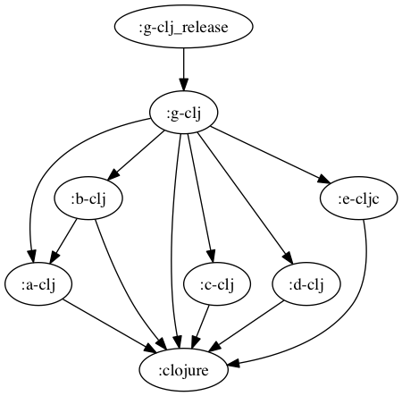
```
buck-out/gen/RULES/clojure-clojurescript-buck/tests/g-clj_release
└── g-clj.jar

0 directories, 1 file
```
## g-clj_test
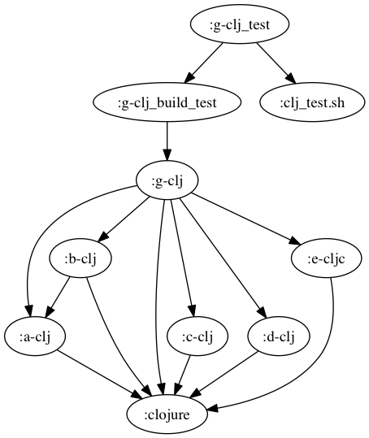
```
buck-out/gen/RULES/clojure-clojurescript-buck/tests/g-clj_test [error opening dir]

0 directories, 0 files
```
## g-cljc

```
buck-out/gen/RULES/clojure-clojurescript-buck/tests/g-cljc
└── build
    ├── deps
    ├── project.clj
    ├── src
    │   ├── a
    │   │   └── a_cljc.cljc
    │   ├── b
    │   │   └── b_cljc.cljc
    │   ├── c
    │   │   └── c_cljc.cljc
    │   ├── d
    │   │   ├── d1.cljc
    │   │   └── d2.cljc
    │   ├── e
    │   │   └── e_cljc.cljc
    │   └── g
    │       └── core
    │           └── g_cljc.cljc
    └── test

10 directories, 9 files
```
`cat project.clj`:
``` clojure
(defproject g-cljc "0.0.1"
  :dependencies [[aleph "0.4.1-beta2"]
[org.clojure/clojure "1.8.0"]
[org.clojure/data.json "0.2.6"]
[org.omcljs/om "1.0.0-alpha28"]]
  :main g.core.g-cljc
  :aot [g.core.g-cljc]
  :source-paths ["src"])
```
## g-cljc_build

```
buck-out/gen/RULES/clojure-clojurescript-buck/tests/g-cljc_build
└── build
    ├── classes
    │   ├── META-INF
    │   │   └── maven
    │   │       └── g-cljc
    │   │           └── g-cljc
    │   │               └── pom.properties
    │   ├── a
    │   │   ├── a_cljc$fn__29.class
    │   │   ├── a_cljc$loading__5569__auto____27.class
    │   │   └── a_cljc__init.class
    │   ├── aleph
    │   │   ├── flow$acquire$fn$reify__1751.class
    │   │   ├── flow$acquire$fn__1750.class
    │   │   ├── flow$acquire.class
    │   │   ├── flow$dispose.class
    │   │   ├── flow$fn__1741.class
    │   │   ├── flow$instrumented_pool$reify__1745.class
    │   │   ├── flow$instrumented_pool$reify__1747.class
    │   │   ├── flow$instrumented_pool.class
    │   │   ├── flow$loading__5569__auto____1232.class
    │   │   ├── flow$release.class
    │   │   ├── flow__init.class
    │   │   ├── http
    │   │   │   ├── client$client_handler$handle_response__4721.class
    │   │   │   ├── client$client_handler$reify__4723$fn__4728.class
    │   │   │   ├── client$client_handler$reify__4723$fn__4730.class
    │   │   │   ├── client$client_handler$reify__4723$fn__4737.class
    │   │   │   ├── client$client_handler$reify__4723$fn__4743.class
    │   │   │   ├── client$client_handler$reify__4723.class
    │   │   │   ├── client$client_handler.class
    │   │   │   ├── client$close_connection.class
    │   │   │   ├── client$fn__4695.class
    │   │   │   ├── client$fn__4697$no_url__4698.class
    │   │   │   ├── client$fn__4697$req__GT_domain__4702.class
    │   │   │   ├── client$fn__4697.class
    │   │   │   ├── client$http_connection$fn__4767$fn__4768$f__3786__auto____4769.class
    │   │   │   ├── client$http_connection$fn__4767$fn__4768$fn__4771.class
    │   │   │   ├── client$http_connection$fn__4767$fn__4768.class
    │   │   │   ├── client$http_connection$fn__4767$fn__4777.class
    │   │   │   ├── client$http_connection$fn__4767$fn__4779$fn__4780.class
    │   │   │   ├── client$http_connection$fn__4767$fn__4779$fn__4782$fn__4783$fn__4784.class
    │   │   │   ├── client$http_connection$fn__4767$fn__4779$fn__4782$fn__4783.class
    │   │   │   ├── client$http_connection$fn__4767$fn__4779$fn__4782.class
    │   │   │   ├── client$http_connection$fn__4767$fn__4779.class
    │   │   │   ├── client$http_connection$fn__4767.class
    │   │   │   ├── client$http_connection.class
    │   │   │   ├── client$loading__5569__auto____4337.class
    │   │   │   ├── client$pipeline_builder$fn__4760.class
    │   │   │   ├── client$pipeline_builder.class
    │   │   │   ├── client$raw_client_handler$handle_response__4707.class
    │   │   │   ├── client$raw_client_handler$reify__4709$fn__4710.class
    │   │   │   ├── client$raw_client_handler$reify__4709$fn__4712.class
    │   │   │   ├── client$raw_client_handler$reify__4709.class
    │   │   │   ├── client$raw_client_handler.class
    │   │   │   ├── client$websocket_client_handler$reify__4796$fn__4797.class
    │   │   │   ├── client$websocket_client_handler$reify__4796$fn__4800$fn__4801.class
    │   │   │   ├── client$websocket_client_handler$reify__4796$fn__4800.class
    │   │   │   ├── client$websocket_client_handler$reify__4796.class
    │   │   │   ├── client$websocket_client_handler.class
    │   │   │   ├── client$websocket_connection$fn__4811.class
    │   │   │   ├── client$websocket_connection$fn__4814.class
    │   │   │   ├── client$websocket_connection.class
    │   │   │   ├── client$websocket_frame_size.class
    │   │   │   ├── client$websocket_handshaker.class
    │   │   │   ├── client__init.class
    │   │   │   ├── client_middleware$accept_encoding_value.class
    │   │   │   ├── client_middleware$basic_auth_value.class
    │   │   │   ├── client_middleware$client_error_QMARK_.class
    │   │   │   ├── client_middleware$coerce_clojure_body.class
    │   │   │   ├── client_middleware$coerce_json_body.class
    │   │   │   ├── client_middleware$coerce_transit_body.class
    │   │   │   ├── client_middleware$conflict_QMARK_.class
    │   │   │   ├── client_middleware$content_type_value.class
    │   │   │   ├── client_middleware$decorate_accept.class
    │   │   │   ├── client_middleware$decorate_accept_encoding.class
    │   │   │   ├── client_middleware$decorate_basic_auth.class
    │   │   │   ├── client_middleware$decorate_content_type.class
    │   │   │   ├── client_middleware$decorate_form_params.class
    │   │   │   ├── client_middleware$decorate_method.class
    │   │   │   ├── client_middleware$decorate_nested_params.class
    │   │   │   ├── client_middleware$decorate_oauth.class
    │   │   │   ├── client_middleware$decorate_query_params$fn__4587.class
    │   │   │   ├── client_middleware$decorate_query_params.class
    │   │   │   ├── client_middleware$decorate_url.class
    │   │   │   ├── client_middleware$decorate_user_info.class
    │   │   │   ├── client_middleware$def_decorator.class
    │   │   │   ├── client_middleware$detect_charset.class
    │   │   │   ├── client_middleware$dissoc_in.class
    │   │   │   ├── client_middleware$fn__4341.class
    │   │   │   ├── client_middleware$fn__4343.class
    │   │   │   ├── client_middleware$fn__4345.class
    │   │   │   ├── client_middleware$fn__4475$fn__4476.class
    │   │   │   ├── client_middleware$fn__4475$opt__4478.class
    │   │   │   ├── client_middleware$fn__4475.class
    │   │   │   ├── client_middleware$fn__4631$fn__4632.class
    │   │   │   ├── client_middleware$fn__4631.class
    │   │   │   ├── client_middleware$fn__4637.class
    │   │   │   ├── client_middleware$fn__4639.class
    │   │   │   ├── client_middleware$fn__4662.class
    │   │   │   ├── client_middleware$fn__4664.class
    │   │   │   ├── client_middleware$fn__4666.class
    │   │   │   ├── client_middleware$fn__4668.class
    │   │   │   ├── client_middleware$fn__4670.class
    │   │   │   ├── client_middleware$fn__4672.class
    │   │   │   ├── client_middleware$fn__4674.class
    │   │   │   ├── client_middleware$fn__4678.class
    │   │   │   ├── client_middleware$fn__4682.class
    │   │   │   ├── client_middleware$follow_redirect.class
    │   │   │   ├── client_middleware$generate_query_string.class
    │   │   │   ├── client_middleware$handle_redirects.class
    │   │   │   ├── client_middleware$json_decode.class
    │   │   │   ├── client_middleware$json_decode_strict.class
    │   │   │   ├── client_middleware$loading__5569__auto____4339.class
    │   │   │   ├── client_middleware$missing_QMARK_.class
    │   │   │   ├── client_middleware$nest_params$fn__4485$fn__4488.class
    │   │   │   ├── client_middleware$nest_params$fn__4485.class
    │   │   │   ├── client_middleware$nest_params.class
    │   │   │   ├── client_middleware$parse_content_type$fn__4624.class
    │   │   │   ├── client_middleware$parse_content_type$fn__4627.class
    │   │   │   ├── client_middleware$parse_content_type.class
    │   │   │   ├── client_middleware$parse_transit.class
    │   │   │   ├── client_middleware$parse_url.class
    │   │   │   ├── client_middleware$parse_user_info.class
    │   │   │   ├── client_middleware$redirect_QMARK_.class
    │   │   │   ├── client_middleware$server_error_QMARK_.class
    │   │   │   ├── client_middleware$success_QMARK_.class
    │   │   │   ├── client_middleware$update.class
    │   │   │   ├── client_middleware$url_encode.class
    │   │   │   ├── client_middleware$url_encode_illegal_characters.class
    │   │   │   ├── client_middleware$when_pos.class
    │   │   │   ├── client_middleware$wrap_exceptions$fn__4513$fn__4523.class
    │   │   │   ├── client_middleware$wrap_exceptions$fn__4513$fn__4527.class
    │   │   │   ├── client_middleware$wrap_exceptions$fn__4513$fn__4531.class
    │   │   │   ├── client_middleware$wrap_exceptions$fn__4513$fn__4535.class
    │   │   │   ├── client_middleware$wrap_exceptions$fn__4513$fn__4539$fn__4541.class
    │   │   │   ├── client_middleware$wrap_exceptions$fn__4513$fn__4539.class
    │   │   │   ├── client_middleware$wrap_exceptions$fn__4513.class
    │   │   │   ├── client_middleware$wrap_exceptions.class
    │   │   │   ├── client_middleware$wrap_request$fn__4686$fn__4687.class
    │   │   │   ├── client_middleware$wrap_request$fn__4686$fn__4690.class
    │   │   │   ├── client_middleware$wrap_request$fn__4686.class
    │   │   │   ├── client_middleware$wrap_request.class
    │   │   │   ├── client_middleware$wrap_request_timing$fn__4617$fn__4618.class
    │   │   │   ├── client_middleware$wrap_request_timing$fn__4617.class
    │   │   │   ├── client_middleware$wrap_request_timing.class
    │   │   │   ├── client_middleware__init.class
    │   │   │   ├── core
    │   │   │   │   ├── HeaderMap$eval4012__4013.class
    │   │   │   │   ├── HeaderMap$fn__4009.class
    │   │   │   │   ├── HeaderMap$fn__4015.class
    │   │   │   │   ├── HeaderMap$fn__4017.class
    │   │   │   │   ├── HeaderMap.class
    │   │   │   │   ├── ILookupNettyRequest.class
    │   │   │   │   ├── ILookupNettyResponse.class
    │   │   │   │   ├── NettyRequest$eval4067__4068.class
    │   │   │   │   ├── NettyRequest$fn__4064.class
    │   │   │   │   ├── NettyRequest$fn__4070.class
    │   │   │   │   ├── NettyRequest$fn__4072.class
    │   │   │   │   ├── NettyRequest.class
    │   │   │   │   ├── NettyResponse$eval4115__4116.class
    │   │   │   │   ├── NettyResponse$fn__4112.class
    │   │   │   │   ├── NettyResponse$fn__4118.class
    │   │   │   │   ├── NettyResponse$fn__4120.class
    │   │   │   │   └── NettyResponse.class
    │   │   │   ├── core$eval4003.class
    │   │   │   ├── core$eval4054.class
    │   │   │   ├── core$eval4105.class
    │   │   │   ├── core$fn__3991.class
    │   │   │   ├── core$fn__3994$fn__3995.class
    │   │   │   ├── core$fn__3994.class
    │   │   │   ├── core$fn__4007$__GT_HeaderMap__4030.class
    │   │   │   ├── core$fn__4007.class
    │   │   │   ├── core$fn__4050.class
    │   │   │   ├── core$fn__4062$__GT_NettyRequest__4089.class
    │   │   │   ├── core$fn__4062.class
    │   │   │   ├── core$fn__4092$__GT_NettyRequest__4093.class
    │   │   │   ├── core$fn__4092.class
    │   │   │   ├── core$fn__4101.class
    │   │   │   ├── core$fn__4110$__GT_NettyResponse__4134.class
    │   │   │   ├── core$fn__4110.class
    │   │   │   ├── core$fn__4137$__GT_NettyResponse__4138.class
    │   │   │   ├── core$fn__4137.class
    │   │   │   ├── core$fn__4145$coerce_element__4146.class
    │   │   │   ├── core$fn__4145.class
    │   │   │   ├── core$fn__4175$handle_cleanup__4176$fn__4177.class
    │   │   │   ├── core$fn__4175$handle_cleanup__4176$fn__4179.class
    │   │   │   ├── core$fn__4175$handle_cleanup__4176.class
    │   │   │   ├── core$fn__4175$send_message__4182$fn__4183.class
    │   │   │   ├── core$fn__4175$send_message__4182.class
    │   │   │   ├── core$fn__4175.class
    │   │   │   ├── core$headers__GT_map.class
    │   │   │   ├── core$loading__5569__auto____1759.class
    │   │   │   ├── core$map__GT_headers_BANG_.class
    │   │   │   ├── core$netty_request__GT_ring_request.class
    │   │   │   ├── core$netty_response__GT_ring_response.class
    │   │   │   ├── core$normalize_header_key.class
    │   │   │   ├── core$ring_request__GT_full_netty_request.class
    │   │   │   ├── core$ring_request__GT_netty_request.class
    │   │   │   ├── core$ring_response__GT_netty_response.class
    │   │   │   ├── core$send_contiguous_body.class
    │   │   │   ├── core$send_file_body.class
    │   │   │   ├── core$send_streaming_body$fn__4153.class
    │   │   │   ├── core$send_streaming_body$fn__4157.class
    │   │   │   ├── core$send_streaming_body$fn__4161.class
    │   │   │   ├── core$send_streaming_body$fn__4163.class
    │   │   │   ├── core$send_streaming_body$fn__4165$fn__4166.class
    │   │   │   ├── core$send_streaming_body$fn__4165.class
    │   │   │   ├── core$send_streaming_body.class
    │   │   │   ├── core$try_set_content_length_BANG_.class
    │   │   │   ├── core__init.class
    │   │   │   ├── server$date_header_value$fn__4197.class
    │   │   │   ├── server$date_header_value.class
    │   │   │   ├── server$error_response.class
    │   │   │   ├── server$fn__4193.class
    │   │   │   ├── server$fn__4208$fn__4209.class
    │   │   │   ├── server$fn__4208$fn__4211.class
    │   │   │   ├── server$fn__4208$send_response__4213$f__3786__auto____4217.class
    │   │   │   ├── server$fn__4208$send_response__4213$fn__4215.class
    │   │   │   ├── server$fn__4208$send_response__4213$fn__4220.class
    │   │   │   ├── server$fn__4208$send_response__4213.class
    │   │   │   ├── server$fn__4208.class
    │   │   │   ├── server$handle_request$fn__4228$f__619__auto____4229.class
    │   │   │   ├── server$handle_request$fn__4228$fn__4234.class
    │   │   │   ├── server$handle_request$fn__4228.class
    │   │   │   ├── server$handle_request$fn__4241.class
    │   │   │   ├── server$handle_request$fn__4243$fn__4244.class
    │   │   │   ├── server$handle_request$fn__4243.class
    │   │   │   ├── server$handle_request.class
    │   │   │   ├── server$initialize_websocket_handler$fn__4329.class
    │   │   │   ├── server$initialize_websocket_handler$fn__4331.class
    │   │   │   ├── server$initialize_websocket_handler$fn__4333.class
    │   │   │   ├── server$initialize_websocket_handler.class
    │   │   │   ├── server$invalid_value_response.class
    │   │   │   ├── server$loading__5569__auto____1757.class
    │   │   │   ├── server$pipeline_builder$fn__4303.class
    │   │   │   ├── server$pipeline_builder.class
    │   │   │   ├── server$raw_ring_handler$handle_request__4291.class
    │   │   │   ├── server$raw_ring_handler$reify__4293$fn__4294.class
    │   │   │   ├── server$raw_ring_handler$reify__4293.class
    │   │   │   ├── server$raw_ring_handler.class
    │   │   │   ├── server$rfc_1123_date_string.class
    │   │   │   ├── server$ring_handler$handle_request__4250.class
    │   │   │   ├── server$ring_handler$process_content__4266$fn__4268.class
    │   │   │   ├── server$ring_handler$process_content__4266.class
    │   │   │   ├── server$ring_handler$process_last_content__4256.class
    │   │   │   ├── server$ring_handler$process_request__4252$fn__4253.class
    │   │   │   ├── server$ring_handler$process_request__4252.class
    │   │   │   ├── server$ring_handler$reify__4278.class
    │   │   │   ├── server$ring_handler.class
    │   │   │   ├── server$start_server$fn__4309.class
    │   │   │   ├── server$start_server.class
    │   │   │   ├── server$websocket_server_handler$fn__4314.class
    │   │   │   ├── server$websocket_server_handler$fn__4316$fn__4317.class
    │   │   │   ├── server$websocket_server_handler$fn__4316.class
    │   │   │   ├── server$websocket_server_handler$reify__4321.class
    │   │   │   ├── server$websocket_server_handler.class
    │   │   │   └── server__init.class
    │   │   ├── http$connection_pool$fn__4828$fn__4829.class
    │   │   ├── http$connection_pool$fn__4828.class
    │   │   ├── http$connection_pool$fn__4832.class
    │   │   ├── http$connection_pool.class
    │   │   ├── http$create_connection.class
    │   │   ├── http$def_http_method.class
    │   │   ├── http$fn__4817.class
    │   │   ├── http$fn__4835.class
    │   │   ├── http$fn__4849$maybe_connect__4852.class
    │   │   ├── http$fn__4849$maybe_timeout_BANG___4850.class
    │   │   ├── http$fn__4849$request__4855$fn__4857$fn__4858$fn__4859.class
    │   │   ├── http$fn__4849$request__4855$fn__4857$fn__4858$fn__4861$fn__4862.class
    │   │   ├── http$fn__4849$request__4855$fn__4857$fn__4858$fn__4861$fn__4864$fn__4865.class
    │   │   ├── http$fn__4849$request__4855$fn__4857$fn__4858$fn__4861$fn__4864.class
    │   │   ├── http$fn__4849$request__4855$fn__4857$fn__4858$fn__4861.class
    │   │   ├── http$fn__4849$request__4855$fn__4857$fn__4858$fn__4869.class
    │   │   ├── http$fn__4849$request__4855$fn__4857$fn__4858.class
    │   │   ├── http$fn__4849$request__4855$fn__4857.class
    │   │   ├── http$fn__4849$request__4855.class
    │   │   ├── http$fn__4849.class
    │   │   ├── http$get_all.class
    │   │   ├── http$loading__5569__auto____177.class
    │   │   ├── http$register_connection_stats_callback.class
    │   │   ├── http$req.class
    │   │   ├── http$start_server.class
    │   │   ├── http$unregister_connection_stats_callback.class
    │   │   ├── http$websocket_client.class
    │   │   ├── http$websocket_connection.class
    │   │   ├── http__init.class
    │   │   ├── netty
    │   │   │   ├── AlephServer.class
    │   │   │   ├── ChannelSink$fn__3798.class
    │   │   │   ├── ChannelSink.class
    │   │   │   ├── HeaderMap$eval3926__3927.class
    │   │   │   ├── HeaderMap$fn__3923.class
    │   │   │   ├── HeaderMap$fn__3929.class
    │   │   │   ├── HeaderMap$fn__3931.class
    │   │   │   ├── HeaderMap$fn__3934.class
    │   │   │   └── HeaderMap.class
    │   │   ├── netty$__GT_ChannelSink.class
    │   │   ├── netty$acquire.class
    │   │   ├── netty$acquire__3740.class
    │   │   ├── netty$allocate.class
    │   │   ├── netty$bandwidth_tracker$fn__3895.class
    │   │   ├── netty$bandwidth_tracker$reify__3897.class
    │   │   ├── netty$bandwidth_tracker.class
    │   │   ├── netty$buf__GT_array.class
    │   │   ├── netty$buffered_source$fn__3824.class
    │   │   ├── netty$buffered_source.class
    │   │   ├── netty$bufs__GT_array$fn__3758.class
    │   │   ├── netty$bufs__GT_array$fn__3760.class
    │   │   ├── netty$bufs__GT_array.class
    │   │   ├── netty$channel.class
    │   │   ├── netty$channel_handler.class
    │   │   ├── netty$channel_remote_address.class
    │   │   ├── netty$channel_server_name.class
    │   │   ├── netty$channel_server_port.class
    │   │   ├── netty$close.class
    │   │   ├── netty$connection_stats.class
    │   │   ├── netty$create_client$fn__3975.class
    │   │   ├── netty$create_client$fn__3978.class
    │   │   ├── netty$create_client.class
    │   │   ├── netty$epoll_available_QMARK_.class
    │   │   ├── netty$eval3728$fn__3729.class
    │   │   ├── netty$eval3728.class
    │   │   ├── netty$eval3735$fn__3736.class
    │   │   ├── netty$eval3735.class
    │   │   ├── netty$eval3917.class
    │   │   ├── netty$flush.class
    │   │   ├── netty$fn__3726.class
    │   │   ├── netty$fn__3765.class
    │   │   ├── netty$fn__3767.class
    │   │   ├── netty$fn__3769$append_to_buf_BANG___3770.class
    │   │   ├── netty$fn__3769$to_byte_buf__3772.class
    │   │   ├── netty$fn__3769.class
    │   │   ├── netty$fn__3797$__GT_ChannelSink__3812.class
    │   │   ├── netty$fn__3797.class
    │   │   ├── netty$fn__3921$__GT_HeaderMap__3946.class
    │   │   ├── netty$fn__3921.class
    │   │   ├── netty$fn__3955.class
    │   │   ├── netty$fn__3958$G__3953__3963.class
    │   │   ├── netty$fn__3958$G__3954__3960.class
    │   │   ├── netty$fn__3958.class
    │   │   ├── netty$fn__3971.class
    │   │   ├── netty$fn__3973.class
    │   │   ├── netty$get_default_event_loop_threads.class
    │   │   ├── netty$headers.class
    │   │   ├── netty$insecure_ssl_client_context.class
    │   │   ├── netty$instrument_BANG_$f__3786__auto____3905.class
    │   │   ├── netty$instrument_BANG_$fn__3908.class
    │   │   ├── netty$instrument_BANG_.class
    │   │   ├── netty$leak_detector_level_BANG_.class
    │   │   ├── netty$loading__5569__auto____2709.class
    │   │   ├── netty$pipeline_initializer$reify__3900.class
    │   │   ├── netty$pipeline_initializer.class
    │   │   ├── netty$put_BANG_$fn__3791.class
    │   │   ├── netty$put_BANG_.class
    │   │   ├── netty$release.class
    │   │   ├── netty$release__3733.class
    │   │   ├── netty$release_buf__GT_array.class
    │   │   ├── netty$safe_execute.class
    │   │   ├── netty$self_signed_ssl_context.class
    │   │   ├── netty$set_logger_BANG_.class
    │   │   ├── netty$sink$fn__3816.class
    │   │   ├── netty$sink.class
    │   │   ├── netty$source$fn__3820.class
    │   │   ├── netty$source.class
    │   │   ├── netty$ssl_client_context.class
    │   │   ├── netty$start_server$fn__3983.class
    │   │   ├── netty$start_server$reify__3986.class
    │   │   ├── netty$start_server.class
    │   │   ├── netty$to_byte_buf_stream.class
    │   │   ├── netty$wrap_future$reify__3777.class
    │   │   ├── netty$wrap_future.class
    │   │   ├── netty$write.class
    │   │   ├── netty$write_and_flush.class
    │   │   └── netty__init.class
    │   ├── b
    │   │   ├── b_cljc$fn__33.class
    │   │   ├── b_cljc$loading__5569__auto____31.class
    │   │   └── b_cljc__init.class
    │   ├── byte_streams
    │   │   ├── char_sequence$coding_error_action.class
    │   │   ├── char_sequence$decode.class
    │   │   ├── char_sequence$decode_byte_source$reify__3396$fn__3397.class
    │   │   ├── char_sequence$decode_byte_source$reify__3396.class
    │   │   ├── char_sequence$decode_byte_source.class
    │   │   ├── char_sequence$flush.class
    │   │   ├── char_sequence$fn__3379.class
    │   │   ├── char_sequence$lazy_char_buffer_sequence$fn__3387.class
    │   │   ├── char_sequence$lazy_char_buffer_sequence.class
    │   │   ├── char_sequence$loading__5569__auto____3377.class
    │   │   ├── char_sequence$parse_result.class
    │   │   ├── char_sequence__init.class
    │   │   ├── graph
    │   │   │   ├── Conversion.class
    │   │   │   ├── ConversionGraph$fn__2975$fn__2976.class
    │   │   │   ├── ConversionGraph$fn__2975.class
    │   │   │   ├── ConversionGraph$fn__2979$fn__2980.class
    │   │   │   ├── ConversionGraph$fn__2979.class
    │   │   │   ├── ConversionGraph$fn__2983.class
    │   │   │   ├── ConversionGraph$fn__2985$fn__2987.class
    │   │   │   ├── ConversionGraph$fn__2985.class
    │   │   │   ├── ConversionGraph.class
    │   │   │   ├── ConversionPath$reify__3002.class
    │   │   │   ├── ConversionPath$reify__3004.class
    │   │   │   ├── ConversionPath$reify__3006.class
    │   │   │   ├── ConversionPath$reify__3008.class
    │   │   │   ├── ConversionPath.class
    │   │   │   ├── IConversionGraph.class
    │   │   │   └── Type.class
    │   │   ├── graph$assignable_QMARK_.class
    │   │   ├── graph$canonicalize.class
    │   │   ├── graph$class_satisfies_QMARK_$fn__2859.class
    │   │   ├── graph$class_satisfies_QMARK_.class
    │   │   ├── graph$closeable_seq$reify__3047.class
    │   │   ├── graph$closeable_seq.class
    │   │   ├── graph$conj_path.class
    │   │   ├── graph$conversion_fn$fn__3052.class
    │   │   ├── graph$conversion_fn$fn__3054.class
    │   │   ├── graph$conversion_fn$fn__3056$fn__3057$fn__3058.class
    │   │   ├── graph$conversion_fn$fn__3056$fn__3057.class
    │   │   ├── graph$conversion_fn$fn__3056$fn__3061.class
    │   │   ├── graph$conversion_fn$fn__3056.class
    │   │   ├── graph$conversion_fn.class
    │   │   ├── graph$conversion_graph.class
    │   │   ├── graph$fn__2836.class
    │   │   ├── graph$fn__2838$__GT_Conversion__2842.class
    │   │   ├── graph$fn__2838.class
    │   │   ├── graph$fn__2845$__GT_Type__2849.class
    │   │   ├── graph$fn__2845.class
    │   │   ├── graph$fn__2879.class
    │   │   ├── graph$fn__2882$G__2875__2889.class
    │   │   ├── graph$fn__2882$G__2876__2885.class
    │   │   ├── graph$fn__2882.class
    │   │   ├── graph$fn__2895$G__2871__2900.class
    │   │   ├── graph$fn__2895$G__2872__2897.class
    │   │   ├── graph$fn__2895.class
    │   │   ├── graph$fn__2906$G__2867__2919.class
    │   │   ├── graph$fn__2906$G__2868__2912.class
    │   │   ├── graph$fn__2906.class
    │   │   ├── graph$fn__2925$G__2869__2932.class
    │   │   ├── graph$fn__2925$G__2870__2928.class
    │   │   ├── graph$fn__2925.class
    │   │   ├── graph$fn__2938$G__2877__2947.class
    │   │   ├── graph$fn__2938$G__2878__2942.class
    │   │   ├── graph$fn__2938.class
    │   │   ├── graph$fn__2953$G__2873__2958.class
    │   │   ├── graph$fn__2953$G__2874__2955.class
    │   │   ├── graph$fn__2953.class
    │   │   ├── graph$fn__2974$__GT_ConversionGraph__2993.class
    │   │   ├── graph$fn__2974.class
    │   │   ├── graph$fn__2998$__GT_ConversionPath__3018.class
    │   │   ├── graph$fn__2998$map__GT_ConversionPath__3020.class
    │   │   ├── graph$fn__2998.class
    │   │   ├── graph$fn__3025$fn__3027.class
    │   │   ├── graph$fn__3025$fn__3034.class
    │   │   ├── graph$fn__3025.class
    │   │   ├── graph$implicit_conversions$fn__2964.class
    │   │   ├── graph$implicit_conversions$fn__2966.class
    │   │   ├── graph$implicit_conversions$fn__2968.class
    │   │   ├── graph$implicit_conversions.class
    │   │   ├── graph$loading__5569__auto____2713.class
    │   │   ├── graph$pprint_type.class
    │   │   ├── graph$protocol_QMARK_.class
    │   │   ├── graph$seq_conversion_fn$fn__3075.class
    │   │   ├── graph$seq_conversion_fn$fn__3077.class
    │   │   ├── graph$seq_conversion_fn$fn__3079$fn__3080.class
    │   │   ├── graph$seq_conversion_fn$fn__3079$fn__3084.class
    │   │   ├── graph$seq_conversion_fn$fn__3079$fn__3086.class
    │   │   ├── graph$seq_conversion_fn$fn__3079$fn__3088.class
    │   │   ├── graph$seq_conversion_fn$fn__3079.class
    │   │   ├── graph$seq_conversion_fn.class
    │   │   ├── graph$type.class
    │   │   ├── graph__init.class
    │   │   ├── protocols
    │   │   │   ├── ByteSink.class
    │   │   │   ├── ByteSource.class
    │   │   │   └── Closeable.class
    │   │   ├── protocols$fn__2772.class
    │   │   ├── protocols$fn__2776.class
    │   │   ├── protocols$fn__2779$G__2774__2784.class
    │   │   ├── protocols$fn__2779$G__2775__2781.class
    │   │   ├── protocols$fn__2779.class
    │   │   ├── protocols$fn__2792.class
    │   │   ├── protocols$fn__2795$G__2790__2804.class
    │   │   ├── protocols$fn__2795$G__2791__2799.class
    │   │   ├── protocols$fn__2795.class
    │   │   ├── protocols$fn__2812.class
    │   │   ├── protocols$fn__2815$G__2810__2824.class
    │   │   ├── protocols$fn__2815$G__2811__2819.class
    │   │   ├── protocols$fn__2815.class
    │   │   ├── protocols$fn__2830.class
    │   │   ├── protocols$fn__2832$closeable_QMARK___2833.class
    │   │   ├── protocols$fn__2832.class
    │   │   ├── protocols$loading__5569__auto____2770.class
    │   │   ├── protocols__init.class
    │   │   ├── pushback_stream
    │   │   │   ├── Consumption.class
    │   │   │   ├── PushbackByteStream.class
    │   │   │   ├── PushbackStream.class
    │   │   │   └── SynchronizedPushbackByteStream.class
    │   │   ├── pushback_stream$__GT_input_stream.class
    │   │   ├── pushback_stream$both$fn__3286.class
    │   │   ├── pushback_stream$both$fn__3288.class
    │   │   ├── pushback_stream$both.class
    │   │   ├── pushback_stream$close.class
    │   │   ├── pushback_stream$close__3346.class
    │   │   ├── pushback_stream$eager_take.class
    │   │   ├── pushback_stream$eager_take__3353.class
    │   │   ├── pushback_stream$eval3327$fn__3328.class
    │   │   ├── pushback_stream$eval3327.class
    │   │   ├── pushback_stream$eval3334$fn__3335.class
    │   │   ├── pushback_stream$eval3334.class
    │   │   ├── pushback_stream$eval3341$fn__3342.class
    │   │   ├── pushback_stream$eval3341.class
    │   │   ├── pushback_stream$eval3348$fn__3349.class
    │   │   ├── pushback_stream$eval3348.class
    │   │   ├── pushback_stream$eval3355$fn__3356.class
    │   │   ├── pushback_stream$eval3355.class
    │   │   ├── pushback_stream$eval3362$fn__3363.class
    │   │   ├── pushback_stream$eval3362.class
    │   │   ├── pushback_stream$eval3369$fn__3370.class
    │   │   ├── pushback_stream$eval3369.class
    │   │   ├── pushback_stream$expand_either$fn__3280.class
    │   │   ├── pushback_stream$expand_either.class
    │   │   ├── pushback_stream$fn__3269.class
    │   │   ├── pushback_stream$fn__3271.class
    │   │   ├── pushback_stream$fn__3273$__GT_Consumption__3275.class
    │   │   ├── pushback_stream$fn__3273.class
    │   │   ├── pushback_stream$fn__3291$__GT_PushbackByteStream__3303.class
    │   │   ├── pushback_stream$fn__3291.class
    │   │   ├── pushback_stream$fn__3306$__GT_SynchronizedPushbackByteStream__3322.class
    │   │   ├── pushback_stream$fn__3306.class
    │   │   ├── pushback_stream$loading__5569__auto____3094.class
    │   │   ├── pushback_stream$prewalk.class
    │   │   ├── pushback_stream$pushback_array.class
    │   │   ├── pushback_stream$pushback_array__3367.class
    │   │   ├── pushback_stream$pushback_buffer.class
    │   │   ├── pushback_stream$pushback_buffer__3374.class
    │   │   ├── pushback_stream$pushback_stream.class
    │   │   ├── pushback_stream$put.class
    │   │   ├── pushback_stream$put_array.class
    │   │   ├── pushback_stream$put_array__3332.class
    │   │   ├── pushback_stream$put_buffer.class
    │   │   ├── pushback_stream$put_buffer__3339.class
    │   │   ├── pushback_stream$take.class
    │   │   ├── pushback_stream$take__3360.class
    │   │   ├── pushback_stream$unsafe_pushback_stream.class
    │   │   ├── pushback_stream$walk.class
    │   │   ├── pushback_stream__init.class
    │   │   ├── utils$fast_memoize$fn__2722$fn__2723.class
    │   │   ├── utils$fast_memoize$fn__2722$fn__2725.class
    │   │   ├── utils$fast_memoize$fn__2722$fn__2727.class
    │   │   ├── utils$fast_memoize$fn__2722$fn__2729.class
    │   │   ├── utils$fast_memoize$fn__2722$fn__2731.class
    │   │   ├── utils$fast_memoize$fn__2722$fn__2733.class
    │   │   ├── utils$fast_memoize$fn__2722$fn__2735.class
    │   │   ├── utils$fast_memoize$fn__2722$fn__2737.class
    │   │   ├── utils$fast_memoize$fn__2722.class
    │   │   ├── utils$fast_memoize.class
    │   │   ├── utils$fn__2717.class
    │   │   ├── utils$loading__5569__auto____2715.class
    │   │   ├── utils$memoize_form.class
    │   │   └── utils__init.class
    │   ├── byte_streams$bytes_EQ_.class
    │   ├── byte_streams$cmp_bufs$fn__3716.class
    │   ├── byte_streams$cmp_bufs.class
    │   ├── byte_streams$compare_bytes.class
    │   ├── byte_streams$conversion_path.class
    │   ├── byte_streams$convert.class
    │   ├── byte_streams$def_conversion.class
    │   ├── byte_streams$def_transfer.class
    │   ├── byte_streams$default_transfer.class
    │   ├── byte_streams$eval3490.class
    │   ├── byte_streams$eval3498.class
    │   ├── byte_streams$eval3519.class
    │   ├── byte_streams$eval3535.class
    │   ├── byte_streams$eval3545.class
    │   ├── byte_streams$eval3564.class
    │   ├── byte_streams$eval3572.class
    │   ├── byte_streams$eval3580.class
    │   ├── byte_streams$eval3585.class
    │   ├── byte_streams$eval3604.class
    │   ├── byte_streams$eval3620.class
    │   ├── byte_streams$fn__3407.class
    │   ├── byte_streams$fn__3409.class
    │   ├── byte_streams$fn__3412.class
    │   ├── byte_streams$fn__3431.class
    │   ├── byte_streams$fn__3433.class
    │   ├── byte_streams$fn__3435.class
    │   ├── byte_streams$fn__3445$conversion_cost__3449.class
    │   ├── byte_streams$fn__3445$fn__3446.class
    │   ├── byte_streams$fn__3445.class
    │   ├── byte_streams$fn__3492$fn__3493.class
    │   ├── byte_streams$fn__3492$fn__3495.class
    │   ├── byte_streams$fn__3492.class
    │   ├── byte_streams$fn__3500$fn__3501.class
    │   ├── byte_streams$fn__3500$fn__3503.class
    │   ├── byte_streams$fn__3500.class
    │   ├── byte_streams$fn__3507.class
    │   ├── byte_streams$fn__3510.class
    │   ├── byte_streams$fn__3512.class
    │   ├── byte_streams$fn__3514.class
    │   ├── byte_streams$fn__3522$fn__3524.class
    │   ├── byte_streams$fn__3522.class
    │   ├── byte_streams$fn__3538$fn__3540.class
    │   ├── byte_streams$fn__3538.class
    │   ├── byte_streams$fn__3543.class
    │   ├── byte_streams$fn__3548$fn__3550.class
    │   ├── byte_streams$fn__3548.class
    │   ├── byte_streams$fn__3554.class
    │   ├── byte_streams$fn__3557.class
    │   ├── byte_streams$fn__3561.class
    │   ├── byte_streams$fn__3566$fn__3568.class
    │   ├── byte_streams$fn__3566.class
    │   ├── byte_streams$fn__3574$fn__3575.class
    │   ├── byte_streams$fn__3574.class
    │   ├── byte_streams$fn__3578.class
    │   ├── byte_streams$fn__3582.class
    │   ├── byte_streams$fn__3587$fn__3588.class
    │   ├── byte_streams$fn__3587$fn__3591.class
    │   ├── byte_streams$fn__3587.class
    │   ├── byte_streams$fn__3595.class
    │   ├── byte_streams$fn__3599.class
    │   ├── byte_streams$fn__3602.class
    │   ├── byte_streams$fn__3606.class
    │   ├── byte_streams$fn__3614.class
    │   ├── byte_streams$fn__3617.class
    │   ├── byte_streams$fn__3623$buf_seq__3625$fn__3626.class
    │   ├── byte_streams$fn__3623$buf_seq__3625.class
    │   ├── byte_streams$fn__3623$fn__3629.class
    │   ├── byte_streams$fn__3623.class
    │   ├── byte_streams$fn__3632.class
    │   ├── byte_streams$fn__3634.class
    │   ├── byte_streams$fn__3637.class
    │   ├── byte_streams$fn__3641.class
    │   ├── byte_streams$fn__3645.class
    │   ├── byte_streams$fn__3648.class
    │   ├── byte_streams$fn__3650.class
    │   ├── byte_streams$fn__3652.class
    │   ├── byte_streams$fn__3655.class
    │   ├── byte_streams$fn__3659.class
    │   ├── byte_streams$fn__3661$readable_character_QMARK___3662.class
    │   ├── byte_streams$fn__3661.class
    │   ├── byte_streams$loading__5569__auto____2711.class
    │   ├── byte_streams$normalize_type_descriptor.class
    │   ├── byte_streams$optimized_transfer_QMARK_.class
    │   ├── byte_streams$possible_conversions.class
    │   ├── byte_streams$print_bytes$fn__3672.class
    │   ├── byte_streams$print_bytes$fn__3676.class
    │   ├── byte_streams$print_bytes$fn__3678.class
    │   ├── byte_streams$print_bytes$fn__3682.class
    │   ├── byte_streams$print_bytes$hex_format__3674.class
    │   ├── byte_streams$print_bytes$hex_format__3680.class
    │   ├── byte_streams$print_bytes.class
    │   ├── byte_streams$reify__3487.class
    │   ├── byte_streams$seq_of.class
    │   ├── byte_streams$stream_of.class
    │   ├── byte_streams$this__3457$fn__3458.class
    │   ├── byte_streams$this__3457$fn__3460.class
    │   ├── byte_streams$this__3457$fn__3463$fn__3464.class
    │   ├── byte_streams$this__3457$fn__3463.class
    │   ├── byte_streams$this__3457$fn__3470.class
    │   ├── byte_streams$this__3457$fn__3473.class
    │   ├── byte_streams$this__3457.class
    │   ├── byte_streams$to_byte_array.class
    │   ├── byte_streams$to_byte_arrays.class
    │   ├── byte_streams$to_byte_buffer.class
    │   ├── byte_streams$to_byte_buffers.class
    │   ├── byte_streams$to_byte_sink.class
    │   ├── byte_streams$to_byte_source.class
    │   ├── byte_streams$to_char_sequence.class
    │   ├── byte_streams$to_data_input_stream.class
    │   ├── byte_streams$to_input_stream.class
    │   ├── byte_streams$to_line_seq$line_BANG___3706$fn__3707$fn__3708.class
    │   ├── byte_streams$to_line_seq$line_BANG___3706$fn__3707.class
    │   ├── byte_streams$to_line_seq$line_BANG___3706.class
    │   ├── byte_streams$to_line_seq.class
    │   ├── byte_streams$to_output_stream.class
    │   ├── byte_streams$to_readable_channel.class
    │   ├── byte_streams$to_reader.class
    │   ├── byte_streams$to_string.class
    │   ├── byte_streams$transfer.class
    │   ├── byte_streams$type_descriptor.class
    │   ├── byte_streams$vector_of.class
    │   ├── byte_streams__init.class
    │   ├── c
    │   │   ├── c_cljc$fn__163.class
    │   │   ├── c_cljc$loading__5569__auto____35.class
    │   │   └── c_cljc__init.class
    │   ├── clj_tuple$fn__1413.class
    │   ├── clj_tuple$hash_map.class
    │   ├── clj_tuple$loading__5569__auto____1411.class
    │   ├── clj_tuple$vector.class
    │   ├── clj_tuple__init.class
    │   ├── clojure
    │   │   ├── data
    │   │   │   ├── json
    │   │   │   │   └── JSONWriter.class
    │   │   │   ├── json$_read.class
    │   │   │   ├── json$codepoint.class
    │   │   │   ├── json$codepoint_case.class
    │   │   │   ├── json$codepoint_clause.class
    │   │   │   ├── json$default_value_fn.class
    │   │   │   ├── json$default_write_key_fn.class
    │   │   │   ├── json$fn__113$fn__114.class
    │   │   │   ├── json$fn__113.class
    │   │   │   ├── json$fn__39.class
    │   │   │   ├── json$fn__83.class
    │   │   │   ├── json$fn__86$G__81__93.class
    │   │   │   ├── json$fn__86$G__82__89.class
    │   │   │   ├── json$fn__86.class
    │   │   │   ├── json$json_str.class
    │   │   │   ├── json$loading__5569__auto____37.class
    │   │   │   ├── json$pprint.class
    │   │   │   ├── json$pprint_array$fn__121.class
    │   │   │   ├── json$pprint_array.class
    │   │   │   ├── json$pprint_dispatch.class
    │   │   │   ├── json$pprint_generic$fn__149.class
    │   │   │   ├── json$pprint_generic.class
    │   │   │   ├── json$pprint_json.class
    │   │   │   ├── json$pprint_object$fn__127.class
    │   │   │   ├── json$pprint_object$iter__130__134$fn__135$fn__136.class
    │   │   │   ├── json$pprint_object$iter__130__134$fn__135.class
    │   │   │   ├── json$pprint_object$iter__130__134.class
    │   │   │   ├── json$pprint_object.class
    │   │   │   ├── json$print_json.class
    │   │   │   ├── json$read.class
    │   │   │   ├── json$read_array.class
    │   │   │   ├── json$read_decimal.class
    │   │   │   ├── json$read_escaped_char.class
    │   │   │   ├── json$read_hex_char.class
    │   │   │   ├── json$read_integer$fn__60.class
    │   │   │   ├── json$read_integer.class
    │   │   │   ├── json$read_json.class
    │   │   │   ├── json$read_number$fn__65.class
    │   │   │   ├── json$read_number.class
    │   │   │   ├── json$read_object.class
    │   │   │   ├── json$read_quoted_string.class
    │   │   │   ├── json$read_str.class
    │   │   │   ├── json$write.class
    │   │   │   ├── json$write_array.class
    │   │   │   ├── json$write_bignum.class
    │   │   │   ├── json$write_double.class
    │   │   │   ├── json$write_float.class
    │   │   │   ├── json$write_generic.class
    │   │   │   ├── json$write_json.class
    │   │   │   ├── json$write_named.class
    │   │   │   ├── json$write_null.class
    │   │   │   ├── json$write_object.class
    │   │   │   ├── json$write_plain.class
    │   │   │   ├── json$write_ratio.class
    │   │   │   ├── json$write_str.class
    │   │   │   ├── json$write_string.class
    │   │   │   ├── json__init.class
    │   │   │   └── json_compat_0_1__init.class
    │   │   └── tools
    │   │       ├── logging
    │   │       │   ├── impl
    │   │       │   │   ├── Logger.class
    │   │       │   │   └── LoggerFactory.class
    │   │       │   ├── impl$cl_factory.class
    │   │       │   ├── impl$find_factory.class
    │   │       │   ├── impl$fn__185.class
    │   │       │   ├── impl$fn__191.class
    │   │       │   ├── impl$fn__194$G__187__201.class
    │   │       │   ├── impl$fn__194$G__188__197.class
    │   │       │   ├── impl$fn__194.class
    │   │       │   ├── impl$fn__207$G__189__218.class
    │   │       │   ├── impl$fn__207$G__190__212.class
    │   │       │   ├── impl$fn__207.class
    │   │       │   ├── impl$fn__228.class
    │   │       │   ├── impl$fn__231$G__224__236.class
    │   │       │   ├── impl$fn__231$G__225__233.class
    │   │       │   ├── impl$fn__231.class
    │   │       │   ├── impl$fn__242$G__226__249.class
    │   │       │   ├── impl$fn__242$G__227__245.class
    │   │       │   ├── impl$fn__242.class
    │   │       │   ├── impl$jul_factory.class
    │   │       │   ├── impl$loading__5569__auto____183.class
    │   │       │   ├── impl$log4j_factory.class
    │   │       │   ├── impl$reify__255.class
    │   │       │   ├── impl$reify__257.class
    │   │       │   ├── impl$slf4j_factory.class
    │   │       │   ├── impl__init.class
    │   │       │   └── proxy$java
    │   │       │       └── io
    │   │       │           └── ByteArrayOutputStream$ff19274a.class
    │   │       ├── logging$debug.class
    │   │       ├── logging$debugf.class
    │   │       ├── logging$enabled_QMARK_.class
    │   │       ├── logging$error.class
    │   │       ├── logging$errorf.class
    │   │       ├── logging$eval349$fn__350.class
    │   │       ├── logging$eval349$fn__353.class
    │   │       ├── logging$eval349$reify__358.class
    │   │       ├── logging$eval349.class
    │   │       ├── logging$fatal.class
    │   │       ├── logging$fatalf.class
    │   │       ├── logging$fn__294.class
    │   │       ├── logging$fn__324$log_capture_BANG___325.class
    │   │       ├── logging$fn__324$log_uncapture_BANG___328.class
    │   │       ├── logging$fn__324.class
    │   │       ├── logging$info.class
    │   │       ├── logging$infof.class
    │   │       ├── logging$loading__5569__auto____181.class
    │   │       ├── logging$log.class
    │   │       ├── logging$log_STAR_$fn__296.class
    │   │       ├── logging$log_STAR_.class
    │   │       ├── logging$log_stream$fn__316$fn__317.class
    │   │       ├── logging$log_stream$fn__316$fn__319.class
    │   │       ├── logging$log_stream$fn__316.class
    │   │       ├── logging$log_stream.class
    │   │       ├── logging$logf.class
    │   │       ├── logging$logp.class
    │   │       ├── logging$spy.class
    │   │       ├── logging$spyf.class
    │   │       ├── logging$trace.class
    │   │       ├── logging$tracef.class
    │   │       ├── logging$warn.class
    │   │       ├── logging$warnf.class
    │   │       ├── logging$with_logs.class
    │   │       └── logging__init.class
    │   ├── cognitect
    │   │   ├── transit
    │   │   │   ├── HandlerMapContainer.class
    │   │   │   ├── HandlerMapProvider.class
    │   │   │   ├── Reader.class
    │   │   │   └── Writer.class
    │   │   ├── transit$fn__4349.class
    │   │   ├── transit$fn__4353.class
    │   │   ├── transit$fn__4356$G__4351__4361.class
    │   │   ├── transit$fn__4356$G__4352__4358.class
    │   │   ├── transit$fn__4356.class
    │   │   ├── transit$fn__4367$__GT_HandlerMapContainer__4369.class
    │   │   ├── transit$fn__4367.class
    │   │   ├── transit$fn__4390$__GT_Writer__4392.class
    │   │   ├── transit$fn__4390.class
    │   │   ├── transit$fn__4435$__GT_Reader__4437.class
    │   │   ├── transit$fn__4435.class
    │   │   ├── transit$fn_or_val.class
    │   │   ├── transit$list_builder$reify__4432.class
    │   │   ├── transit$list_builder.class
    │   │   ├── transit$loading__5569__auto____4347.class
    │   │   ├── transit$map_builder$reify__4429.class
    │   │   ├── transit$map_builder.class
    │   │   ├── transit$nsed_name.class
    │   │   ├── transit$read.class
    │   │   ├── transit$read_array_handler$reify__4405.class
    │   │   ├── transit$read_array_handler.class
    │   │   ├── transit$read_handler$reify__4399.class
    │   │   ├── transit$read_handler.class
    │   │   ├── transit$read_handler_map.class
    │   │   ├── transit$read_map_handler$reify__4402.class
    │   │   ├── transit$read_map_handler.class
    │   │   ├── transit$reader.class
    │   │   ├── transit$record_read_handler$fn__4451.class
    │   │   ├── transit$record_read_handler$reify__4453.class
    │   │   ├── transit$record_read_handler.class
    │   │   ├── transit$record_read_handlers$fn__4456.class
    │   │   ├── transit$record_read_handlers.class
    │   │   ├── transit$record_write_handler$reify__4444.class
    │   │   ├── transit$record_write_handler.class
    │   │   ├── transit$record_write_handlers$fn__4447.class
    │   │   ├── transit$record_write_handlers.class
    │   │   ├── transit$reify$reify__4417.class
    │   │   ├── transit$reify$reify__4421.class
    │   │   ├── transit$reify$reify__4426.class
    │   │   ├── transit$reify__4380.class
    │   │   ├── transit$reify__4382.class
    │   │   ├── transit$reify__4384.class
    │   │   ├── transit$reify__4386.class
    │   │   ├── transit$reify__4388.class
    │   │   ├── transit$reify__4408.class
    │   │   ├── transit$reify__4410.class
    │   │   ├── transit$reify__4412.class
    │   │   ├── transit$reify__4414.class
    │   │   ├── transit$reify__4416.class
    │   │   ├── transit$reify__4420.class
    │   │   ├── transit$reify__4425.class
    │   │   ├── transit$tagged_value.class
    │   │   ├── transit$transit_format.class
    │   │   ├── transit$write.class
    │   │   ├── transit$write_handler$reify__4377.class
    │   │   ├── transit$write_handler.class
    │   │   ├── transit$write_handler_map.class
    │   │   ├── transit$writer.class
    │   │   └── transit__init.class
    │   ├── d
    │   │   ├── d1$fn__167.class
    │   │   ├── d1$loading__5569__auto____165.class
    │   │   ├── d1__init.class
    │   │   ├── d2$fn__171.class
    │   │   ├── d2$loading__5569__auto____169.class
    │   │   └── d2__init.class
    │   ├── e
    │   │   ├── e_cljc$fn__175.class
    │   │   ├── e_cljc$loading__5569__auto____173.class
    │   │   └── e_cljc__init.class
    │   ├── g
    │   │   └── core
    │   │       ├── g_cljc$fn__4878.class
    │   │       ├── g_cljc$loading__5569__auto____25.class
    │   │       ├── g_cljc.class
    │   │       └── g_cljc__init.class
    │   ├── manifold
    │   │   ├── debug$disable_dropped_error_logging_BANG_.class
    │   │   ├── debug$enable_dropped_error_logging_BANG_.class
    │   │   ├── debug$fn__703.class
    │   │   ├── debug$loading__5569__auto____701.class
    │   │   ├── debug__init.class
    │   │   ├── deferred
    │   │   │   ├── Deferrable.class
    │   │   │   ├── Deferred$f__806__auto____955.class
    │   │   │   ├── Deferred$f__806__auto____960.class
    │   │   │   ├── Deferred$fn__916.class
    │   │   │   ├── Deferred$fn__918.class
    │   │   │   ├── Deferred$fn__920$fn__921.class
    │   │   │   ├── Deferred$fn__920.class
    │   │   │   ├── Deferred$fn__928$fn__929.class
    │   │   │   ├── Deferred$fn__928.class
    │   │   │   ├── Deferred$fn__936$fn__937.class
    │   │   │   ├── Deferred$fn__936.class
    │   │   │   ├── Deferred$fn__944$fn__945.class
    │   │   │   ├── Deferred$fn__944.class
    │   │   │   ├── Deferred.class
    │   │   │   ├── ErrorDeferred$fn__1014.class
    │   │   │   ├── ErrorDeferred.class
    │   │   │   ├── IDeferred.class
    │   │   │   ├── IDeferredListener.class
    │   │   │   ├── IMutableDeferred.class
    │   │   │   ├── LeakAwareDeferred$f__806__auto____861.class
    │   │   │   ├── LeakAwareDeferred$f__806__auto____866.class
    │   │   │   ├── LeakAwareDeferred$fn__822.class
    │   │   │   ├── LeakAwareDeferred$fn__824.class
    │   │   │   ├── LeakAwareDeferred$fn__826$fn__827.class
    │   │   │   ├── LeakAwareDeferred$fn__826.class
    │   │   │   ├── LeakAwareDeferred$fn__834$fn__835.class
    │   │   │   ├── LeakAwareDeferred$fn__834.class
    │   │   │   ├── LeakAwareDeferred$fn__842$fn__843.class
    │   │   │   ├── LeakAwareDeferred$fn__842.class
    │   │   │   ├── LeakAwareDeferred$fn__850$fn__851.class
    │   │   │   ├── LeakAwareDeferred$fn__850.class
    │   │   │   ├── LeakAwareDeferred.class
    │   │   │   ├── Listener.class
    │   │   │   ├── Recur.class
    │   │   │   ├── SuccessDeferred$fn__1004.class
    │   │   │   ├── SuccessDeferred$fn__1006.class
    │   │   │   └── SuccessDeferred.class
    │   │   ├── deferred$$reify__779.class
    │   │   ├── deferred$$reify__782.class
    │   │   ├── deferred$__GT_deferred.class
    │   │   ├── deferred$add_listener_BANG_.class
    │   │   ├── deferred$back_references$fn__1211.class
    │   │   ├── deferred$back_references.class
    │   │   ├── deferred$both$fn__812.class
    │   │   ├── deferred$both$fn__815.class
    │   │   ├── deferred$both.class
    │   │   ├── deferred$cancel_listener_BANG_.class
    │   │   ├── deferred$catch.class
    │   │   ├── deferred$catch_SINGLEQUOTE_$fn__1150.class
    │   │   ├── deferred$catch_SINGLEQUOTE_$fn__1152.class
    │   │   ├── deferred$catch_SINGLEQUOTE_.class
    │   │   ├── deferred$chain.class
    │   │   ├── deferred$chain_SINGLEQUOTE_.class
    │   │   ├── deferred$chain_SINGLEQUOTE___inliner__1142.class
    │   │   ├── deferred$chain__inliner__1145.class
    │   │   ├── deferred$claim_BANG_.class
    │   │   ├── deferred$connect$fn__1037.class
    │   │   ├── deferred$connect$fn__1039.class
    │   │   ├── deferred$connect.class
    │   │   ├── deferred$deferrable_QMARK_.class
    │   │   ├── deferred$deferred_QMARK_.class
    │   │   ├── deferred$deferred_QMARK___764.class
    │   │   ├── deferred$deref_deferred.class
    │   │   ├── deferred$error_BANG_.class
    │   │   ├── deferred$error_deferred.class
    │   │   ├── deferred$error_value.class
    │   │   ├── deferred$error_value__746.class
    │   │   ├── deferred$eval727$fn__728.class
    │   │   ├── deferred$eval727.class
    │   │   ├── deferred$eval734$fn__735.class
    │   │   ├── deferred$eval734.class
    │   │   ├── deferred$eval741$fn__742.class
    │   │   ├── deferred$eval741.class
    │   │   ├── deferred$eval751$fn__752.class
    │   │   ├── deferred$eval751.class
    │   │   ├── deferred$eval759$fn__760.class
    │   │   ├── deferred$eval759.class
    │   │   ├── deferred$expand_let_flow$fn__1217.class
    │   │   ├── deferred$expand_let_flow$fn__1219.class
    │   │   ├── deferred$expand_let_flow$fn__1221.class
    │   │   ├── deferred$expand_let_flow$fn__1223.class
    │   │   ├── deferred$expand_let_flow.class
    │   │   ├── deferred$finally.class
    │   │   ├── deferred$finally_SINGLEQUOTE_$fn__1159.class
    │   │   ├── deferred$finally_SINGLEQUOTE_.class
    │   │   ├── deferred$fn$reify__1208.class
    │   │   ├── deferred$fn__1003$__GT_SuccessDeferred__1010.class
    │   │   ├── deferred$fn__1003.class
    │   │   ├── deferred$fn__1013$__GT_ErrorDeferred__1021.class
    │   │   ├── deferred$fn__1013.class
    │   │   ├── deferred$fn__1024$deferred__1025.class
    │   │   ├── deferred$fn__1024.class
    │   │   ├── deferred$fn__1066$chain_SINGLEQUOTE____1087$fn__1089.class
    │   │   ├── deferred$fn__1066$chain_SINGLEQUOTE____1087$fn__1091.class
    │   │   ├── deferred$fn__1066$chain_SINGLEQUOTE____1087.class
    │   │   ├── deferred$fn__1066$subscribe__1067$fn__1068.class
    │   │   ├── deferred$fn__1066$subscribe__1067$fn__1070.class
    │   │   ├── deferred$fn__1066$subscribe__1067$fn__1072.class
    │   │   ├── deferred$fn__1066$subscribe__1067$fn__1074.class
    │   │   ├── deferred$fn__1066$subscribe__1067$fn__1076.class
    │   │   ├── deferred$fn__1066$subscribe__1067$fn__1078.class
    │   │   ├── deferred$fn__1066$subscribe__1067.class
    │   │   ├── deferred$fn__1066.class
    │   │   ├── deferred$fn__1107$chain___1128$fn__1130.class
    │   │   ├── deferred$fn__1107$chain___1128$fn__1132.class
    │   │   ├── deferred$fn__1107$chain___1128.class
    │   │   ├── deferred$fn__1107$subscribe__1108$fn__1109.class
    │   │   ├── deferred$fn__1107$subscribe__1108$fn__1111.class
    │   │   ├── deferred$fn__1107$subscribe__1108$fn__1113.class
    │   │   ├── deferred$fn__1107$subscribe__1108$fn__1115.class
    │   │   ├── deferred$fn__1107$subscribe__1108$fn__1117.class
    │   │   ├── deferred$fn__1107$subscribe__1108$fn__1119.class
    │   │   ├── deferred$fn__1107$subscribe__1108.class
    │   │   ├── deferred$fn__1107.class
    │   │   ├── deferred$fn__1191$__GT_Recur__1193.class
    │   │   ├── deferred$fn__1191.class
    │   │   ├── deferred$fn__1207.class
    │   │   ├── deferred$fn__1228$fn__1229.class
    │   │   ├── deferred$fn__1228.class
    │   │   ├── deferred$fn__707.class
    │   │   ├── deferred$fn__711.class
    │   │   ├── deferred$fn__714$G__709__719.class
    │   │   ├── deferred$fn__714$G__710__716.class
    │   │   ├── deferred$fn__714.class
    │   │   ├── deferred$fn__725.class
    │   │   ├── deferred$fn__786.class
    │   │   ├── deferred$fn__788$__GT_Listener__790.class
    │   │   ├── deferred$fn__788.class
    │   │   ├── deferred$fn__796.class
    │   │   ├── deferred$fn__819$__GT_LeakAwareDeferred__910.class
    │   │   ├── deferred$fn__819.class
    │   │   ├── deferred$fn__913$__GT_Deferred__1000.class
    │   │   ├── deferred$fn__913.class
    │   │   ├── deferred$future.class
    │   │   ├── deferred$future_with.class
    │   │   ├── deferred$let_flow.class
    │   │   ├── deferred$let_flow_SINGLEQUOTE_.class
    │   │   ├── deferred$listener$fn__793.class
    │   │   ├── deferred$listener.class
    │   │   ├── deferred$loading__5569__auto____179.class
    │   │   ├── deferred$loop$fn__1202.class
    │   │   ├── deferred$loop$fn__1204.class
    │   │   ├── deferred$loop.class
    │   │   ├── deferred$on_realized.class
    │   │   ├── deferred$on_realized__757.class
    │   │   ├── deferred$onto.class
    │   │   ├── deferred$realized_QMARK_.class
    │   │   ├── deferred$realized_QMARK___732.class
    │   │   ├── deferred$recur.class
    │   │   ├── deferred$register_future_callbacks$f__614__auto____771.class
    │   │   ├── deferred$register_future_callbacks.class
    │   │   ├── deferred$set_deferred.class
    │   │   ├── deferred$success_BANG_.class
    │   │   ├── deferred$success_deferred.class
    │   │   ├── deferred$success_error_unrealized.class
    │   │   ├── deferred$success_value.class
    │   │   ├── deferred$success_value__739.class
    │   │   ├── deferred$timeout_BANG_$fn__1182.class
    │   │   ├── deferred$timeout_BANG_$fn__1184.class
    │   │   ├── deferred$timeout_BANG_.class
    │   │   ├── deferred$unroll_chain$fn__1053.class
    │   │   ├── deferred$unroll_chain$fn__1055.class
    │   │   ├── deferred$unroll_chain.class
    │   │   ├── deferred$unwrap.class
    │   │   ├── deferred$unwrap_SINGLEQUOTE_.class
    │   │   ├── deferred$zip$fn__1178.class
    │   │   ├── deferred$zip.class
    │   │   ├── deferred$zip_SINGLEQUOTE_$fn__1166.class
    │   │   ├── deferred$zip_SINGLEQUOTE_$fn__1168.class
    │   │   ├── deferred$zip_SINGLEQUOTE_.class
    │   │   ├── deferred$zip_SINGLEQUOTE___inliner__1164.class
    │   │   ├── deferred$zip__inliner__1176.class
    │   │   ├── deferred__init.class
    │   │   ├── executor$eval504$fn__505.class
    │   │   ├── executor$eval504.class
    │   │   ├── executor$executor.class
    │   │   ├── executor$executor__509.class
    │   │   ├── executor$fixed_thread_executor$fn__551.class
    │   │   ├── executor$fixed_thread_executor$reify__554.class
    │   │   ├── executor$fixed_thread_executor.class
    │   │   ├── executor$fn__502.class
    │   │   ├── executor$fn__560$fn__561$fn__562.class
    │   │   ├── executor$fn__560$fn__561$fn__564$fn__569.class
    │   │   ├── executor$fn__560$fn__561$fn__564$fn__573.class
    │   │   ├── executor$fn__560$fn__561$fn__564.class
    │   │   ├── executor$fn__560$fn__561.class
    │   │   ├── executor$fn__560$wait_pool__581.class
    │   │   ├── executor$fn__560.class
    │   │   ├── executor$fn__586$execute_pool__607.class
    │   │   ├── executor$fn__586$fn__587$fn__588.class
    │   │   ├── executor$fn__586$fn__587$fn__590$fn__595.class
    │   │   ├── executor$fn__586$fn__587$fn__590$fn__599.class
    │   │   ├── executor$fn__586$fn__587$fn__590.class
    │   │   ├── executor$fn__586$fn__587.class
    │   │   ├── executor$fn__586.class
    │   │   ├── executor$instrumented_executor$fn__544.class
    │   │   ├── executor$instrumented_executor$reify__546.class
    │   │   ├── executor$instrumented_executor.class
    │   │   ├── executor$loading__5569__auto____500.class
    │   │   ├── executor$register_execute_pool_stats_callback.class
    │   │   ├── executor$register_wait_pool_stats_callback.class
    │   │   ├── executor$stats__GT_map$fn__527.class
    │   │   ├── executor$stats__GT_map$fn__529.class
    │   │   ├── executor$stats__GT_map$fn__531.class
    │   │   ├── executor$stats__GT_map$fn__533.class
    │   │   ├── executor$stats__GT_map$fn__535.class
    │   │   ├── executor$stats__GT_map$fn__537.class
    │   │   ├── executor$stats__GT_map$fn__539.class
    │   │   ├── executor$stats__GT_map$q__525.class
    │   │   ├── executor$stats__GT_map.class
    │   │   ├── executor$thread_factory$reify__511$f__512.class
    │   │   ├── executor$thread_factory$reify__511.class
    │   │   ├── executor$thread_factory.class
    │   │   ├── executor$unregister_execute_pool_stats_callback.class
    │   │   ├── executor$unregister_wait_pool_stats_callback.class
    │   │   ├── executor$utilization_executor.class
    │   │   ├── executor__init.class
    │   │   ├── stream
    │   │   │   ├── BufferedStream$fn__2650.class
    │   │   │   ├── BufferedStream$fn__2652.class
    │   │   │   ├── BufferedStream.class
    │   │   │   ├── Callback.class
    │   │   │   ├── SinkProxy.class
    │   │   │   ├── SourceProxy$fn__2299.class
    │   │   │   ├── SourceProxy.class
    │   │   │   ├── SplicedStream.class
    │   │   │   ├── core
    │   │   │   │   ├── IEventSink.class
    │   │   │   │   ├── IEventSource.class
    │   │   │   │   ├── IEventStream.class
    │   │   │   │   ├── Sinkable.class
    │   │   │   │   └── Sourceable.class
    │   │   │   ├── core$close_BANG_.class
    │   │   │   ├── core$close_BANG___1812.class
    │   │   │   ├── core$closed_QMARK_.class
    │   │   │   ├── core$closed_QMARK___1819.class
    │   │   │   ├── core$def_sink$fn__1865.class
    │   │   │   ├── core$def_sink.class
    │   │   │   ├── core$def_sink_PLUS_source$fn__1869.class
    │   │   │   ├── core$def_sink_PLUS_source.class
    │   │   │   ├── core$def_source$fn__1861.class
    │   │   │   ├── core$def_source.class
    │   │   │   ├── core$drained_QMARK_.class
    │   │   │   ├── core$drained_QMARK___1826.class
    │   │   │   ├── core$eval1806$fn__1807.class
    │   │   │   ├── core$eval1806.class
    │   │   │   ├── core$eval1814$fn__1815.class
    │   │   │   ├── core$eval1814.class
    │   │   │   ├── core$eval1821$fn__1822.class
    │   │   │   ├── core$eval1821.class
    │   │   │   ├── core$eval1828$fn__1829.class
    │   │   │   ├── core$eval1828.class
    │   │   │   ├── core$eval1835$fn__1836.class
    │   │   │   ├── core$eval1835.class
    │   │   │   ├── core$fn__1765.class
    │   │   │   ├── core$fn__1769.class
    │   │   │   ├── core$fn__1772$G__1767__1777.class
    │   │   │   ├── core$fn__1772$G__1768__1774.class
    │   │   │   ├── core$fn__1772.class
    │   │   │   ├── core$fn__1785.class
    │   │   │   ├── core$fn__1788$G__1783__1793.class
    │   │   │   ├── core$fn__1788$G__1784__1790.class
    │   │   │   ├── core$fn__1788.class
    │   │   │   ├── core$fn__1799.class
    │   │   │   ├── core$fn__1801.class
    │   │   │   ├── core$fn__1803.class
    │   │   │   ├── core$fn__1842.class
    │   │   │   ├── core$loading__5569__auto____1763.class
    │   │   │   ├── core$merged_body$fn__1857.class
    │   │   │   ├── core$merged_body.class
    │   │   │   ├── core$synchronous_QMARK_.class
    │   │   │   ├── core$synchronous_QMARK___1840.class
    │   │   │   ├── core$weak_handle.class
    │   │   │   ├── core$weak_handle__1833.class
    │   │   │   ├── core__init.class
    │   │   │   ├── default
    │   │   │   │   ├── Consumer.class
    │   │   │   │   ├── Consumption.class
    │   │   │   │   ├── Producer.class
    │   │   │   │   ├── Production.class
    │   │   │   │   ├── Stream$fn__2000$fn__2001.class
    │   │   │   │   ├── Stream$fn__2000.class
    │   │   │   │   ├── Stream$fn__2017.class
    │   │   │   │   ├── Stream$fn__2021.class
    │   │   │   │   ├── Stream$fn__2025.class
    │   │   │   │   ├── Stream$fn__2029.class
    │   │   │   │   └── Stream.class
    │   │   │   ├── default$__GT_Stream.class
    │   │   │   ├── default$add_BANG_$fn__2062$fn__2063.class
    │   │   │   ├── default$add_BANG_$fn__2062.class
    │   │   │   ├── default$add_BANG_.class
    │   │   │   ├── default$fn__1977.class
    │   │   │   ├── default$fn__1979$__GT_Production__1981.class
    │   │   │   ├── default$fn__1979.class
    │   │   │   ├── default$fn__1984$__GT_Consumption__1986.class
    │   │   │   ├── default$fn__1984.class
    │   │   │   ├── default$fn__1989$__GT_Producer__1991.class
    │   │   │   ├── default$fn__1989.class
    │   │   │   ├── default$fn__1994$__GT_Consumer__1996.class
    │   │   │   ├── default$fn__1994.class
    │   │   │   ├── default$fn__1999$__GT_Stream__2058.class
    │   │   │   ├── default$fn__1999.class
    │   │   │   ├── default$loading__5569__auto____1872.class
    │   │   │   ├── default$onto.class
    │   │   │   ├── default$stream.class
    │   │   │   ├── default$stream_STAR_.class
    │   │   │   ├── default__init.class
    │   │   │   ├── deferred
    │   │   │   │   ├── DeferredSink.class
    │   │   │   │   └── DeferredSource.class
    │   │   │   ├── deferred$__GT_DeferredSink.class
    │   │   │   ├── deferred$__GT_DeferredSource.class
    │   │   │   ├── deferred$fn__2245.class
    │   │   │   ├── deferred$fn__2247$__GT_DeferredSink__2257.class
    │   │   │   ├── deferred$fn__2247.class
    │   │   │   ├── deferred$fn__2261$__GT_DeferredSource__2271.class
    │   │   │   ├── deferred$fn__2261.class
    │   │   │   ├── deferred$fn__2275.class
    │   │   │   ├── deferred$fn__2277.class
    │   │   │   ├── deferred$loading__5569__auto____2243.class
    │   │   │   ├── deferred__init.class
    │   │   │   ├── graph
    │   │   │   │   ├── AsyncPut.class
    │   │   │   │   └── Downstream.class
    │   │   │   ├── graph$async_connect$err_callback__1938.class
    │   │   │   ├── graph$async_connect$this__1914$fn__1915$fn__1916.class
    │   │   │   ├── graph$async_connect$this__1914$fn__1915.class
    │   │   │   ├── graph$async_connect$this__1914$fn__1919$fn__1920.class
    │   │   │   ├── graph$async_connect$this__1914$fn__1919.class
    │   │   │   ├── graph$async_connect$this__1914.class
    │   │   │   ├── graph$async_connect$this__1925$fn__1926.class
    │   │   │   ├── graph$async_connect$this__1925$fn__1928$fn__1929.class
    │   │   │   ├── graph$async_connect$this__1925$fn__1928.class
    │   │   │   ├── graph$async_connect$this__1925$fn__1932$fn__1933.class
    │   │   │   ├── graph$async_connect$this__1925$fn__1932.class
    │   │   │   ├── graph$async_connect$this__1925.class
    │   │   │   ├── graph$async_connect$this__1942$fn__1943$fn__1944.class
    │   │   │   ├── graph$async_connect$this__1942$fn__1943.class
    │   │   │   ├── graph$async_connect$this__1942$fn__1947.class
    │   │   │   ├── graph$async_connect$this__1942$fn__1949.class
    │   │   │   ├── graph$async_connect$this__1942.class
    │   │   │   ├── graph$async_connect.class
    │   │   │   ├── graph$async_send.class
    │   │   │   ├── graph$connect.class
    │   │   │   ├── graph$downstream$fn__1888.class
    │   │   │   ├── graph$downstream.class
    │   │   │   ├── graph$fn__1876.class
    │   │   │   ├── graph$fn__1878$__GT_Downstream__1880.class
    │   │   │   ├── graph$fn__1878.class
    │   │   │   ├── graph$fn__1883$__GT_AsyncPut__1885.class
    │   │   │   ├── graph$fn__1883.class
    │   │   │   ├── graph$handle_async_error.class
    │   │   │   ├── graph$handle_async_put.class
    │   │   │   ├── graph$loading__5569__auto____1874.class
    │   │   │   ├── graph$sync_connect$f__619__auto____1957$fn__1958.class
    │   │   │   ├── graph$sync_connect$f__619__auto____1957.class
    │   │   │   ├── graph$sync_connect.class
    │   │   │   ├── graph$sync_send$fn__1894.class
    │   │   │   ├── graph$sync_send.class
    │   │   │   ├── graph__init.class
    │   │   │   ├── iterator
    │   │   │   │   ├── IteratorSource$f__2105$f__614__auto____2106.class
    │   │   │   │   ├── IteratorSource$f__2105.class
    │   │   │   │   └── IteratorSource.class
    │   │   │   ├── iterator$__GT_IteratorSource.class
    │   │   │   ├── iterator$fn__2102.class
    │   │   │   ├── iterator$fn__2104$__GT_IteratorSource__2123.class
    │   │   │   ├── iterator$fn__2104.class
    │   │   │   ├── iterator$fn__2127.class
    │   │   │   ├── iterator$fn__2129.class
    │   │   │   ├── iterator$loading__5569__auto____2100.class
    │   │   │   ├── iterator__init.class
    │   │   │   ├── queue
    │   │   │   │   ├── BlockingQueueSink$f__2166$f__614__auto____2167.class
    │   │   │   │   ├── BlockingQueueSink$f__2166.class
    │   │   │   │   ├── BlockingQueueSink$f__2178$f__614__auto____2179.class
    │   │   │   │   ├── BlockingQueueSink$f__2178.class
    │   │   │   │   ├── BlockingQueueSink.class
    │   │   │   │   ├── BlockingQueueSource$f__2136$f__614__auto____2137.class
    │   │   │   │   ├── BlockingQueueSource$f__2136.class
    │   │   │   │   ├── BlockingQueueSource$f__2143$f__614__auto____2144.class
    │   │   │   │   ├── BlockingQueueSource$f__2143.class
    │   │   │   │   └── BlockingQueueSource.class
    │   │   │   ├── queue$__GT_BlockingQueueSink.class
    │   │   │   ├── queue$__GT_BlockingQueueSource.class
    │   │   │   ├── queue$fn__2133.class
    │   │   │   ├── queue$fn__2135$__GT_BlockingQueueSource__2161.class
    │   │   │   ├── queue$fn__2135.class
    │   │   │   ├── queue$fn__2165$__GT_BlockingQueueSink__2201.class
    │   │   │   ├── queue$fn__2165.class
    │   │   │   ├── queue$fn__2205.class
    │   │   │   ├── queue$fn__2207.class
    │   │   │   ├── queue$loading__5569__auto____2131.class
    │   │   │   ├── queue__init.class
    │   │   │   ├── random_access
    │   │   │   │   └── RandomAccessSource.class
    │   │   │   ├── random_access$__GT_RandomAccessSource.class
    │   │   │   ├── random_access$fn__2082.class
    │   │   │   ├── random_access$fn__2084$__GT_RandomAccessSource__2094.class
    │   │   │   ├── random_access$fn__2084.class
    │   │   │   ├── random_access$fn__2098.class
    │   │   │   ├── random_access$loading__5569__auto____2080.class
    │   │   │   ├── random_access__init.class
    │   │   │   ├── seq
    │   │   │   │   ├── SeqSource$f__2214$f__614__auto____2215.class
    │   │   │   │   ├── SeqSource$f__2214.class
    │   │   │   │   └── SeqSource.class
    │   │   │   ├── seq$__GT_SeqSource.class
    │   │   │   ├── seq$fn__2211.class
    │   │   │   ├── seq$fn__2213$__GT_SeqSource__2235.class
    │   │   │   ├── seq$fn__2213.class
    │   │   │   ├── seq$fn__2239.class
    │   │   │   ├── seq$fn__2241.class
    │   │   │   ├── seq$loading__5569__auto____2209.class
    │   │   │   └── seq__init.class
    │   │   ├── stream$__GT_sink.class
    │   │   ├── stream$__GT_source.class
    │   │   ├── stream$batch$this__1198__auto____2667$fn__2668$fn__2669.class
    │   │   ├── stream$batch$this__1198__auto____2667$fn__2668$fn__2671$fn__2672.class
    │   │   ├── stream$batch$this__1198__auto____2667$fn__2668$fn__2671.class
    │   │   ├── stream$batch$this__1198__auto____2667$fn__2668.class
    │   │   ├── stream$batch$this__1198__auto____2667$fn__2678.class
    │   │   ├── stream$batch$this__1198__auto____2667$fn__2680.class
    │   │   ├── stream$batch$this__1198__auto____2667.class
    │   │   ├── stream$batch.class
    │   │   ├── stream$buffer.class
    │   │   ├── stream$buffered_stream$buf_PLUS___2659.class
    │   │   ├── stream$buffered_stream.class
    │   │   ├── stream$close_BANG_.class
    │   │   ├── stream$close_BANG___2368.class
    │   │   ├── stream$closed_QMARK_.class
    │   │   ├── stream$closed_QMARK___2375.class
    │   │   ├── stream$concat$this__1198__auto____2613$fn__2614$fn__2615$this__1198__auto____2618$fn__2619$fn__2620.class
    │   │   ├── stream$concat$this__1198__auto____2613$fn__2614$fn__2615$this__1198__auto____2618$fn__2619$fn__2622.class
    │   │   ├── stream$concat$this__1198__auto____2613$fn__2614$fn__2615$this__1198__auto____2618$fn__2619.class
    │   │   ├── stream$concat$this__1198__auto____2613$fn__2614$fn__2615$this__1198__auto____2618$fn__2626.class
    │   │   ├── stream$concat$this__1198__auto____2613$fn__2614$fn__2615$this__1198__auto____2618$fn__2628.class
    │   │   ├── stream$concat$this__1198__auto____2613$fn__2614$fn__2615$this__1198__auto____2618.class
    │   │   ├── stream$concat$this__1198__auto____2613$fn__2614$fn__2615.class
    │   │   ├── stream$concat$this__1198__auto____2613$fn__2614$fn__2636.class
    │   │   ├── stream$concat$this__1198__auto____2613$fn__2614.class
    │   │   ├── stream$concat$this__1198__auto____2613$fn__2639.class
    │   │   ├── stream$concat$this__1198__auto____2613$fn__2641.class
    │   │   ├── stream$concat$this__1198__auto____2613.class
    │   │   ├── stream$concat.class
    │   │   ├── stream$connect.class
    │   │   ├── stream$connect_via.class
    │   │   ├── stream$connect_via_proxy$fn__2454.class
    │   │   ├── stream$connect_via_proxy$fn__2456.class
    │   │   ├── stream$connect_via_proxy.class
    │   │   ├── stream$description.class
    │   │   ├── stream$description__2340.class
    │   │   ├── stream$downstream.class
    │   │   ├── stream$downstream__2347.class
    │   │   ├── stream$drained_QMARK_.class
    │   │   ├── stream$drained_QMARK___2389.class
    │   │   ├── stream$eval2307$fn__2308.class
    │   │   ├── stream$eval2307.class
    │   │   ├── stream$eval2314$fn__2315.class
    │   │   ├── stream$eval2314.class
    │   │   ├── stream$eval2321$fn__2322.class
    │   │   ├── stream$eval2321.class
    │   │   ├── stream$eval2328$fn__2329.class
    │   │   ├── stream$eval2328.class
    │   │   ├── stream$eval2335$fn__2336.class
    │   │   ├── stream$eval2335.class
    │   │   ├── stream$eval2342$fn__2343.class
    │   │   ├── stream$eval2342.class
    │   │   ├── stream$eval2349$fn__2350.class
    │   │   ├── stream$eval2349.class
    │   │   ├── stream$eval2356$fn__2357.class
    │   │   ├── stream$eval2356.class
    │   │   ├── stream$eval2363$fn__2364.class
    │   │   ├── stream$eval2363.class
    │   │   ├── stream$eval2370$fn__2371.class
    │   │   ├── stream$eval2370.class
    │   │   ├── stream$eval2377$fn__2378.class
    │   │   ├── stream$eval2377.class
    │   │   ├── stream$eval2384$fn__2385.class
    │   │   ├── stream$eval2384.class
    │   │   ├── stream$eval2391$fn__2392.class
    │   │   ├── stream$eval2391.class
    │   │   ├── stream$filter$fn__2527.class
    │   │   ├── stream$filter.class
    │   │   ├── stream$fn__2279.class
    │   │   ├── stream$fn__2281$sinkable_QMARK___2282.class
    │   │   ├── stream$fn__2281.class
    │   │   ├── stream$fn__2286$sourceable_QMARK___2287.class
    │   │   ├── stream$fn__2286.class
    │   │   ├── stream$fn__2293$__GT_SinkProxy__2295.class
    │   │   ├── stream$fn__2293.class
    │   │   ├── stream$fn__2298$__GT_SourceProxy__2302.class
    │   │   ├── stream$fn__2298.class
    │   │   ├── stream$fn__2430$__GT_SplicedStream__2437.class
    │   │   ├── stream$fn__2430.class
    │   │   ├── stream$fn__2441$__GT_Callback__2445.class
    │   │   ├── stream$fn__2441.class
    │   │   ├── stream$fn__2448$consume__2449.class
    │   │   ├── stream$fn__2448.class
    │   │   ├── stream$fn__2491$zip__2492$fn__2498.class
    │   │   ├── stream$fn__2491$zip__2492$fn__2501.class
    │   │   ├── stream$fn__2491$zip__2492$this__1198__auto____2505$fn__2506$fn__2507.class
    │   │   ├── stream$fn__2491$zip__2492$this__1198__auto____2505$fn__2506$fn__2509.class
    │   │   ├── stream$fn__2491$zip__2492$this__1198__auto____2505$fn__2506$fn__2511.class
    │   │   ├── stream$fn__2491$zip__2492$this__1198__auto____2505$fn__2506.class
    │   │   ├── stream$fn__2491$zip__2492$this__1198__auto____2505$fn__2514.class
    │   │   ├── stream$fn__2491$zip__2492$this__1198__auto____2505$fn__2516.class
    │   │   ├── stream$fn__2491$zip__2492$this__1198__auto____2505.class
    │   │   ├── stream$fn__2491$zip__2492.class
    │   │   ├── stream$fn__2491.class
    │   │   ├── stream$fn__2649$__GT_BufferedStream__2656.class
    │   │   ├── stream$fn__2649.class
    │   │   ├── stream$lazily_partition_by$this__1198__auto____2586$fn__2587$fn__2588$fn__2589.class
    │   │   ├── stream$lazily_partition_by$this__1198__auto____2586$fn__2587$fn__2588$fn__2593.class
    │   │   ├── stream$lazily_partition_by$this__1198__auto____2586$fn__2587$fn__2588$fn__2595.class
    │   │   ├── stream$lazily_partition_by$this__1198__auto____2586$fn__2587$fn__2588$fn__2597.class
    │   │   ├── stream$lazily_partition_by$this__1198__auto____2586$fn__2587$fn__2588.class
    │   │   ├── stream$lazily_partition_by$this__1198__auto____2586$fn__2587.class
    │   │   ├── stream$lazily_partition_by$this__1198__auto____2586$fn__2601.class
    │   │   ├── stream$lazily_partition_by$this__1198__auto____2586$fn__2603.class
    │   │   ├── stream$lazily_partition_by$this__1198__auto____2586.class
    │   │   ├── stream$lazily_partition_by.class
    │   │   ├── stream$loading__5569__auto____1761.class
    │   │   ├── stream$map$fn__2474.class
    │   │   ├── stream$map$fn__2476.class
    │   │   ├── stream$map.class
    │   │   ├── stream$mapcat$fn__2563$this__1198__auto____2566$fn__2567$fn__2568.class
    │   │   ├── stream$mapcat$fn__2563$this__1198__auto____2566$fn__2567.class
    │   │   ├── stream$mapcat$fn__2563$this__1198__auto____2566$fn__2571.class
    │   │   ├── stream$mapcat$fn__2563$this__1198__auto____2566$fn__2573.class
    │   │   ├── stream$mapcat$fn__2563$this__1198__auto____2566.class
    │   │   ├── stream$mapcat$fn__2563.class
    │   │   ├── stream$mapcat$fn__2581.class
    │   │   ├── stream$mapcat.class
    │   │   ├── stream$on_closed.class
    │   │   ├── stream$on_closed__2382.class
    │   │   ├── stream$on_drained.class
    │   │   ├── stream$on_drained__2396.class
    │   │   ├── stream$onto.class
    │   │   ├── stream$onto__2312.class
    │   │   ├── stream$periodically.class
    │   │   ├── stream$periodically_$fn__2464$fn__2465.class
    │   │   ├── stream$periodically_$fn__2464.class
    │   │   ├── stream$periodically_.class
    │   │   ├── stream$put_BANG_.class
    │   │   ├── stream$put_BANG___inliner__2398.class
    │   │   ├── stream$put_all_BANG_$this__1198__auto____2403$fn__2404$fn__2405.class
    │   │   ├── stream$put_all_BANG_$this__1198__auto____2403$fn__2404.class
    │   │   ├── stream$put_all_BANG_$this__1198__auto____2403$fn__2408.class
    │   │   ├── stream$put_all_BANG_$this__1198__auto____2403$fn__2410.class
    │   │   ├── stream$put_all_BANG_$this__1198__auto____2403.class
    │   │   ├── stream$put_all_BANG_.class
    │   │   ├── stream$realize_each$fn__2480$fn__2481.class
    │   │   ├── stream$realize_each$fn__2480$fn__2483.class
    │   │   ├── stream$realize_each$fn__2480.class
    │   │   ├── stream$realize_each.class
    │   │   ├── stream$reduce$fn__2541$this__1198__auto____2544$fn__2545$fn__2546.class
    │   │   ├── stream$reduce$fn__2541$this__1198__auto____2544$fn__2545$fn__2548.class
    │   │   ├── stream$reduce$fn__2541$this__1198__auto____2544$fn__2545.class
    │   │   ├── stream$reduce$fn__2541$this__1198__auto____2544$fn__2551.class
    │   │   ├── stream$reduce$fn__2541$this__1198__auto____2544$fn__2553.class
    │   │   ├── stream$reduce$fn__2541$this__1198__auto____2544.class
    │   │   ├── stream$reduce$fn__2541.class
    │   │   ├── stream$reduce.class
    │   │   ├── stream$reductions$fn__2530$fn__2531$fn__2532.class
    │   │   ├── stream$reductions$fn__2530$fn__2531$fn__2534.class
    │   │   ├── stream$reductions$fn__2530$fn__2531.class
    │   │   ├── stream$reductions$fn__2530.class
    │   │   ├── stream$reductions.class
    │   │   ├── stream$sink_QMARK_.class
    │   │   ├── stream$sink_QMARK___2333.class
    │   │   ├── stream$sink_only.class
    │   │   ├── stream$source_QMARK_.class
    │   │   ├── stream$source_QMARK___2326.class
    │   │   ├── stream$source_only.class
    │   │   ├── stream$splice.class
    │   │   ├── stream$stream.class
    │   │   ├── stream$stream_QMARK_.class
    │   │   ├── stream$stream_QMARK___2319.class
    │   │   ├── stream$stream_STAR_.class
    │   │   ├── stream$stream__GT_seq$fn__2459.class
    │   │   ├── stream$stream__GT_seq$fn__2461.class
    │   │   ├── stream$stream__GT_seq.class
    │   │   ├── stream$synchronous_QMARK_.class
    │   │   ├── stream$synchronous_QMARK___2361.class
    │   │   ├── stream$take_BANG_.class
    │   │   ├── stream$take_BANG___inliner__2421.class
    │   │   ├── stream$throttle$this__1198__auto____2690$fn__2691$fn__2692.class
    │   │   ├── stream$throttle$this__1198__auto____2690$fn__2691$fn__2694.class
    │   │   ├── stream$throttle$this__1198__auto____2690$fn__2691$fn__2696.class
    │   │   ├── stream$throttle$this__1198__auto____2690$fn__2691.class
    │   │   ├── stream$throttle$this__1198__auto____2690$fn__2699.class
    │   │   ├── stream$throttle$this__1198__auto____2690$fn__2701.class
    │   │   ├── stream$throttle$this__1198__auto____2690.class
    │   │   ├── stream$throttle.class
    │   │   ├── stream$transform.class
    │   │   ├── stream$try_put_BANG_.class
    │   │   ├── stream$try_put_BANG___inliner__2418.class
    │   │   ├── stream$try_take_BANG_.class
    │   │   ├── stream$try_take_BANG___inliner__2424.class
    │   │   ├── stream$weak_handle.class
    │   │   ├── stream$weak_handle__2354.class
    │   │   ├── stream__init.class
    │   │   ├── time$at.class
    │   │   ├── time$days.class
    │   │   ├── time$fn__652.class
    │   │   ├── time$fn__662$format_duration__663.class
    │   │   ├── time$fn__662.class
    │   │   ├── time$fn__668$add__680.class
    │   │   ├── time$fn__668$floor__671.class
    │   │   ├── time$fn__668$fn__669.class
    │   │   ├── time$fn__668.class
    │   │   ├── time$fn__684$every__693$f__694.class
    │   │   ├── time$fn__684$every__693$fn__696.class
    │   │   ├── time$fn__684$every__693.class
    │   │   ├── time$fn__684$fn__685$fn__686.class
    │   │   ├── time$fn__684$fn__685.class
    │   │   ├── time$fn__684$in__689$f__690.class
    │   │   ├── time$fn__684$in__689.class
    │   │   ├── time$fn__684.class
    │   │   ├── time$hours.class
    │   │   ├── time$hz.class
    │   │   ├── time$loading__5569__auto____650.class
    │   │   ├── time$microseconds.class
    │   │   ├── time$milliseconds.class
    │   │   ├── time$minutes.class
    │   │   ├── time$nanoseconds.class
    │   │   ├── time$seconds.class
    │   │   ├── time__init.class
    │   │   ├── utils$fast_satisfies$fn__633.class
    │   │   ├── utils$fast_satisfies$fn__635.class
    │   │   ├── utils$fast_satisfies.class
    │   │   ├── utils$fn__612.class
    │   │   ├── utils$future_with.class
    │   │   ├── utils$invoke_callbacks$fn__627.class
    │   │   ├── utils$invoke_callbacks.class
    │   │   ├── utils$loading__5569__auto____610.class
    │   │   ├── utils$mutex.class
    │   │   ├── utils$wait_for.class
    │   │   ├── utils$when_class$fn__647.class
    │   │   ├── utils$when_class.class
    │   │   ├── utils$when_core_async$fn__644.class
    │   │   ├── utils$when_core_async.class
    │   │   ├── utils$with_lock.class
    │   │   ├── utils$with_lock_STAR_.class
    │   │   ├── utils$without_overflow.class
    │   │   └── utils__init.class
    │   ├── potemkin
    │   │   ├── collections
    │   │   │   ├── PotemkinMap.class
    │   │   │   └── PotemkinMeta.class
    │   │   ├── collections$compile_if.class
    │   │   ├── collections$def_derived_map$fn__1728.class
    │   │   ├── collections$def_derived_map$fn__1730.class
    │   │   ├── collections$def_derived_map$fn__1733.class
    │   │   ├── collections$def_derived_map$fn__1736.class
    │   │   ├── collections$def_derived_map.class
    │   │   ├── collections$def_map_type$fn__1698.class
    │   │   ├── collections$def_map_type.class
    │   │   ├── collections$fn__1537.class
    │   │   ├── collections$fn__1553.class
    │   │   ├── collections$fn__1556$G__1545__1563.class
    │   │   ├── collections$fn__1556$G__1546__1559.class
    │   │   ├── collections$fn__1556.class
    │   │   ├── collections$fn__1569$G__1549__1576.class
    │   │   ├── collections$fn__1569$G__1550__1572.class
    │   │   ├── collections$fn__1569.class
    │   │   ├── collections$fn__1582$G__1539__1587.class
    │   │   ├── collections$fn__1582$G__1540__1584.class
    │   │   ├── collections$fn__1582.class
    │   │   ├── collections$fn__1593$G__1541__1602.class
    │   │   ├── collections$fn__1593$G__1542__1597.class
    │   │   ├── collections$fn__1593.class
    │   │   ├── collections$fn__1608$G__1547__1613.class
    │   │   ├── collections$fn__1608$G__1548__1610.class
    │   │   ├── collections$fn__1608.class
    │   │   ├── collections$fn__1619$G__1551__1624.class
    │   │   ├── collections$fn__1619$G__1552__1621.class
    │   │   ├── collections$fn__1619.class
    │   │   ├── collections$fn__1630$G__1543__1639.class
    │   │   ├── collections$fn__1630$G__1544__1634.class
    │   │   ├── collections$fn__1630.class
    │   │   ├── collections$fn__1649.class
    │   │   ├── collections$fn__1652$G__1645__1657.class
    │   │   ├── collections$fn__1652$G__1646__1654.class
    │   │   ├── collections$fn__1652.class
    │   │   ├── collections$fn__1663$G__1647__1670.class
    │   │   ├── collections$fn__1663$G__1648__1666.class
    │   │   ├── collections$fn__1663.class
    │   │   ├── collections$fn__1686.class
    │   │   ├── collections$fn__1688$fn__1689.class
    │   │   ├── collections$fn__1688.class
    │   │   ├── collections$loading__5569__auto____1407.class
    │   │   ├── collections$reify_map_type$fn__1703.class
    │   │   ├── collections$reify_map_type$fn__1705.class
    │   │   ├── collections$reify_map_type.class
    │   │   ├── collections$throw_arity.class
    │   │   ├── collections__init.class
    │   │   ├── macros$equivalent_QMARK_.class
    │   │   ├── macros$fn__1269.class
    │   │   ├── macros$gensym_QMARK_.class
    │   │   ├── macros$loading__5569__auto____1260.class
    │   │   ├── macros$normalize_gensyms$fn__1285.class
    │   │   ├── macros$normalize_gensyms$gensym_STAR___1283.class
    │   │   ├── macros$normalize_gensyms.class
    │   │   ├── macros$safe_resolve.class
    │   │   ├── macros$un_gensym.class
    │   │   ├── macros$unified_gensym_QMARK_.class
    │   │   ├── macros$unify_gensyms$fn__1278.class
    │   │   ├── macros$unify_gensyms.class
    │   │   ├── macros__init.class
    │   │   ├── namespaces$fn__1238.class
    │   │   ├── namespaces$import_def.class
    │   │   ├── namespaces$import_fn.class
    │   │   ├── namespaces$import_macro.class
    │   │   ├── namespaces$import_vars$fn__1255.class
    │   │   ├── namespaces$import_vars$unravel__1250$fn__1251.class
    │   │   ├── namespaces$import_vars$unravel__1250.class
    │   │   ├── namespaces$import_vars.class
    │   │   ├── namespaces$link_vars$fn__1240.class
    │   │   ├── namespaces$link_vars.class
    │   │   ├── namespaces$loading__5569__auto____1236.class
    │   │   ├── namespaces__init.class
    │   │   ├── types
    │   │   │   └── PotemkinType.class
    │   │   ├── types$abstract_type_QMARK_.class
    │   │   ├── types$clean_deftype$fn__1336.class
    │   │   ├── types$clean_deftype.class
    │   │   ├── types$def_abstract_type.class
    │   │   ├── types$definterface_PLUS_$fn__1383$fn__1385.class
    │   │   ├── types$definterface_PLUS_$fn__1383.class
    │   │   ├── types$definterface_PLUS_$fn__1388.class
    │   │   ├── types$definterface_PLUS_$fn__1391$fn__1393.class
    │   │   ├── types$definterface_PLUS_$fn__1391$fn__1395.class
    │   │   ├── types$definterface_PLUS_$fn__1391.class
    │   │   ├── types$definterface_PLUS_.class
    │   │   ├── types$defprotocol_PLUS_.class
    │   │   ├── types$defrecord_PLUS_.class
    │   │   ├── types$deftype_PLUS_.class
    │   │   ├── types$deftype_STAR___GT_deftype.class
    │   │   ├── types$deftype_STAR___GT_fn_map$fn__GT_key__1358$fn__1359.class
    │   │   ├── types$deftype_STAR___GT_fn_map$fn__GT_key__1358.class
    │   │   ├── types$deftype_STAR___GT_fn_map.class
    │   │   ├── types$deftype__GT_deftype_STAR_$find_deftype_STAR___1350.class
    │   │   ├── types$deftype__GT_deftype_STAR_$remove_nil_implements__1352.class
    │   │   ├── types$deftype__GT_deftype_STAR_.class
    │   │   ├── types$expand_deftype$fn__1342.class
    │   │   ├── types$expand_deftype.class
    │   │   ├── types$extend_implementations$fn__1297.class
    │   │   ├── types$extend_implementations.class
    │   │   ├── types$extend_protocol_PLUS_$fn__1324.class
    │   │   ├── types$extend_protocol_PLUS_$fn__1328.class
    │   │   ├── types$extend_protocol_PLUS_$protocol_QMARK___1315.class
    │   │   ├── types$extend_protocol_PLUS_$this__1309$fn__1311.class
    │   │   ├── types$extend_protocol_PLUS_$this__1309.class
    │   │   ├── types$extend_protocol_PLUS_.class
    │   │   ├── types$fn__1290.class
    │   │   ├── types$fn__1292.class
    │   │   ├── types$fn__1399.class
    │   │   ├── types$loading__5569__auto____1258.class
    │   │   ├── types$merge_deftypes_STAR_$fn__1364.class
    │   │   ├── types$merge_deftypes_STAR_.class
    │   │   ├── types$munge_fn_name$fn__1371.class
    │   │   ├── types$munge_fn_name.class
    │   │   ├── types$protocol_QMARK_.class
    │   │   ├── types$register_impl_callback$fn__1303.class
    │   │   ├── types$register_impl_callback.class
    │   │   ├── types$reify_PLUS_.class
    │   │   ├── types$resolve_tag.class
    │   │   ├── types$transform_deftype_STAR_$fn__1346.class
    │   │   ├── types$transform_deftype_STAR_.class
    │   │   ├── types$untag.class
    │   │   ├── types__init.class
    │   │   ├── utils$condp_case$fn__1454$fn__1456.class
    │   │   ├── utils$condp_case$fn__1454.class
    │   │   ├── utils$condp_case.class
    │   │   ├── utils$de_nil.class
    │   │   ├── utils$de_nil__1476.class
    │   │   ├── utils$doary.class
    │   │   ├── utils$doit.class
    │   │   ├── utils$eval1461$fn__1462.class
    │   │   ├── utils$eval1461.class
    │   │   ├── utils$eval1470$fn__1471.class
    │   │   ├── utils$eval1470.class
    │   │   ├── utils$fast_bound_fn.class
    │   │   ├── utils$fast_bound_fn_STAR_$f__1423__auto____1430.class
    │   │   ├── utils$fast_bound_fn_STAR_$fn__1432.class
    │   │   ├── utils$fast_bound_fn_STAR_.class
    │   │   ├── utils$fast_memoize$fn__1481.class
    │   │   ├── utils$fast_memoize.class
    │   │   ├── utils$fn__1417.class
    │   │   ├── utils$loading__5569__auto____1409.class
    │   │   ├── utils$memoize_form.class
    │   │   ├── utils$re_nil.class
    │   │   ├── utils$re_nil__1467.class
    │   │   ├── utils$retry_exception_QMARK_.class
    │   │   ├── utils$try_STAR_$fn__1440.class
    │   │   ├── utils$try_STAR_$ignore_retry__1443.class
    │   │   ├── utils$try_STAR_.class
    │   │   ├── utils__init.class
    │   │   ├── walk$fn__1264.class
    │   │   ├── walk$loading__5569__auto____1262.class
    │   │   ├── walk$postwalk.class
    │   │   ├── walk$prewalk.class
    │   │   ├── walk$walk.class
    │   │   └── walk__init.class
    │   ├── potemkin$fn__1739.class
    │   ├── potemkin$loading__5569__auto____1234.class
    │   ├── potemkin__init.class
    │   ├── primitive_math$_.class
    │   ├── primitive_math$_EQ__EQ_.class
    │   ├── primitive_math$_GT_.class
    │   ├── primitive_math$_GT__EQ_.class
    │   ├── primitive_math$_GT__GT_.class
    │   ├── primitive_math$_GT__GT__GT_.class
    │   ├── primitive_math$_LT_.class
    │   ├── primitive_math$_LT__EQ_.class
    │   ├── primitive_math$_LT__LT_.class
    │   ├── primitive_math$_PLUS_.class
    │   ├── primitive_math$_SLASH_.class
    │   ├── primitive_math$_STAR_.class
    │   ├── primitive_math$bit_and.class
    │   ├── primitive_math$bit_not.class
    │   ├── primitive_math$bit_or.class
    │   ├── primitive_math$bit_shift_left.class
    │   ├── primitive_math$bit_shift_right.class
    │   ├── primitive_math$bit_unsigned_shift_right.class
    │   ├── primitive_math$bit_xor.class
    │   ├── primitive_math$bool_and.class
    │   ├── primitive_math$bool_not.class
    │   ├── primitive_math$bool_or.class
    │   ├── primitive_math$bool_xor.class
    │   ├── primitive_math$byte.class
    │   ├── primitive_math$byte__GT_ubyte.class
    │   ├── primitive_math$byte__GT_ubyte__inliner__3222.class
    │   ├── primitive_math$byte__inliner__3204.class
    │   ├── primitive_math$dec.class
    │   ├── primitive_math$div.class
    │   ├── primitive_math$double.class
    │   ├── primitive_math$double__GT_long.class
    │   ├── primitive_math$double__GT_long__inliner__3248.class
    │   ├── primitive_math$double__inliner__3219.class
    │   ├── primitive_math$eval3111$fn__3112.class
    │   ├── primitive_math$eval3111.class
    │   ├── primitive_math$eval3139.class
    │   ├── primitive_math$eval3143.class
    │   ├── primitive_math$eval3147.class
    │   ├── primitive_math$eval3151.class
    │   ├── primitive_math$eval3155.class
    │   ├── primitive_math$eval3159.class
    │   ├── primitive_math$false_QMARK_.class
    │   ├── primitive_math$float.class
    │   ├── primitive_math$float__GT_int.class
    │   ├── primitive_math$float__GT_int__inliner__3242.class
    │   ├── primitive_math$float__inliner__3213.class
    │   ├── primitive_math$fn__3098.class
    │   ├── primitive_math$fn__3177.class
    │   ├── primitive_math$inc.class
    │   ├── primitive_math$int.class
    │   ├── primitive_math$int__GT_float.class
    │   ├── primitive_math$int__GT_float__inliner__3245.class
    │   ├── primitive_math$int__GT_uint.class
    │   ├── primitive_math$int__GT_uint__inliner__3234.class
    │   ├── primitive_math$int__inliner__3210.class
    │   ├── primitive_math$loading__5569__auto____3096.class
    │   ├── primitive_math$long.class
    │   ├── primitive_math$long__GT_double.class
    │   ├── primitive_math$long__GT_double__inliner__3251.class
    │   ├── primitive_math$long__GT_ulong.class
    │   ├── primitive_math$long__inliner__3216.class
    │   ├── primitive_math$max.class
    │   ├── primitive_math$min.class
    │   ├── primitive_math$not_EQ__EQ_.class
    │   ├── primitive_math$ns_wrapper$fn__3182$fn__3183.class
    │   ├── primitive_math$ns_wrapper$fn__3182$fn__3186.class
    │   ├── primitive_math$ns_wrapper$fn__3182.class
    │   ├── primitive_math$ns_wrapper.class
    │   ├── primitive_math$rem.class
    │   ├── primitive_math$reverse_double.class
    │   ├── primitive_math$reverse_double__inliner__3266.class
    │   ├── primitive_math$reverse_float.class
    │   ├── primitive_math$reverse_float__inliner__3263.class
    │   ├── primitive_math$reverse_int.class
    │   ├── primitive_math$reverse_int__inliner__3257.class
    │   ├── primitive_math$reverse_long.class
    │   ├── primitive_math$reverse_long__inliner__3260.class
    │   ├── primitive_math$reverse_short.class
    │   ├── primitive_math$reverse_short__inliner__3254.class
    │   ├── primitive_math$short.class
    │   ├── primitive_math$short__GT_ushort.class
    │   ├── primitive_math$short__GT_ushort__inliner__3228.class
    │   ├── primitive_math$short__inliner__3207.class
    │   ├── primitive_math$true_QMARK_.class
    │   ├── primitive_math$ubyte__GT_byte.class
    │   ├── primitive_math$ubyte__GT_byte__inliner__3225.class
    │   ├── primitive_math$uint__GT_int.class
    │   ├── primitive_math$uint__GT_int__inliner__3237.class
    │   ├── primitive_math$ulong__GT_long.class
    │   ├── primitive_math$unuse_primitive_operators.class
    │   ├── primitive_math$use_primitive_operators.class
    │   ├── primitive_math$ushort__GT_short.class
    │   ├── primitive_math$ushort__GT_short__inliner__3231.class
    │   ├── primitive_math$using_primitive_operators_QMARK_.class
    │   ├── primitive_math$variadic_predicate_proxy.class
    │   ├── primitive_math$variadic_proxy.class
    │   ├── primitive_math$zero_QMARK_.class
    │   ├── primitive_math__init.class
    │   └── riddley
    │       ├── compiler
    │       │   └── proxy$clojure
    │       │       └── lang
    │       │           └── Compiler$ObjMethod$ff19274a.class
    │       ├── compiler$fn__366.class
    │       ├── compiler$fn__372$local_id__373.class
    │       ├── compiler$fn__372.class
    │       ├── compiler$loading__5569__auto____364.class
    │       ├── compiler$locals.class
    │       ├── compiler$register_arg$fn__385.class
    │       ├── compiler$register_arg.class
    │       ├── compiler$register_local$fn__380$fn__381.class
    │       ├── compiler$register_local$fn__380.class
    │       ├── compiler$register_local.class
    │       ├── compiler$stub_method.class
    │       ├── compiler$tag_of.class
    │       ├── compiler$with_base_env.class
    │       ├── compiler$with_lexical_scoping.class
    │       ├── compiler$with_stub_vars.class
    │       ├── compiler__init.class
    │       ├── walk$case_handler$fn__471.class
    │       ├── walk$case_handler.class
    │       ├── walk$catch_handler$fn__477.class
    │       ├── walk$catch_handler.class
    │       ├── walk$def_handler$fn__422.class
    │       ├── walk$def_handler.class
    │       ├── walk$deftype_handler$fn__446$fn__452$fn__454.class
    │       ├── walk$deftype_handler$fn__446$fn__452.class
    │       ├── walk$deftype_handler$fn__446.class
    │       ├── walk$deftype_handler.class
    │       ├── walk$do_handler.class
    │       ├── walk$dot_handler.class
    │       ├── walk$fn__388.class
    │       ├── walk$fn_handler$body_handler__405$fn__406.class
    │       ├── walk$fn_handler$body_handler__405.class
    │       ├── walk$fn_handler$fn__415$fn__416.class
    │       ├── walk$fn_handler$fn__415.class
    │       ├── walk$fn_handler.class
    │       ├── walk$let_bindings$fn__426.class
    │       ├── walk$let_bindings.class
    │       ├── walk$let_handler$fn__467.class
    │       ├── walk$let_handler.class
    │       ├── walk$loading__5569__auto____362.class
    │       ├── walk$macroexpand$fn__390.class
    │       ├── walk$macroexpand.class
    │       ├── walk$macroexpand_all.class
    │       ├── walk$reify_handler$fn__433$fn__435.class
    │       ├── walk$reify_handler$fn__433.class
    │       ├── walk$reify_handler.class
    │       ├── walk$walk_exprs$fn__484$fn__485.class
    │       ├── walk$walk_exprs$fn__484$fn__489.class
    │       ├── walk$walk_exprs$fn__484.class
    │       ├── walk$walk_exprs.class
    │       └── walk__init.class
    ├── g-cljc-0.0.1.jar
    └── stale
        └── extract-native.dependencies

50 directories, 1826 files
```
## g-cljc_build_test

```
buck-out/gen/RULES/clojure-clojurescript-buck/tests/g-cljc_build_test
└── build_test
    ├── deps
    ├── dev-resources
    ├── project.clj
    ├── resources
    ├── src
    │   ├── a
    │   │   └── a_cljc.cljc
    │   ├── b
    │   │   └── b_cljc.cljc
    │   ├── c
    │   │   └── c_cljc.cljc
    │   ├── d
    │   │   ├── d1.cljc
    │   │   └── d2.cljc
    │   ├── e
    │   │   └── e_cljc.cljc
    │   └── g
    │       └── core
    │           └── g_cljc.cljc
    ├── target
    │   ├── classes
    │   │   ├── META-INF
    │   │   │   └── maven
    │   │   │       └── g-cljc
    │   │   │           └── g-cljc
    │   │   │               └── pom.properties
    │   │   ├── a
    │   │   │   ├── a_cljc$fn__29.class
    │   │   │   ├── a_cljc$loading__5569__auto____27.class
    │   │   │   └── a_cljc__init.class
    │   │   ├── aleph
    │   │   │   ├── flow$acquire$fn$reify__1751.class
    │   │   │   ├── flow$acquire$fn__1750.class
    │   │   │   ├── flow$acquire.class
    │   │   │   ├── flow$dispose.class
    │   │   │   ├── flow$fn__1741.class
    │   │   │   ├── flow$instrumented_pool$reify__1745.class
    │   │   │   ├── flow$instrumented_pool$reify__1747.class
    │   │   │   ├── flow$instrumented_pool.class
    │   │   │   ├── flow$loading__5569__auto____1232.class
    │   │   │   ├── flow$release.class
    │   │   │   ├── flow__init.class
    │   │   │   ├── http
    │   │   │   │   ├── client$client_handler$handle_response__4721.class
    │   │   │   │   ├── client$client_handler$reify__4723$fn__4728.class
    │   │   │   │   ├── client$client_handler$reify__4723$fn__4730.class
    │   │   │   │   ├── client$client_handler$reify__4723$fn__4737.class
    │   │   │   │   ├── client$client_handler$reify__4723$fn__4743.class
    │   │   │   │   ├── client$client_handler$reify__4723.class
    │   │   │   │   ├── client$client_handler.class
    │   │   │   │   ├── client$close_connection.class
    │   │   │   │   ├── client$fn__4695.class
    │   │   │   │   ├── client$fn__4697$no_url__4698.class
    │   │   │   │   ├── client$fn__4697$req__GT_domain__4702.class
    │   │   │   │   ├── client$fn__4697.class
    │   │   │   │   ├── client$http_connection$fn__4767$fn__4768$f__3786__auto____4769.class
    │   │   │   │   ├── client$http_connection$fn__4767$fn__4768$fn__4771.class
    │   │   │   │   ├── client$http_connection$fn__4767$fn__4768.class
    │   │   │   │   ├── client$http_connection$fn__4767$fn__4777.class
    │   │   │   │   ├── client$http_connection$fn__4767$fn__4779$fn__4780.class
    │   │   │   │   ├── client$http_connection$fn__4767$fn__4779$fn__4782$fn__4783$fn__4784.class
    │   │   │   │   ├── client$http_connection$fn__4767$fn__4779$fn__4782$fn__4783.class
    │   │   │   │   ├── client$http_connection$fn__4767$fn__4779$fn__4782.class
    │   │   │   │   ├── client$http_connection$fn__4767$fn__4779.class
    │   │   │   │   ├── client$http_connection$fn__4767.class
    │   │   │   │   ├── client$http_connection.class
    │   │   │   │   ├── client$loading__5569__auto____4337.class
    │   │   │   │   ├── client$pipeline_builder$fn__4760.class
    │   │   │   │   ├── client$pipeline_builder.class
    │   │   │   │   ├── client$raw_client_handler$handle_response__4707.class
    │   │   │   │   ├── client$raw_client_handler$reify__4709$fn__4710.class
    │   │   │   │   ├── client$raw_client_handler$reify__4709$fn__4712.class
    │   │   │   │   ├── client$raw_client_handler$reify__4709.class
    │   │   │   │   ├── client$raw_client_handler.class
    │   │   │   │   ├── client$websocket_client_handler$reify__4796$fn__4797.class
    │   │   │   │   ├── client$websocket_client_handler$reify__4796$fn__4800$fn__4801.class
    │   │   │   │   ├── client$websocket_client_handler$reify__4796$fn__4800.class
    │   │   │   │   ├── client$websocket_client_handler$reify__4796.class
    │   │   │   │   ├── client$websocket_client_handler.class
    │   │   │   │   ├── client$websocket_connection$fn__4811.class
    │   │   │   │   ├── client$websocket_connection$fn__4814.class
    │   │   │   │   ├── client$websocket_connection.class
    │   │   │   │   ├── client$websocket_frame_size.class
    │   │   │   │   ├── client$websocket_handshaker.class
    │   │   │   │   ├── client__init.class
    │   │   │   │   ├── client_middleware$accept_encoding_value.class
    │   │   │   │   ├── client_middleware$basic_auth_value.class
    │   │   │   │   ├── client_middleware$client_error_QMARK_.class
    │   │   │   │   ├── client_middleware$coerce_clojure_body.class
    │   │   │   │   ├── client_middleware$coerce_json_body.class
    │   │   │   │   ├── client_middleware$coerce_transit_body.class
    │   │   │   │   ├── client_middleware$conflict_QMARK_.class
    │   │   │   │   ├── client_middleware$content_type_value.class
    │   │   │   │   ├── client_middleware$decorate_accept.class
    │   │   │   │   ├── client_middleware$decorate_accept_encoding.class
    │   │   │   │   ├── client_middleware$decorate_basic_auth.class
    │   │   │   │   ├── client_middleware$decorate_content_type.class
    │   │   │   │   ├── client_middleware$decorate_form_params.class
    │   │   │   │   ├── client_middleware$decorate_method.class
    │   │   │   │   ├── client_middleware$decorate_nested_params.class
    │   │   │   │   ├── client_middleware$decorate_oauth.class
    │   │   │   │   ├── client_middleware$decorate_query_params$fn__4587.class
    │   │   │   │   ├── client_middleware$decorate_query_params.class
    │   │   │   │   ├── client_middleware$decorate_url.class
    │   │   │   │   ├── client_middleware$decorate_user_info.class
    │   │   │   │   ├── client_middleware$def_decorator.class
    │   │   │   │   ├── client_middleware$detect_charset.class
    │   │   │   │   ├── client_middleware$dissoc_in.class
    │   │   │   │   ├── client_middleware$fn__4341.class
    │   │   │   │   ├── client_middleware$fn__4343.class
    │   │   │   │   ├── client_middleware$fn__4345.class
    │   │   │   │   ├── client_middleware$fn__4475$fn__4476.class
    │   │   │   │   ├── client_middleware$fn__4475$opt__4478.class
    │   │   │   │   ├── client_middleware$fn__4475.class
    │   │   │   │   ├── client_middleware$fn__4631$fn__4632.class
    │   │   │   │   ├── client_middleware$fn__4631.class
    │   │   │   │   ├── client_middleware$fn__4637.class
    │   │   │   │   ├── client_middleware$fn__4639.class
    │   │   │   │   ├── client_middleware$fn__4662.class
    │   │   │   │   ├── client_middleware$fn__4664.class
    │   │   │   │   ├── client_middleware$fn__4666.class
    │   │   │   │   ├── client_middleware$fn__4668.class
    │   │   │   │   ├── client_middleware$fn__4670.class
    │   │   │   │   ├── client_middleware$fn__4672.class
    │   │   │   │   ├── client_middleware$fn__4674.class
    │   │   │   │   ├── client_middleware$fn__4678.class
    │   │   │   │   ├── client_middleware$fn__4682.class
    │   │   │   │   ├── client_middleware$follow_redirect.class
    │   │   │   │   ├── client_middleware$generate_query_string.class
    │   │   │   │   ├── client_middleware$handle_redirects.class
    │   │   │   │   ├── client_middleware$json_decode.class
    │   │   │   │   ├── client_middleware$json_decode_strict.class
    │   │   │   │   ├── client_middleware$loading__5569__auto____4339.class
    │   │   │   │   ├── client_middleware$missing_QMARK_.class
    │   │   │   │   ├── client_middleware$nest_params$fn__4485$fn__4488.class
    │   │   │   │   ├── client_middleware$nest_params$fn__4485.class
    │   │   │   │   ├── client_middleware$nest_params.class
    │   │   │   │   ├── client_middleware$parse_content_type$fn__4624.class
    │   │   │   │   ├── client_middleware$parse_content_type$fn__4627.class
    │   │   │   │   ├── client_middleware$parse_content_type.class
    │   │   │   │   ├── client_middleware$parse_transit.class
    │   │   │   │   ├── client_middleware$parse_url.class
    │   │   │   │   ├── client_middleware$parse_user_info.class
    │   │   │   │   ├── client_middleware$redirect_QMARK_.class
    │   │   │   │   ├── client_middleware$server_error_QMARK_.class
    │   │   │   │   ├── client_middleware$success_QMARK_.class
    │   │   │   │   ├── client_middleware$update.class
    │   │   │   │   ├── client_middleware$url_encode.class
    │   │   │   │   ├── client_middleware$url_encode_illegal_characters.class
    │   │   │   │   ├── client_middleware$when_pos.class
    │   │   │   │   ├── client_middleware$wrap_exceptions$fn__4513$fn__4523.class
    │   │   │   │   ├── client_middleware$wrap_exceptions$fn__4513$fn__4527.class
    │   │   │   │   ├── client_middleware$wrap_exceptions$fn__4513$fn__4531.class
    │   │   │   │   ├── client_middleware$wrap_exceptions$fn__4513$fn__4535.class
    │   │   │   │   ├── client_middleware$wrap_exceptions$fn__4513$fn__4539$fn__4541.class
    │   │   │   │   ├── client_middleware$wrap_exceptions$fn__4513$fn__4539.class
    │   │   │   │   ├── client_middleware$wrap_exceptions$fn__4513.class
    │   │   │   │   ├── client_middleware$wrap_exceptions.class
    │   │   │   │   ├── client_middleware$wrap_request$fn__4686$fn__4687.class
    │   │   │   │   ├── client_middleware$wrap_request$fn__4686$fn__4690.class
    │   │   │   │   ├── client_middleware$wrap_request$fn__4686.class
    │   │   │   │   ├── client_middleware$wrap_request.class
    │   │   │   │   ├── client_middleware$wrap_request_timing$fn__4617$fn__4618.class
    │   │   │   │   ├── client_middleware$wrap_request_timing$fn__4617.class
    │   │   │   │   ├── client_middleware$wrap_request_timing.class
    │   │   │   │   ├── client_middleware__init.class
    │   │   │   │   ├── core
    │   │   │   │   │   ├── HeaderMap$eval4012__4013.class
    │   │   │   │   │   ├── HeaderMap$fn__4009.class
    │   │   │   │   │   ├── HeaderMap$fn__4015.class
    │   │   │   │   │   ├── HeaderMap$fn__4017.class
    │   │   │   │   │   ├── HeaderMap.class
    │   │   │   │   │   ├── ILookupNettyRequest.class
    │   │   │   │   │   ├── ILookupNettyResponse.class
    │   │   │   │   │   ├── NettyRequest$eval4067__4068.class
    │   │   │   │   │   ├── NettyRequest$fn__4064.class
    │   │   │   │   │   ├── NettyRequest$fn__4070.class
    │   │   │   │   │   ├── NettyRequest$fn__4072.class
    │   │   │   │   │   ├── NettyRequest.class
    │   │   │   │   │   ├── NettyResponse$eval4115__4116.class
    │   │   │   │   │   ├── NettyResponse$fn__4112.class
    │   │   │   │   │   ├── NettyResponse$fn__4118.class
    │   │   │   │   │   ├── NettyResponse$fn__4120.class
    │   │   │   │   │   └── NettyResponse.class
    │   │   │   │   ├── core$eval4003.class
    │   │   │   │   ├── core$eval4054.class
    │   │   │   │   ├── core$eval4105.class
    │   │   │   │   ├── core$fn__3991.class
    │   │   │   │   ├── core$fn__3994$fn__3995.class
    │   │   │   │   ├── core$fn__3994.class
    │   │   │   │   ├── core$fn__4007$__GT_HeaderMap__4030.class
    │   │   │   │   ├── core$fn__4007.class
    │   │   │   │   ├── core$fn__4050.class
    │   │   │   │   ├── core$fn__4062$__GT_NettyRequest__4089.class
    │   │   │   │   ├── core$fn__4062.class
    │   │   │   │   ├── core$fn__4092$__GT_NettyRequest__4093.class
    │   │   │   │   ├── core$fn__4092.class
    │   │   │   │   ├── core$fn__4101.class
    │   │   │   │   ├── core$fn__4110$__GT_NettyResponse__4134.class
    │   │   │   │   ├── core$fn__4110.class
    │   │   │   │   ├── core$fn__4137$__GT_NettyResponse__4138.class
    │   │   │   │   ├── core$fn__4137.class
    │   │   │   │   ├── core$fn__4145$coerce_element__4146.class
    │   │   │   │   ├── core$fn__4145.class
    │   │   │   │   ├── core$fn__4175$handle_cleanup__4176$fn__4177.class
    │   │   │   │   ├── core$fn__4175$handle_cleanup__4176$fn__4179.class
    │   │   │   │   ├── core$fn__4175$handle_cleanup__4176.class
    │   │   │   │   ├── core$fn__4175$send_message__4182$fn__4183.class
    │   │   │   │   ├── core$fn__4175$send_message__4182.class
    │   │   │   │   ├── core$fn__4175.class
    │   │   │   │   ├── core$headers__GT_map.class
    │   │   │   │   ├── core$loading__5569__auto____1759.class
    │   │   │   │   ├── core$map__GT_headers_BANG_.class
    │   │   │   │   ├── core$netty_request__GT_ring_request.class
    │   │   │   │   ├── core$netty_response__GT_ring_response.class
    │   │   │   │   ├── core$normalize_header_key.class
    │   │   │   │   ├── core$ring_request__GT_full_netty_request.class
    │   │   │   │   ├── core$ring_request__GT_netty_request.class
    │   │   │   │   ├── core$ring_response__GT_netty_response.class
    │   │   │   │   ├── core$send_contiguous_body.class
    │   │   │   │   ├── core$send_file_body.class
    │   │   │   │   ├── core$send_streaming_body$fn__4153.class
    │   │   │   │   ├── core$send_streaming_body$fn__4157.class
    │   │   │   │   ├── core$send_streaming_body$fn__4161.class
    │   │   │   │   ├── core$send_streaming_body$fn__4163.class
    │   │   │   │   ├── core$send_streaming_body$fn__4165$fn__4166.class
    │   │   │   │   ├── core$send_streaming_body$fn__4165.class
    │   │   │   │   ├── core$send_streaming_body.class
    │   │   │   │   ├── core$try_set_content_length_BANG_.class
    │   │   │   │   ├── core__init.class
    │   │   │   │   ├── server$date_header_value$fn__4197.class
    │   │   │   │   ├── server$date_header_value.class
    │   │   │   │   ├── server$error_response.class
    │   │   │   │   ├── server$fn__4193.class
    │   │   │   │   ├── server$fn__4208$fn__4209.class
    │   │   │   │   ├── server$fn__4208$fn__4211.class
    │   │   │   │   ├── server$fn__4208$send_response__4213$f__3786__auto____4217.class
    │   │   │   │   ├── server$fn__4208$send_response__4213$fn__4215.class
    │   │   │   │   ├── server$fn__4208$send_response__4213$fn__4220.class
    │   │   │   │   ├── server$fn__4208$send_response__4213.class
    │   │   │   │   ├── server$fn__4208.class
    │   │   │   │   ├── server$handle_request$fn__4228$f__619__auto____4229.class
    │   │   │   │   ├── server$handle_request$fn__4228$fn__4234.class
    │   │   │   │   ├── server$handle_request$fn__4228.class
    │   │   │   │   ├── server$handle_request$fn__4241.class
    │   │   │   │   ├── server$handle_request$fn__4243$fn__4244.class
    │   │   │   │   ├── server$handle_request$fn__4243.class
    │   │   │   │   ├── server$handle_request.class
    │   │   │   │   ├── server$initialize_websocket_handler$fn__4329.class
    │   │   │   │   ├── server$initialize_websocket_handler$fn__4331.class
    │   │   │   │   ├── server$initialize_websocket_handler$fn__4333.class
    │   │   │   │   ├── server$initialize_websocket_handler.class
    │   │   │   │   ├── server$invalid_value_response.class
    │   │   │   │   ├── server$loading__5569__auto____1757.class
    │   │   │   │   ├── server$pipeline_builder$fn__4303.class
    │   │   │   │   ├── server$pipeline_builder.class
    │   │   │   │   ├── server$raw_ring_handler$handle_request__4291.class
    │   │   │   │   ├── server$raw_ring_handler$reify__4293$fn__4294.class
    │   │   │   │   ├── server$raw_ring_handler$reify__4293.class
    │   │   │   │   ├── server$raw_ring_handler.class
    │   │   │   │   ├── server$rfc_1123_date_string.class
    │   │   │   │   ├── server$ring_handler$handle_request__4250.class
    │   │   │   │   ├── server$ring_handler$process_content__4266$fn__4268.class
    │   │   │   │   ├── server$ring_handler$process_content__4266.class
    │   │   │   │   ├── server$ring_handler$process_last_content__4256.class
    │   │   │   │   ├── server$ring_handler$process_request__4252$fn__4253.class
    │   │   │   │   ├── server$ring_handler$process_request__4252.class
    │   │   │   │   ├── server$ring_handler$reify__4278.class
    │   │   │   │   ├── server$ring_handler.class
    │   │   │   │   ├── server$start_server$fn__4309.class
    │   │   │   │   ├── server$start_server.class
    │   │   │   │   ├── server$websocket_server_handler$fn__4314.class
    │   │   │   │   ├── server$websocket_server_handler$fn__4316$fn__4317.class
    │   │   │   │   ├── server$websocket_server_handler$fn__4316.class
    │   │   │   │   ├── server$websocket_server_handler$reify__4321.class
    │   │   │   │   ├── server$websocket_server_handler.class
    │   │   │   │   └── server__init.class
    │   │   │   ├── http$connection_pool$fn__4828$fn__4829.class
    │   │   │   ├── http$connection_pool$fn__4828.class
    │   │   │   ├── http$connection_pool$fn__4832.class
    │   │   │   ├── http$connection_pool.class
    │   │   │   ├── http$create_connection.class
    │   │   │   ├── http$def_http_method.class
    │   │   │   ├── http$fn__4817.class
    │   │   │   ├── http$fn__4835.class
    │   │   │   ├── http$fn__4849$maybe_connect__4852.class
    │   │   │   ├── http$fn__4849$maybe_timeout_BANG___4850.class
    │   │   │   ├── http$fn__4849$request__4855$fn__4857$fn__4858$fn__4859.class
    │   │   │   ├── http$fn__4849$request__4855$fn__4857$fn__4858$fn__4861$fn__4862.class
    │   │   │   ├── http$fn__4849$request__4855$fn__4857$fn__4858$fn__4861$fn__4864$fn__4865.class
    │   │   │   ├── http$fn__4849$request__4855$fn__4857$fn__4858$fn__4861$fn__4864.class
    │   │   │   ├── http$fn__4849$request__4855$fn__4857$fn__4858$fn__4861.class
    │   │   │   ├── http$fn__4849$request__4855$fn__4857$fn__4858$fn__4869.class
    │   │   │   ├── http$fn__4849$request__4855$fn__4857$fn__4858.class
    │   │   │   ├── http$fn__4849$request__4855$fn__4857.class
    │   │   │   ├── http$fn__4849$request__4855.class
    │   │   │   ├── http$fn__4849.class
    │   │   │   ├── http$get_all.class
    │   │   │   ├── http$loading__5569__auto____177.class
    │   │   │   ├── http$register_connection_stats_callback.class
    │   │   │   ├── http$req.class
    │   │   │   ├── http$start_server.class
    │   │   │   ├── http$unregister_connection_stats_callback.class
    │   │   │   ├── http$websocket_client.class
    │   │   │   ├── http$websocket_connection.class
    │   │   │   ├── http__init.class
    │   │   │   ├── netty
    │   │   │   │   ├── AlephServer.class
    │   │   │   │   ├── ChannelSink$fn__3798.class
    │   │   │   │   ├── ChannelSink.class
    │   │   │   │   ├── HeaderMap$eval3926__3927.class
    │   │   │   │   ├── HeaderMap$fn__3923.class
    │   │   │   │   ├── HeaderMap$fn__3929.class
    │   │   │   │   ├── HeaderMap$fn__3931.class
    │   │   │   │   ├── HeaderMap$fn__3934.class
    │   │   │   │   └── HeaderMap.class
    │   │   │   ├── netty$__GT_ChannelSink.class
    │   │   │   ├── netty$acquire.class
    │   │   │   ├── netty$acquire__3740.class
    │   │   │   ├── netty$allocate.class
    │   │   │   ├── netty$bandwidth_tracker$fn__3895.class
    │   │   │   ├── netty$bandwidth_tracker$reify__3897.class
    │   │   │   ├── netty$bandwidth_tracker.class
    │   │   │   ├── netty$buf__GT_array.class
    │   │   │   ├── netty$buffered_source$fn__3824.class
    │   │   │   ├── netty$buffered_source.class
    │   │   │   ├── netty$bufs__GT_array$fn__3758.class
    │   │   │   ├── netty$bufs__GT_array$fn__3760.class
    │   │   │   ├── netty$bufs__GT_array.class
    │   │   │   ├── netty$channel.class
    │   │   │   ├── netty$channel_handler.class
    │   │   │   ├── netty$channel_remote_address.class
    │   │   │   ├── netty$channel_server_name.class
    │   │   │   ├── netty$channel_server_port.class
    │   │   │   ├── netty$close.class
    │   │   │   ├── netty$connection_stats.class
    │   │   │   ├── netty$create_client$fn__3975.class
    │   │   │   ├── netty$create_client$fn__3978.class
    │   │   │   ├── netty$create_client.class
    │   │   │   ├── netty$epoll_available_QMARK_.class
    │   │   │   ├── netty$eval3728$fn__3729.class
    │   │   │   ├── netty$eval3728.class
    │   │   │   ├── netty$eval3735$fn__3736.class
    │   │   │   ├── netty$eval3735.class
    │   │   │   ├── netty$eval3917.class
    │   │   │   ├── netty$flush.class
    │   │   │   ├── netty$fn__3726.class
    │   │   │   ├── netty$fn__3765.class
    │   │   │   ├── netty$fn__3767.class
    │   │   │   ├── netty$fn__3769$append_to_buf_BANG___3770.class
    │   │   │   ├── netty$fn__3769$to_byte_buf__3772.class
    │   │   │   ├── netty$fn__3769.class
    │   │   │   ├── netty$fn__3797$__GT_ChannelSink__3812.class
    │   │   │   ├── netty$fn__3797.class
    │   │   │   ├── netty$fn__3921$__GT_HeaderMap__3946.class
    │   │   │   ├── netty$fn__3921.class
    │   │   │   ├── netty$fn__3955.class
    │   │   │   ├── netty$fn__3958$G__3953__3963.class
    │   │   │   ├── netty$fn__3958$G__3954__3960.class
    │   │   │   ├── netty$fn__3958.class
    │   │   │   ├── netty$fn__3971.class
    │   │   │   ├── netty$fn__3973.class
    │   │   │   ├── netty$get_default_event_loop_threads.class
    │   │   │   ├── netty$headers.class
    │   │   │   ├── netty$insecure_ssl_client_context.class
    │   │   │   ├── netty$instrument_BANG_$f__3786__auto____3905.class
    │   │   │   ├── netty$instrument_BANG_$fn__3908.class
    │   │   │   ├── netty$instrument_BANG_.class
    │   │   │   ├── netty$leak_detector_level_BANG_.class
    │   │   │   ├── netty$loading__5569__auto____2709.class
    │   │   │   ├── netty$pipeline_initializer$reify__3900.class
    │   │   │   ├── netty$pipeline_initializer.class
    │   │   │   ├── netty$put_BANG_$fn__3791.class
    │   │   │   ├── netty$put_BANG_.class
    │   │   │   ├── netty$release.class
    │   │   │   ├── netty$release__3733.class
    │   │   │   ├── netty$release_buf__GT_array.class
    │   │   │   ├── netty$safe_execute.class
    │   │   │   ├── netty$self_signed_ssl_context.class
    │   │   │   ├── netty$set_logger_BANG_.class
    │   │   │   ├── netty$sink$fn__3816.class
    │   │   │   ├── netty$sink.class
    │   │   │   ├── netty$source$fn__3820.class
    │   │   │   ├── netty$source.class
    │   │   │   ├── netty$ssl_client_context.class
    │   │   │   ├── netty$start_server$fn__3983.class
    │   │   │   ├── netty$start_server$reify__3986.class
    │   │   │   ├── netty$start_server.class
    │   │   │   ├── netty$to_byte_buf_stream.class
    │   │   │   ├── netty$wrap_future$reify__3777.class
    │   │   │   ├── netty$wrap_future.class
    │   │   │   ├── netty$write.class
    │   │   │   ├── netty$write_and_flush.class
    │   │   │   └── netty__init.class
    │   │   ├── b
    │   │   │   ├── b_cljc$fn__33.class
    │   │   │   ├── b_cljc$loading__5569__auto____31.class
    │   │   │   └── b_cljc__init.class
    │   │   ├── byte_streams
    │   │   │   ├── char_sequence$coding_error_action.class
    │   │   │   ├── char_sequence$decode.class
    │   │   │   ├── char_sequence$decode_byte_source$reify__3396$fn__3397.class
    │   │   │   ├── char_sequence$decode_byte_source$reify__3396.class
    │   │   │   ├── char_sequence$decode_byte_source.class
    │   │   │   ├── char_sequence$flush.class
    │   │   │   ├── char_sequence$fn__3379.class
    │   │   │   ├── char_sequence$lazy_char_buffer_sequence$fn__3387.class
    │   │   │   ├── char_sequence$lazy_char_buffer_sequence.class
    │   │   │   ├── char_sequence$loading__5569__auto____3377.class
    │   │   │   ├── char_sequence$parse_result.class
    │   │   │   ├── char_sequence__init.class
    │   │   │   ├── graph
    │   │   │   │   ├── Conversion.class
    │   │   │   │   ├── ConversionGraph$fn__2975$fn__2976.class
    │   │   │   │   ├── ConversionGraph$fn__2975.class
    │   │   │   │   ├── ConversionGraph$fn__2979$fn__2980.class
    │   │   │   │   ├── ConversionGraph$fn__2979.class
    │   │   │   │   ├── ConversionGraph$fn__2983.class
    │   │   │   │   ├── ConversionGraph$fn__2985$fn__2987.class
    │   │   │   │   ├── ConversionGraph$fn__2985.class
    │   │   │   │   ├── ConversionGraph.class
    │   │   │   │   ├── ConversionPath$reify__3002.class
    │   │   │   │   ├── ConversionPath$reify__3004.class
    │   │   │   │   ├── ConversionPath$reify__3006.class
    │   │   │   │   ├── ConversionPath$reify__3008.class
    │   │   │   │   ├── ConversionPath.class
    │   │   │   │   ├── IConversionGraph.class
    │   │   │   │   └── Type.class
    │   │   │   ├── graph$assignable_QMARK_.class
    │   │   │   ├── graph$canonicalize.class
    │   │   │   ├── graph$class_satisfies_QMARK_$fn__2859.class
    │   │   │   ├── graph$class_satisfies_QMARK_.class
    │   │   │   ├── graph$closeable_seq$reify__3047.class
    │   │   │   ├── graph$closeable_seq.class
    │   │   │   ├── graph$conj_path.class
    │   │   │   ├── graph$conversion_fn$fn__3052.class
    │   │   │   ├── graph$conversion_fn$fn__3054.class
    │   │   │   ├── graph$conversion_fn$fn__3056$fn__3057$fn__3058.class
    │   │   │   ├── graph$conversion_fn$fn__3056$fn__3057.class
    │   │   │   ├── graph$conversion_fn$fn__3056$fn__3061.class
    │   │   │   ├── graph$conversion_fn$fn__3056.class
    │   │   │   ├── graph$conversion_fn.class
    │   │   │   ├── graph$conversion_graph.class
    │   │   │   ├── graph$fn__2836.class
    │   │   │   ├── graph$fn__2838$__GT_Conversion__2842.class
    │   │   │   ├── graph$fn__2838.class
    │   │   │   ├── graph$fn__2845$__GT_Type__2849.class
    │   │   │   ├── graph$fn__2845.class
    │   │   │   ├── graph$fn__2879.class
    │   │   │   ├── graph$fn__2882$G__2875__2889.class
    │   │   │   ├── graph$fn__2882$G__2876__2885.class
    │   │   │   ├── graph$fn__2882.class
    │   │   │   ├── graph$fn__2895$G__2871__2900.class
    │   │   │   ├── graph$fn__2895$G__2872__2897.class
    │   │   │   ├── graph$fn__2895.class
    │   │   │   ├── graph$fn__2906$G__2867__2919.class
    │   │   │   ├── graph$fn__2906$G__2868__2912.class
    │   │   │   ├── graph$fn__2906.class
    │   │   │   ├── graph$fn__2925$G__2869__2932.class
    │   │   │   ├── graph$fn__2925$G__2870__2928.class
    │   │   │   ├── graph$fn__2925.class
    │   │   │   ├── graph$fn__2938$G__2877__2947.class
    │   │   │   ├── graph$fn__2938$G__2878__2942.class
    │   │   │   ├── graph$fn__2938.class
    │   │   │   ├── graph$fn__2953$G__2873__2958.class
    │   │   │   ├── graph$fn__2953$G__2874__2955.class
    │   │   │   ├── graph$fn__2953.class
    │   │   │   ├── graph$fn__2974$__GT_ConversionGraph__2993.class
    │   │   │   ├── graph$fn__2974.class
    │   │   │   ├── graph$fn__2998$__GT_ConversionPath__3018.class
    │   │   │   ├── graph$fn__2998$map__GT_ConversionPath__3020.class
    │   │   │   ├── graph$fn__2998.class
    │   │   │   ├── graph$fn__3025$fn__3027.class
    │   │   │   ├── graph$fn__3025$fn__3034.class
    │   │   │   ├── graph$fn__3025.class
    │   │   │   ├── graph$implicit_conversions$fn__2964.class
    │   │   │   ├── graph$implicit_conversions$fn__2966.class
    │   │   │   ├── graph$implicit_conversions$fn__2968.class
    │   │   │   ├── graph$implicit_conversions.class
    │   │   │   ├── graph$loading__5569__auto____2713.class
    │   │   │   ├── graph$pprint_type.class
    │   │   │   ├── graph$protocol_QMARK_.class
    │   │   │   ├── graph$seq_conversion_fn$fn__3075.class
    │   │   │   ├── graph$seq_conversion_fn$fn__3077.class
    │   │   │   ├── graph$seq_conversion_fn$fn__3079$fn__3080.class
    │   │   │   ├── graph$seq_conversion_fn$fn__3079$fn__3084.class
    │   │   │   ├── graph$seq_conversion_fn$fn__3079$fn__3086.class
    │   │   │   ├── graph$seq_conversion_fn$fn__3079$fn__3088.class
    │   │   │   ├── graph$seq_conversion_fn$fn__3079.class
    │   │   │   ├── graph$seq_conversion_fn.class
    │   │   │   ├── graph$type.class
    │   │   │   ├── graph__init.class
    │   │   │   ├── protocols
    │   │   │   │   ├── ByteSink.class
    │   │   │   │   ├── ByteSource.class
    │   │   │   │   └── Closeable.class
    │   │   │   ├── protocols$fn__2772.class
    │   │   │   ├── protocols$fn__2776.class
    │   │   │   ├── protocols$fn__2779$G__2774__2784.class
    │   │   │   ├── protocols$fn__2779$G__2775__2781.class
    │   │   │   ├── protocols$fn__2779.class
    │   │   │   ├── protocols$fn__2792.class
    │   │   │   ├── protocols$fn__2795$G__2790__2804.class
    │   │   │   ├── protocols$fn__2795$G__2791__2799.class
    │   │   │   ├── protocols$fn__2795.class
    │   │   │   ├── protocols$fn__2812.class
    │   │   │   ├── protocols$fn__2815$G__2810__2824.class
    │   │   │   ├── protocols$fn__2815$G__2811__2819.class
    │   │   │   ├── protocols$fn__2815.class
    │   │   │   ├── protocols$fn__2830.class
    │   │   │   ├── protocols$fn__2832$closeable_QMARK___2833.class
    │   │   │   ├── protocols$fn__2832.class
    │   │   │   ├── protocols$loading__5569__auto____2770.class
    │   │   │   ├── protocols__init.class
    │   │   │   ├── pushback_stream
    │   │   │   │   ├── Consumption.class
    │   │   │   │   ├── PushbackByteStream.class
    │   │   │   │   ├── PushbackStream.class
    │   │   │   │   └── SynchronizedPushbackByteStream.class
    │   │   │   ├── pushback_stream$__GT_input_stream.class
    │   │   │   ├── pushback_stream$both$fn__3286.class
    │   │   │   ├── pushback_stream$both$fn__3288.class
    │   │   │   ├── pushback_stream$both.class
    │   │   │   ├── pushback_stream$close.class
    │   │   │   ├── pushback_stream$close__3346.class
    │   │   │   ├── pushback_stream$eager_take.class
    │   │   │   ├── pushback_stream$eager_take__3353.class
    │   │   │   ├── pushback_stream$eval3327$fn__3328.class
    │   │   │   ├── pushback_stream$eval3327.class
    │   │   │   ├── pushback_stream$eval3334$fn__3335.class
    │   │   │   ├── pushback_stream$eval3334.class
    │   │   │   ├── pushback_stream$eval3341$fn__3342.class
    │   │   │   ├── pushback_stream$eval3341.class
    │   │   │   ├── pushback_stream$eval3348$fn__3349.class
    │   │   │   ├── pushback_stream$eval3348.class
    │   │   │   ├── pushback_stream$eval3355$fn__3356.class
    │   │   │   ├── pushback_stream$eval3355.class
    │   │   │   ├── pushback_stream$eval3362$fn__3363.class
    │   │   │   ├── pushback_stream$eval3362.class
    │   │   │   ├── pushback_stream$eval3369$fn__3370.class
    │   │   │   ├── pushback_stream$eval3369.class
    │   │   │   ├── pushback_stream$expand_either$fn__3280.class
    │   │   │   ├── pushback_stream$expand_either.class
    │   │   │   ├── pushback_stream$fn__3269.class
    │   │   │   ├── pushback_stream$fn__3271.class
    │   │   │   ├── pushback_stream$fn__3273$__GT_Consumption__3275.class
    │   │   │   ├── pushback_stream$fn__3273.class
    │   │   │   ├── pushback_stream$fn__3291$__GT_PushbackByteStream__3303.class
    │   │   │   ├── pushback_stream$fn__3291.class
    │   │   │   ├── pushback_stream$fn__3306$__GT_SynchronizedPushbackByteStream__3322.class
    │   │   │   ├── pushback_stream$fn__3306.class
    │   │   │   ├── pushback_stream$loading__5569__auto____3094.class
    │   │   │   ├── pushback_stream$prewalk.class
    │   │   │   ├── pushback_stream$pushback_array.class
    │   │   │   ├── pushback_stream$pushback_array__3367.class
    │   │   │   ├── pushback_stream$pushback_buffer.class
    │   │   │   ├── pushback_stream$pushback_buffer__3374.class
    │   │   │   ├── pushback_stream$pushback_stream.class
    │   │   │   ├── pushback_stream$put.class
    │   │   │   ├── pushback_stream$put_array.class
    │   │   │   ├── pushback_stream$put_array__3332.class
    │   │   │   ├── pushback_stream$put_buffer.class
    │   │   │   ├── pushback_stream$put_buffer__3339.class
    │   │   │   ├── pushback_stream$take.class
    │   │   │   ├── pushback_stream$take__3360.class
    │   │   │   ├── pushback_stream$unsafe_pushback_stream.class
    │   │   │   ├── pushback_stream$walk.class
    │   │   │   ├── pushback_stream__init.class
    │   │   │   ├── utils$fast_memoize$fn__2722$fn__2723.class
    │   │   │   ├── utils$fast_memoize$fn__2722$fn__2725.class
    │   │   │   ├── utils$fast_memoize$fn__2722$fn__2727.class
    │   │   │   ├── utils$fast_memoize$fn__2722$fn__2729.class
    │   │   │   ├── utils$fast_memoize$fn__2722$fn__2731.class
    │   │   │   ├── utils$fast_memoize$fn__2722$fn__2733.class
    │   │   │   ├── utils$fast_memoize$fn__2722$fn__2735.class
    │   │   │   ├── utils$fast_memoize$fn__2722$fn__2737.class
    │   │   │   ├── utils$fast_memoize$fn__2722.class
    │   │   │   ├── utils$fast_memoize.class
    │   │   │   ├── utils$fn__2717.class
    │   │   │   ├── utils$loading__5569__auto____2715.class
    │   │   │   ├── utils$memoize_form.class
    │   │   │   └── utils__init.class
    │   │   ├── byte_streams$bytes_EQ_.class
    │   │   ├── byte_streams$cmp_bufs$fn__3716.class
    │   │   ├── byte_streams$cmp_bufs.class
    │   │   ├── byte_streams$compare_bytes.class
    │   │   ├── byte_streams$conversion_path.class
    │   │   ├── byte_streams$convert.class
    │   │   ├── byte_streams$def_conversion.class
    │   │   ├── byte_streams$def_transfer.class
    │   │   ├── byte_streams$default_transfer.class
    │   │   ├── byte_streams$eval3490.class
    │   │   ├── byte_streams$eval3498.class
    │   │   ├── byte_streams$eval3519.class
    │   │   ├── byte_streams$eval3535.class
    │   │   ├── byte_streams$eval3545.class
    │   │   ├── byte_streams$eval3564.class
    │   │   ├── byte_streams$eval3572.class
    │   │   ├── byte_streams$eval3580.class
    │   │   ├── byte_streams$eval3585.class
    │   │   ├── byte_streams$eval3604.class
    │   │   ├── byte_streams$eval3620.class
    │   │   ├── byte_streams$fn__3407.class
    │   │   ├── byte_streams$fn__3409.class
    │   │   ├── byte_streams$fn__3412.class
    │   │   ├── byte_streams$fn__3431.class
    │   │   ├── byte_streams$fn__3433.class
    │   │   ├── byte_streams$fn__3435.class
    │   │   ├── byte_streams$fn__3445$conversion_cost__3449.class
    │   │   ├── byte_streams$fn__3445$fn__3446.class
    │   │   ├── byte_streams$fn__3445.class
    │   │   ├── byte_streams$fn__3492$fn__3493.class
    │   │   ├── byte_streams$fn__3492$fn__3495.class
    │   │   ├── byte_streams$fn__3492.class
    │   │   ├── byte_streams$fn__3500$fn__3501.class
    │   │   ├── byte_streams$fn__3500$fn__3503.class
    │   │   ├── byte_streams$fn__3500.class
    │   │   ├── byte_streams$fn__3507.class
    │   │   ├── byte_streams$fn__3510.class
    │   │   ├── byte_streams$fn__3512.class
    │   │   ├── byte_streams$fn__3514.class
    │   │   ├── byte_streams$fn__3522$fn__3524.class
    │   │   ├── byte_streams$fn__3522.class
    │   │   ├── byte_streams$fn__3538$fn__3540.class
    │   │   ├── byte_streams$fn__3538.class
    │   │   ├── byte_streams$fn__3543.class
    │   │   ├── byte_streams$fn__3548$fn__3550.class
    │   │   ├── byte_streams$fn__3548.class
    │   │   ├── byte_streams$fn__3554.class
    │   │   ├── byte_streams$fn__3557.class
    │   │   ├── byte_streams$fn__3561.class
    │   │   ├── byte_streams$fn__3566$fn__3568.class
    │   │   ├── byte_streams$fn__3566.class
    │   │   ├── byte_streams$fn__3574$fn__3575.class
    │   │   ├── byte_streams$fn__3574.class
    │   │   ├── byte_streams$fn__3578.class
    │   │   ├── byte_streams$fn__3582.class
    │   │   ├── byte_streams$fn__3587$fn__3588.class
    │   │   ├── byte_streams$fn__3587$fn__3591.class
    │   │   ├── byte_streams$fn__3587.class
    │   │   ├── byte_streams$fn__3595.class
    │   │   ├── byte_streams$fn__3599.class
    │   │   ├── byte_streams$fn__3602.class
    │   │   ├── byte_streams$fn__3606.class
    │   │   ├── byte_streams$fn__3614.class
    │   │   ├── byte_streams$fn__3617.class
    │   │   ├── byte_streams$fn__3623$buf_seq__3625$fn__3626.class
    │   │   ├── byte_streams$fn__3623$buf_seq__3625.class
    │   │   ├── byte_streams$fn__3623$fn__3629.class
    │   │   ├── byte_streams$fn__3623.class
    │   │   ├── byte_streams$fn__3632.class
    │   │   ├── byte_streams$fn__3634.class
    │   │   ├── byte_streams$fn__3637.class
    │   │   ├── byte_streams$fn__3641.class
    │   │   ├── byte_streams$fn__3645.class
    │   │   ├── byte_streams$fn__3648.class
    │   │   ├── byte_streams$fn__3650.class
    │   │   ├── byte_streams$fn__3652.class
    │   │   ├── byte_streams$fn__3655.class
    │   │   ├── byte_streams$fn__3659.class
    │   │   ├── byte_streams$fn__3661$readable_character_QMARK___3662.class
    │   │   ├── byte_streams$fn__3661.class
    │   │   ├── byte_streams$loading__5569__auto____2711.class
    │   │   ├── byte_streams$normalize_type_descriptor.class
    │   │   ├── byte_streams$optimized_transfer_QMARK_.class
    │   │   ├── byte_streams$possible_conversions.class
    │   │   ├── byte_streams$print_bytes$fn__3672.class
    │   │   ├── byte_streams$print_bytes$fn__3676.class
    │   │   ├── byte_streams$print_bytes$fn__3678.class
    │   │   ├── byte_streams$print_bytes$fn__3682.class
    │   │   ├── byte_streams$print_bytes$hex_format__3674.class
    │   │   ├── byte_streams$print_bytes$hex_format__3680.class
    │   │   ├── byte_streams$print_bytes.class
    │   │   ├── byte_streams$reify__3487.class
    │   │   ├── byte_streams$seq_of.class
    │   │   ├── byte_streams$stream_of.class
    │   │   ├── byte_streams$this__3457$fn__3458.class
    │   │   ├── byte_streams$this__3457$fn__3460.class
    │   │   ├── byte_streams$this__3457$fn__3463$fn__3464.class
    │   │   ├── byte_streams$this__3457$fn__3463.class
    │   │   ├── byte_streams$this__3457$fn__3470.class
    │   │   ├── byte_streams$this__3457$fn__3473.class
    │   │   ├── byte_streams$this__3457.class
    │   │   ├── byte_streams$to_byte_array.class
    │   │   ├── byte_streams$to_byte_arrays.class
    │   │   ├── byte_streams$to_byte_buffer.class
    │   │   ├── byte_streams$to_byte_buffers.class
    │   │   ├── byte_streams$to_byte_sink.class
    │   │   ├── byte_streams$to_byte_source.class
    │   │   ├── byte_streams$to_char_sequence.class
    │   │   ├── byte_streams$to_data_input_stream.class
    │   │   ├── byte_streams$to_input_stream.class
    │   │   ├── byte_streams$to_line_seq$line_BANG___3706$fn__3707$fn__3708.class
    │   │   ├── byte_streams$to_line_seq$line_BANG___3706$fn__3707.class
    │   │   ├── byte_streams$to_line_seq$line_BANG___3706.class
    │   │   ├── byte_streams$to_line_seq.class
    │   │   ├── byte_streams$to_output_stream.class
    │   │   ├── byte_streams$to_readable_channel.class
    │   │   ├── byte_streams$to_reader.class
    │   │   ├── byte_streams$to_string.class
    │   │   ├── byte_streams$transfer.class
    │   │   ├── byte_streams$type_descriptor.class
    │   │   ├── byte_streams$vector_of.class
    │   │   ├── byte_streams__init.class
    │   │   ├── c
    │   │   │   ├── c_cljc$fn__163.class
    │   │   │   ├── c_cljc$loading__5569__auto____35.class
    │   │   │   └── c_cljc__init.class
    │   │   ├── clj_tuple$fn__1413.class
    │   │   ├── clj_tuple$hash_map.class
    │   │   ├── clj_tuple$loading__5569__auto____1411.class
    │   │   ├── clj_tuple$vector.class
    │   │   ├── clj_tuple__init.class
    │   │   ├── clojure
    │   │   │   ├── data
    │   │   │   │   ├── json
    │   │   │   │   │   └── JSONWriter.class
    │   │   │   │   ├── json$_read.class
    │   │   │   │   ├── json$codepoint.class
    │   │   │   │   ├── json$codepoint_case.class
    │   │   │   │   ├── json$codepoint_clause.class
    │   │   │   │   ├── json$default_value_fn.class
    │   │   │   │   ├── json$default_write_key_fn.class
    │   │   │   │   ├── json$fn__113$fn__114.class
    │   │   │   │   ├── json$fn__113.class
    │   │   │   │   ├── json$fn__39.class
    │   │   │   │   ├── json$fn__83.class
    │   │   │   │   ├── json$fn__86$G__81__93.class
    │   │   │   │   ├── json$fn__86$G__82__89.class
    │   │   │   │   ├── json$fn__86.class
    │   │   │   │   ├── json$json_str.class
    │   │   │   │   ├── json$loading__5569__auto____37.class
    │   │   │   │   ├── json$pprint.class
    │   │   │   │   ├── json$pprint_array$fn__121.class
    │   │   │   │   ├── json$pprint_array.class
    │   │   │   │   ├── json$pprint_dispatch.class
    │   │   │   │   ├── json$pprint_generic$fn__149.class
    │   │   │   │   ├── json$pprint_generic.class
    │   │   │   │   ├── json$pprint_json.class
    │   │   │   │   ├── json$pprint_object$fn__127.class
    │   │   │   │   ├── json$pprint_object$iter__130__134$fn__135$fn__136.class
    │   │   │   │   ├── json$pprint_object$iter__130__134$fn__135.class
    │   │   │   │   ├── json$pprint_object$iter__130__134.class
    │   │   │   │   ├── json$pprint_object.class
    │   │   │   │   ├── json$print_json.class
    │   │   │   │   ├── json$read.class
    │   │   │   │   ├── json$read_array.class
    │   │   │   │   ├── json$read_decimal.class
    │   │   │   │   ├── json$read_escaped_char.class
    │   │   │   │   ├── json$read_hex_char.class
    │   │   │   │   ├── json$read_integer$fn__60.class
    │   │   │   │   ├── json$read_integer.class
    │   │   │   │   ├── json$read_json.class
    │   │   │   │   ├── json$read_number$fn__65.class
    │   │   │   │   ├── json$read_number.class
    │   │   │   │   ├── json$read_object.class
    │   │   │   │   ├── json$read_quoted_string.class
    │   │   │   │   ├── json$read_str.class
    │   │   │   │   ├── json$write.class
    │   │   │   │   ├── json$write_array.class
    │   │   │   │   ├── json$write_bignum.class
    │   │   │   │   ├── json$write_double.class
    │   │   │   │   ├── json$write_float.class
    │   │   │   │   ├── json$write_generic.class
    │   │   │   │   ├── json$write_json.class
    │   │   │   │   ├── json$write_named.class
    │   │   │   │   ├── json$write_null.class
    │   │   │   │   ├── json$write_object.class
    │   │   │   │   ├── json$write_plain.class
    │   │   │   │   ├── json$write_ratio.class
    │   │   │   │   ├── json$write_str.class
    │   │   │   │   ├── json$write_string.class
    │   │   │   │   ├── json__init.class
    │   │   │   │   └── json_compat_0_1__init.class
    │   │   │   └── tools
    │   │   │       ├── logging
    │   │   │       │   ├── impl
    │   │   │       │   │   ├── Logger.class
    │   │   │       │   │   └── LoggerFactory.class
    │   │   │       │   ├── impl$cl_factory.class
    │   │   │       │   ├── impl$find_factory.class
    │   │   │       │   ├── impl$fn__185.class
    │   │   │       │   ├── impl$fn__191.class
    │   │   │       │   ├── impl$fn__194$G__187__201.class
    │   │   │       │   ├── impl$fn__194$G__188__197.class
    │   │   │       │   ├── impl$fn__194.class
    │   │   │       │   ├── impl$fn__207$G__189__218.class
    │   │   │       │   ├── impl$fn__207$G__190__212.class
    │   │   │       │   ├── impl$fn__207.class
    │   │   │       │   ├── impl$fn__228.class
    │   │   │       │   ├── impl$fn__231$G__224__236.class
    │   │   │       │   ├── impl$fn__231$G__225__233.class
    │   │   │       │   ├── impl$fn__231.class
    │   │   │       │   ├── impl$fn__242$G__226__249.class
    │   │   │       │   ├── impl$fn__242$G__227__245.class
    │   │   │       │   ├── impl$fn__242.class
    │   │   │       │   ├── impl$jul_factory.class
    │   │   │       │   ├── impl$loading__5569__auto____183.class
    │   │   │       │   ├── impl$log4j_factory.class
    │   │   │       │   ├── impl$reify__255.class
    │   │   │       │   ├── impl$reify__257.class
    │   │   │       │   ├── impl$slf4j_factory.class
    │   │   │       │   ├── impl__init.class
    │   │   │       │   └── proxy$java
    │   │   │       │       └── io
    │   │   │       │           └── ByteArrayOutputStream$ff19274a.class
    │   │   │       ├── logging$debug.class
    │   │   │       ├── logging$debugf.class
    │   │   │       ├── logging$enabled_QMARK_.class
    │   │   │       ├── logging$error.class
    │   │   │       ├── logging$errorf.class
    │   │   │       ├── logging$eval349$fn__350.class
    │   │   │       ├── logging$eval349$fn__353.class
    │   │   │       ├── logging$eval349$reify__358.class
    │   │   │       ├── logging$eval349.class
    │   │   │       ├── logging$fatal.class
    │   │   │       ├── logging$fatalf.class
    │   │   │       ├── logging$fn__294.class
    │   │   │       ├── logging$fn__324$log_capture_BANG___325.class
    │   │   │       ├── logging$fn__324$log_uncapture_BANG___328.class
    │   │   │       ├── logging$fn__324.class
    │   │   │       ├── logging$info.class
    │   │   │       ├── logging$infof.class
    │   │   │       ├── logging$loading__5569__auto____181.class
    │   │   │       ├── logging$log.class
    │   │   │       ├── logging$log_STAR_$fn__296.class
    │   │   │       ├── logging$log_STAR_.class
    │   │   │       ├── logging$log_stream$fn__316$fn__317.class
    │   │   │       ├── logging$log_stream$fn__316$fn__319.class
    │   │   │       ├── logging$log_stream$fn__316.class
    │   │   │       ├── logging$log_stream.class
    │   │   │       ├── logging$logf.class
    │   │   │       ├── logging$logp.class
    │   │   │       ├── logging$spy.class
    │   │   │       ├── logging$spyf.class
    │   │   │       ├── logging$trace.class
    │   │   │       ├── logging$tracef.class
    │   │   │       ├── logging$warn.class
    │   │   │       ├── logging$warnf.class
    │   │   │       ├── logging$with_logs.class
    │   │   │       └── logging__init.class
    │   │   ├── cognitect
    │   │   │   ├── transit
    │   │   │   │   ├── HandlerMapContainer.class
    │   │   │   │   ├── HandlerMapProvider.class
    │   │   │   │   ├── Reader.class
    │   │   │   │   └── Writer.class
    │   │   │   ├── transit$fn__4349.class
    │   │   │   ├── transit$fn__4353.class
    │   │   │   ├── transit$fn__4356$G__4351__4361.class
    │   │   │   ├── transit$fn__4356$G__4352__4358.class
    │   │   │   ├── transit$fn__4356.class
    │   │   │   ├── transit$fn__4367$__GT_HandlerMapContainer__4369.class
    │   │   │   ├── transit$fn__4367.class
    │   │   │   ├── transit$fn__4390$__GT_Writer__4392.class
    │   │   │   ├── transit$fn__4390.class
    │   │   │   ├── transit$fn__4435$__GT_Reader__4437.class
    │   │   │   ├── transit$fn__4435.class
    │   │   │   ├── transit$fn_or_val.class
    │   │   │   ├── transit$list_builder$reify__4432.class
    │   │   │   ├── transit$list_builder.class
    │   │   │   ├── transit$loading__5569__auto____4347.class
    │   │   │   ├── transit$map_builder$reify__4429.class
    │   │   │   ├── transit$map_builder.class
    │   │   │   ├── transit$nsed_name.class
    │   │   │   ├── transit$read.class
    │   │   │   ├── transit$read_array_handler$reify__4405.class
    │   │   │   ├── transit$read_array_handler.class
    │   │   │   ├── transit$read_handler$reify__4399.class
    │   │   │   ├── transit$read_handler.class
    │   │   │   ├── transit$read_handler_map.class
    │   │   │   ├── transit$read_map_handler$reify__4402.class
    │   │   │   ├── transit$read_map_handler.class
    │   │   │   ├── transit$reader.class
    │   │   │   ├── transit$record_read_handler$fn__4451.class
    │   │   │   ├── transit$record_read_handler$reify__4453.class
    │   │   │   ├── transit$record_read_handler.class
    │   │   │   ├── transit$record_read_handlers$fn__4456.class
    │   │   │   ├── transit$record_read_handlers.class
    │   │   │   ├── transit$record_write_handler$reify__4444.class
    │   │   │   ├── transit$record_write_handler.class
    │   │   │   ├── transit$record_write_handlers$fn__4447.class
    │   │   │   ├── transit$record_write_handlers.class
    │   │   │   ├── transit$reify$reify__4417.class
    │   │   │   ├── transit$reify$reify__4421.class
    │   │   │   ├── transit$reify$reify__4426.class
    │   │   │   ├── transit$reify__4380.class
    │   │   │   ├── transit$reify__4382.class
    │   │   │   ├── transit$reify__4384.class
    │   │   │   ├── transit$reify__4386.class
    │   │   │   ├── transit$reify__4388.class
    │   │   │   ├── transit$reify__4408.class
    │   │   │   ├── transit$reify__4410.class
    │   │   │   ├── transit$reify__4412.class
    │   │   │   ├── transit$reify__4414.class
    │   │   │   ├── transit$reify__4416.class
    │   │   │   ├── transit$reify__4420.class
    │   │   │   ├── transit$reify__4425.class
    │   │   │   ├── transit$tagged_value.class
    │   │   │   ├── transit$transit_format.class
    │   │   │   ├── transit$write.class
    │   │   │   ├── transit$write_handler$reify__4377.class
    │   │   │   ├── transit$write_handler.class
    │   │   │   ├── transit$write_handler_map.class
    │   │   │   ├── transit$writer.class
    │   │   │   └── transit__init.class
    │   │   ├── d
    │   │   │   ├── d1$fn__167.class
    │   │   │   ├── d1$loading__5569__auto____165.class
    │   │   │   ├── d1__init.class
    │   │   │   ├── d2$fn__171.class
    │   │   │   ├── d2$loading__5569__auto____169.class
    │   │   │   └── d2__init.class
    │   │   ├── e
    │   │   │   ├── e_cljc$fn__175.class
    │   │   │   ├── e_cljc$loading__5569__auto____173.class
    │   │   │   └── e_cljc__init.class
    │   │   ├── g
    │   │   │   └── core
    │   │   │       ├── g_cljc$fn__4878.class
    │   │   │       ├── g_cljc$loading__5569__auto____25.class
    │   │   │       ├── g_cljc.class
    │   │   │       └── g_cljc__init.class
    │   │   ├── manifold
    │   │   │   ├── debug$disable_dropped_error_logging_BANG_.class
    │   │   │   ├── debug$enable_dropped_error_logging_BANG_.class
    │   │   │   ├── debug$fn__703.class
    │   │   │   ├── debug$loading__5569__auto____701.class
    │   │   │   ├── debug__init.class
    │   │   │   ├── deferred
    │   │   │   │   ├── Deferrable.class
    │   │   │   │   ├── Deferred$f__806__auto____955.class
    │   │   │   │   ├── Deferred$f__806__auto____960.class
    │   │   │   │   ├── Deferred$fn__916.class
    │   │   │   │   ├── Deferred$fn__918.class
    │   │   │   │   ├── Deferred$fn__920$fn__921.class
    │   │   │   │   ├── Deferred$fn__920.class
    │   │   │   │   ├── Deferred$fn__928$fn__929.class
    │   │   │   │   ├── Deferred$fn__928.class
    │   │   │   │   ├── Deferred$fn__936$fn__937.class
    │   │   │   │   ├── Deferred$fn__936.class
    │   │   │   │   ├── Deferred$fn__944$fn__945.class
    │   │   │   │   ├── Deferred$fn__944.class
    │   │   │   │   ├── Deferred.class
    │   │   │   │   ├── ErrorDeferred$fn__1014.class
    │   │   │   │   ├── ErrorDeferred.class
    │   │   │   │   ├── IDeferred.class
    │   │   │   │   ├── IDeferredListener.class
    │   │   │   │   ├── IMutableDeferred.class
    │   │   │   │   ├── LeakAwareDeferred$f__806__auto____861.class
    │   │   │   │   ├── LeakAwareDeferred$f__806__auto____866.class
    │   │   │   │   ├── LeakAwareDeferred$fn__822.class
    │   │   │   │   ├── LeakAwareDeferred$fn__824.class
    │   │   │   │   ├── LeakAwareDeferred$fn__826$fn__827.class
    │   │   │   │   ├── LeakAwareDeferred$fn__826.class
    │   │   │   │   ├── LeakAwareDeferred$fn__834$fn__835.class
    │   │   │   │   ├── LeakAwareDeferred$fn__834.class
    │   │   │   │   ├── LeakAwareDeferred$fn__842$fn__843.class
    │   │   │   │   ├── LeakAwareDeferred$fn__842.class
    │   │   │   │   ├── LeakAwareDeferred$fn__850$fn__851.class
    │   │   │   │   ├── LeakAwareDeferred$fn__850.class
    │   │   │   │   ├── LeakAwareDeferred.class
    │   │   │   │   ├── Listener.class
    │   │   │   │   ├── Recur.class
    │   │   │   │   ├── SuccessDeferred$fn__1004.class
    │   │   │   │   ├── SuccessDeferred$fn__1006.class
    │   │   │   │   └── SuccessDeferred.class
    │   │   │   ├── deferred$$reify__779.class
    │   │   │   ├── deferred$$reify__782.class
    │   │   │   ├── deferred$__GT_deferred.class
    │   │   │   ├── deferred$add_listener_BANG_.class
    │   │   │   ├── deferred$back_references$fn__1211.class
    │   │   │   ├── deferred$back_references.class
    │   │   │   ├── deferred$both$fn__812.class
    │   │   │   ├── deferred$both$fn__815.class
    │   │   │   ├── deferred$both.class
    │   │   │   ├── deferred$cancel_listener_BANG_.class
    │   │   │   ├── deferred$catch.class
    │   │   │   ├── deferred$catch_SINGLEQUOTE_$fn__1150.class
    │   │   │   ├── deferred$catch_SINGLEQUOTE_$fn__1152.class
    │   │   │   ├── deferred$catch_SINGLEQUOTE_.class
    │   │   │   ├── deferred$chain.class
    │   │   │   ├── deferred$chain_SINGLEQUOTE_.class
    │   │   │   ├── deferred$chain_SINGLEQUOTE___inliner__1142.class
    │   │   │   ├── deferred$chain__inliner__1145.class
    │   │   │   ├── deferred$claim_BANG_.class
    │   │   │   ├── deferred$connect$fn__1037.class
    │   │   │   ├── deferred$connect$fn__1039.class
    │   │   │   ├── deferred$connect.class
    │   │   │   ├── deferred$deferrable_QMARK_.class
    │   │   │   ├── deferred$deferred_QMARK_.class
    │   │   │   ├── deferred$deferred_QMARK___764.class
    │   │   │   ├── deferred$deref_deferred.class
    │   │   │   ├── deferred$error_BANG_.class
    │   │   │   ├── deferred$error_deferred.class
    │   │   │   ├── deferred$error_value.class
    │   │   │   ├── deferred$error_value__746.class
    │   │   │   ├── deferred$eval727$fn__728.class
    │   │   │   ├── deferred$eval727.class
    │   │   │   ├── deferred$eval734$fn__735.class
    │   │   │   ├── deferred$eval734.class
    │   │   │   ├── deferred$eval741$fn__742.class
    │   │   │   ├── deferred$eval741.class
    │   │   │   ├── deferred$eval751$fn__752.class
    │   │   │   ├── deferred$eval751.class
    │   │   │   ├── deferred$eval759$fn__760.class
    │   │   │   ├── deferred$eval759.class
    │   │   │   ├── deferred$expand_let_flow$fn__1217.class
    │   │   │   ├── deferred$expand_let_flow$fn__1219.class
    │   │   │   ├── deferred$expand_let_flow$fn__1221.class
    │   │   │   ├── deferred$expand_let_flow$fn__1223.class
    │   │   │   ├── deferred$expand_let_flow.class
    │   │   │   ├── deferred$finally.class
    │   │   │   ├── deferred$finally_SINGLEQUOTE_$fn__1159.class
    │   │   │   ├── deferred$finally_SINGLEQUOTE_.class
    │   │   │   ├── deferred$fn$reify__1208.class
    │   │   │   ├── deferred$fn__1003$__GT_SuccessDeferred__1010.class
    │   │   │   ├── deferred$fn__1003.class
    │   │   │   ├── deferred$fn__1013$__GT_ErrorDeferred__1021.class
    │   │   │   ├── deferred$fn__1013.class
    │   │   │   ├── deferred$fn__1024$deferred__1025.class
    │   │   │   ├── deferred$fn__1024.class
    │   │   │   ├── deferred$fn__1066$chain_SINGLEQUOTE____1087$fn__1089.class
    │   │   │   ├── deferred$fn__1066$chain_SINGLEQUOTE____1087$fn__1091.class
    │   │   │   ├── deferred$fn__1066$chain_SINGLEQUOTE____1087.class
    │   │   │   ├── deferred$fn__1066$subscribe__1067$fn__1068.class
    │   │   │   ├── deferred$fn__1066$subscribe__1067$fn__1070.class
    │   │   │   ├── deferred$fn__1066$subscribe__1067$fn__1072.class
    │   │   │   ├── deferred$fn__1066$subscribe__1067$fn__1074.class
    │   │   │   ├── deferred$fn__1066$subscribe__1067$fn__1076.class
    │   │   │   ├── deferred$fn__1066$subscribe__1067$fn__1078.class
    │   │   │   ├── deferred$fn__1066$subscribe__1067.class
    │   │   │   ├── deferred$fn__1066.class
    │   │   │   ├── deferred$fn__1107$chain___1128$fn__1130.class
    │   │   │   ├── deferred$fn__1107$chain___1128$fn__1132.class
    │   │   │   ├── deferred$fn__1107$chain___1128.class
    │   │   │   ├── deferred$fn__1107$subscribe__1108$fn__1109.class
    │   │   │   ├── deferred$fn__1107$subscribe__1108$fn__1111.class
    │   │   │   ├── deferred$fn__1107$subscribe__1108$fn__1113.class
    │   │   │   ├── deferred$fn__1107$subscribe__1108$fn__1115.class
    │   │   │   ├── deferred$fn__1107$subscribe__1108$fn__1117.class
    │   │   │   ├── deferred$fn__1107$subscribe__1108$fn__1119.class
    │   │   │   ├── deferred$fn__1107$subscribe__1108.class
    │   │   │   ├── deferred$fn__1107.class
    │   │   │   ├── deferred$fn__1191$__GT_Recur__1193.class
    │   │   │   ├── deferred$fn__1191.class
    │   │   │   ├── deferred$fn__1207.class
    │   │   │   ├── deferred$fn__1228$fn__1229.class
    │   │   │   ├── deferred$fn__1228.class
    │   │   │   ├── deferred$fn__707.class
    │   │   │   ├── deferred$fn__711.class
    │   │   │   ├── deferred$fn__714$G__709__719.class
    │   │   │   ├── deferred$fn__714$G__710__716.class
    │   │   │   ├── deferred$fn__714.class
    │   │   │   ├── deferred$fn__725.class
    │   │   │   ├── deferred$fn__786.class
    │   │   │   ├── deferred$fn__788$__GT_Listener__790.class
    │   │   │   ├── deferred$fn__788.class
    │   │   │   ├── deferred$fn__796.class
    │   │   │   ├── deferred$fn__819$__GT_LeakAwareDeferred__910.class
    │   │   │   ├── deferred$fn__819.class
    │   │   │   ├── deferred$fn__913$__GT_Deferred__1000.class
    │   │   │   ├── deferred$fn__913.class
    │   │   │   ├── deferred$future.class
    │   │   │   ├── deferred$future_with.class
    │   │   │   ├── deferred$let_flow.class
    │   │   │   ├── deferred$let_flow_SINGLEQUOTE_.class
    │   │   │   ├── deferred$listener$fn__793.class
    │   │   │   ├── deferred$listener.class
    │   │   │   ├── deferred$loading__5569__auto____179.class
    │   │   │   ├── deferred$loop$fn__1202.class
    │   │   │   ├── deferred$loop$fn__1204.class
    │   │   │   ├── deferred$loop.class
    │   │   │   ├── deferred$on_realized.class
    │   │   │   ├── deferred$on_realized__757.class
    │   │   │   ├── deferred$onto.class
    │   │   │   ├── deferred$realized_QMARK_.class
    │   │   │   ├── deferred$realized_QMARK___732.class
    │   │   │   ├── deferred$recur.class
    │   │   │   ├── deferred$register_future_callbacks$f__614__auto____771.class
    │   │   │   ├── deferred$register_future_callbacks.class
    │   │   │   ├── deferred$set_deferred.class
    │   │   │   ├── deferred$success_BANG_.class
    │   │   │   ├── deferred$success_deferred.class
    │   │   │   ├── deferred$success_error_unrealized.class
    │   │   │   ├── deferred$success_value.class
    │   │   │   ├── deferred$success_value__739.class
    │   │   │   ├── deferred$timeout_BANG_$fn__1182.class
    │   │   │   ├── deferred$timeout_BANG_$fn__1184.class
    │   │   │   ├── deferred$timeout_BANG_.class
    │   │   │   ├── deferred$unroll_chain$fn__1053.class
    │   │   │   ├── deferred$unroll_chain$fn__1055.class
    │   │   │   ├── deferred$unroll_chain.class
    │   │   │   ├── deferred$unwrap.class
    │   │   │   ├── deferred$unwrap_SINGLEQUOTE_.class
    │   │   │   ├── deferred$zip$fn__1178.class
    │   │   │   ├── deferred$zip.class
    │   │   │   ├── deferred$zip_SINGLEQUOTE_$fn__1166.class
    │   │   │   ├── deferred$zip_SINGLEQUOTE_$fn__1168.class
    │   │   │   ├── deferred$zip_SINGLEQUOTE_.class
    │   │   │   ├── deferred$zip_SINGLEQUOTE___inliner__1164.class
    │   │   │   ├── deferred$zip__inliner__1176.class
    │   │   │   ├── deferred__init.class
    │   │   │   ├── executor$eval504$fn__505.class
    │   │   │   ├── executor$eval504.class
    │   │   │   ├── executor$executor.class
    │   │   │   ├── executor$executor__509.class
    │   │   │   ├── executor$fixed_thread_executor$fn__551.class
    │   │   │   ├── executor$fixed_thread_executor$reify__554.class
    │   │   │   ├── executor$fixed_thread_executor.class
    │   │   │   ├── executor$fn__502.class
    │   │   │   ├── executor$fn__560$fn__561$fn__562.class
    │   │   │   ├── executor$fn__560$fn__561$fn__564$fn__569.class
    │   │   │   ├── executor$fn__560$fn__561$fn__564$fn__573.class
    │   │   │   ├── executor$fn__560$fn__561$fn__564.class
    │   │   │   ├── executor$fn__560$fn__561.class
    │   │   │   ├── executor$fn__560$wait_pool__581.class
    │   │   │   ├── executor$fn__560.class
    │   │   │   ├── executor$fn__586$execute_pool__607.class
    │   │   │   ├── executor$fn__586$fn__587$fn__588.class
    │   │   │   ├── executor$fn__586$fn__587$fn__590$fn__595.class
    │   │   │   ├── executor$fn__586$fn__587$fn__590$fn__599.class
    │   │   │   ├── executor$fn__586$fn__587$fn__590.class
    │   │   │   ├── executor$fn__586$fn__587.class
    │   │   │   ├── executor$fn__586.class
    │   │   │   ├── executor$instrumented_executor$fn__544.class
    │   │   │   ├── executor$instrumented_executor$reify__546.class
    │   │   │   ├── executor$instrumented_executor.class
    │   │   │   ├── executor$loading__5569__auto____500.class
    │   │   │   ├── executor$register_execute_pool_stats_callback.class
    │   │   │   ├── executor$register_wait_pool_stats_callback.class
    │   │   │   ├── executor$stats__GT_map$fn__527.class
    │   │   │   ├── executor$stats__GT_map$fn__529.class
    │   │   │   ├── executor$stats__GT_map$fn__531.class
    │   │   │   ├── executor$stats__GT_map$fn__533.class
    │   │   │   ├── executor$stats__GT_map$fn__535.class
    │   │   │   ├── executor$stats__GT_map$fn__537.class
    │   │   │   ├── executor$stats__GT_map$fn__539.class
    │   │   │   ├── executor$stats__GT_map$q__525.class
    │   │   │   ├── executor$stats__GT_map.class
    │   │   │   ├── executor$thread_factory$reify__511$f__512.class
    │   │   │   ├── executor$thread_factory$reify__511.class
    │   │   │   ├── executor$thread_factory.class
    │   │   │   ├── executor$unregister_execute_pool_stats_callback.class
    │   │   │   ├── executor$unregister_wait_pool_stats_callback.class
    │   │   │   ├── executor$utilization_executor.class
    │   │   │   ├── executor__init.class
    │   │   │   ├── stream
    │   │   │   │   ├── BufferedStream$fn__2650.class
    │   │   │   │   ├── BufferedStream$fn__2652.class
    │   │   │   │   ├── BufferedStream.class
    │   │   │   │   ├── Callback.class
    │   │   │   │   ├── SinkProxy.class
    │   │   │   │   ├── SourceProxy$fn__2299.class
    │   │   │   │   ├── SourceProxy.class
    │   │   │   │   ├── SplicedStream.class
    │   │   │   │   ├── core
    │   │   │   │   │   ├── IEventSink.class
    │   │   │   │   │   ├── IEventSource.class
    │   │   │   │   │   ├── IEventStream.class
    │   │   │   │   │   ├── Sinkable.class
    │   │   │   │   │   └── Sourceable.class
    │   │   │   │   ├── core$close_BANG_.class
    │   │   │   │   ├── core$close_BANG___1812.class
    │   │   │   │   ├── core$closed_QMARK_.class
    │   │   │   │   ├── core$closed_QMARK___1819.class
    │   │   │   │   ├── core$def_sink$fn__1865.class
    │   │   │   │   ├── core$def_sink.class
    │   │   │   │   ├── core$def_sink_PLUS_source$fn__1869.class
    │   │   │   │   ├── core$def_sink_PLUS_source.class
    │   │   │   │   ├── core$def_source$fn__1861.class
    │   │   │   │   ├── core$def_source.class
    │   │   │   │   ├── core$drained_QMARK_.class
    │   │   │   │   ├── core$drained_QMARK___1826.class
    │   │   │   │   ├── core$eval1806$fn__1807.class
    │   │   │   │   ├── core$eval1806.class
    │   │   │   │   ├── core$eval1814$fn__1815.class
    │   │   │   │   ├── core$eval1814.class
    │   │   │   │   ├── core$eval1821$fn__1822.class
    │   │   │   │   ├── core$eval1821.class
    │   │   │   │   ├── core$eval1828$fn__1829.class
    │   │   │   │   ├── core$eval1828.class
    │   │   │   │   ├── core$eval1835$fn__1836.class
    │   │   │   │   ├── core$eval1835.class
    │   │   │   │   ├── core$fn__1765.class
    │   │   │   │   ├── core$fn__1769.class
    │   │   │   │   ├── core$fn__1772$G__1767__1777.class
    │   │   │   │   ├── core$fn__1772$G__1768__1774.class
    │   │   │   │   ├── core$fn__1772.class
    │   │   │   │   ├── core$fn__1785.class
    │   │   │   │   ├── core$fn__1788$G__1783__1793.class
    │   │   │   │   ├── core$fn__1788$G__1784__1790.class
    │   │   │   │   ├── core$fn__1788.class
    │   │   │   │   ├── core$fn__1799.class
    │   │   │   │   ├── core$fn__1801.class
    │   │   │   │   ├── core$fn__1803.class
    │   │   │   │   ├── core$fn__1842.class
    │   │   │   │   ├── core$loading__5569__auto____1763.class
    │   │   │   │   ├── core$merged_body$fn__1857.class
    │   │   │   │   ├── core$merged_body.class
    │   │   │   │   ├── core$synchronous_QMARK_.class
    │   │   │   │   ├── core$synchronous_QMARK___1840.class
    │   │   │   │   ├── core$weak_handle.class
    │   │   │   │   ├── core$weak_handle__1833.class
    │   │   │   │   ├── core__init.class
    │   │   │   │   ├── default
    │   │   │   │   │   ├── Consumer.class
    │   │   │   │   │   ├── Consumption.class
    │   │   │   │   │   ├── Producer.class
    │   │   │   │   │   ├── Production.class
    │   │   │   │   │   ├── Stream$fn__2000$fn__2001.class
    │   │   │   │   │   ├── Stream$fn__2000.class
    │   │   │   │   │   ├── Stream$fn__2017.class
    │   │   │   │   │   ├── Stream$fn__2021.class
    │   │   │   │   │   ├── Stream$fn__2025.class
    │   │   │   │   │   ├── Stream$fn__2029.class
    │   │   │   │   │   └── Stream.class
    │   │   │   │   ├── default$__GT_Stream.class
    │   │   │   │   ├── default$add_BANG_$fn__2062$fn__2063.class
    │   │   │   │   ├── default$add_BANG_$fn__2062.class
    │   │   │   │   ├── default$add_BANG_.class
    │   │   │   │   ├── default$fn__1977.class
    │   │   │   │   ├── default$fn__1979$__GT_Production__1981.class
    │   │   │   │   ├── default$fn__1979.class
    │   │   │   │   ├── default$fn__1984$__GT_Consumption__1986.class
    │   │   │   │   ├── default$fn__1984.class
    │   │   │   │   ├── default$fn__1989$__GT_Producer__1991.class
    │   │   │   │   ├── default$fn__1989.class
    │   │   │   │   ├── default$fn__1994$__GT_Consumer__1996.class
    │   │   │   │   ├── default$fn__1994.class
    │   │   │   │   ├── default$fn__1999$__GT_Stream__2058.class
    │   │   │   │   ├── default$fn__1999.class
    │   │   │   │   ├── default$loading__5569__auto____1872.class
    │   │   │   │   ├── default$onto.class
    │   │   │   │   ├── default$stream.class
    │   │   │   │   ├── default$stream_STAR_.class
    │   │   │   │   ├── default__init.class
    │   │   │   │   ├── deferred
    │   │   │   │   │   ├── DeferredSink.class
    │   │   │   │   │   └── DeferredSource.class
    │   │   │   │   ├── deferred$__GT_DeferredSink.class
    │   │   │   │   ├── deferred$__GT_DeferredSource.class
    │   │   │   │   ├── deferred$fn__2245.class
    │   │   │   │   ├── deferred$fn__2247$__GT_DeferredSink__2257.class
    │   │   │   │   ├── deferred$fn__2247.class
    │   │   │   │   ├── deferred$fn__2261$__GT_DeferredSource__2271.class
    │   │   │   │   ├── deferred$fn__2261.class
    │   │   │   │   ├── deferred$fn__2275.class
    │   │   │   │   ├── deferred$fn__2277.class
    │   │   │   │   ├── deferred$loading__5569__auto____2243.class
    │   │   │   │   ├── deferred__init.class
    │   │   │   │   ├── graph
    │   │   │   │   │   ├── AsyncPut.class
    │   │   │   │   │   └── Downstream.class
    │   │   │   │   ├── graph$async_connect$err_callback__1938.class
    │   │   │   │   ├── graph$async_connect$this__1914$fn__1915$fn__1916.class
    │   │   │   │   ├── graph$async_connect$this__1914$fn__1915.class
    │   │   │   │   ├── graph$async_connect$this__1914$fn__1919$fn__1920.class
    │   │   │   │   ├── graph$async_connect$this__1914$fn__1919.class
    │   │   │   │   ├── graph$async_connect$this__1914.class
    │   │   │   │   ├── graph$async_connect$this__1925$fn__1926.class
    │   │   │   │   ├── graph$async_connect$this__1925$fn__1928$fn__1929.class
    │   │   │   │   ├── graph$async_connect$this__1925$fn__1928.class
    │   │   │   │   ├── graph$async_connect$this__1925$fn__1932$fn__1933.class
    │   │   │   │   ├── graph$async_connect$this__1925$fn__1932.class
    │   │   │   │   ├── graph$async_connect$this__1925.class
    │   │   │   │   ├── graph$async_connect$this__1942$fn__1943$fn__1944.class
    │   │   │   │   ├── graph$async_connect$this__1942$fn__1943.class
    │   │   │   │   ├── graph$async_connect$this__1942$fn__1947.class
    │   │   │   │   ├── graph$async_connect$this__1942$fn__1949.class
    │   │   │   │   ├── graph$async_connect$this__1942.class
    │   │   │   │   ├── graph$async_connect.class
    │   │   │   │   ├── graph$async_send.class
    │   │   │   │   ├── graph$connect.class
    │   │   │   │   ├── graph$downstream$fn__1888.class
    │   │   │   │   ├── graph$downstream.class
    │   │   │   │   ├── graph$fn__1876.class
    │   │   │   │   ├── graph$fn__1878$__GT_Downstream__1880.class
    │   │   │   │   ├── graph$fn__1878.class
    │   │   │   │   ├── graph$fn__1883$__GT_AsyncPut__1885.class
    │   │   │   │   ├── graph$fn__1883.class
    │   │   │   │   ├── graph$handle_async_error.class
    │   │   │   │   ├── graph$handle_async_put.class
    │   │   │   │   ├── graph$loading__5569__auto____1874.class
    │   │   │   │   ├── graph$sync_connect$f__619__auto____1957$fn__1958.class
    │   │   │   │   ├── graph$sync_connect$f__619__auto____1957.class
    │   │   │   │   ├── graph$sync_connect.class
    │   │   │   │   ├── graph$sync_send$fn__1894.class
    │   │   │   │   ├── graph$sync_send.class
    │   │   │   │   ├── graph__init.class
    │   │   │   │   ├── iterator
    │   │   │   │   │   ├── IteratorSource$f__2105$f__614__auto____2106.class
    │   │   │   │   │   ├── IteratorSource$f__2105.class
    │   │   │   │   │   └── IteratorSource.class
    │   │   │   │   ├── iterator$__GT_IteratorSource.class
    │   │   │   │   ├── iterator$fn__2102.class
    │   │   │   │   ├── iterator$fn__2104$__GT_IteratorSource__2123.class
    │   │   │   │   ├── iterator$fn__2104.class
    │   │   │   │   ├── iterator$fn__2127.class
    │   │   │   │   ├── iterator$fn__2129.class
    │   │   │   │   ├── iterator$loading__5569__auto____2100.class
    │   │   │   │   ├── iterator__init.class
    │   │   │   │   ├── queue
    │   │   │   │   │   ├── BlockingQueueSink$f__2166$f__614__auto____2167.class
    │   │   │   │   │   ├── BlockingQueueSink$f__2166.class
    │   │   │   │   │   ├── BlockingQueueSink$f__2178$f__614__auto____2179.class
    │   │   │   │   │   ├── BlockingQueueSink$f__2178.class
    │   │   │   │   │   ├── BlockingQueueSink.class
    │   │   │   │   │   ├── BlockingQueueSource$f__2136$f__614__auto____2137.class
    │   │   │   │   │   ├── BlockingQueueSource$f__2136.class
    │   │   │   │   │   ├── BlockingQueueSource$f__2143$f__614__auto____2144.class
    │   │   │   │   │   ├── BlockingQueueSource$f__2143.class
    │   │   │   │   │   └── BlockingQueueSource.class
    │   │   │   │   ├── queue$__GT_BlockingQueueSink.class
    │   │   │   │   ├── queue$__GT_BlockingQueueSource.class
    │   │   │   │   ├── queue$fn__2133.class
    │   │   │   │   ├── queue$fn__2135$__GT_BlockingQueueSource__2161.class
    │   │   │   │   ├── queue$fn__2135.class
    │   │   │   │   ├── queue$fn__2165$__GT_BlockingQueueSink__2201.class
    │   │   │   │   ├── queue$fn__2165.class
    │   │   │   │   ├── queue$fn__2205.class
    │   │   │   │   ├── queue$fn__2207.class
    │   │   │   │   ├── queue$loading__5569__auto____2131.class
    │   │   │   │   ├── queue__init.class
    │   │   │   │   ├── random_access
    │   │   │   │   │   └── RandomAccessSource.class
    │   │   │   │   ├── random_access$__GT_RandomAccessSource.class
    │   │   │   │   ├── random_access$fn__2082.class
    │   │   │   │   ├── random_access$fn__2084$__GT_RandomAccessSource__2094.class
    │   │   │   │   ├── random_access$fn__2084.class
    │   │   │   │   ├── random_access$fn__2098.class
    │   │   │   │   ├── random_access$loading__5569__auto____2080.class
    │   │   │   │   ├── random_access__init.class
    │   │   │   │   ├── seq
    │   │   │   │   │   ├── SeqSource$f__2214$f__614__auto____2215.class
    │   │   │   │   │   ├── SeqSource$f__2214.class
    │   │   │   │   │   └── SeqSource.class
    │   │   │   │   ├── seq$__GT_SeqSource.class
    │   │   │   │   ├── seq$fn__2211.class
    │   │   │   │   ├── seq$fn__2213$__GT_SeqSource__2235.class
    │   │   │   │   ├── seq$fn__2213.class
    │   │   │   │   ├── seq$fn__2239.class
    │   │   │   │   ├── seq$fn__2241.class
    │   │   │   │   ├── seq$loading__5569__auto____2209.class
    │   │   │   │   └── seq__init.class
    │   │   │   ├── stream$__GT_sink.class
    │   │   │   ├── stream$__GT_source.class
    │   │   │   ├── stream$batch$this__1198__auto____2667$fn__2668$fn__2669.class
    │   │   │   ├── stream$batch$this__1198__auto____2667$fn__2668$fn__2671$fn__2672.class
    │   │   │   ├── stream$batch$this__1198__auto____2667$fn__2668$fn__2671.class
    │   │   │   ├── stream$batch$this__1198__auto____2667$fn__2668.class
    │   │   │   ├── stream$batch$this__1198__auto____2667$fn__2678.class
    │   │   │   ├── stream$batch$this__1198__auto____2667$fn__2680.class
    │   │   │   ├── stream$batch$this__1198__auto____2667.class
    │   │   │   ├── stream$batch.class
    │   │   │   ├── stream$buffer.class
    │   │   │   ├── stream$buffered_stream$buf_PLUS___2659.class
    │   │   │   ├── stream$buffered_stream.class
    │   │   │   ├── stream$close_BANG_.class
    │   │   │   ├── stream$close_BANG___2368.class
    │   │   │   ├── stream$closed_QMARK_.class
    │   │   │   ├── stream$closed_QMARK___2375.class
    │   │   │   ├── stream$concat$this__1198__auto____2613$fn__2614$fn__2615$this__1198__auto____2618$fn__2619$fn__2620.class
    │   │   │   ├── stream$concat$this__1198__auto____2613$fn__2614$fn__2615$this__1198__auto____2618$fn__2619$fn__2622.class
    │   │   │   ├── stream$concat$this__1198__auto____2613$fn__2614$fn__2615$this__1198__auto____2618$fn__2619.class
    │   │   │   ├── stream$concat$this__1198__auto____2613$fn__2614$fn__2615$this__1198__auto____2618$fn__2626.class
    │   │   │   ├── stream$concat$this__1198__auto____2613$fn__2614$fn__2615$this__1198__auto____2618$fn__2628.class
    │   │   │   ├── stream$concat$this__1198__auto____2613$fn__2614$fn__2615$this__1198__auto____2618.class
    │   │   │   ├── stream$concat$this__1198__auto____2613$fn__2614$fn__2615.class
    │   │   │   ├── stream$concat$this__1198__auto____2613$fn__2614$fn__2636.class
    │   │   │   ├── stream$concat$this__1198__auto____2613$fn__2614.class
    │   │   │   ├── stream$concat$this__1198__auto____2613$fn__2639.class
    │   │   │   ├── stream$concat$this__1198__auto____2613$fn__2641.class
    │   │   │   ├── stream$concat$this__1198__auto____2613.class
    │   │   │   ├── stream$concat.class
    │   │   │   ├── stream$connect.class
    │   │   │   ├── stream$connect_via.class
    │   │   │   ├── stream$connect_via_proxy$fn__2454.class
    │   │   │   ├── stream$connect_via_proxy$fn__2456.class
    │   │   │   ├── stream$connect_via_proxy.class
    │   │   │   ├── stream$description.class
    │   │   │   ├── stream$description__2340.class
    │   │   │   ├── stream$downstream.class
    │   │   │   ├── stream$downstream__2347.class
    │   │   │   ├── stream$drained_QMARK_.class
    │   │   │   ├── stream$drained_QMARK___2389.class
    │   │   │   ├── stream$eval2307$fn__2308.class
    │   │   │   ├── stream$eval2307.class
    │   │   │   ├── stream$eval2314$fn__2315.class
    │   │   │   ├── stream$eval2314.class
    │   │   │   ├── stream$eval2321$fn__2322.class
    │   │   │   ├── stream$eval2321.class
    │   │   │   ├── stream$eval2328$fn__2329.class
    │   │   │   ├── stream$eval2328.class
    │   │   │   ├── stream$eval2335$fn__2336.class
    │   │   │   ├── stream$eval2335.class
    │   │   │   ├── stream$eval2342$fn__2343.class
    │   │   │   ├── stream$eval2342.class
    │   │   │   ├── stream$eval2349$fn__2350.class
    │   │   │   ├── stream$eval2349.class
    │   │   │   ├── stream$eval2356$fn__2357.class
    │   │   │   ├── stream$eval2356.class
    │   │   │   ├── stream$eval2363$fn__2364.class
    │   │   │   ├── stream$eval2363.class
    │   │   │   ├── stream$eval2370$fn__2371.class
    │   │   │   ├── stream$eval2370.class
    │   │   │   ├── stream$eval2377$fn__2378.class
    │   │   │   ├── stream$eval2377.class
    │   │   │   ├── stream$eval2384$fn__2385.class
    │   │   │   ├── stream$eval2384.class
    │   │   │   ├── stream$eval2391$fn__2392.class
    │   │   │   ├── stream$eval2391.class
    │   │   │   ├── stream$filter$fn__2527.class
    │   │   │   ├── stream$filter.class
    │   │   │   ├── stream$fn__2279.class
    │   │   │   ├── stream$fn__2281$sinkable_QMARK___2282.class
    │   │   │   ├── stream$fn__2281.class
    │   │   │   ├── stream$fn__2286$sourceable_QMARK___2287.class
    │   │   │   ├── stream$fn__2286.class
    │   │   │   ├── stream$fn__2293$__GT_SinkProxy__2295.class
    │   │   │   ├── stream$fn__2293.class
    │   │   │   ├── stream$fn__2298$__GT_SourceProxy__2302.class
    │   │   │   ├── stream$fn__2298.class
    │   │   │   ├── stream$fn__2430$__GT_SplicedStream__2437.class
    │   │   │   ├── stream$fn__2430.class
    │   │   │   ├── stream$fn__2441$__GT_Callback__2445.class
    │   │   │   ├── stream$fn__2441.class
    │   │   │   ├── stream$fn__2448$consume__2449.class
    │   │   │   ├── stream$fn__2448.class
    │   │   │   ├── stream$fn__2491$zip__2492$fn__2498.class
    │   │   │   ├── stream$fn__2491$zip__2492$fn__2501.class
    │   │   │   ├── stream$fn__2491$zip__2492$this__1198__auto____2505$fn__2506$fn__2507.class
    │   │   │   ├── stream$fn__2491$zip__2492$this__1198__auto____2505$fn__2506$fn__2509.class
    │   │   │   ├── stream$fn__2491$zip__2492$this__1198__auto____2505$fn__2506$fn__2511.class
    │   │   │   ├── stream$fn__2491$zip__2492$this__1198__auto____2505$fn__2506.class
    │   │   │   ├── stream$fn__2491$zip__2492$this__1198__auto____2505$fn__2514.class
    │   │   │   ├── stream$fn__2491$zip__2492$this__1198__auto____2505$fn__2516.class
    │   │   │   ├── stream$fn__2491$zip__2492$this__1198__auto____2505.class
    │   │   │   ├── stream$fn__2491$zip__2492.class
    │   │   │   ├── stream$fn__2491.class
    │   │   │   ├── stream$fn__2649$__GT_BufferedStream__2656.class
    │   │   │   ├── stream$fn__2649.class
    │   │   │   ├── stream$lazily_partition_by$this__1198__auto____2586$fn__2587$fn__2588$fn__2589.class
    │   │   │   ├── stream$lazily_partition_by$this__1198__auto____2586$fn__2587$fn__2588$fn__2593.class
    │   │   │   ├── stream$lazily_partition_by$this__1198__auto____2586$fn__2587$fn__2588$fn__2595.class
    │   │   │   ├── stream$lazily_partition_by$this__1198__auto____2586$fn__2587$fn__2588$fn__2597.class
    │   │   │   ├── stream$lazily_partition_by$this__1198__auto____2586$fn__2587$fn__2588.class
    │   │   │   ├── stream$lazily_partition_by$this__1198__auto____2586$fn__2587.class
    │   │   │   ├── stream$lazily_partition_by$this__1198__auto____2586$fn__2601.class
    │   │   │   ├── stream$lazily_partition_by$this__1198__auto____2586$fn__2603.class
    │   │   │   ├── stream$lazily_partition_by$this__1198__auto____2586.class
    │   │   │   ├── stream$lazily_partition_by.class
    │   │   │   ├── stream$loading__5569__auto____1761.class
    │   │   │   ├── stream$map$fn__2474.class
    │   │   │   ├── stream$map$fn__2476.class
    │   │   │   ├── stream$map.class
    │   │   │   ├── stream$mapcat$fn__2563$this__1198__auto____2566$fn__2567$fn__2568.class
    │   │   │   ├── stream$mapcat$fn__2563$this__1198__auto____2566$fn__2567.class
    │   │   │   ├── stream$mapcat$fn__2563$this__1198__auto____2566$fn__2571.class
    │   │   │   ├── stream$mapcat$fn__2563$this__1198__auto____2566$fn__2573.class
    │   │   │   ├── stream$mapcat$fn__2563$this__1198__auto____2566.class
    │   │   │   ├── stream$mapcat$fn__2563.class
    │   │   │   ├── stream$mapcat$fn__2581.class
    │   │   │   ├── stream$mapcat.class
    │   │   │   ├── stream$on_closed.class
    │   │   │   ├── stream$on_closed__2382.class
    │   │   │   ├── stream$on_drained.class
    │   │   │   ├── stream$on_drained__2396.class
    │   │   │   ├── stream$onto.class
    │   │   │   ├── stream$onto__2312.class
    │   │   │   ├── stream$periodically.class
    │   │   │   ├── stream$periodically_$fn__2464$fn__2465.class
    │   │   │   ├── stream$periodically_$fn__2464.class
    │   │   │   ├── stream$periodically_.class
    │   │   │   ├── stream$put_BANG_.class
    │   │   │   ├── stream$put_BANG___inliner__2398.class
    │   │   │   ├── stream$put_all_BANG_$this__1198__auto____2403$fn__2404$fn__2405.class
    │   │   │   ├── stream$put_all_BANG_$this__1198__auto____2403$fn__2404.class
    │   │   │   ├── stream$put_all_BANG_$this__1198__auto____2403$fn__2408.class
    │   │   │   ├── stream$put_all_BANG_$this__1198__auto____2403$fn__2410.class
    │   │   │   ├── stream$put_all_BANG_$this__1198__auto____2403.class
    │   │   │   ├── stream$put_all_BANG_.class
    │   │   │   ├── stream$realize_each$fn__2480$fn__2481.class
    │   │   │   ├── stream$realize_each$fn__2480$fn__2483.class
    │   │   │   ├── stream$realize_each$fn__2480.class
    │   │   │   ├── stream$realize_each.class
    │   │   │   ├── stream$reduce$fn__2541$this__1198__auto____2544$fn__2545$fn__2546.class
    │   │   │   ├── stream$reduce$fn__2541$this__1198__auto____2544$fn__2545$fn__2548.class
    │   │   │   ├── stream$reduce$fn__2541$this__1198__auto____2544$fn__2545.class
    │   │   │   ├── stream$reduce$fn__2541$this__1198__auto____2544$fn__2551.class
    │   │   │   ├── stream$reduce$fn__2541$this__1198__auto____2544$fn__2553.class
    │   │   │   ├── stream$reduce$fn__2541$this__1198__auto____2544.class
    │   │   │   ├── stream$reduce$fn__2541.class
    │   │   │   ├── stream$reduce.class
    │   │   │   ├── stream$reductions$fn__2530$fn__2531$fn__2532.class
    │   │   │   ├── stream$reductions$fn__2530$fn__2531$fn__2534.class
    │   │   │   ├── stream$reductions$fn__2530$fn__2531.class
    │   │   │   ├── stream$reductions$fn__2530.class
    │   │   │   ├── stream$reductions.class
    │   │   │   ├── stream$sink_QMARK_.class
    │   │   │   ├── stream$sink_QMARK___2333.class
    │   │   │   ├── stream$sink_only.class
    │   │   │   ├── stream$source_QMARK_.class
    │   │   │   ├── stream$source_QMARK___2326.class
    │   │   │   ├── stream$source_only.class
    │   │   │   ├── stream$splice.class
    │   │   │   ├── stream$stream.class
    │   │   │   ├── stream$stream_QMARK_.class
    │   │   │   ├── stream$stream_QMARK___2319.class
    │   │   │   ├── stream$stream_STAR_.class
    │   │   │   ├── stream$stream__GT_seq$fn__2459.class
    │   │   │   ├── stream$stream__GT_seq$fn__2461.class
    │   │   │   ├── stream$stream__GT_seq.class
    │   │   │   ├── stream$synchronous_QMARK_.class
    │   │   │   ├── stream$synchronous_QMARK___2361.class
    │   │   │   ├── stream$take_BANG_.class
    │   │   │   ├── stream$take_BANG___inliner__2421.class
    │   │   │   ├── stream$throttle$this__1198__auto____2690$fn__2691$fn__2692.class
    │   │   │   ├── stream$throttle$this__1198__auto____2690$fn__2691$fn__2694.class
    │   │   │   ├── stream$throttle$this__1198__auto____2690$fn__2691$fn__2696.class
    │   │   │   ├── stream$throttle$this__1198__auto____2690$fn__2691.class
    │   │   │   ├── stream$throttle$this__1198__auto____2690$fn__2699.class
    │   │   │   ├── stream$throttle$this__1198__auto____2690$fn__2701.class
    │   │   │   ├── stream$throttle$this__1198__auto____2690.class
    │   │   │   ├── stream$throttle.class
    │   │   │   ├── stream$transform.class
    │   │   │   ├── stream$try_put_BANG_.class
    │   │   │   ├── stream$try_put_BANG___inliner__2418.class
    │   │   │   ├── stream$try_take_BANG_.class
    │   │   │   ├── stream$try_take_BANG___inliner__2424.class
    │   │   │   ├── stream$weak_handle.class
    │   │   │   ├── stream$weak_handle__2354.class
    │   │   │   ├── stream__init.class
    │   │   │   ├── time$at.class
    │   │   │   ├── time$days.class
    │   │   │   ├── time$fn__652.class
    │   │   │   ├── time$fn__662$format_duration__663.class
    │   │   │   ├── time$fn__662.class
    │   │   │   ├── time$fn__668$add__680.class
    │   │   │   ├── time$fn__668$floor__671.class
    │   │   │   ├── time$fn__668$fn__669.class
    │   │   │   ├── time$fn__668.class
    │   │   │   ├── time$fn__684$every__693$f__694.class
    │   │   │   ├── time$fn__684$every__693$fn__696.class
    │   │   │   ├── time$fn__684$every__693.class
    │   │   │   ├── time$fn__684$fn__685$fn__686.class
    │   │   │   ├── time$fn__684$fn__685.class
    │   │   │   ├── time$fn__684$in__689$f__690.class
    │   │   │   ├── time$fn__684$in__689.class
    │   │   │   ├── time$fn__684.class
    │   │   │   ├── time$hours.class
    │   │   │   ├── time$hz.class
    │   │   │   ├── time$loading__5569__auto____650.class
    │   │   │   ├── time$microseconds.class
    │   │   │   ├── time$milliseconds.class
    │   │   │   ├── time$minutes.class
    │   │   │   ├── time$nanoseconds.class
    │   │   │   ├── time$seconds.class
    │   │   │   ├── time__init.class
    │   │   │   ├── utils$fast_satisfies$fn__633.class
    │   │   │   ├── utils$fast_satisfies$fn__635.class
    │   │   │   ├── utils$fast_satisfies.class
    │   │   │   ├── utils$fn__612.class
    │   │   │   ├── utils$future_with.class
    │   │   │   ├── utils$invoke_callbacks$fn__627.class
    │   │   │   ├── utils$invoke_callbacks.class
    │   │   │   ├── utils$loading__5569__auto____610.class
    │   │   │   ├── utils$mutex.class
    │   │   │   ├── utils$wait_for.class
    │   │   │   ├── utils$when_class$fn__647.class
    │   │   │   ├── utils$when_class.class
    │   │   │   ├── utils$when_core_async$fn__644.class
    │   │   │   ├── utils$when_core_async.class
    │   │   │   ├── utils$with_lock.class
    │   │   │   ├── utils$with_lock_STAR_.class
    │   │   │   ├── utils$without_overflow.class
    │   │   │   └── utils__init.class
    │   │   ├── potemkin
    │   │   │   ├── collections
    │   │   │   │   ├── PotemkinMap.class
    │   │   │   │   └── PotemkinMeta.class
    │   │   │   ├── collections$compile_if.class
    │   │   │   ├── collections$def_derived_map$fn__1728.class
    │   │   │   ├── collections$def_derived_map$fn__1730.class
    │   │   │   ├── collections$def_derived_map$fn__1733.class
    │   │   │   ├── collections$def_derived_map$fn__1736.class
    │   │   │   ├── collections$def_derived_map.class
    │   │   │   ├── collections$def_map_type$fn__1698.class
    │   │   │   ├── collections$def_map_type.class
    │   │   │   ├── collections$fn__1537.class
    │   │   │   ├── collections$fn__1553.class
    │   │   │   ├── collections$fn__1556$G__1545__1563.class
    │   │   │   ├── collections$fn__1556$G__1546__1559.class
    │   │   │   ├── collections$fn__1556.class
    │   │   │   ├── collections$fn__1569$G__1549__1576.class
    │   │   │   ├── collections$fn__1569$G__1550__1572.class
    │   │   │   ├── collections$fn__1569.class
    │   │   │   ├── collections$fn__1582$G__1539__1587.class
    │   │   │   ├── collections$fn__1582$G__1540__1584.class
    │   │   │   ├── collections$fn__1582.class
    │   │   │   ├── collections$fn__1593$G__1541__1602.class
    │   │   │   ├── collections$fn__1593$G__1542__1597.class
    │   │   │   ├── collections$fn__1593.class
    │   │   │   ├── collections$fn__1608$G__1547__1613.class
    │   │   │   ├── collections$fn__1608$G__1548__1610.class
    │   │   │   ├── collections$fn__1608.class
    │   │   │   ├── collections$fn__1619$G__1551__1624.class
    │   │   │   ├── collections$fn__1619$G__1552__1621.class
    │   │   │   ├── collections$fn__1619.class
    │   │   │   ├── collections$fn__1630$G__1543__1639.class
    │   │   │   ├── collections$fn__1630$G__1544__1634.class
    │   │   │   ├── collections$fn__1630.class
    │   │   │   ├── collections$fn__1649.class
    │   │   │   ├── collections$fn__1652$G__1645__1657.class
    │   │   │   ├── collections$fn__1652$G__1646__1654.class
    │   │   │   ├── collections$fn__1652.class
    │   │   │   ├── collections$fn__1663$G__1647__1670.class
    │   │   │   ├── collections$fn__1663$G__1648__1666.class
    │   │   │   ├── collections$fn__1663.class
    │   │   │   ├── collections$fn__1686.class
    │   │   │   ├── collections$fn__1688$fn__1689.class
    │   │   │   ├── collections$fn__1688.class
    │   │   │   ├── collections$loading__5569__auto____1407.class
    │   │   │   ├── collections$reify_map_type$fn__1703.class
    │   │   │   ├── collections$reify_map_type$fn__1705.class
    │   │   │   ├── collections$reify_map_type.class
    │   │   │   ├── collections$throw_arity.class
    │   │   │   ├── collections__init.class
    │   │   │   ├── macros$equivalent_QMARK_.class
    │   │   │   ├── macros$fn__1269.class
    │   │   │   ├── macros$gensym_QMARK_.class
    │   │   │   ├── macros$loading__5569__auto____1260.class
    │   │   │   ├── macros$normalize_gensyms$fn__1285.class
    │   │   │   ├── macros$normalize_gensyms$gensym_STAR___1283.class
    │   │   │   ├── macros$normalize_gensyms.class
    │   │   │   ├── macros$safe_resolve.class
    │   │   │   ├── macros$un_gensym.class
    │   │   │   ├── macros$unified_gensym_QMARK_.class
    │   │   │   ├── macros$unify_gensyms$fn__1278.class
    │   │   │   ├── macros$unify_gensyms.class
    │   │   │   ├── macros__init.class
    │   │   │   ├── namespaces$fn__1238.class
    │   │   │   ├── namespaces$import_def.class
    │   │   │   ├── namespaces$import_fn.class
    │   │   │   ├── namespaces$import_macro.class
    │   │   │   ├── namespaces$import_vars$fn__1255.class
    │   │   │   ├── namespaces$import_vars$unravel__1250$fn__1251.class
    │   │   │   ├── namespaces$import_vars$unravel__1250.class
    │   │   │   ├── namespaces$import_vars.class
    │   │   │   ├── namespaces$link_vars$fn__1240.class
    │   │   │   ├── namespaces$link_vars.class
    │   │   │   ├── namespaces$loading__5569__auto____1236.class
    │   │   │   ├── namespaces__init.class
    │   │   │   ├── types
    │   │   │   │   └── PotemkinType.class
    │   │   │   ├── types$abstract_type_QMARK_.class
    │   │   │   ├── types$clean_deftype$fn__1336.class
    │   │   │   ├── types$clean_deftype.class
    │   │   │   ├── types$def_abstract_type.class
    │   │   │   ├── types$definterface_PLUS_$fn__1383$fn__1385.class
    │   │   │   ├── types$definterface_PLUS_$fn__1383.class
    │   │   │   ├── types$definterface_PLUS_$fn__1388.class
    │   │   │   ├── types$definterface_PLUS_$fn__1391$fn__1393.class
    │   │   │   ├── types$definterface_PLUS_$fn__1391$fn__1395.class
    │   │   │   ├── types$definterface_PLUS_$fn__1391.class
    │   │   │   ├── types$definterface_PLUS_.class
    │   │   │   ├── types$defprotocol_PLUS_.class
    │   │   │   ├── types$defrecord_PLUS_.class
    │   │   │   ├── types$deftype_PLUS_.class
    │   │   │   ├── types$deftype_STAR___GT_deftype.class
    │   │   │   ├── types$deftype_STAR___GT_fn_map$fn__GT_key__1358$fn__1359.class
    │   │   │   ├── types$deftype_STAR___GT_fn_map$fn__GT_key__1358.class
    │   │   │   ├── types$deftype_STAR___GT_fn_map.class
    │   │   │   ├── types$deftype__GT_deftype_STAR_$find_deftype_STAR___1350.class
    │   │   │   ├── types$deftype__GT_deftype_STAR_$remove_nil_implements__1352.class
    │   │   │   ├── types$deftype__GT_deftype_STAR_.class
    │   │   │   ├── types$expand_deftype$fn__1342.class
    │   │   │   ├── types$expand_deftype.class
    │   │   │   ├── types$extend_implementations$fn__1297.class
    │   │   │   ├── types$extend_implementations.class
    │   │   │   ├── types$extend_protocol_PLUS_$fn__1324.class
    │   │   │   ├── types$extend_protocol_PLUS_$fn__1328.class
    │   │   │   ├── types$extend_protocol_PLUS_$protocol_QMARK___1315.class
    │   │   │   ├── types$extend_protocol_PLUS_$this__1309$fn__1311.class
    │   │   │   ├── types$extend_protocol_PLUS_$this__1309.class
    │   │   │   ├── types$extend_protocol_PLUS_.class
    │   │   │   ├── types$fn__1290.class
    │   │   │   ├── types$fn__1292.class
    │   │   │   ├── types$fn__1399.class
    │   │   │   ├── types$loading__5569__auto____1258.class
    │   │   │   ├── types$merge_deftypes_STAR_$fn__1364.class
    │   │   │   ├── types$merge_deftypes_STAR_.class
    │   │   │   ├── types$munge_fn_name$fn__1371.class
    │   │   │   ├── types$munge_fn_name.class
    │   │   │   ├── types$protocol_QMARK_.class
    │   │   │   ├── types$register_impl_callback$fn__1303.class
    │   │   │   ├── types$register_impl_callback.class
    │   │   │   ├── types$reify_PLUS_.class
    │   │   │   ├── types$resolve_tag.class
    │   │   │   ├── types$transform_deftype_STAR_$fn__1346.class
    │   │   │   ├── types$transform_deftype_STAR_.class
    │   │   │   ├── types$untag.class
    │   │   │   ├── types__init.class
    │   │   │   ├── utils$condp_case$fn__1454$fn__1456.class
    │   │   │   ├── utils$condp_case$fn__1454.class
    │   │   │   ├── utils$condp_case.class
    │   │   │   ├── utils$de_nil.class
    │   │   │   ├── utils$de_nil__1476.class
    │   │   │   ├── utils$doary.class
    │   │   │   ├── utils$doit.class
    │   │   │   ├── utils$eval1461$fn__1462.class
    │   │   │   ├── utils$eval1461.class
    │   │   │   ├── utils$eval1470$fn__1471.class
    │   │   │   ├── utils$eval1470.class
    │   │   │   ├── utils$fast_bound_fn.class
    │   │   │   ├── utils$fast_bound_fn_STAR_$f__1423__auto____1430.class
    │   │   │   ├── utils$fast_bound_fn_STAR_$fn__1432.class
    │   │   │   ├── utils$fast_bound_fn_STAR_.class
    │   │   │   ├── utils$fast_memoize$fn__1481.class
    │   │   │   ├── utils$fast_memoize.class
    │   │   │   ├── utils$fn__1417.class
    │   │   │   ├── utils$loading__5569__auto____1409.class
    │   │   │   ├── utils$memoize_form.class
    │   │   │   ├── utils$re_nil.class
    │   │   │   ├── utils$re_nil__1467.class
    │   │   │   ├── utils$retry_exception_QMARK_.class
    │   │   │   ├── utils$try_STAR_$fn__1440.class
    │   │   │   ├── utils$try_STAR_$ignore_retry__1443.class
    │   │   │   ├── utils$try_STAR_.class
    │   │   │   ├── utils__init.class
    │   │   │   ├── walk$fn__1264.class
    │   │   │   ├── walk$loading__5569__auto____1262.class
    │   │   │   ├── walk$postwalk.class
    │   │   │   ├── walk$prewalk.class
    │   │   │   ├── walk$walk.class
    │   │   │   └── walk__init.class
    │   │   ├── potemkin$fn__1739.class
    │   │   ├── potemkin$loading__5569__auto____1234.class
    │   │   ├── potemkin__init.class
    │   │   ├── primitive_math$_.class
    │   │   ├── primitive_math$_EQ__EQ_.class
    │   │   ├── primitive_math$_GT_.class
    │   │   ├── primitive_math$_GT__EQ_.class
    │   │   ├── primitive_math$_GT__GT_.class
    │   │   ├── primitive_math$_GT__GT__GT_.class
    │   │   ├── primitive_math$_LT_.class
    │   │   ├── primitive_math$_LT__EQ_.class
    │   │   ├── primitive_math$_LT__LT_.class
    │   │   ├── primitive_math$_PLUS_.class
    │   │   ├── primitive_math$_SLASH_.class
    │   │   ├── primitive_math$_STAR_.class
    │   │   ├── primitive_math$bit_and.class
    │   │   ├── primitive_math$bit_not.class
    │   │   ├── primitive_math$bit_or.class
    │   │   ├── primitive_math$bit_shift_left.class
    │   │   ├── primitive_math$bit_shift_right.class
    │   │   ├── primitive_math$bit_unsigned_shift_right.class
    │   │   ├── primitive_math$bit_xor.class
    │   │   ├── primitive_math$bool_and.class
    │   │   ├── primitive_math$bool_not.class
    │   │   ├── primitive_math$bool_or.class
    │   │   ├── primitive_math$bool_xor.class
    │   │   ├── primitive_math$byte.class
    │   │   ├── primitive_math$byte__GT_ubyte.class
    │   │   ├── primitive_math$byte__GT_ubyte__inliner__3222.class
    │   │   ├── primitive_math$byte__inliner__3204.class
    │   │   ├── primitive_math$dec.class
    │   │   ├── primitive_math$div.class
    │   │   ├── primitive_math$double.class
    │   │   ├── primitive_math$double__GT_long.class
    │   │   ├── primitive_math$double__GT_long__inliner__3248.class
    │   │   ├── primitive_math$double__inliner__3219.class
    │   │   ├── primitive_math$eval3111$fn__3112.class
    │   │   ├── primitive_math$eval3111.class
    │   │   ├── primitive_math$eval3139.class
    │   │   ├── primitive_math$eval3143.class
    │   │   ├── primitive_math$eval3147.class
    │   │   ├── primitive_math$eval3151.class
    │   │   ├── primitive_math$eval3155.class
    │   │   ├── primitive_math$eval3159.class
    │   │   ├── primitive_math$false_QMARK_.class
    │   │   ├── primitive_math$float.class
    │   │   ├── primitive_math$float__GT_int.class
    │   │   ├── primitive_math$float__GT_int__inliner__3242.class
    │   │   ├── primitive_math$float__inliner__3213.class
    │   │   ├── primitive_math$fn__3098.class
    │   │   ├── primitive_math$fn__3177.class
    │   │   ├── primitive_math$inc.class
    │   │   ├── primitive_math$int.class
    │   │   ├── primitive_math$int__GT_float.class
    │   │   ├── primitive_math$int__GT_float__inliner__3245.class
    │   │   ├── primitive_math$int__GT_uint.class
    │   │   ├── primitive_math$int__GT_uint__inliner__3234.class
    │   │   ├── primitive_math$int__inliner__3210.class
    │   │   ├── primitive_math$loading__5569__auto____3096.class
    │   │   ├── primitive_math$long.class
    │   │   ├── primitive_math$long__GT_double.class
    │   │   ├── primitive_math$long__GT_double__inliner__3251.class
    │   │   ├── primitive_math$long__GT_ulong.class
    │   │   ├── primitive_math$long__inliner__3216.class
    │   │   ├── primitive_math$max.class
    │   │   ├── primitive_math$min.class
    │   │   ├── primitive_math$not_EQ__EQ_.class
    │   │   ├── primitive_math$ns_wrapper$fn__3182$fn__3183.class
    │   │   ├── primitive_math$ns_wrapper$fn__3182$fn__3186.class
    │   │   ├── primitive_math$ns_wrapper$fn__3182.class
    │   │   ├── primitive_math$ns_wrapper.class
    │   │   ├── primitive_math$rem.class
    │   │   ├── primitive_math$reverse_double.class
    │   │   ├── primitive_math$reverse_double__inliner__3266.class
    │   │   ├── primitive_math$reverse_float.class
    │   │   ├── primitive_math$reverse_float__inliner__3263.class
    │   │   ├── primitive_math$reverse_int.class
    │   │   ├── primitive_math$reverse_int__inliner__3257.class
    │   │   ├── primitive_math$reverse_long.class
    │   │   ├── primitive_math$reverse_long__inliner__3260.class
    │   │   ├── primitive_math$reverse_short.class
    │   │   ├── primitive_math$reverse_short__inliner__3254.class
    │   │   ├── primitive_math$short.class
    │   │   ├── primitive_math$short__GT_ushort.class
    │   │   ├── primitive_math$short__GT_ushort__inliner__3228.class
    │   │   ├── primitive_math$short__inliner__3207.class
    │   │   ├── primitive_math$true_QMARK_.class
    │   │   ├── primitive_math$ubyte__GT_byte.class
    │   │   ├── primitive_math$ubyte__GT_byte__inliner__3225.class
    │   │   ├── primitive_math$uint__GT_int.class
    │   │   ├── primitive_math$uint__GT_int__inliner__3237.class
    │   │   ├── primitive_math$ulong__GT_long.class
    │   │   ├── primitive_math$unuse_primitive_operators.class
    │   │   ├── primitive_math$use_primitive_operators.class
    │   │   ├── primitive_math$ushort__GT_short.class
    │   │   ├── primitive_math$ushort__GT_short__inliner__3231.class
    │   │   ├── primitive_math$using_primitive_operators_QMARK_.class
    │   │   ├── primitive_math$variadic_predicate_proxy.class
    │   │   ├── primitive_math$variadic_proxy.class
    │   │   ├── primitive_math$zero_QMARK_.class
    │   │   ├── primitive_math__init.class
    │   │   └── riddley
    │   │       ├── compiler
    │   │       │   └── proxy$clojure
    │   │       │       └── lang
    │   │       │           └── Compiler$ObjMethod$ff19274a.class
    │   │       ├── compiler$fn__366.class
    │   │       ├── compiler$fn__372$local_id__373.class
    │   │       ├── compiler$fn__372.class
    │   │       ├── compiler$loading__5569__auto____364.class
    │   │       ├── compiler$locals.class
    │   │       ├── compiler$register_arg$fn__385.class
    │   │       ├── compiler$register_arg.class
    │   │       ├── compiler$register_local$fn__380$fn__381.class
    │   │       ├── compiler$register_local$fn__380.class
    │   │       ├── compiler$register_local.class
    │   │       ├── compiler$stub_method.class
    │   │       ├── compiler$tag_of.class
    │   │       ├── compiler$with_base_env.class
    │   │       ├── compiler$with_lexical_scoping.class
    │   │       ├── compiler$with_stub_vars.class
    │   │       ├── compiler__init.class
    │   │       ├── walk$case_handler$fn__471.class
    │   │       ├── walk$case_handler.class
    │   │       ├── walk$catch_handler$fn__477.class
    │   │       ├── walk$catch_handler.class
    │   │       ├── walk$def_handler$fn__422.class
    │   │       ├── walk$def_handler.class
    │   │       ├── walk$deftype_handler$fn__446$fn__452$fn__454.class
    │   │       ├── walk$deftype_handler$fn__446$fn__452.class
    │   │       ├── walk$deftype_handler$fn__446.class
    │   │       ├── walk$deftype_handler.class
    │   │       ├── walk$do_handler.class
    │   │       ├── walk$dot_handler.class
    │   │       ├── walk$fn__388.class
    │   │       ├── walk$fn_handler$body_handler__405$fn__406.class
    │   │       ├── walk$fn_handler$body_handler__405.class
    │   │       ├── walk$fn_handler$fn__415$fn__416.class
    │   │       ├── walk$fn_handler$fn__415.class
    │   │       ├── walk$fn_handler.class
    │   │       ├── walk$let_bindings$fn__426.class
    │   │       ├── walk$let_bindings.class
    │   │       ├── walk$let_handler$fn__467.class
    │   │       ├── walk$let_handler.class
    │   │       ├── walk$loading__5569__auto____362.class
    │   │       ├── walk$macroexpand$fn__390.class
    │   │       ├── walk$macroexpand.class
    │   │       ├── walk$macroexpand_all.class
    │   │       ├── walk$reify_handler$fn__433$fn__435.class
    │   │       ├── walk$reify_handler$fn__433.class
    │   │       ├── walk$reify_handler.class
    │   │       ├── walk$walk_exprs$fn__484$fn__485.class
    │   │       ├── walk$walk_exprs$fn__484$fn__489.class
    │   │       ├── walk$walk_exprs$fn__484.class
    │   │       ├── walk$walk_exprs.class
    │   │       └── walk__init.class
    │   ├── g-cljc-0.0.1.jar
    │   └── stale
    │       └── extract-native.dependencies
    └── test
        └── g
            ├── g1_test.cljc
            └── g2_test.cljc

63 directories, 1837 files
```
`cat project.clj`:
``` clojure
(defproject g-cljc "0.0.1"
  :dependencies [[aleph "0.4.1-beta2"]
[org.clojure/clojure "1.8.0"]
[org.clojure/data.json "0.2.6"]
[org.omcljs/om "1.0.0-alpha28"]]
  :main g.core.g-cljc
  :aot [g.core.g-cljc]
  :source-paths ["src"])
```
## g-cljc_cljs

```
buck-out/gen/RULES/clojure-clojurescript-buck/tests/g-cljc_cljs
└── build
    ├── deps
    ├── project.clj
    ├── src
    │   ├── a
    │   │   └── a_cljc.cljc
    │   ├── b
    │   │   └── b_cljc.cljc
    │   ├── c
    │   │   └── c_cljc.cljc
    │   ├── d
    │   │   ├── d1.cljc
    │   │   └── d2.cljc
    │   ├── e
    │   │   └── e_cljc.cljc
    │   └── g
    │       └── core
    │           └── g_cljc.cljc
    └── test

10 directories, 9 files
```
`cat project.clj`:
``` clojure
(defproject g-cljc_cljs "0.0.1"
:dependencies [[aleph "0.4.1-beta2"]
[org.clojure/clojure "1.8.0"]
[org.clojure/clojurescript "1.7.228"]
[org.clojure/data.json "0.2.6"]
[org.omcljs/om "1.0.0-alpha28"]]
:plugins [[lein-cljsbuild "1.1.2"]
          [lein-doo "0.1.6"]]
:source-paths ["src" "test"]
:cljsbuild {:builds {:debug {:source-paths ["src" "test"]
                             :compiler {:optimizations :simple
                                        :output-dir "target"
                                        :output-to "target/g-cljc_cljs.js"}}
                     :integration {:source-paths ["src" "test"]
                                   :compiler {:optimizations :advanced
                                              :output-dir "integ"
                                              :output-to "integ/g-cljc_cljs.min.js"}}
                     :release {:source-paths ["src"]
                               :compiler {:optimizations :advanced
                                          :output-dir "release"
                                          :output-to "release/g-cljc_cljs.js"}}}})
```
## g-cljc_cljs_build

```
buck-out/gen/RULES/clojure-clojurescript-buck/tests/g-cljc_cljs_build
└── build
    ├── a
    │   └── a_cljc.js
    ├── b
    │   └── b_cljc.js
    ├── c
    │   └── c_cljc.js
    ├── cljs
    │   ├── core.cljs
    │   └── core.js
    ├── d
    │   ├── d1.js
    │   └── d2.js
    ├── e
    │   └── e_cljc.js
    ├── g
    │   └── core
    │       └── g_cljc.js
    └── g-cljc_cljs.js

9 directories, 10 files
```
## g-cljc_cljs_build_test

```
buck-out/gen/RULES/clojure-clojurescript-buck/tests/g-cljc_cljs_build_test
└── build_test
    ├── deps
    ├── integ
    │   ├── a
    │   │   └── a_cljc.js
    │   ├── b
    │   │   └── b_cljc.js
    │   ├── c
    │   │   └── c_cljc.js
    │   ├── cljs
    │   │   ├── core.cljs
    │   │   ├── core.js
    │   │   ├── pprint.cljs
    │   │   ├── pprint.js
    │   │   ├── test.cljs
    │   │   └── test.js
    │   ├── clojure
    │   │   ├── string.cljs
    │   │   └── string.js
    │   ├── constants_table.js
    │   ├── d
    │   │   ├── d1.js
    │   │   └── d2.js
    │   ├── doo
    │   │   ├── runner.cljs
    │   │   └── runner.js
    │   ├── e
    │   │   └── e_cljc.js
    │   ├── g
    │   │   ├── core
    │   │   │   └── g_cljc.js
    │   │   ├── g1_test.js
    │   │   └── g2_test.js
    │   ├── g-cljc_cljs.min.js
    │   ├── jx
    │   │   └── reporter
    │   │       ├── karma.cljs
    │   │       └── karma.js
    │   └── test
    │       └── runner.js
    ├── project.clj
    ├── src
    │   ├── a
    │   │   └── a_cljc.cljc
    │   ├── b
    │   │   └── b_cljc.cljc
    │   ├── c
    │   │   └── c_cljc.cljc
    │   ├── d
    │   │   ├── d1.cljc
    │   │   └── d2.cljc
    │   ├── e
    │   │   └── e_cljc.cljc
    │   └── g
    │       └── core
    │           └── g_cljc.cljc
    ├── target
    │   ├── a
    │   │   └── a_cljc.js
    │   ├── b
    │   │   └── b_cljc.js
    │   ├── c
    │   │   └── c_cljc.js
    │   ├── cljs
    │   │   ├── core.cljs
    │   │   ├── core.js
    │   │   ├── pprint.cljs
    │   │   ├── pprint.js
    │   │   ├── test.cljs
    │   │   └── test.js
    │   ├── clojure
    │   │   ├── string.cljs
    │   │   └── string.js
    │   ├── d
    │   │   ├── d1.js
    │   │   └── d2.js
    │   ├── doo
    │   │   ├── runner.cljs
    │   │   └── runner.js
    │   ├── e
    │   │   └── e_cljc.js
    │   ├── g
    │   │   ├── core
    │   │   │   └── g_cljc.js
    │   │   ├── g1_test.js
    │   │   └── g2_test.js
    │   ├── g-cljc_cljs.js
    │   ├── jx
    │   │   └── reporter
    │   │       ├── karma.cljs
    │   │       └── karma.js
    │   └── test
    │       └── runner.js
    └── test
        ├── g
        │   ├── g1_test.cljc
        │   └── g2_test.cljc
        └── runner.cljs

39 directories, 59 files
```
`cat project.clj`:
``` clojure
(defproject g-cljc_cljs "0.0.1"
:dependencies [[aleph "0.4.1-beta2"]
[org.clojure/clojure "1.8.0"]
[org.clojure/clojurescript "1.7.228"]
[org.clojure/data.json "0.2.6"]
[org.omcljs/om "1.0.0-alpha28"]]
:plugins [[lein-cljsbuild "1.1.2"]
          [lein-doo "0.1.6"]]
:source-paths ["src" "test"]
:cljsbuild {:builds {:debug {:source-paths ["src" "test"]
                             :compiler {:optimizations :simple
                                        :output-dir "target"
                                        :output-to "target/g-cljc_cljs.js"}}
                     :integration {:source-paths ["src" "test"]
                                   :compiler {:optimizations :advanced
                                              :output-dir "integ"
                                              :output-to "integ/g-cljc_cljs.min.js"}}
                     :release {:source-paths ["src"]
                               :compiler {:optimizations :advanced
                                          :output-dir "release"
                                          :output-to "release/g-cljc_cljs.js"}}}})
```
## g-cljc_cljs_release

```
buck-out/gen/RULES/clojure-clojurescript-buck/tests/g-cljc_cljs_release
└── g-cljc_cljs.js

0 directories, 1 file
```
## g-cljc_cljs_test

```
buck-out/gen/RULES/clojure-clojurescript-buck/tests/g-cljc_cljs_test [error opening dir]

0 directories, 0 files
```
## g-cljc_release

```
buck-out/gen/RULES/clojure-clojurescript-buck/tests/g-cljc_release
└── g-cljc.jar

0 directories, 1 file
```
## g-cljc_test

```
buck-out/gen/RULES/clojure-clojurescript-buck/tests/g-cljc_test [error opening dir]

0 directories, 0 files
```
## g-cljs

```
buck-out/gen/RULES/clojure-clojurescript-buck/tests/g-cljs
└── build
    ├── deps
    ├── project.clj
    ├── src
    │   ├── a
    │   │   └── a_cljs.cljs
    │   ├── b
    │   │   └── b_cljs.cljs
    │   ├── c
    │   │   └── c_cljs.cljs
    │   ├── d
    │   │   ├── d1.cljs
    │   │   └── d2.cljs
    │   ├── e
    │   │   └── e_cljc.cljc
    │   └── g
    │       └── core
    │           └── g_cljs.cljs
    └── test

10 directories, 9 files
```
`cat project.clj`:
``` clojure
(defproject g-cljs "0.0.1"
:dependencies [[aleph "0.4.1-beta2"]
[org.clojure/clojure "1.8.0"]
[org.clojure/clojurescript "1.7.228"]
[org.clojure/data.json "0.2.6"]
[org.omcljs/om "1.0.0-alpha28"]]
:plugins [[lein-cljsbuild "1.1.2"]
          [lein-doo "0.1.6"]]
:source-paths ["src" "test"]
:cljsbuild {:builds {:debug {:source-paths ["src" "test"]
                             :compiler {:optimizations :simple
                                        :output-dir "target"
                                        :output-to "target/g-cljs.js"}}
                     :integration {:source-paths ["src" "test"]
                                   :compiler {:optimizations :advanced
                                              :output-dir "integ"
                                              :output-to "integ/g-cljs.min.js"}}
                     :release {:source-paths ["src"]
                               :compiler {:optimizations :advanced
                                          :output-dir "release"
                                          :output-to "release/g-cljs.js"}}}})
```
## g-cljs_build

```
buck-out/gen/RULES/clojure-clojurescript-buck/tests/g-cljs_build
└── build
    ├── a
    │   └── a_cljs.js
    ├── b
    │   └── b_cljs.js
    ├── c
    │   └── c_cljs.js
    ├── cljs
    │   ├── core.cljs
    │   └── core.js
    ├── d
    │   ├── d1.js
    │   └── d2.js
    ├── e
    │   └── e_cljc.js
    ├── g
    │   └── core
    │       └── g_cljs.js
    └── g-cljs.js

9 directories, 10 files
```
## g-cljs_build_test

```
buck-out/gen/RULES/clojure-clojurescript-buck/tests/g-cljs_build_test
└── build_test
    ├── deps
    ├── integ
    │   ├── a
    │   │   └── a_cljs.js
    │   ├── b
    │   │   └── b_cljs.js
    │   ├── c
    │   │   └── c_cljs.js
    │   ├── cljs
    │   │   ├── core.cljs
    │   │   ├── core.js
    │   │   ├── pprint.cljs
    │   │   ├── pprint.js
    │   │   ├── test.cljs
    │   │   └── test.js
    │   ├── clojure
    │   │   ├── string.cljs
    │   │   └── string.js
    │   ├── constants_table.js
    │   ├── d
    │   │   ├── d1.js
    │   │   └── d2.js
    │   ├── doo
    │   │   ├── runner.cljs
    │   │   └── runner.js
    │   ├── e
    │   │   └── e_cljc.js
    │   ├── g
    │   │   ├── core
    │   │   │   └── g_cljs.js
    │   │   ├── g1_test.js
    │   │   └── g2_test.js
    │   ├── g-cljs.min.js
    │   ├── jx
    │   │   └── reporter
    │   │       ├── karma.cljs
    │   │       └── karma.js
    │   └── test
    │       └── runner.js
    ├── project.clj
    ├── src
    │   ├── a
    │   │   └── a_cljs.cljs
    │   ├── b
    │   │   └── b_cljs.cljs
    │   ├── c
    │   │   └── c_cljs.cljs
    │   ├── d
    │   │   ├── d1.cljs
    │   │   └── d2.cljs
    │   ├── e
    │   │   └── e_cljc.cljc
    │   └── g
    │       └── core
    │           └── g_cljs.cljs
    ├── target
    │   ├── a
    │   │   └── a_cljs.js
    │   ├── b
    │   │   └── b_cljs.js
    │   ├── c
    │   │   └── c_cljs.js
    │   ├── cljs
    │   │   ├── core.cljs
    │   │   ├── core.js
    │   │   ├── pprint.cljs
    │   │   ├── pprint.js
    │   │   ├── test.cljs
    │   │   └── test.js
    │   ├── clojure
    │   │   ├── string.cljs
    │   │   └── string.js
    │   ├── d
    │   │   ├── d1.js
    │   │   └── d2.js
    │   ├── doo
    │   │   ├── runner.cljs
    │   │   └── runner.js
    │   ├── e
    │   │   └── e_cljc.js
    │   ├── g
    │   │   ├── core
    │   │   │   └── g_cljs.js
    │   │   ├── g1_test.js
    │   │   └── g2_test.js
    │   ├── g-cljs.js
    │   ├── jx
    │   │   └── reporter
    │   │       ├── karma.cljs
    │   │       └── karma.js
    │   └── test
    │       └── runner.js
    └── test
        ├── g
        │   ├── g1_test.cljs
        │   └── g2_test.cljs
        └── runner.cljs

39 directories, 59 files
```
`cat project.clj`:
``` clojure
(defproject g-cljs "0.0.1"
:dependencies [[aleph "0.4.1-beta2"]
[org.clojure/clojure "1.8.0"]
[org.clojure/clojurescript "1.7.228"]
[org.clojure/data.json "0.2.6"]
[org.omcljs/om "1.0.0-alpha28"]]
:plugins [[lein-cljsbuild "1.1.2"]
          [lein-doo "0.1.6"]]
:source-paths ["src" "test"]
:cljsbuild {:builds {:debug {:source-paths ["src" "test"]
                             :compiler {:optimizations :simple
                                        :output-dir "target"
                                        :output-to "target/g-cljs.js"}}
                     :integration {:source-paths ["src" "test"]
                                   :compiler {:optimizations :advanced
                                              :output-dir "integ"
                                              :output-to "integ/g-cljs.min.js"}}
                     :release {:source-paths ["src"]
                               :compiler {:optimizations :advanced
                                          :output-dir "release"
                                          :output-to "release/g-cljs.js"}}}})
```
## g-cljs_release

```
buck-out/gen/RULES/clojure-clojurescript-buck/tests/g-cljs_release
└── g-cljs.js

0 directories, 1 file
```
## g-cljs_test

```
buck-out/gen/RULES/clojure-clojurescript-buck/tests/g-cljs_test [error opening dir]

0 directories, 0 files
```
